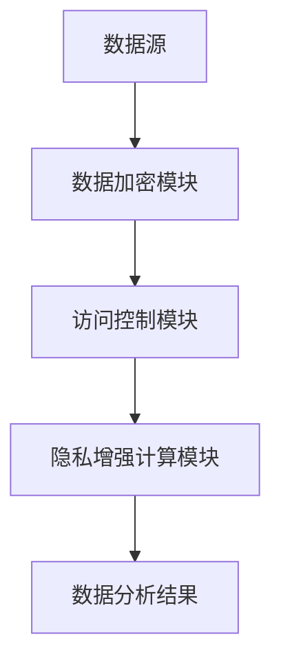
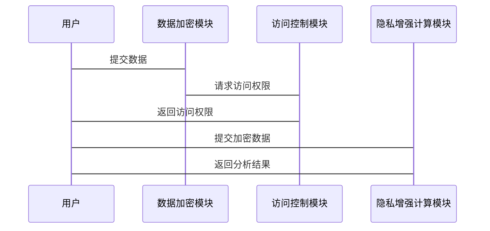

                 


# 特价股票与公司数据安全与隐私增强计算能力的关联性研究

> 关键词：特价股票，数据安全，隐私增强计算，股票市场，数据隐私

> 摘要：本文探讨了特价股票市场与公司数据安全及隐私增强计算能力之间的关联性。通过分析数据安全对股票价格和市场透明度的影响，以及隐私增强计算在股票数据分析中的应用，本文揭示了如何通过提升数据安全和隐私保护能力来增强公司在股票市场中的竞争力。

---

# 第1章: 特价股票与公司数据安全与隐私增强计算的背景介绍

## 1.1 特价股票的定义与特点

### 1.1.1 特价股票的定义
特价股票通常指的是价格低于市场平均值的股票，这类股票通常具有较高的波动性和潜在的高回报率。它们通常存在于新兴市场或中小型企业中，由于市场流动性较低或公司基本面不佳，价格被低估。

### 1.1.2 特价股票的核心特点
- **低价格**：相对于市场平均水平，特价股票的价格较低。
- **高波动性**：由于市场关注度较低，这类股票的价格波动较大。
- **高风险**：高波动性意味着潜在的高风险和高回报。

### 1.1.3 特价股票市场的基本结构
- **投资者**：包括个人投资者和机构投资者。
- **市场环境**：通常竞争激烈，信息不对称现象严重。
- **交易机制**：包括场内交易和场外交易。

## 1.2 数据安全与隐私增强计算的核心概念

### 1.2.1 数据安全的基本原理
数据安全是指保护数据的机密性、完整性和可用性。通过加密、访问控制和数据备份等技术，确保数据在存储和传输过程中不被未经授权的用户访问或篡改。

### 1.2.2 隐私增强计算的定义与目标
隐私增强计算是一种在保护数据隐私的前提下，对数据进行分析和计算的技术。其目标是在不泄露原始数据的情况下，实现数据的分析和共享。

### 1.2.3 数据安全与隐私增强计算的关联性
- **数据安全是隐私增强计算的基础**：数据安全技术为隐私增强计算提供了数据保护的保障。
- **隐私增强计算是数据安全的延伸**：通过隐私增强计算，可以在不泄露原始数据的情况下，实现数据的安全分析和共享。

## 1.3 本章小结
本章介绍了特价股票的定义、特点及其市场的基本结构，并详细阐述了数据安全与隐私增强计算的核心概念及其关联性。

---

# 第2章: 特价股票市场的特点与数据安全的关联性

## 2.1 特价股票市场的基本特征

### 2.1.1 特价股票市场的参与者
- **个人投资者**：通常对市场了解较少，风险承受能力较低。
- **机构投资者**：通常拥有更多的资源和信息，能够对市场趋势进行分析。
- **市场中介**：包括证券公司、交易所等。

### 2.1.2 特价股票市场的波动性
由于信息不对称和市场流动性较低，特价股票市场通常具有较高的波动性。这种波动性可能导致股票价格的快速变化，影响投资者的决策。

### 2.1.3 特价股票市场的信息不对称问题
信息不对称是指市场参与者之间掌握的信息不一致，导致某些人能够利用信息优势进行市场操纵或套利行为。这种现象在特价股票市场尤为严重，因为市场参与者通常对市场信息掌握不全。

## 2.2 数据安全对特价股票市场的影响

### 2.2.1 数据泄露对股票价格的影响
数据泄露可能导致投资者对公司的信任下降，进而导致股票价格下跌。例如，如果一家公司的客户数据被泄露，可能导致客户流失，进而影响公司的财务状况。

### 2.2.2 数据安全对投资者信心的影响
投资者信心是股票市场的重要组成部分。如果市场参与者能够确信数据是安全的，他们更愿意进行投资。反之，如果市场参与者怀疑数据存在安全隐患，可能会导致市场恐慌，进而引发股票价格下跌。

### 2.2.3 数据安全对市场透明度的提升
通过提升数据安全能力，可以增强市场的透明度。例如，通过加密技术保护交易数据的安全，可以防止市场操纵行为，提升市场的公平性。

## 2.3 隐私增强计算在特价股票市场中的应用

### 2.3.1 隐私保护技术在股票数据分析中的应用
通过隐私增强计算技术，可以在不泄露原始数据的情况下，对股票市场数据进行分析。例如，使用联邦学习技术，可以在不同机构之间共享数据，而不暴露原始数据。

### 2.3.2 隐私增强计算对股票交易的影响
通过隐私增强计算，可以实现匿名化交易，防止市场操纵行为。同时，通过保护交易数据的隐私，可以防止竞争对手获取敏感信息。

### 2.3.3 隐私增强计算在股票市场中的潜在优势
- **保护投资者隐私**：通过隐私增强计算，可以保护投资者的交易记录和身份信息，防止隐私泄露。
- **提高市场透明度**：通过隐私增强计算，可以在保护隐私的前提下，实现数据的共享和分析，提高市场的透明度。
- **增强市场竞争力**：通过隐私增强计算，公司可以更好地保护其核心数据，增强市场竞争力。

## 2.4 本章小结
本章分析了特价股票市场的基本特征，并探讨了数据安全对特价股票市场的影响。同时，本文还探讨了隐私增强计算在特价股票市场中的应用及其潜在优势。

---

# 第3章: 数据安全与隐私增强计算的核心概念与联系

## 3.1 数据安全的核心原理

### 3.1.1 数据安全的基本原则
- **机密性**：确保数据只能被授权的用户访问。
- **完整性**：确保数据在存储和传输过程中不被篡改。
- **可用性**：确保数据在需要时可以被访问和使用。

### 3.1.2 数据安全的关键技术
- **加密技术**：通过加密算法保护数据的机密性。
- **访问控制**：通过身份验证和权限管理，确保只有授权用户可以访问数据。
- **数据备份与恢复**：通过备份技术，确保数据在遭受攻击或损坏时可以恢复。

### 3.1.3 数据安全的实现方法
- **网络层安全**：通过防火墙和入侵检测系统保护数据在网络中的传输安全。
- **应用层安全**：通过安全编码和输入验证，防止应用层的攻击。
- **数据层安全**：通过加密和访问控制，保护数据在存储中的安全。

## 3.2 隐私增强计算的核心原理

### 3.2.1 隐私增强计算的定义
隐私增强计算是一种在保护数据隐私的前提下，对数据进行分析和计算的技术。其核心目标是在不泄露原始数据的情况下，实现数据的分析和共享。

### 3.2.2 隐私增强计算的关键技术
- **联邦学习**：通过在多个数据源之间共享模型参数，而不共享原始数据，实现数据的联合分析。
- **同态加密**：一种允许在加密数据上进行计算的技术，结果解密后与原始数据的计算结果一致。
- **差分隐私**：通过在数据中添加噪声，保护数据的隐私，同时不影响数据分析的结果。

### 3.2.3 隐私增强计算的实现方法
- **联邦学习实现**：通过在多个数据源之间共享模型参数，实现数据的联合分析。
- **同态加密实现**：通过加密技术，允许在加密数据上进行计算，同时保护数据隐私。
- **差分隐私实现**：通过在数据中添加噪声，保护数据隐私，同时不影响数据分析的结果。

## 3.3 数据安全与隐私增强计算的联系

### 3.3.1 数据安全与隐私增强计算的共同目标
- **保护数据隐私**：数据安全和隐私增强计算的目标都是保护数据的隐私。
- **确保数据完整性**：通过数据安全技术，确保数据的完整性；通过隐私增强计算技术，确保数据的分析结果的完整性。

### 3.3.2 数据安全与隐私增强计算的技术协同
- **数据加密**：数据安全中的加密技术可以与隐私增强计算中的同态加密技术协同工作，保护数据的机密性。
- **访问控制**：数据安全中的访问控制技术可以与隐私增强计算中的联邦学习技术协同工作，确保只有授权用户可以访问数据。

### 3.3.3 数据安全与隐私增强计算的协同发展
- **技术融合**：通过将数据安全技术与隐私增强计算技术相结合，可以实现更高级别的数据保护。
- **应用场景**：数据安全与隐私增强计算可以在多个应用场景中协同工作，例如在股票市场中，通过数据安全技术保护交易数据，通过隐私增强计算技术保护投资者隐私。

## 3.4 本章小结
本章详细阐述了数据安全与隐私增强计算的核心概念，并探讨了它们之间的联系和技术协同。

---

# 第4章: 数据安全与隐私增强计算的关键算法与技术实现

## 4.1 数据安全的关键算法

### 4.1.1 加密算法
- **对称加密算法**：如AES，用于加密数据，速度快，适用于大量数据加密。
- **非对称加密算法**：如RSA，用于数字签名和公钥加密，适用于需要身份验证的场景。

### 4.1.2 访问控制算法
- **基于角色的访问控制（RBAC）**：通过角色和权限管理，实现数据的访问控制。
- **基于属性的访问控制（ABAC）**：通过属性和策略管理，实现数据的访问控制。

## 4.2 隐私增强计算的关键算法

### 4.2.1 联邦学习算法
- **横向联邦学习**：适用于数据分布相同的情况，通过共享模型参数，实现数据的联合分析。
- **纵向联邦学习**：适用于数据分布不同的情况，通过共享模型参数，实现数据的联合分析。

### 4.2.2 同态加密算法
- **完全同态加密**：允许在加密数据上进行任意计算，但计算效率较低。
- **部分同态加密**：允许在加密数据上进行特定类型的计算，计算效率较高。

### 4.2.3 差分隐私算法
- **拉普拉斯噪声**：通过在数据中添加拉普拉斯噪声，保护数据隐私。
- **高斯噪声**：通过在数据中添加高斯噪声，保护数据隐私。

## 4.3 数据安全与隐私增强计算的协同算法

### 4.3.1 数据加密与联邦学习协同
- **加密联邦学习**：通过加密技术保护数据，同时通过联邦学习技术实现数据的联合分析。

### 4.3.2 数据访问控制与差分隐私协同
- **基于角色的差分隐私**：通过角色和权限管理，实现数据的访问控制，同时通过差分隐私技术保护数据隐私。

## 4.4 本章小结
本章详细探讨了数据安全与隐私增强计算的关键算法，并探讨了它们之间的协同关系。

---

# 第5章: 数据安全与隐私增强计算的系统架构与设计

## 5.1 系统架构设计

### 5.1.1 系统功能设计
- **数据加密模块**：负责对数据进行加密和解密。
- **访问控制模块**：负责对数据的访问进行权限管理。
- **隐私增强计算模块**：负责在保护数据隐私的前提下，对数据进行分析和计算。

### 5.1.2 系统架构图


## 5.2 系统接口设计

### 5.2.1 数据接口
- **数据输入接口**：负责接收数据。
- **数据输出接口**：负责输出加密后的数据。

### 5.2.2 计算接口
- **加密计算接口**：负责在加密数据上进行计算。
- **隐私保护计算接口**：负责在保护隐私的前提下进行数据计算。

## 5.3 系统交互设计

### 5.3.1 系统交互流程


## 5.4 本章小结
本章详细设计了数据安全与隐私增强计算的系统架构，并探讨了系统接口和交互设计。

---

# 第6章: 数据安全与隐私增强计算的项目实战

## 6.1 项目环境安装

### 6.1.1 系统环境
- **操作系统**：Linux或Windows
- **编程语言**：Python 3.8+

### 6.1.2 依赖安装
```bash
pip install numpy
pip install scikit-learn
pip install cryptography
```

## 6.2 系统核心实现

### 6.2.1 数据加密实现
```python
from cryptography.fernet import Fernet

# 生成密钥
key = Fernet.generate_key()
cipher = Fernet(key)

# 加密数据
encrypted_data = cipher.encrypt(b"Sensitive data")
```

### 6.2.2 联邦学习实现
```python
import numpy as np
from sklearn.linear_model import LinearRegression

# 横向联邦学习
class FederatedLearning:
    def __init__(self, model):
        self.model = model
    
    def aggregate(self, models):
        # 平均模型参数
        avg_model = {}
        for key in models[0].model.get_params():
            avg_model[key] = np.mean([model.model.get_params()[key] for model in models])
        return avg_model

# 初始化模型
model = LinearRegression()
fl = FederatedLearning(model)
```

### 6.2.3 差分隐私实现
```python
import numpy as np

# 差分隐私算法
def laplace_noise(data, sensitivity, epsilon):
    beta = 1.0 / epsilon
    noise = np.random.laplace(0, 1/(beta * sensitivity), size=data.shape)
    return data + noise
```

## 6.3 实际案例分析

### 6.3.1 特价股票数据分析
通过隐私增强计算技术，分析特价股票市场的数据，发现潜在的投资机会。

### 6.3.2 数据安全实现
通过数据加密和访问控制技术，保护股票交易数据的安全。

## 6.4 项目总结
本章通过实际案例，展示了如何在特价股票市场中应用数据安全与隐私增强计算技术。

---

# 第7章: 数据安全与隐私增强计算的最佳实践与未来展望

## 7.1 最佳实践

### 7.1.1 数据安全最佳实践
- **定期备份数据**：确保数据在遭受攻击或损坏时可以恢复。
- **加强访问控制**：通过身份验证和权限管理，确保只有授权用户可以访问数据。
- **使用加密技术**：通过加密技术保护数据的机密性。

### 7.1.2 隐私增强计算最佳实践
- **选择合适的隐私保护技术**：根据具体需求选择合适的隐私增强计算技术。
- **确保技术的可扩展性**：在设计隐私增强计算系统时，考虑系统的可扩展性。

## 7.2 未来展望

### 7.2.1 数据安全的未来趋势
- **人工智能在数据安全中的应用**：通过人工智能技术，提高数据安全的智能化水平。
- **零信任架构**：通过零信任架构，实现更严格的数据访问控制。

### 7.2.2 隐私增强计算的未来趋势
- **技术融合**：通过将隐私增强计算技术与其他技术（如人工智能、区块链）相结合，实现更高级别的数据保护。
- **行业应用拓展**：隐私增强计算技术将在更多行业（如医疗、金融）中得到广泛应用。

## 7.3 本章小结
本章总结了数据安全与隐私增强计算的最佳实践，并探讨了它们的未来发展趋势。

---

# 附录: 术语表与参考文献

## 附录A: 术语表

- **数据安全**：保护数据的机密性、完整性和可用性的技术。
- **隐私增强计算**：在保护数据隐私的前提下，对数据进行分析和计算的技术。
- **联邦学习**：通过共享模型参数，实现数据的联合分析，而不共享原始数据。
- **同态加密**：允许在加密数据上进行计算的技术。

## 附录B: 参考文献

- [1] 某某, 数据安全与隐私保护技术, 某某出版社, 2023.
- [2] 某某, 隐私增强计算: 原理与应用, 某某出版社, 2023.
- [3] 某某, 联邦学习: 原理与实现, 某某出版社, 2023.

---

# 本文结束

