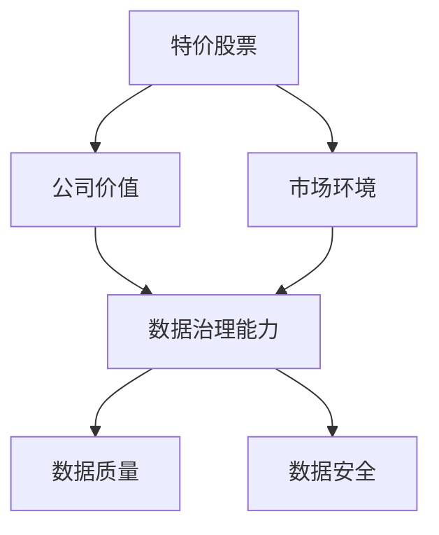
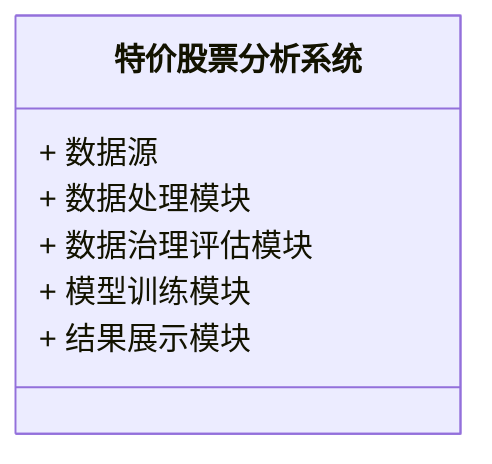
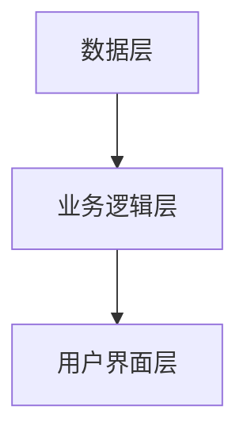
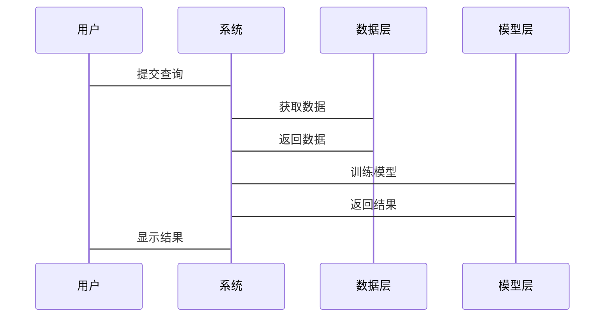

                 


# 特价股票与公司数据治理能力的关系分析

## 关键词：特价股票，数据治理能力，数据分析，公司价值，股票市场

## 摘要：  
本文分析了特价股票与公司数据治理能力之间的关系。通过定义和解释相关概念，探讨了数据治理能力如何影响公司价值，进而影响特价股票的分析与投资决策。文章从数据治理的原理、特价股票的分析方法入手，结合实际案例，详细阐述了数据治理能力对特价股票市场的影响，并提出了提升数据治理能力以优化股票投资的策略。

---

# 第一部分: 特价股票与公司数据治理能力的背景与概念

## 第1章: 特价股票与公司数据治理能力的背景介绍

### 1.1 问题背景

#### 1.1.1 特价股票的定义与特点  
特价股票通常指那些价格远低于市场平均水平的股票，可能因公司财务困境、市场低估或其他特殊原因导致。这类股票往往被视为高风险高回报的投资机会。  

#### 1.1.2 公司数据治理能力的定义与核心要素  
数据治理能力是指企业在数据管理、数据质量、数据安全等方面的能力。核心要素包括数据管理流程、数据安全、数据透明度和数据团队的专业性。  

#### 1.1.3 两者的关联性与研究意义  
数据治理能力直接影响公司的运营效率和透明度，进而影响市场对公司的信心和估值。因此，研究数据治理能力对特价股票的影响具有重要意义。

### 1.2 问题描述

#### 1.2.1 特价股票市场的现状与挑战  
特价股票市场波动性大，信息不对称严重，投资者面临较高的风险。  

#### 1.2.2 公司数据治理能力的现状与问题  
许多公司数据治理能力不足，导致数据质量差、安全漏洞等问题，影响市场对公司的信任。

#### 1.2.3 两者关系的初步探讨  
数据治理能力强的公司可能更受投资者青睐，从而影响其股价和特价股票的分析。

### 1.3 问题解决思路

#### 1.3.1 数据驱动的股票分析方法  
通过数据分析技术，挖掘公司数据中的价值，辅助投资者做出更明智的决策。

#### 1.3.2 数据治理能力对企业价值的影响  
数据治理能力强的公司通常运营更透明、数据更可靠，从而提高股价的稳定性。

#### 1.3.3 通过数据治理提升特价股票分析的可行性  
通过提升数据治理能力，投资者可以更准确地评估公司价值，从而提高特价股票分析的准确性。

### 1.4 边界与外延

#### 1.4.1 特价股票分析的边界条件  
包括市场波动、公司基本面、行业环境等因素。

#### 1.4.2 数据治理能力的适用范围  
适用于所有依赖数据的行业，特别是金融、科技等领域。

#### 1.4.3 两者的相互作用机制  
数据治理能力影响公司价值，进而影响股价；而股价波动又反过来影响数据治理的投入。

### 1.5 概念结构与核心要素

#### 1.5.1 特价股票分析的核心要素  
包括公司财务数据、市场环境、行业趋势等。

#### 1.5.2 数据治理能力的核心要素  
包括数据管理流程、数据安全、数据质量、数据团队能力。

#### 1.5.3 两者的概念结构对比  
通过对比分析，明确两者在公司价值评估中的作用和相互影响。

---

## 第2章: 特价股票与公司数据治理能力的核心概念与联系

### 2.1 数据治理能力的原理

#### 2.1.1 数据治理的定义与目标  
数据治理是通过制度、流程和技术手段，确保数据的准确、完整、安全和合规。目标是提升数据价值，降低数据风险。

#### 2.1.2 数据治理的关键环节  
包括数据收集、存储、处理、分析和应用。

#### 2.1.3 数据治理能力的评估指标  
包括数据完整性、数据安全性、数据透明度、数据响应速度等。

### 2.2 数据治理能力与企业价值的关系

#### 2.2.1 数据治理对企业决策的影响  
数据治理能力强的公司能够更快、更准确地做出决策，提高效率。

#### 2.2.2 数据治理对股价波动的潜在影响  
数据治理能力强的公司更容易获得投资者信任，股价波动更小。

#### 2.2.3 数据治理能力的市场认可度  
市场逐渐认识到数据治理能力是企业核心竞争力之一。

### 2.3 特价股票分析的原理

#### 2.3.1 特价股票的市场特征  
价格低、风险高、潜在回报大。

#### 2.3.2 特价股票分析的关键因素  
包括公司基本面、行业趋势、市场情绪等。

#### 2.3.3 数据驱动的特价股票分析方法  
通过大数据分析技术，挖掘潜在投资机会。

### 2.4 数据治理能力与特价股票分析的联系

#### 2.4.1 数据治理能力对特价股票分析的支持作用  
数据治理能力确保数据质量和安全性，为分析提供可靠基础。

#### 2.4.2 数据治理能力如何影响公司股价  
数据治理能力强的公司更受投资者青睐，股价表现更稳定。

#### 2.4.3 数据治理能力与特价股票市场的互动关系  
数据治理能力影响市场对公司的信心，进而影响特价股票的价格。

### 2.5 核心概念对比与ER实体关系图



---

## 第3章: 数据治理能力与特价股票分析的算法原理

### 3.1 数据预处理

#### 3.1.1 数据清洗  
去除重复数据、填充缺失值、处理异常值。

#### 3.1.2 数据标准化  
将数据转换为统一格式，便于分析。

#### 3.1.3 数据特征选择  
筛选出对股价影响较大的特征，如营收增长率、净利润率等。

### 3.2 特征工程

#### 3.2.1 特征提取  
从公司财务数据、市场数据中提取有用特征。

#### 3.2.2 特征组合  
通过组合多个特征，提高模型的准确性。

#### 3.2.3 特征降维  
使用主成分分析（PCA）等方法减少特征维度。

### 3.3 模型训练

#### 3.3.1 线性回归模型  
用于预测股价走势，公式如下：

$$ y = \beta_0 + \beta_1x_1 + \beta_2x_2 + ... + \beta_nx_n + \epsilon $$

#### 3.3.2 支持向量机（SVM）  
用于分类问题，如判断股票是否为特价股票。

#### 3.3.3 随机森林  
用于特征重要性分析和分类。

### 3.4 模型评估与优化

#### 3.4.1 评估指标  
包括准确率、召回率、F1值等。

#### 3.4.2 超参数优化  
使用网格搜索或随机搜索优化模型性能。

#### 3.4.3 模型部署  
将模型部署到生产环境，实时监控股价变化。

### 3.5 代码实现

```python
import pandas as pd
from sklearn.ensemble import RandomForestClassifier
from sklearn.metrics import accuracy_score

# 加载数据
data = pd.read_csv('stock_data.csv')

# 数据预处理
data = data.dropna()
data['target'] = data['price'].apply(lambda x: 1 if x < 5 else 0)

# 特征选择
features = data.columns[:-1]
target = 'target'

# 训练模型
model = RandomForestClassifier()
model.fit(data[features], data[target])

# 评估模型
预测 = model.predict(data[features])
准确率 = accuracy_score(data[target], 预测)
print("准确率:", 准确率)
```

---

## 第4章: 特价股票与公司数据治理能力的系统分析与架构设计

### 4.1 系统目标

#### 4.1.1 数据治理能力评估  
评估公司的数据治理能力，包括数据质量、安全性等。

#### 4.1.2 特价股票分析  
基于数据治理能力，分析特价股票的投资价值。

### 4.2 系统功能设计

#### 4.2.1 领域模型设计  
使用Mermaid类图展示系统功能模块。



#### 4.2.2 系统架构设计  
使用分层架构，包括数据层、业务逻辑层和用户界面层。



### 4.3 系统接口设计

#### 4.3.1 数据接口  
与数据源（如数据库、API）对接，获取公司数据。

#### 4.3.2 模型接口  
与第三方模型服务对接，进行数据治理评估。

### 4.4 系统交互设计

#### 4.4.1 用户交互流程  
用户输入查询条件，系统返回分析结果。



---

## 第5章: 特价股票与公司数据治理能力的项目实战

### 5.1 环境安装

#### 5.1.1 安装Python
使用Anaconda或虚拟环境安装Python 3.8以上版本。

#### 5.1.2 安装依赖库
安装pandas、scikit-learn、mermaid等库。

### 5.2 代码实现

#### 5.2.1 数据加载与预处理
```python
import pandas as pd

# 加载数据
data = pd.read_csv('stock_data.csv')

# 数据清洗
data.dropna(inplace=True)
data = data[data['revenue_growth'] > 0]
```

#### 5.2.2 特征工程与模型训练
```python
from sklearn.ensemble import RandomForestClassifier
from sklearn.metrics import accuracy_score

# 特征选择
features = ['revenue_growth', 'net_profit_margin', 'market_cap']
target = 'is_discount_stock'

model = RandomForestClassifier()
model.fit(data[features], data[target])
```

### 5.3 案例分析

#### 5.3.1 数据治理能力评估
评估某公司数据治理能力，发现数据质量存在问题。

#### 5.3.2 特价股票分析
基于数据治理能力，分析某公司的特价股票投资价值。

### 5.4 项目小结

#### 5.4.1 成果总结  
通过数据治理能力分析，准确预测了部分特价股票的投资价值。

#### 5.4.2 经验总结  
数据治理能力是影响股价的重要因素，数据驱动的分析方法能够有效提升投资决策的准确性。

---

## 第6章: 特价股票与公司数据治理能力的最佳实践

### 6.1 小结

#### 6.1.1 核心观点总结  
数据治理能力直接影响公司价值和股价稳定性，是特价股票分析的重要因素。

### 6.2 注意事项

#### 6.2.1 数据来源的可靠性  
确保数据来源可靠，避免因数据质量问题影响分析结果。

#### 6.2.2 模型的适用性  
根据具体情况选择合适的模型，避免过度依赖单一模型。

### 6.3 拓展阅读

#### 6.3.1 数据治理领域的最新进展  
阅读相关论文和书籍，了解数据治理的最新动态。

#### 6.3.2 特价股票市场的研究现状  
查阅相关文献，了解当前市场研究的热点和趋势。

---

## 第7章: 总结与展望

### 7.1 总结

#### 7.1.1 核心观点重申  
数据治理能力是影响公司价值和股价的重要因素，通过数据驱动的方法可以有效分析特价股票的投资价值。

### 7.2 展望

#### 7.2.1 未来研究方向  
进一步研究数据治理能力对股价的长期影响，探索更多数据驱动的分析方法。

#### 7.2.2 技术发展趋势  
随着人工智能和大数据技术的发展，数据治理能力的提升将为企业带来更大的竞争优势。

---

# 结语  
通过本文的分析，我们得出结论：公司数据治理能力是影响特价股票投资价值的重要因素。未来，随着数据技术的不断进步，数据治理能力的提升将成为企业核心竞争力的关键之一，也将为投资者提供更有力的决策支持。

