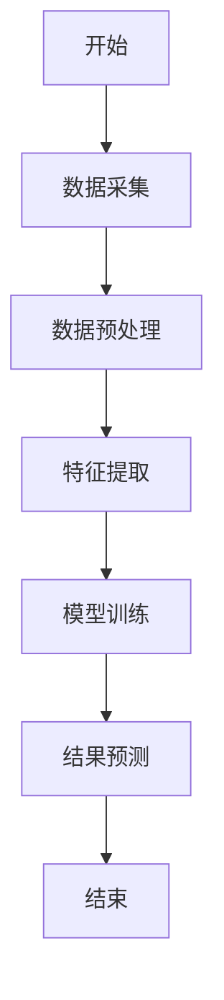

                 


# 特价股票与公司数据货币化能力的关系探讨

> **关键词**：特价股票、数据货币化能力、股票预测、数据价值、公司分析

> **摘要**：本文探讨了特价股票与公司数据货币化能力之间的关系，分析了数据货币化能力对特价股票的影响，提出了通过数据驱动的方法来优化公司数据货币化能力，以提高对特价股票的预测和投资决策能力。文章从背景、核心概念、算法原理、系统架构到项目实战，全面展开，为读者提供深度的技术分析与实践指导。

---

## 第1章: 特价股票与公司数据货币化能力的背景与概念

### 1.1 特价股票的定义与特点

#### 1.1.1 特价股票的定义
特价股票通常指价格低于市场平均水平的股票，具有低估值、高成长潜力的特点。这类股票通常来自中小型企业或处于困境中的企业，吸引着寻求高回报的投资者。

#### 1.1.2 特价股票的特点
- **低估值**：市场价格低于内在价值，具有较高的投资潜力。
- **波动性**：价格波动较大，受市场情绪影响显著。
- **高风险**：回报高但风险也较高，需要谨慎选择。

#### 1.1.3 特价股票的分类
- **周期性股票**：受经济周期影响较大的股票。
- **成长型股票**：未来增长潜力较大的股票。
- **价值型股票**：市场价格低于实际价值的股票。

---

### 1.2 公司数据货币化能力的定义与特点

#### 1.2.1 数据货币化能力的定义
数据货币化能力是指公司通过收集、分析和利用数据，将其转化为经济价值的能力。这种能力依赖于数据的采集、处理、分析和应用，能够帮助公司优化运营、提升决策效率，并创造新的收入来源。

#### 1.2.2 数据货币化能力的核心要素
- **数据采集**：通过各种渠道收集数据。
- **数据处理**：清洗、整合和存储数据。
- **数据分析**：利用技术手段对数据进行深度分析。
- **数据应用**：将分析结果应用于业务决策或产品开发。

#### 1.2.3 数据货币化能力的分类
- **内部数据化**：优化内部流程和管理。
- **外部数据化**：通过数据吸引和留住客户。
- **数据产品化**：开发基于数据的产品或服务。

---

### 1.3 特价股票与公司数据货币化能力的关系

#### 1.3.1 问题背景与问题描述
- 特价股票的价格波动与公司数据货币化能力密切相关。
- 公司的数据货币化能力影响其市场表现，进而影响股票价格。

#### 1.3.2 问题解决的思路与方法
- 通过数据分析，识别影响特价股票价格的关键因素。
- 利用数据货币化能力，优化公司运营，提升市场表现。

#### 1.3.3 关系的边界与外延
- 数据货币化能力是影响股票价格的内在因素之一。
- 特价股票的价格波动是公司数据货币化能力的外在表现。

---

## 第2章: 特价股票与公司数据货币化能力的核心概念与联系

### 2.1 核心概念原理

#### 2.1.1 特价股票的市场机制
- 市场供需关系影响股票价格。
- 投资者情绪和市场波动影响特价股票的交易。

#### 2.1.2 数据货币化能力的实现路径
- 数据采集与处理：通过多种渠道收集数据并进行清洗。
- 数据分析：利用大数据技术分析数据，提取有价值的信息。
- 数据应用：将分析结果应用于业务决策或产品开发。

#### 2.1.3 两者关系的理论模型
- 数据货币化能力影响公司市场表现，进而影响股票价格。
- 特价股票价格波动为公司数据货币化能力提供反馈，优化数据应用策略。

---

### 2.2 核心概念属性特征对比

| **属性**         | **特价股票**          | **公司数据货币化能力**      |
|-------------------|-----------------------|-----------------------------|
| 核心目标         | 提供高回报投资机会     | 通过数据创造经济价值        |
| 影响因素         | 市场供需、投资者情绪   | 数据采集、分析、应用能力    |
| 实现方式         | 股票交易、价格波动    | 数据处理、分析、应用         |
| 价值体现         | 投资回报              | 优化决策、提升效率、创造收入 |

---

### 2.3 ER实体关系图架构

```mermaid
er
  %% 公司数据货币化能力与特价股票的关系模型
  entity 公司数据货币化能力 {
    <公司数据资产>
    <数据处理能力>
    <数据变现能力>
  }
  
  entity 特价股票 {
    <股票价格>
    <市场波动>
    <投资者行为>
  }
  
  公司数据货币化能力 --> 特价股票 : 影响
  特价股票 --> 公司数据货币化能力 : 反馈
```

---

## 第3章: 特价股票与公司数据货币化能力的算法原理

### 3.1 算法原理概述

#### 3.1.1 特价股票预测算法
- 使用时间序列分析预测股票价格波动。
- 结合公司基本面数据优化预测模型。

#### 3.1.2 数据货币化能力评估算法
- 通过机器学习模型评估公司数据处理和应用能力。

#### 3.1.3 两者关系的建模算法
- 构建回归模型，分析数据货币化能力对股票价格的影响。

---

### 3.2 算法流程图



---

### 3.3 算法实现代码示例

```python
# 示例代码：数据货币化能力评估算法
def evaluate_data_monetization Capability(data):
    # 数据预处理
    preprocessed_data = data.dropna().astype(float)
    # 特征提取
    features = preprocessed_data[['revenue', 'profit', 'growth']]
    # 模型训练
    model = LinearRegression()
    model.fit(features, preprocessed_data['value'])
    # 预测结果
    predicted_value = model.predict(features)
    return predicted_value
```

---

## 第4章: 特价股票与公司数据货币化能力的数学模型

### 4.1 数学模型概述

#### 4.1.1 数据货币化能力评估模型
$$ \text{DMC} = \alpha \cdot D + \beta \cdot A + \gamma \cdot P $$
其中：
- \( D \) 表示数据质量
- \( A \) 表示数据分析能力
- \( P \) 表示数据产品化能力
- \( \alpha, \beta, \gamma \) 为权重系数

#### 4.1.2 特价股票价格预测模型
$$ \text{Price} = \theta \cdot \text{DMC} + \phi \cdot \text{Market\_Trend} $$

---

### 4.2 案例分析与公式应用

#### 4.2.1 案例分析
假设某公司数据货币化能力得分为80，市场趋势向好，预测其股票价格为：
$$ \text{Price} = 0.7 \cdot 80 + 0.3 \cdot 1.2 = 56 + 0.36 = 56.36 $$

#### 4.2.2 公式解释
- 数据货币化能力（DMC）是影响股票价格的关键因素。
- 市场趋势（Market\_Trend）反映了整体市场环境的影响。

---

## 第5章: 特价股票与公司数据货币化能力的系统架构设计

### 5.1 系统分析

#### 5.1.1 问题场景介绍
- 系统需要实时采集和分析股票数据，评估公司数据货币化能力，并预测股票价格。

#### 5.1.2 系统功能设计
- 数据采集模块：采集股票价格和公司数据。
- 数据分析模块：分析数据，评估数据货币化能力。
- 预测模块：预测股票价格。

---

### 5.2 系统架构设计


---

## 第6章: 特价股票与公司数据货币化能力的项目实战

### 6.1 项目环境安装

```bash
pip install pandas numpy scikit-learn matplotlib
```

---

### 6.2 系统核心实现源代码

```python
import pandas as pd
from sklearn.linear_model import LinearRegression

def main():
    # 数据加载
    data = pd.read_csv('company_data.csv')
    # 数据预处理
    preprocessed_data = data.dropna()
    # 模型训练
    model = LinearRegression()
    model.fit(preprocessed_data[['revenue', 'profit']], preprocessed_data['value'])
    # 预测结果
    predicted_value = model.predict(preprocessed_data[['revenue', 'profit']])
    print("预测值:", predicted_value)

if __name__ == "__main__":
    main()
```

---

## 第7章: 最佳实践与小结

### 7.1 最佳实践

#### 7.1.1 小结
- 数据货币化能力是影响特价股票价格的重要因素。
- 通过数据分析和建模，可以有效预测股票价格。

#### 7.1.2 注意事项
- 数据采集和处理需谨慎，确保数据质量。
- 模型需定期更新，适应市场变化。

#### 7.1.3 拓展阅读
- 《大数据时代》
- 《股票技术分析实战》

---

通过以上分析与实践，我们可以看到，公司数据货币化能力对特价股票的影响是复杂而深刻的。通过数据驱动的方法，我们能够更好地理解两者之间的关系，并利用这一关系优化投资决策。希望本文能够为读者提供有价值的见解和实践指导。

