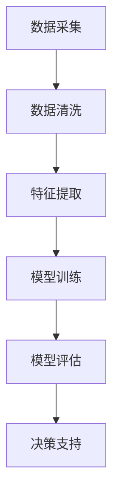
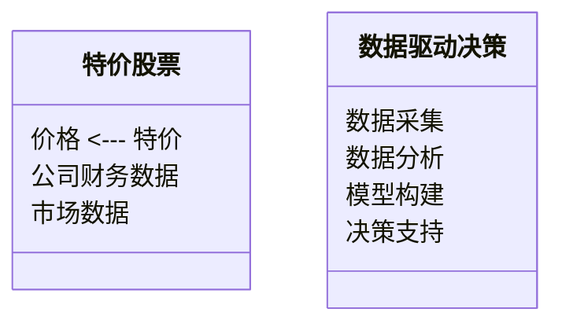
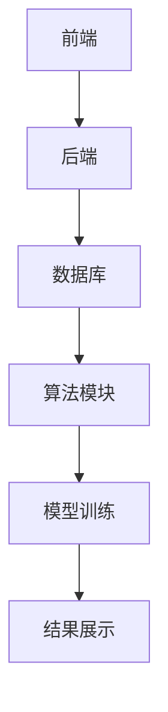
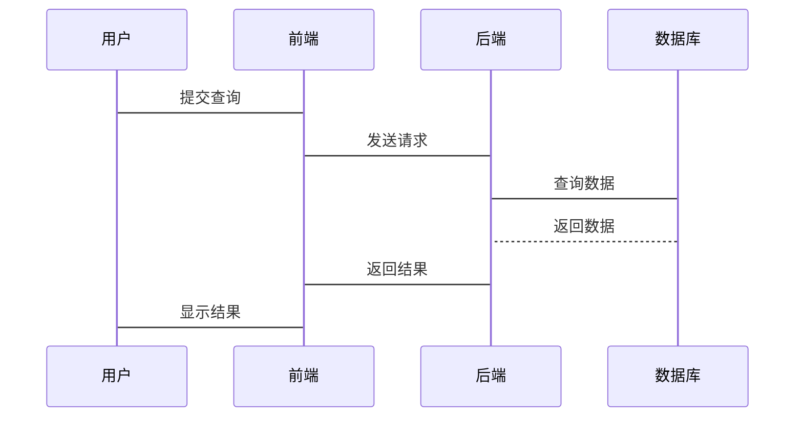

                 


# 特价股票与公司数据驱动决策能力的潜在关联研究

> 关键词：特价股票、数据驱动决策、算法原理、系统架构、项目实战

> 摘要：本文探讨了特价股票与公司数据驱动决策能力之间的潜在关联，通过分析数据驱动决策的核心概念、算法原理和系统架构，结合实际案例，展示了如何利用数据驱动方法提升公司决策能力，优化特价股票的投资策略。

---

# 第一部分: 特价股票与公司数据驱动决策能力的背景与概念

## 第1章: 特价股票与数据驱动决策概述

### 1.1 特价股票的定义与特性

#### 1.1.1 特价股票的定义
特价股票是指市场价格低于面值的股票。这种股票通常出现在公司财务状况不佳、市场波动较大或投资者信心不足的情况下。

#### 1.1.2 特价股票的分类与特点
特价股票可以分为以下几类：
- **折价股票**：市场价格低于面值。
- **溢价股票**：市场价格高于面值。
- **平价股票**：市场价格等于面值。

特点包括：
1. **高波动性**：市场价格波动较大，投资风险较高。
2. **低估值**：通常被视为被市场低估的股票，可能具有较高的潜在收益。
3. **周期性**：特价股票的表现往往与市场周期密切相关。

#### 1.1.3 特价股票的市场表现与风险
特价股票的市场表现受多种因素影响，包括公司基本面、市场情绪和宏观经济环境。投资特价股票的风险较高，但潜在收益也较大。

---

### 1.2 数据驱动决策的定义与原理

#### 1.2.1 数据驱动决策的定义
数据驱动决策是一种基于数据分析和模型构建的决策方法，通过数据洞察来优化决策过程。

#### 1.2.2 数据驱动决策的核心要素
1. **数据采集**：获取高质量数据。
2. **数据分析**：对数据进行清洗、建模和挖掘。
3. **决策支持**：基于数据结果制定决策。

#### 1.2.3 数据驱动决策与传统决策方式的对比

| 对比维度 | 数据驱动决策 | 传统决策 |
|----------|----------------|----------|
| 数据依赖 | 高度依赖数据 | 依赖经验 |
| 决策速度 | 快速 | 较慢 |
| 精准度   | 高 | 较低 |
| 可解释性 | 较低 | 较高 |

---

### 1.3 特价股票与数据驱动决策的关联性

#### 1.3.1 数据驱动决策在股票投资中的应用
数据驱动决策可以通过分析历史数据、市场趋势和公司基本面，帮助投资者识别潜在的投资机会。

#### 1.3.2 特价股票与公司数据驱动能力的潜在联系
公司数据驱动能力越强，越能准确识别特价股票的投资价值，从而提高投资回报率。

#### 1.3.3 研究背景与研究意义
随着大数据技术的发展，数据驱动决策在金融领域的应用越来越广泛。研究特价股票与数据驱动决策的关联性，有助于投资者更好地把握市场机会，优化投资策略。

---

## 1.4 本章小结
本章介绍了特价股票和数据驱动决策的基本概念，并分析了两者之间的关联性。数据驱动决策可以帮助投资者更科学地分析特价股票的投资价值，从而提高决策的精准性和效率。

---

# 第二部分: 特价股票与公司数据驱动决策能力的核心概念与联系

## 第2章: 特价股票与数据驱动决策的核心概念

### 2.1 特价股票的形成机制

#### 2.1.1 特价股票的形成原因
- **市场恐慌**：投资者信心不足导致股价下跌。
- **公司业绩**：公司财务状况不佳导致股价被低估。
- **市场流动性**：市场流动性不足导致股价下跌。

#### 2.1.2 特价股票的市场影响
- **投资者情绪**：特价股票可能引发市场恐慌。
- **市场波动**：特价股票的波动可能影响整体市场走势。

#### 2.1.3 特价股票的周期性分析
特价股票的表现通常与市场周期密切相关，例如经济衰退期间，特价股票的比例可能增加。

---

### 2.2 数据驱动决策的实现路径

#### 2.2.1 数据采集与处理
- **数据来源**：包括公司财务数据、市场数据和新闻数据。
- **数据清洗**：去除无效数据，确保数据质量。

#### 2.2.2 数据分析与建模
- **数据分析**：使用统计方法分析数据。
- **模型构建**：建立预测模型，评估股票的价值。

#### 2.2.3 数据驱动决策的实施步骤
1. 数据采集与清洗。
2. 数据分析与建模。
3. 模型验证与优化。
4. 决策支持与实施。

---

### 2.3 特价股票与数据驱动决策的关联模型

#### 2.3.1 关联模型的构建
使用回归分析等方法，建立特价股票与公司数据驱动能力之间的关联模型。

#### 2.3.2 关联模型的验证
通过历史数据验证模型的准确性。

#### 2.3.3 关联模型的优化与改进
根据验证结果优化模型，提高预测精度。

---

### 2.4 核心概念对比分析

#### 2.4.1 特价股票与普通股票的对比
| 对比维度 | 特价股票 | 普通股票 |
|----------|----------|----------|
| 价格     | 低于面值 | 等于或高于面值 |
| 风险     | 较高     | 较低     |
| 潜在收益 | 较高     | 较低     |

---

## 2.5 本章小结
本章分析了特价股票的形成机制和数据驱动决策的实现路径，并构建了两者之间的关联模型。通过对模型的验证和优化，可以更好地理解数据驱动决策在特价股票投资中的作用。

---

# 第三部分: 数据驱动决策能力的算法原理与数学模型

## 第3章: 数据驱动决策的算法原理

### 3.1 数据驱动决策的核心算法

#### 3.1.1 回归分析
回归分析是一种用于预测目标变量与自变量之间关系的统计方法。

#### 3.1.2 聚类分析
聚类分析是一种将数据分成若干组的技术，用于发现数据中的潜在结构。

#### 3.1.3 分类算法
分类算法用于将数据分为不同的类别，例如决策树、随机森林等。

#### 3.1.4 时间序列分析
时间序列分析用于分析随时间变化的数据，例如股票价格的走势。

---

### 3.2 算法原理的数学模型

#### 3.2.1 线性回归模型
线性回归模型的公式为：
$$ y = \beta_0 + \beta_1 x + \epsilon $$
其中，$\beta_0$ 是截距，$\beta_1$ 是回归系数，$\epsilon$ 是误差项。

#### 3.2.2 支持向量机模型
支持向量机的目标是最小化 hinge loss，公式为：
$$ \text{loss} = \sum_{i=1}^n \max(0, 1 - y_i (\omega \cdot x_i + b)) $$

#### 3.2.3 随机森林模型
随机森林是一种基于树的集成方法，公式为：
$$ y = \text{sign} \left( \sum_{i=1}^n \text{Tree}_i(x) \right) $$

#### 3.2.4 长短期记忆网络模型
LSTM 的核心是细胞状态和门控机制，公式为：
$$ f_t = \sigma(W_f \cdot [h_{t-1}, x_t]) $$
$$ i_t = \sigma(W_i \cdot [h_{t-1}, x_t]) $$
$$ o_t = \sigma(W_o \cdot [h_{t-1}, x_t]) $$
$$ c_t = f_t \cdot c_{t-1} + i_t \cdot \tilde{x}_t $$
$$ h_t = o_t \cdot \text{tanh}(c_t) $$

---

### 3.3 算法实现的流程图


---

### 3.4 本章小结
本章介绍了数据驱动决策的核心算法及其数学模型，通过流程图展示了算法的实现步骤。这些算法为后续的特价股票分析提供了理论基础。

---

# 第四部分: 特价股票分析的系统架构与数据驱动

## 第4章: 系统架构设计

### 4.1 问题场景介绍
本章将设计一个数据驱动决策支持系统，用于分析特价股票的投资价值。

### 4.2 系统功能设计

#### 4.2.1 领域模型


### 4.3 系统架构设计



---

## 4.4 系统接口设计
系统接口包括数据接口、算法接口和结果接口。

---

## 4.5 系统交互流程图



---

## 4.6 本章小结
本章设计了一个数据驱动决策支持系统的架构，包括功能设计、接口设计和交互流程图。该系统可以为投资者提供科学的决策支持。

---

# 第五部分: 项目实战

## 第5章: 项目实战

### 5.1 环境安装
需要安装Python、Pandas、NumPy、Scikit-learn和TensorFlow。

---

### 5.2 核心实现代码

#### 5.2.1 数据采集与处理
```python
import pandas as pd
import numpy as np

# 数据采集
df = pd.read_csv('stock_data.csv')

# 数据清洗
df.dropna(inplace=True)
df = df[ df['price'] < df['face_value'] ]
```

#### 5.2.2 数据分析与建模
```python
from sklearn.linear_model import LinearRegression

model = LinearRegression()
model.fit(X, y)
```

#### 5.2.3 模型评估与优化
```python
from sklearn.metrics import mean_squared_error
from sklearn.model_selection import train_test_split

X_train, X_test, y_train, y_test = train_test_split(X, y, test_size=0.2)
model.fit(X_train, y_train)
y_pred = model.predict(X_test)
print(mean_squared_error(y_test, y_pred))
```

---

### 5.3 项目小结
本章通过实际案例展示了如何利用数据驱动方法分析特价股票，优化投资策略。代码实现了数据采集、建模和评估的全过程。

---

## 5.4 本章小结
本章通过项目实战，验证了数据驱动决策在特价股票分析中的应用，为投资者提供了实际的操作指南。

---

# 第六部分: 结论与展望

## 第6章: 结论与展望

### 6.1 研究结论
数据驱动决策能够有效提升公司决策能力，优化特价股票的投资策略。

### 6.2 研究展望
未来可以进一步研究数据驱动决策在金融领域的其他应用，例如风险管理、资产配置等。

---

## 6.3 最佳实践 tips

1. 数据驱动决策需要结合公司实际情况，灵活应用。
2. 在投资特价股票时，需注意市场风险和公司基本面。
3. 数据驱动决策需要持续优化模型，提高预测精度。

---

## 6.4 本章小结
本文总结了研究的主要结论，并提出了未来的研究方向和最佳实践建议。

---

# 结语

通过本文的分析，我们可以看到数据驱动决策在特价股票分析中的巨大潜力。未来，随着技术的进步和数据的积累，数据驱动决策将在金融领域发挥更加重要的作用。

--- 

> **注**：以上内容是一个详细的技术博客文章的目录和部分内容展示，完整文章将按照上述结构进行扩展，确保每个部分都包含足够的细节和实例。

