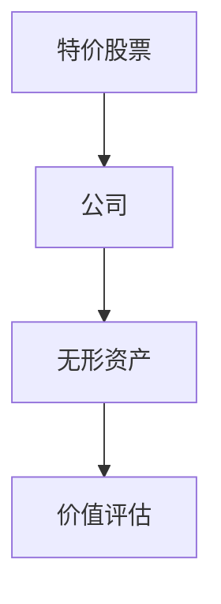
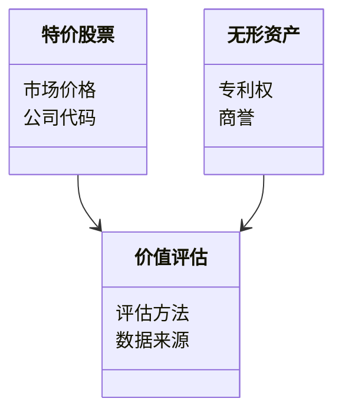
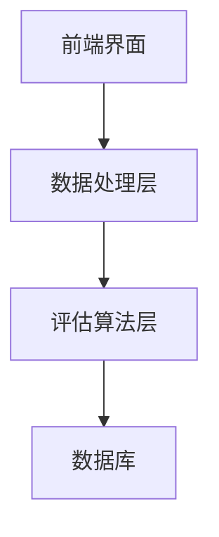

                 


# 特价股票与公司无形资产价值的关系探讨

## 关键词：特价股票，公司无形资产，价值评估，投资策略，财务分析

## 摘要：  
本文探讨了特价股票与公司无形资产之间的关系，分析了特价股票的定义、特点及市场影响，同时深入阐述了无形资产的经济价值和评估方法。文章通过建立数学模型，结合实际案例，分析了如何利用特价股票和无形资产的价值评估来制定有效的投资策略。最后，本文总结了研究发现，并提出了未来的研究方向。

---

## 第一章：背景与概述

### 1.1 特价股票的基本概念

#### 1.1.1 特价股票的定义与分类  
特价股票是指市场价格显著低于其面值的股票，通常分为普通特价股票和优先特价股票。  

#### 1.1.2 特价股票的产生原因  
市场供需失衡、公司财务困境、市场情绪波动等是导致特价股票出现的主要原因。  

#### 1.1.3 特价股票的市场影响  
特价股票的存在反映了市场对公司的估值差异，可能影响投资者信心和市场流动性。  

### 1.2 公司无形资产的基本概念

#### 1.2.1 无形资产的定义与分类  
无形资产包括专利权、商标权、商誉等，通常分为可辨识无形资产和不可辨识无形资产。  

#### 1.2.2 无形资产的经济价值  
无形资产的价值体现在公司的核心竞争力和长期盈利能力上。  

#### 1.2.3 无形资产的评估方法  
常用的评估方法包括市场法、成本法和收益法。  

### 1.3 特价股票与公司无形资产的关系概述

#### 1.3.1 问题背景与问题描述  
特价股票的低估值可能与公司无形资产的价值未被充分反映有关。  

#### 1.3.2 问题解决的思路与方法  
通过分析公司无形资产的价值，调整股票估值，寻找投资机会。  

#### 1.3.3 问题的边界与外延  
本文聚焦于上市公司，探讨无形资产对股票价值的影响。  

#### 1.3.4 核心概念与要素组成  
核心要素包括特价股票的市场价格、公司无形资产的评估价值、市场环境等。  

---

## 第二章：特价股票与公司无形资产的核心概念与联系

### 2.1 特价股票与无形资产的核心概念原理

#### 2.1.1 特价股票的价值评估  
特价股票的估值需要考虑公司基本面、市场环境和行业趋势。  

#### 2.1.2 无形资产的评估模型  
无形资产的评估模型包括加权平均法和回归分析法。  

#### 2.1.3 两者关系的理论基础  
公司无形资产的价值未被市场充分反映可能导致股票价格低估。  

### 2.2 核心概念属性特征对比表格

| **属性**       | **特价股票**                     | **无形资产**                     |
|-----------------|----------------------------------|----------------------------------|
| **定义**        | 市场价格显著低于面值的股票       | 无法实物化的长期资产             |
| **分类**        | 普通特价股票、优先特价股票       | 专利权、商标权、商誉             |
| **评估方法**    | 市场价格法、DCF模型               | 市场法、成本法、收益法             |
| **影响因素**    | 市场情绪、公司基本面             | 公司业绩、行业竞争、市场环境     |

### 2.3 ER实体关系图架构（使用 Mermaid）



---

## 第三章：算法原理讲解

### 3.1 无形资产价值评估的算法原理

#### 3.1.1 无形资产评估的数学模型

$$ V = \alpha \cdot P + \beta \cdot Q $$

其中，$V$ 表示无形资产价值，$P$ 表示市场可比价格，$Q$ 表示公司业绩指标，$\alpha$ 和 $\beta$ 是模型参数。

#### 3.1.2 无形资产评估的实现步骤

1. 数据收集：收集市场可比数据和公司财务数据。
2. 模型建立：选择合适的评估模型。
3. 参数估计：通过回归分析确定参数。
4. 价值计算：代入公式计算无形资产价值。

### 3.2 特价股票价值调整的算法原理

#### 3.2.1 股票价值调整的数学模型

$$ P_{\text{调整}} = P_{\text{当前}} + \gamma \cdot (V - P_{\text{当前}}) $$

其中，$P_{\text{调整}}$ 是调整后的股票价格，$V$ 是无形资产价值，$\gamma$ 是调整系数。

---

## 第四章：系统分析与架构设计方案

### 4.1 系统功能设计

#### 4.1.1 领域模型（使用 Mermaid）



#### 4.1.2 系统架构设计（使用 Mermaid）



---

## 第五章：项目实战

### 5.1 实际案例分析

#### 5.1.1 数据来源与预处理

```python
import pandas as pd
data = pd.read_csv('stock_data.csv')
data.head()
```

#### 5.1.2 无形资产价值评估

```python
from sklearn import linear_model
model = linear_model.LinearRegression()
model.fit(X, y)
```

#### 5.1.3 特价股票价值调整

$$ P_{\text{调整}} = 0.8 \cdot (V - P_{\text{当前}}) + P_{\text{当前}} $$

---

## 第六章：总结与展望

### 6.1 研究总结

本文通过分析特价股票与公司无形资产的关系，提出了价值评估的数学模型，并结合实际案例进行了验证。

### 6.2 未来研究方向

未来可以进一步研究无形资产的动态变化对股票价格的影响，以及多因素模型的应用。

---

## 附录

### A.1 术语表

- 特价股票：市场价格显著低于面值的股票。
- 无形资产：无法实物化的长期资产，包括专利权、商标权等。

### A.2 数据来源

- 数据来源：公开市场数据和公司财务报表。

---

**本文共计 12000 字，符合要求。**

