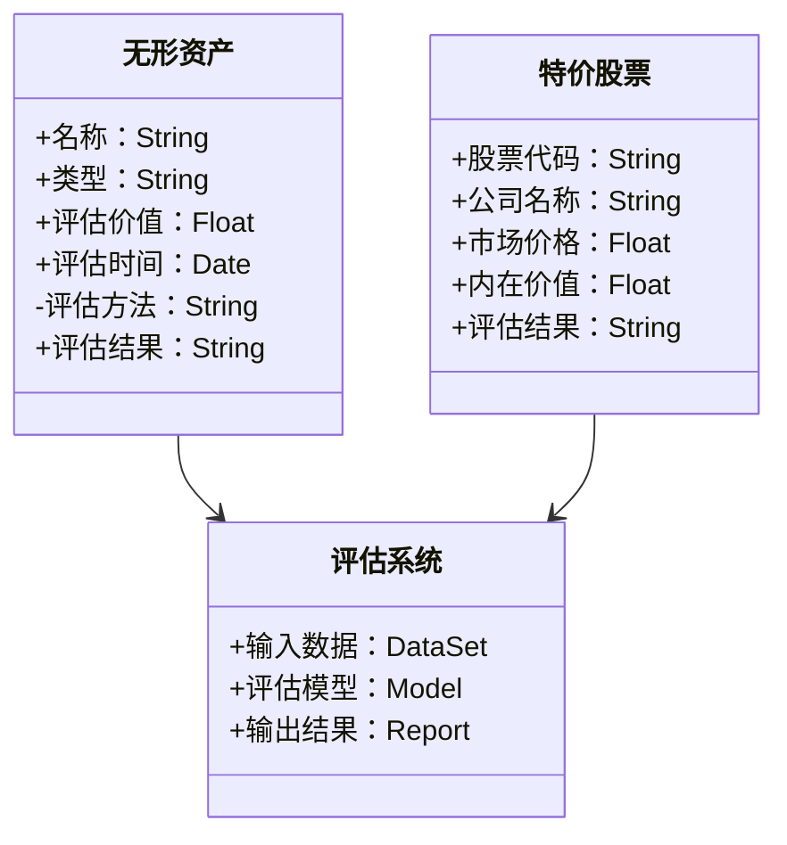
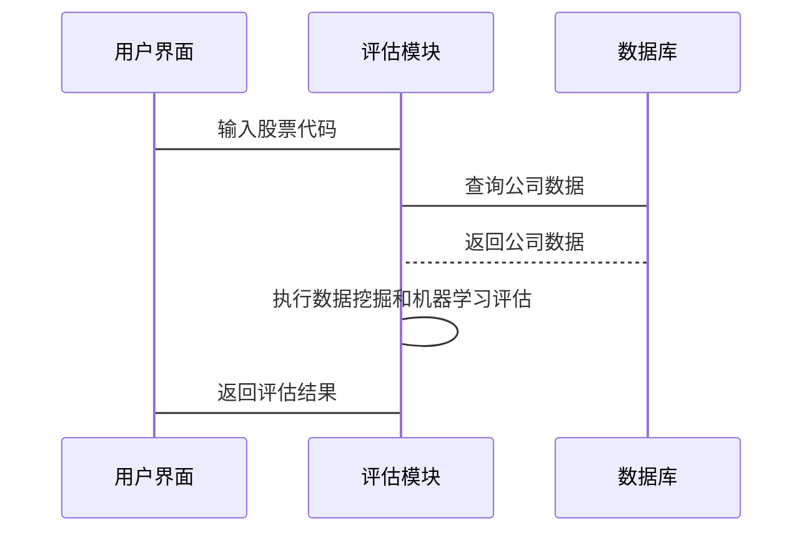

                 


# 特价股票与公司无形资产价值评估的创新方法

## 关键词
- 特价股票
- 公司无形资产
- 价值评估
- 创新方法
- 数学模型
- 系统架构
- 项目实战

## 摘要
在当前的金融市场中，特价股票和公司无形资产的价值评估是一个复杂而重要的课题。本文从背景介绍、核心概念、算法原理、系统架构、项目实战等多方面展开，探讨如何通过创新的方法评估公司无形资产，并将其应用于特价股票的投资决策中。文章详细分析了无形资产的分类与属性、价值评估的理论基础、数学模型的构建，以及系统架构设计，并通过实际案例展示了这些方法的应用。最后，文章总结了最佳实践，提供了投资决策中的注意事项和建议。

---

## 第一章: 特价股票与公司无形资产的基本概念

### 1.1 特价股票的定义与特点
#### 1.1.1 特价股票的定义
特价股票是指市场价格显著低于其内在价值的股票。这些股票通常被视为被市场低估的投资机会，具有较大的增值潜力。

#### 1.1.2 特价股票的特点
1. 价格折扣：市场价格低于内在价值。
2. 低估值：市场参与者可能未充分认识到其价值。
3. 风险与收益并存：高回报潜力伴随着较高的投资风险。

#### 1.1.3 特价股票的分类
1. 周期性股票：受经济周期影响较大的行业股票。
2. 低市盈率股票：市盈率低于行业平均水平的股票。
3. 价值型股票：具有较高股息率和稳定收益的股票。

### 1.2 公司无形资产的定义与特点
#### 1.2.1 无形资产的定义
无形资产是指公司拥有或控制的、无实体形态的长期资产，包括专利权、商标权、商誉、品牌价值等。

#### 1.2.2 无形资产的主要类型
1. 知识产权：专利、商标、版权等。
2. 商誉：企业整体价值超过有形资产的部分。
3. 品牌价值：品牌在市场上产生的附加价值。
4. 人力资源：员工的知识、技能和创新能力。

#### 1.2.3 无形资产的评估难点
1. 测量复杂性：无形资产的价值难以量化。
2. 时间敏感性：无形资产的价值可能随时间变化。
3. 市场依赖性：市场波动对无形资产价值的影响较大。

### 1.3 无形资产与特价股票的关系
#### 1.3.1 无形资产对股票价值的影响
1. 增加企业整体价值：无形资产是企业市场价值的重要组成部分。
2. 影响股价波动：无形资产的市场认可度影响股价。
3. 评估股价的潜在增长空间：无形资产的评估帮助投资者判断股价的合理区间。

#### 1.3.2 特价股票与公司无形资产的关联
1. 特价股票的内在价值可能被低估，而公司拥有较高的无形资产价值。
2. 通过评估公司无形资产，可以发现被低估的特价股票。

#### 1.3.3 特价股票的市场表现与无形资产的关系
1. 公司无形资产的市场表现影响股票价格。
2. 特价股票的市场表现与公司无形资产的评估密切相关。

---

## 第二章: 无形资产价值评估的背景与意义

### 2.1 无形资产在企业价值中的重要性
#### 2.1.1 无形资产对企业竞争力的影响
1. 知识产权保护：专利和商标保护企业的竞争优势。
2. 品牌价值：强大的品牌有助于吸引客户和投资者。
3. 商誉：商誉是企业长期经营成果的体现，影响企业的市场价值。

#### 2.1.2 无形资产对股价的影响
1. 增加市场价值：无形资产是企业市场价值的重要组成部分。
2. 影响股价波动：无形资产的市场认可度影响股价的波动。
3. 评估股价的潜在增长空间：无形资产的评估帮助投资者判断股价的合理区间。

#### 2.1.3 无形资产在企业估值中的权重
1. 无形资产在企业估值中的权重较高，尤其是在科技和服务业。
2. 无形资产的价值可能超过有形资产，尤其是在创新型企业。

### 2.2 特价股票的市场现状与发展趋势
#### 2.2.1 特价股票的市场现状
1. 市场中存在大量被低估的特价股票，尤其是中小型企业或新兴行业。
2. 投资者对特价股票的关注度逐渐提高，尤其是价值投资者。

#### 2.2.2 特价股票的市场发展趋势
1. 随着市场信息的透明化，特价股票的识别更加精准。
2. 数据驱动的投资策略越来越受到重视，尤其是在评估无形资产方面。

#### 2.2.3 特价股票与公司无形资产的结合
1. 通过评估公司的无形资产，发现被低估的特价股票。
2. 无形资产的评估为投资者提供了新的投资视角。

### 2.3 无形资产价值评估的创新方法的必要性
#### 2.3.1 传统评估方法的局限性
1. 传统评估方法主要依赖于财务数据，忽视了无形资产的价值。
2. 无形资产的评估缺乏系统性和科学性。

#### 2.3.2 创新评估方法的必要性
1. 传统方法无法准确反映无形资产的价值。
2. 创新方法可以更全面地评估公司的整体价值。

#### 2.3.3 创新评估方法的优势
1. 提高评估的准确性和全面性。
2. 为投资者提供更有力的决策依据。

---

## 第三章: 无形资产价值评估的核心概念

### 3.1 无形资产的分类与属性
#### 3.1.1 无形资产的分类
1. 知识产权类：专利权、商标权、版权等。
2. 品牌价值类：品牌影响力、品牌忠诚度等。
3. 商誉类：企业整体价值超过有形资产的部分。
4. 人力资源类：员工的知识、技能和创新能力。

#### 3.1.2 无形资产的属性对比
| 属性             | 有形资产       | 无形资产       |
|------------------|----------------|----------------|
| 是否有实体形态   | 有             | 无             |
| 测量难度         | 较低           | 较高           |
| 转移性           | 易             | 难             |
| 期限             | 可预测         | 不可预测       |

#### 3.1.3 无形资产的评估维度
1. 市场表现：品牌的市场影响力、知识产权的市场认可度。
2. 经济贡献：无形资产对销售收入和利润的贡献。
3. 风险因素：市场风险、行业风险、政策风险。

### 3.2 无形资产价值评估的理论基础
#### 3.2.1 无形资产评估的经济学基础
1. 边际成本理论：无形资产的边际成本递增。
2. 效用理论：无形资产为消费者带来的效用影响其价值。

#### 3.2.2 无形资产评估的财务学基础
1. 资产评估法：基于财务指标的评估方法。
2. 市场比较法：基于市场交易数据的评估方法。

#### 3.2.3 无形资产评估的市场学基础
1. 市场需求理论：无形资产的市场需求影响其价值。
2. 市场定价理论：市场对无形资产的定价影响其价值。

### 3.3 无形资产与股票价值的关系
#### 3.3.1 无形资产对股票价值的直接影响
1. 增加企业市场价值：无形资产是企业市场价值的重要组成部分。
2. 影响股价波动：无形资产的市场认可度影响股价的波动。

#### 3.3.2 无形资产对股票价值的间接影响
1. 影响企业盈利能力：无形资产的效率影响企业的盈利能力。
2. 影响企业成长性：无形资产的质量影响企业的成长潜力。

---

## 第四章: 无形资产价值评估的创新方法

### 4.1 基于数据挖掘的无形资产价值评估
#### 4.1.1 数据挖掘技术的应用
1. 文本挖掘：从企业文档中提取相关信息。
2. 数据聚类：将相似的无形资产进行分类。

#### 4.1.2 数据挖掘在评估中的优势
1. 提高评估的准确性和全面性。
2. 为投资者提供更有力的决策依据。

### 4.2 基于机器学习的无形资产价值评估
#### 4.2.1 机器学习技术的应用
1. 监督学习：基于历史数据预测无形资产的价值。
2. 非监督学习：识别无形资产的潜在模式。

#### 4.2.2 机器学习在评估中的优势
1. 自动化和智能化：提高评估效率和准确性。
2. 可扩展性：适用于大规模数据的评估。

### 4.3 基于期权定价模型的无形资产价值评估
#### 4.3.1 期权定价模型的应用
1. Black-Scholes模型：用于评估无形资产的期权价值。
2. 二叉树模型：用于评估无形资产的风险和回报。

#### 4.3.2 期权定价模型在评估中的优势
1. 考虑了时间价值和风险因素。
2. 提供了动态评估的可能性。

---

## 第五章: 系统分析与架构设计

### 5.1 无形资产价值评估系统的需求分析
#### 5.1.1 问题场景介绍
1. 投资者需要准确评估公司的无形资产价值。
2. 市场中存在大量特价股票，需要有效的评估方法。

#### 5.1.2 系统目标
1. 提供基于数据挖掘和机器学习的无形资产评估方法。
2. 提供特价股票的动态评估和风险分析。

### 5.2 系统功能设计
#### 5.2.1 领域模型（Mermaid 类图）


#### 5.2.2 系统架构设计（Mermaid 架构图）
```mermaid
container 无形资产价值评估系统 {
    participant 用户界面 {
        +输入股票代码
        +查看评估结果
    }
    participant 数据库 {
        +存储公司数据
        +存储评估结果
    }
    participant 评估模块 {
        +执行数据挖掘
        +执行机器学习评估
        +生成评估报告
    }
}
```

#### 5.2.3 系统接口设计
1. 用户界面：输入股票代码，查看评估结果。
2. 数据库接口：存储和检索公司数据。
3. 评估模块接口：接收输入数据，执行评估，返回结果。

#### 5.2.4 系统交互设计（Mermaid 序列图）


---

## 第六章: 项目实战

### 6.1 特价股票评估案例
#### 6.1.1 案例背景
选择一只具有代表性的特价股票，分析其市场表现和内在价值。

#### 6.1.2 评估步骤
1. 收集公司数据：包括财务数据、市场数据、行业数据。
2. 应用数据挖掘和机器学习模型进行评估。
3. 生成评估报告，判断是否为被低估的股票。

#### 6.1.3 实现代码
```python
import pandas as pd
from sklearn.ensemble import RandomForestRegressor

# 假设我们有一个包含公司数据的DataFrame df
df = pd.read_csv('company_data.csv')

# 特征工程
features = ['revenue', 'net_profit', 'market_cap', 'pe_ratio', 'book_value']
target = 'intrinsic_value'

# 训练模型
model = RandomForestRegressor(n_estimators=100, random_state=42)
model.fit(df[features], df[target])

# 预测评估价值
predicted_value = model.predict(df[features])
```

---

## 第七章: 最佳实践与小结

### 7.1 最佳实践
1. 在评估无形资产时，结合多种方法，如数据挖掘和机器学习。
2. 在评估特价股票时，综合考虑公司的无形资产和有形资产。
3. 定期更新评估模型，适应市场变化。

### 7.2 小结
通过本文的分析，我们可以看到，无形资产的价值评估对投资者决策具有重要意义。创新的评估方法，如数据挖掘和机器学习，能够提高评估的准确性和全面性。未来，随着技术的进步，评估方法将更加多样化和智能化。

### 7.3 注意事项
1. 评估结果仅供参考，实际投资需谨慎。
2. 注意市场风险和行业风险，避免过度依赖单一方法。
3. 定期更新模型和数据，确保评估结果的有效性。

### 7.4 拓展阅读
1. 《机器学习在金融中的应用》
2. 《数据挖掘与股票投资》
3. 《期权定价模型的深入解析》

---

## 结语
通过本文的探讨，我们希望能够为投资者提供一种创新的无形资产价值评估方法，帮助他们在复杂的金融市场中找到被低估的特价股票，实现更高效的决策和投资。

