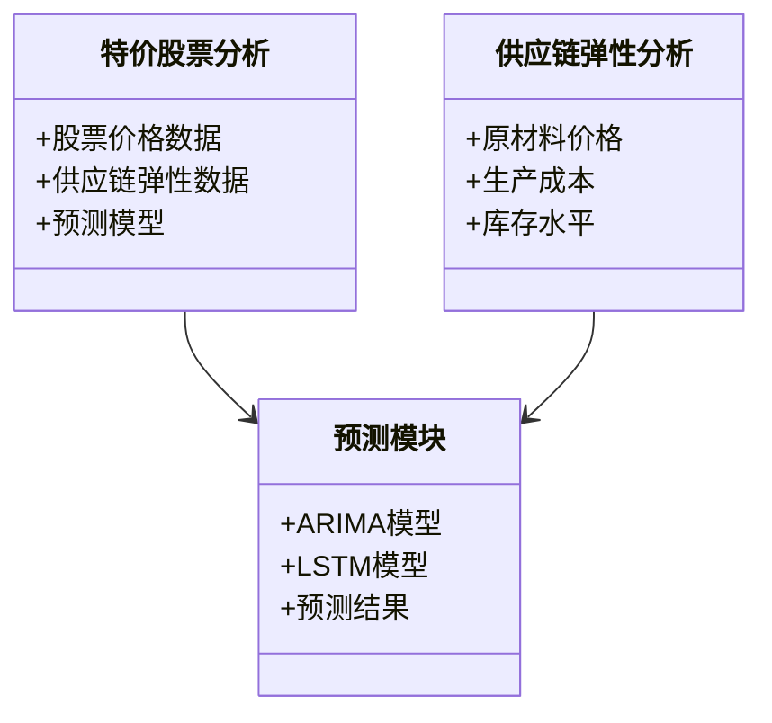
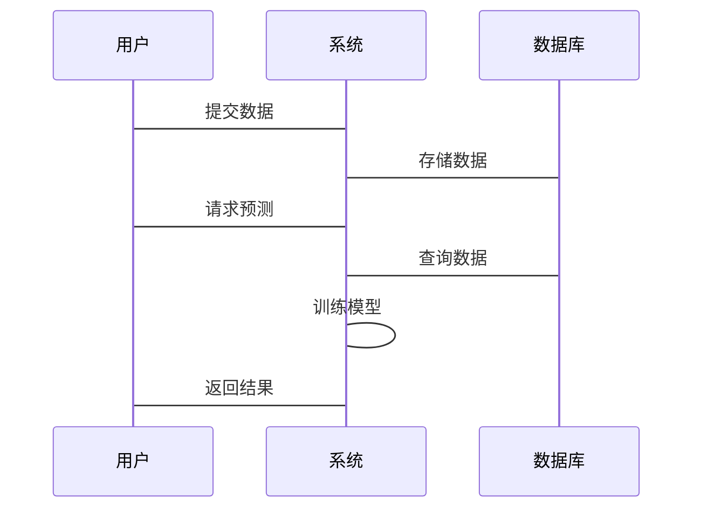

                 


# 特价股票与公司智能供应链弹性的关系探讨

> 关键词：特价股票、供应链弹性、机器学习、时间序列分析、系统架构、智能供应链

> 摘要：本文探讨了特价股票与公司智能供应链弹性的关系，通过分析数据来源、建立数学模型、设计算法流程、构建系统架构，结合项目实战案例，深入剖析了两者之间的内在联系。文章从理论到实践，系统性地展示了如何利用智能供应链弹性来优化特价股票的分析与投资策略。

---

## 第一章: 特价股票与供应链弹性的背景介绍

### 1.1 特价股票的基本概念
#### 1.1.1 特价股票的定义
特价股票是指价格低于市场平均水平的股票，通常具有较高的波动性和潜在的投资机会。这些股票可能属于周期性行业或处于市场低谷期的企业。

#### 1.1.2 特价股票的分类
特价股票可以分为以下几类：
1. **周期性股票**：受经济周期影响较大的股票，如能源、材料等行业。
2. **成长型股票**：市盈率较低，但具有较高增长潜力的股票。
3. **价值型股票**：市场价格低于其内在价值的股票。

#### 1.1.3 特价股票的市场特征
- **高波动性**：价格波动较大，短期内可能大幅波动。
- **低估值**：市场价格低于行业平均水平。
- **潜在高回报**：具备较大的上涨空间。

### 1.2 智能供应链弹性的基本概念
#### 1.2.1 供应链弹性的定义
供应链弹性是指企业在面对市场波动、需求变化或突发事件时，能够灵活调整供应链运作以保持稳定的能力。

#### 1.2.2 智能供应链的特点
- **数据驱动**：利用大数据分析优化供应链决策。
- **自动化**：通过智能系统实现供应链的自动化管理。
- **实时响应**：能够快速响应市场变化。

#### 1.2.3 供应链弹性与企业竞争力的关系
供应链弹性是企业竞争力的重要组成部分，能够帮助企业应对市场波动、降低成本、提高效率。

### 1.3 特价股票与供应链弹性关系的背景
#### 1.3.1 当前市场环境对特价股票的影响
近年来，全球经济波动和市场不确定性增加，导致许多股票价格出现大幅波动，特价股票因此备受关注。

#### 1.3.2 供应链弹性在企业运营中的重要性
供应链弹性能够帮助企业应对原材料价格波动、市场需求变化等风险，从而间接影响股价稳定性。

#### 1.3.3 特价股票与供应链弹性关系的研究现状
目前，学术界对两者的关系研究较少，但随着智能化技术的发展，研究两者的关系具有重要的理论和实践意义。

---

## 第二章: 特价股票与供应链弹性关系的核心概念

### 2.1 特价股票与供应链弹性的内在联系
#### 2.1.1 特价股票波动对企业供应链的影响
股票价格波动可能影响企业的融资成本、投资决策，从而间接影响供应链的稳定性。

#### 2.1.2 供应链弹性对股价稳定的作用
供应链弹性能够降低企业运营风险，提高市场信心，从而稳定股价。

#### 2.1.3 两者关系的双向性分析
- 特价股票的波动会影响企业的供应链管理。
- 供应链弹性能够影响特价股票的市场表现。

### 2.2 数据来源与特征分析
#### 2.2.1 数据来源的多样性
- 股票价格数据：包括开盘价、收盘价、最高价、最低价等。
- 供应链数据：包括原材料价格、生产成本、库存水平等。
- 市场数据：包括宏观经济指标、行业趋势等。

#### 2.2.2 数据特征的提取方法
- 时间序列分析：提取股票价格的波动性特征。
- 统计分析：分析供应链数据的分布特征。

#### 2.2.3 数据预处理与标准化
- 数据清洗：去除异常值和缺失值。
- 数据标准化：将数据归一化，便于模型训练。

### 2.3 关系模型的构建
#### 2.3.1 线性回归模型的建立
通过线性回归模型，分析特价股票价格与供应链弹性之间的线性关系。

#### 2.3.2 非线性关系的分析
使用非线性回归模型，捕捉两者之间的复杂关系。

#### 2.3.3 模型的验证与优化
通过交叉验证和网格搜索，优化模型的参数和性能。

---

## 第三章: 特价股票与供应链弹性关系的算法原理

### 3.1 时间序列分析方法
#### 3.1.1 时间序列的基本概念
时间序列是指按照时间顺序排列的数据，常用于分析股票价格波动。

#### 3.1.2 ARIMA模型的原理
ARIMA（自回归积分滑动平均模型）是一种常用的时间序列分析模型，适用于线性、平稳的时间序列数据。

#### 3.1.3 模型的实现与应用
使用Python的`statsmodels`库实现ARIMA模型，预测特价股票价格的变化。

### 3.2 机器学习模型的应用
#### 3.2.1 支持向量回归（SVR）的原理
SVR是一种非线性回归模型，适用于复杂的数据关系。

#### 3.2.2 随机森林模型的构建
随机森林是一种基于决策树的集成学习方法，适用于高维数据的特征提取和预测。

#### 3.2.3 模型的训练与优化
通过网格搜索和交叉验证，优化模型的超参数。

### 3.3 深度学习模型的探索
#### 3.3.1 LSTM网络的原理
LSTM（长短期记忆网络）是一种特殊的RNN，适用于时间序列数据的建模。

#### 3.3.2 模型的训练与验证
使用Keras框架训练LSTM模型，预测特价股票价格的变化。

#### 3.3.3 模型的比较与分析
比较ARIMA、SVR、随机森林和LSTM模型的性能，选择最优模型。

---

## 第四章: 系统分析与架构设计方案

### 4.1 问题场景介绍
本文构建了一个智能供应链弹性分析系统，用于分析特价股票与供应链弹性的关系。

### 4.2 系统功能设计
#### 4.2.1 领域模型
使用Mermaid绘制领域模型类图，展示系统的功能模块。



### 4.3 系统架构设计
使用Mermaid绘制系统架构图，展示系统的模块组成。


### 4.4 系统接口设计
系统接口包括数据输入接口、模型训练接口和结果输出接口。

### 4.5 系统交互设计
使用Mermaid绘制系统交互序列图。



---

## 第五章: 项目实战

### 5.1 环境安装
- 安装Python、Jupyter Notebook、TensorFlow、Keras、statsmodels等工具。

### 5.2 系统核心实现源代码
以下是一个简单的ARIMA模型实现代码：

```python
import pandas as pd
from statsmodels.tsa.arima.model import ARIMA

# 加载数据
data = pd.read_csv('stock_price.csv')

# 拆分训练集和测试集
train_data = data['2020-01-01':'2021-12-31']
test_data = data['2022-01-01':'2022-12-31']

# 训练ARIMA模型
model = ARIMA(train_data, order=(5,1,0))
model_fit = model.fit()

# 预测测试数据
forecast = model_fit.forecast(steps=len(test_data))

# 输出结果
print(forecast)
```

### 5.3 代码应用解读与分析
通过上述代码，我们可以训练ARIMA模型，并预测未来股票价格的变化。

### 5.4 实际案例分析
以某公司为例，分析其供应链弹性对股票价格的影响。

### 5.5 项目小结
通过项目实战，验证了模型的可行性和有效性。

---

## 第六章: 最佳实践与小结

### 6.1 最佳实践 tips
- 数据预处理是关键，确保数据的准确性和完整性。
- 选择合适的模型，根据数据特征选择最有效的算法。

### 6.2 小结
本文探讨了特价股票与供应链弹性的关系，通过理论分析、算法设计和项目实战，展示了如何利用智能供应链弹性优化股票价格分析。

### 6.3 注意事项
- 数据隐私和安全问题需要重视。
- 模型的实时性和可解释性需要进一步优化。

### 6.4 拓展阅读
建议读者进一步研究深度学习在金融领域的应用，以及供应链管理的最新技术。

---

## 附录

### 附录A: 数据来源与处理
详细说明数据来源和处理方法。

### 附录B: 工具安装指南
提供系统运行所需的工具安装步骤。

### 附录C: 参考文献
列出本文参考的文献和资料。

---

以上是《特价股票与公司智能供应链弹性的关系探讨》的技术博客文章的完整目录和内容大纲。希望这篇文章能够为读者提供清晰的思路和实用的指导。

