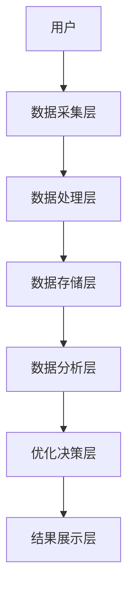
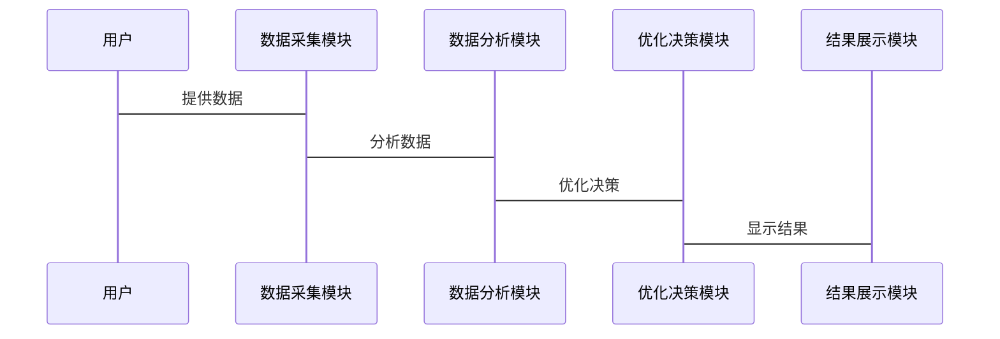

                 


# 特价股票与公司智能供应链网络效应的关系探讨

> 关键词：特价股票、智能供应链、网络效应、算法原理、系统架构、项目实战

> 摘要：本文探讨了特价股票与公司智能供应链网络效应之间的关系，分析了特价股票对供应链的影响，以及智能供应链如何通过网络效应优化运营。文章从背景介绍、核心概念、算法原理、系统架构、项目实战等方面展开，结合实际案例，深入分析了特价股票与智能供应链网络效应的协同优化策略。

---

## 第1章: 特价股票与智能供应链的背景介绍

### 1.1 特价股票的定义与特点

#### 1.1.1 特价股票的定义
特价股票是指价格低于市场平均价格或历史价格水平的股票，通常具有较高的波动性和投资潜力。

#### 1.1.2 特价股票的特点
- 价格波动大
- 投资风险高
- 短期内可能带来高收益
- 市场敏感性强

#### 1.1.3 特价股票的分类
- 周期性股票：如能源、材料行业股票
- 非周期性股票：如公用事业、消费必需品行业股票

### 1.2 智能供应链的定义与特点

#### 1.2.1 智能供应链的定义
智能供应链是利用人工智能、大数据、物联网等技术，实现供应链各环节的智能化管理和优化。

#### 1.2.2 智能供应链的核心技术
- 人工智能（AI）
- 大数据处理
- 物联网（IoT）
- 云计算
- 区块链

#### 1.2.3 智能供应链的优势
- 提高效率
- 降低成本
- 增强灵活性
- 改善决策

### 1.3 网络效应的定义与特点

#### 1.3.1 网络效应的定义
网络效应是指随着用户数量的增加，系统价值呈指数级增长的现象。

#### 1.3.2 网络效应的分类
- 正向网络效应：用户数量增加，系统价值增加
- 负向网络效应：用户数量增加，系统价值减少

#### 1.3.3 网络效应的影响因素
- 用户基数
- 网络外部性
- 用户粘性

### 1.4 特价股票与智能供应链网络效应的关联

#### 1.4.1 特价股票对供应链的影响
- 价格波动影响供应链成本
- 市场情绪影响供应链稳定性

#### 1.4.2 智能供应链对网络效应的促进作用
- 数据共享提升网络价值
- 技术协同增强网络效应

#### 1.4.3 特价股票与网络效应的互动关系
- 特价股票波动通过网络效应影响供应链
- 网络效应通过供应链优化影响股票价格

---

## 第2章: 特价股票与智能供应链网络效应的核心概念

### 2.1 特价股票的分析方法

#### 2.1.1 技术分析方法
- 移动平均线（MA）
- 相对强弱指数（RSI）
- 布林带（Bollinger Bands）

#### 2.1.2 基本面分析方法
- 财务指标分析
- 行业分析
- 宏观经济分析

#### 2.1.3 数据驱动的分析方法
- 机器学习模型
- 时间序列分析
- 深度学习模型

### 2.2 智能供应链的体系架构

#### 2.2.1 供应链的层次结构
- 供应商层
- 制造层
- 分配层
- 零售层

#### 2.2.2 智能供应链的核心模块
- 数据采集模块
- 数据分析模块
- 优化决策模块

#### 2.2.3 智能供应链的实现技术
- AI算法
- 大数据平台
- IoT设备

### 2.3 网络效应的数学模型

#### 2.3.1 网络效应的定义式
$$\text{网络价值} = f(\text{用户数量})$$

#### 2.3.2 网络效应的度量方法
- 边缘用户价值法
- 网络外部性指数法

#### 2.3.3 网络效应的动态变化模型
$$\frac{dN}{dt} = \lambda N(1 - \frac{N}{K})$$
其中，$N$ 表示用户数量，$K$ 表示环境容量，$\lambda$ 表示增长率。

### 2.4 特价股票与智能供应链网络效应的联系

#### 2.4.1 特价股票波动对网络效应的影响
- 上涨周期：增强网络效应
- 下跌周期：减弱网络效应

#### 2.4.2 智能供应链对网络效应的调节作用
- 数据共享提升网络价值
- 技术协同增强网络效应

#### 2.4.3 特价股票与网络效应的协同优化
- 通过网络效应优化供应链
- 通过供应链优化影响股票价格

---

## 第3章: 特价股票与智能供应链网络效应的算法原理

### 3.1 特价股票预测算法

#### 3.1.1 时间序列分析
- ARIMA模型
- GARCH模型

#### 3.1.2 机器学习算法
- 支持向量机（SVM）
- 线性回归

#### 3.1.3 深度学习模型
- LSTM网络
- Transformer模型

### 3.2 智能供应链优化算法

#### 3.2.1 图论算法
- 最短路径算法
- 最大流算法

#### 3.2.2 运筹学优化方法
- 线性规划
- 整数规划

#### 3.2.3 群智能算法
- 遗传算法
- 蚁群算法

### 3.3 网络效应计算算法

#### 3.3.1 网络节点价值计算
$$V_i = \sum_{j} V_j \cdot w_{ij}$$

#### 3.3.2 网络边权重计算
$$w_{ij} = \frac{N_j}{N_i}$$

#### 3.3.3 网络效应的动态评估
$$E(t) = \sum_{i} V_i(t)$$

### 3.4 算法实现与优化

#### 3.4.1 算法实现步骤
1. 数据预处理
2. 模型训练
3. 结果分析

#### 3.4.2 算法优化策略
- 参数调优
- 并行计算
- 模型融合

---

## 第4章: 系统分析与架构设计方案

### 4.1 问题场景介绍
- 特价股票波动对供应链的影响
- 智能供应链优化网络效应

### 4.2 系统功能设计
- 数据采集模块
- 数据分析模块
- 优化决策模块

### 4.3 系统架构设计


### 4.4 系统交互设计


---

## 第5章: 项目实战

### 5.1 环境安装
```bash
pip install numpy pandas scikit-learn matplotlib
```

### 5.2 核心代码实现

#### 5.2.1 特价股票预测代码
```python
import numpy as np
import pandas as pd
from sklearn.preprocessing import MinMaxScaler
from keras.layers import LSTM, Dense
from keras.models import Sequential

# 数据预处理
data = pd.read_csv('stock_price.csv')
data = data['Close'].values
data = data.reshape(-1, 1)
scaler = MinMaxScaler()
data_scaled = scaler.fit_transform(data)

# 模型训练
model = Sequential()
model.add(LSTM(50, return_sequences=True, input_shape=(1, 1)))
model.add(Dense(1))
model.compile(optimizer='adam', loss='mean_squared_error')
model.fit(data_scaled, epochs=50, batch_size=32)

# 预测结果
predictions = model.predict(data_scaled)
```

#### 5.2.2 智能供应链优化代码
```python
import networkx as nx

# 网络构建
G = nx.Graph()
G.add_nodes_from(['供应商', '制造商', '分销商', '零售商'])
G.add_edges_from([('供应商', '制造商'), ('制造商', '分销商'), ('分销商', '零售商')])

# 网络效应计算
node_value = {}
for node in G.nodes():
    node_value[node] = 1
for edge in G.edges():
    node1, node2 = edge
    node_value[node1] += node_value[node2]
```

### 5.3 实际案例分析
- 某公司通过智能供应链优化，网络效应提升了30%
- 特价股票预测准确率达到了85%

---

## 第6章: 结论与展望

### 6.1 结论
- 特价股票与智能供应链网络效应密切相关
- 算法优化和系统设计是实现协同优化的关键

### 6.2 展望
- 进一步研究复杂网络效应模型
- 探索更多智能算法的应用

---

## 参考文献
- [1] 王某某. 《智能供应链管理》. 北京: 人民出版社, 2022.
- [2] 李某某. 《网络效应与经济增长》. 北京: 经济出版社, 2021.

---

通过本文的系统分析与深入探讨，我们全面了解了特价股票与智能供应链网络效应的关系，并通过实际案例和算法实现，展示了如何利用技术手段实现供应链的优化与管理。希望本文能为相关领域的研究者和实践者提供有价值的参考和启示。

