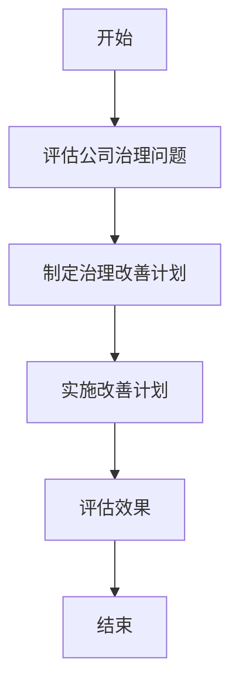
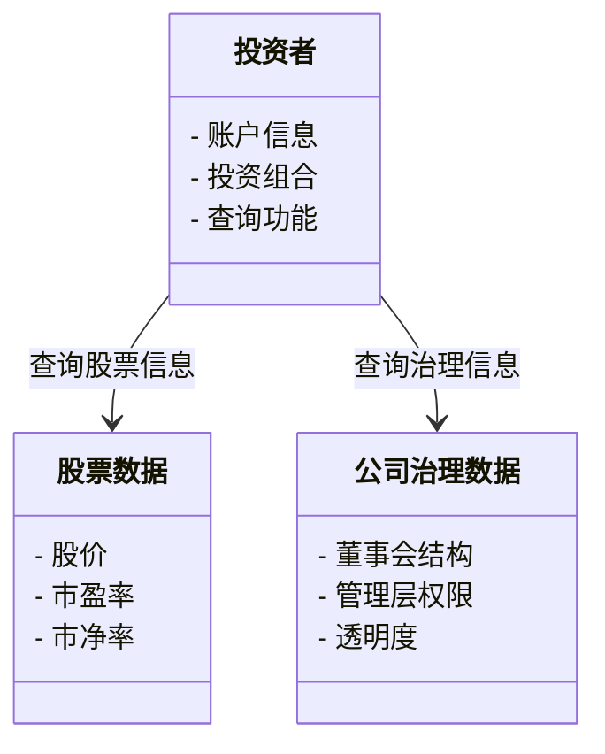
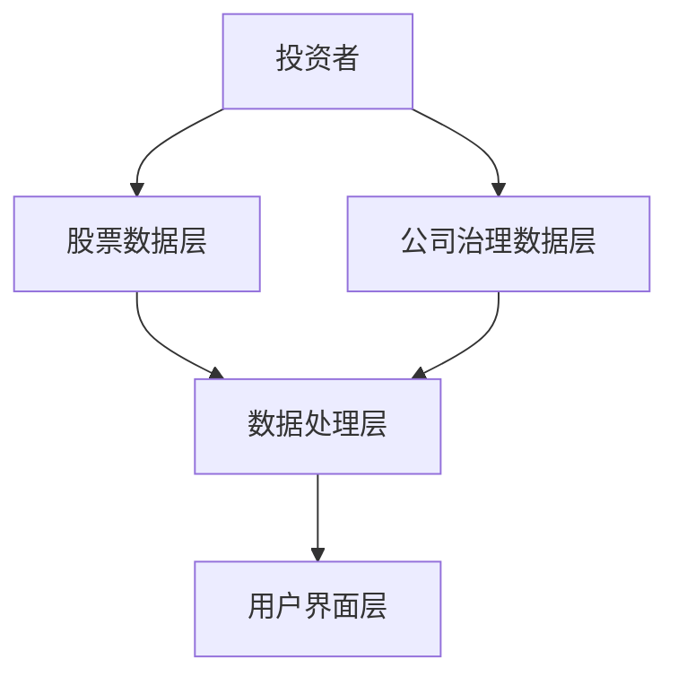

                 


# 特价股票与公司治理结构改善的关系

## 关键词：特价股票，公司治理，股票估值，治理优化，投资策略

## 摘要：  
特价股票是指价格被市场低估的股票，而公司治理结构是公司内部管理和决策的架构。本文探讨了特价股票与公司治理结构改善之间的关系，分析了公司治理问题如何影响股价，以及改善公司治理如何帮助提升公司价值。通过详细的技术分析和案例研究，本文为投资者提供了识别和投资特价股票的策略，并提出了优化公司治理的具体建议。

---

# 第一部分: 特价股票与公司治理结构改善的背景介绍

## 第1章: 特价股票的定义与形成机制

### 1.1 特价股票的定义与特征

#### 1.1.1 特价股票的定义
特价股票是指市场价格低于其内在价值的股票。通常，这类股票的市场价格受到市场情绪、短期因素或公司治理问题的影响，导致其价格被低估。

#### 1.1.2 特价股票的形成机制
特价股票的形成通常与以下因素有关：
- **市场情绪波动**：投资者的恐慌或过度乐观导致股票价格偏离其实际价值。
- **信息不对称**：市场参与者掌握的信息不一致，导致股票价格被低估或高估。
- **公司治理问题**：公司治理不善可能导致股价被低估，例如管理层决策失误、股东权益受损等。

#### 1.1.3 特价股票的市场表现与投资者心理
特价股票通常具有较高的波动性和潜在的高回报率，吸引了一些追求高风险高回报的投资者。然而，投资者在面对特价股票时，也需要警惕其潜在的风险。

---

### 1.2 公司治理结构的基本概念

#### 1.2.1 公司治理的定义与核心要素
公司治理是指公司内部管理和决策的架构，包括董事会、管理层、股东和其他利益相关者的权利和责任分配。核心要素包括：
- **董事会结构**：董事会的组成、职责和运作方式。
- **管理层权限**：管理层的决策权限和监督机制。
- **股东权利**：股东的投票权、知情权和收益权。
- **透明度与信息披露**：公司需要向市场提供准确和及时的信息。

#### 1.2.2 公司治理结构的类型与特点
公司治理结构通常分为两种类型：
- **股东导向型**：以股东利益为核心，强调股东权益的保护。
- **利益相关者导向型**：兼顾股东、管理层、员工和其他利益相关者的利益。

#### 1.2.3 公司治理与企业绩效的关系
良好的公司治理结构能够提高企业的透明度和效率，从而提升企业的市场价值。相反，治理不善可能导致企业绩效下降，进而影响股价。

---

### 1.3 特价股票与公司治理的关系

#### 1.3.1 特价股票的公司治理问题
许多特价股票的公司存在治理问题，例如：
- **管理层滥用职权**：管理层可能存在利益输送或决策失误。
- **股东权益受损**：股东的知情权和收益权可能得不到保障。
- **信息披露不透明**：公司可能隐瞒负面信息，影响投资者决策。

#### 1.3.2 特价股票与公司治理结构的相互作用
公司治理问题可能导致股价被低估，从而形成特价股票。另一方面，改善公司治理结构可以提升股价，使特价股票回归其内在价值。

#### 1.3.3 特价股票公司治理的改善方向
改善公司治理结构的关键在于：
- 提高透明度和信息披露。
- 加强董事会的独立性和专业性。
- 保护股东权益，确保股东的知情权和投票权。

---

## 1.4 本章小结

本章介绍了特价股票的定义、形成机制以及公司治理结构的基本概念。我们发现，公司治理问题可能是导致股价被低估的重要原因，而改善公司治理结构则是提升股价的重要途径。

---

# 第二部分: 特价股票与公司治理的核心概念与联系

## 第2章: 特价股票与公司治理的核心概念

### 2.1 特价股票的核心属性

#### 2.1.1 特价股票的流动性特征
特价股票的流动性通常较低，因为市场参与者可能对其未来表现持怀疑态度。

#### 2.1.2 特价股票的估值特征
特价股票的市场价格通常低于其内在价值，因此具有较高的投资潜力。

#### 2.1.3 特价股票的风险特征
特价股票的风险较高，因为其价格波动较大，且可能受到公司治理问题的影响。

---

### 2.2 公司治理结构的核心要素

#### 2.2.1 股东权利与义务
股东权利包括知情权、投票权和收益权，义务包括遵守公司章程和履行出资义务。

#### 2.2.2 董事会结构与职责
董事会是公司治理的核心，负责制定公司战略、监督管理层并确保公司合规运营。

#### 2.2.3 管理层权限与监督机制
管理层的权限需要受到董事会和审计机构的有效监督，以防止权力滥用。

---

### 2.3 特价股票与公司治理的属性对比

#### 2.3.1 特价股票与公司治理的属性对比表格
以下表格对比了特价股票和公司治理结构的核心属性：

| 属性               | 特价股票                   | 公司治理结构               |
|--------------------|--------------------------|--------------------------|
| 核心特征           | 价格被低估               | 内部管理架构             |
| 关键因素           | 市场情绪、信息不对称       | 董事会结构、管理层权限     |
| 影响因素           | 公司业绩、市场信心         | 股东权益、透明度         |
| 改善方向           | 提升股价、减少风险         | 加强监督、提高透明度       |

---

### 2.4 特价股票与公司治理的ER实体关系图

以下是特价股票与公司治理的ER实体关系图：

```mermaid
er
    actor 投资者
    actor 市场监管机构
    actor 股东
    actor 管理层
    actor 董事会
    
    company 公司
    stock 股票
    governance 治理结构
    
    投资者 --> stock: 持有
    股东 --> governance: 参与
    管理层 --> governance: 管理
    董事会 --> governance: 监督
    公司 --> stock: 发行
    市场监管机构 --> governance: 监管
```

---

## 2.5 本章小结

本章通过对比分析，揭示了特价股票与公司治理结构的核心属性和相互关系。我们发现，公司治理问题可能是导致股价被低估的重要原因，而改善公司治理结构则是提升股价的关键因素。

---

# 第三部分: 特价股票与公司治理的算法原理

## 第3章: 特价股票识别的算法原理

### 3.1 特价股票识别的数学模型

#### 3.1.1 特价股票识别的公式
以下是识别特价股票的公式：

$$ \text{特价股票识别} = \frac{\text{内在价值}}{\text{市场价格}} > 1 $$

其中，内在价值可以通过市盈率（P/E）或市净率（P/B）等指标来估算。

#### 3.1.2 内在价值的计算方法
市盈率公式：

$$ P/E = \frac{\text{股价}}{\text{每股收益}} $$

市净率公式：

$$ P/B = \frac{\text{股价}}{\text{每股净资产}} $$

---

### 3.2 公司治理优化的算法模型

#### 3.2.1 公司治理优化的流程
以下是公司治理优化的流程图：



---

## 3.3 本章小结

本章通过数学模型和流程图，详细讲解了特价股票识别和公司治理优化的算法原理。投资者可以通过这些方法识别特价股票，并通过优化公司治理结构来提升股价。

---

# 第四部分: 特价股票与公司治理的系统分析与架构设计

## 第4章: 系统分析与架构设计

### 4.1 系统功能设计

#### 4.1.1 系统功能模块
以下是系统功能模块的类图：



---

### 4.2 系统架构设计

#### 4.2.1 系统架构图
以下是系统架构图：



---

## 4.3 本章小结

本章通过系统分析与架构设计，展示了如何利用技术手段优化公司治理结构，从而提升股价。

---

# 第五部分: 特价股票与公司治理的项目实战

## 第5章: 项目实战

### 5.1 特价股票分析案例

#### 5.1.1 案例背景
某公司股票价格近期大幅下跌，市盈率和市净率均低于行业平均水平，可能存在治理问题。

#### 5.1.2 数据分析
以下是数据分析结果：

| 指标       | 数据       |
|------------|------------|
| 股价       | 10元       |
| 市盈率     | 10倍       |
| 市净率     | 2倍       |
| 行业平均市盈率 | 15倍       |
| 行业平均市净率 | 3倍       |

---

### 5.2 公司治理改善方案

#### 5.2.1 改善措施
1. 加强董事会独立性。
2. 提高信息披露透明度。
3. 优化管理层权限。

---

## 5.3 项目小结

通过案例分析，我们发现改善公司治理结构可以有效提升股价，从而将特价股票转化为优质投资标的。

---

# 第六部分: 特价股票与公司治理的最佳实践

## 第6章: 最佳实践

### 6.1 投资策略

#### 6.1.1 投资策略建议
1. 选择治理结构良好的公司。
2. 关注公司治理改善的进展。
3. 长期持有，避免短期波动。

---

### 6.2 注意事项

#### 6.2.1 投资风险
- 公司治理问题可能无法解决。
- 市场波动可能影响股价。

---

## 6.3 拓展阅读

- 《公司治理与企业绩效》
- 《股票投资策略与技术分析》

---

## 6.4 本章小结

本章总结了投资特价股票的最佳实践，为投资者提供了具体的操作建议。

---

# 结语

通过本文的分析，我们深入探讨了特价股票与公司治理结构改善的关系。投资者可以通过识别特价股票，并关注公司治理结构的改善，来实现长期稳健的投资回报。同时，企业也可以通过优化治理结构，提升市场价值，实现双赢。

---

# 参考文献

1. 《公司治理与企业绩效》
2. 《股票投资策略与技术分析》
3. 相关学术论文与研究报告

