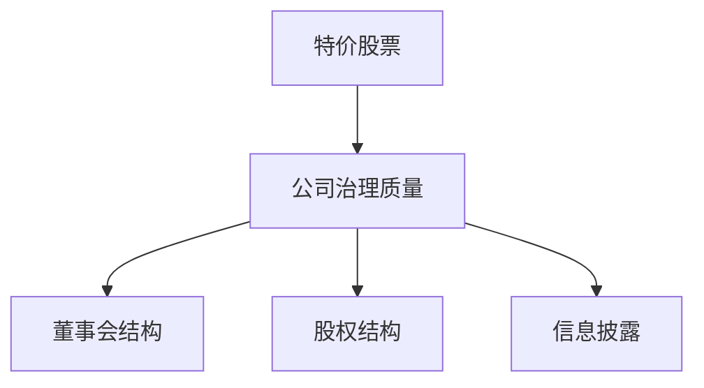

                 

# 特价股票与公司治理质量的相关性研究

> 关键词：特价股票、公司治理质量、相关性分析、大数据分析、数学模型

> 摘要：本文系统研究了特价股票与公司治理质量之间的相关性。通过分析特价股票的特征和公司治理质量的核心要素，构建了相关性分析的理论框架，并结合实证数据，探讨了两者之间的关系。文章还提出了提升公司治理质量以改善股价表现的建议，并展望了未来的研究方向。

---

# 第一部分: 特价股票与公司治理质量的背景介绍

## 第1章: 特价股票与公司治理质量的概述

### 1.1 特价股票的基本概念

#### 1.1.1 特价股票的定义与特征
特价股票是指价格相对较低的股票，通常具有高波动性和高风险。其特征包括低价、高波动性和投资者行为多样性。

#### 1.1.2 特价股票的分类与市场表现
特价股票可以分为周期性股票和成长性股票，其市场表现受多种因素影响，如市场波动和公司基本面。

#### 1.1.3 特价股票的投资价值与风险
投资价值在于潜在的高回报，但风险较高，需谨慎选择。

### 1.2 公司治理质量的核心要素

#### 1.2.1 公司治理的基本概念
公司治理涉及董事会结构、股权分布和信息披露，确保公司有效运作和透明度。

#### 1.2.2 公司治理质量的评价指标
包括董事会结构、股权集中度和信息披露水平。

#### 1.2.3 公司治理与企业绩效的关系
良好的公司治理与企业绩效密切相关，影响股价表现。

### 1.3 特价股票与公司治理质量的相关性背景

#### 1.3.1 特价股票市场的现状与问题
市场波动大，信息不对称，投资者行为复杂。

#### 1.3.2 公司治理质量对股价的影响
治理质量高，股价表现稳定；治理质量低，股价波动大。

#### 1.3.3 特价股票与公司治理质量相关性的研究意义
揭示两者关系，指导投资决策和公司治理优化。

---

## 第2章: 特价股票与公司治理质量的核心概念与联系

### 2.1 特价股票与公司治理质量的核心概念

#### 2.1.1 特价股票的市场定位
低价股票在市场中处于弱势地位，容易受市场波动影响。

#### 2.1.2 公司治理质量的内涵与外延
包括治理结构、机制和效果，影响公司长期发展。

#### 2.1.3 两者之间的逻辑关系
公司治理质量影响股价，进而影响特价股票的市场表现。

### 2.2 特价股票与公司治理质量的属性特征对比

#### 2.2.1 特价股票的属性特征
价格低、波动大、风险高。

#### 2.2.2 公司治理质量的属性特征
透明度高、结构合理、机制完善。

#### 2.2.3 两者属性特征的对比分析
对比分析显示，治理质量高有助于稳定股价，降低风险。

### 2.3 特价股票与公司治理质量的ER实体关系图

### 2.4 本章小结

---

## 第3章: 特价股票与公司治理质量的相关性分析

### 3.1 相关性分析的理论基础

#### 3.1.1 相关性分析的基本概念
相关性分析用于衡量两个变量之间的关系强度。

#### 3.1.2 特价股票与公司治理质量的相关性模型
构建回归模型，分析两者关系。

#### 3.1.3 相关性分析的方法与工具
使用统计软件，如Excel或SPSS，进行数据分析。

### 3.2 特价股票与公司治理质量的相关性实证分析

#### 3.2.1 数据来源与样本选择
数据来源包括公开市场数据和公司治理报告。

#### 3.2.2 数据预处理
清洗数据，处理缺失值和异常值。

#### 3.2.3 相关性计算与结果分析
使用回归分析，得出相关系数和显著性水平。

#### 3.2.4 相关性分析的可视化
绘制散点图和热力图，直观展示相关性。

### 3.3 本章小结

---

## 第4章: 影响公司治理质量的因素分析

### 4.1 影响公司治理质量的因素

#### 4.1.1 董事会结构
董事会独立性和专业性影响治理质量。

#### 4.1.2 股权结构
股权分散性与集中性对治理质量的影响。

#### 4.1.3 信息披露
透明度高的公司治理质量更好。

### 4.2 实证分析

#### 4.2.1 数据分析与结果
分析董事会结构、股权结构和信息披露对治理质量的影响。

#### 4.2.2 结果讨论
董事会独立性和信息披露对治理质量有显著影响。

### 4.3 本章小结

---

## 第5章: 公司治理质量对股价的影响

### 5.1 公司治理质量对股价的影响

#### 5.1.1 数学模型
建立回归模型，分析治理质量对股价的影响。

#### 5.1.2 实证分析
使用历史数据，验证模型的准确性。

### 5.2 对特价股票的影响

#### 5.2.1 特价股票的敏感性
治理质量低的公司，特价股票波动大。

#### 5.2.2 投资者行为的影响
治理质量差的公司，投资者信心不足，股价下跌。

### 5.3 本章小结

---

## 第6章: 大数据分析与相关性研究

### 6.1 大数据分析方法

#### 6.1.1 数据预处理
清洗数据，提取特征。

#### 6.1.2 数据分析与建模
使用机器学习算法，分析数据。

### 6.2 特价股票与公司治理质量的相关性研究

#### 6.2.1 数据可视化
绘制图表，展示相关性。

#### 6.2.2 结果分析
分析大数据结果，验证相关性。

### 6.3 本章小结

---

## 第7章: 提升公司治理质量的建议

### 7.1 提升公司治理质量的措施

#### 7.1.1 完善董事会结构
增加独立董事，优化董事会结构。

#### 7.1.2 提高信息披露质量
加强信息公开，提高透明度。

#### 7.1.3 优化股权结构
分散股权，避免一股独大。

### 7.2 对投资者的建议

#### 7.2.1 关注公司治理质量
选择治理质量高的公司，降低投资风险。

#### 7.2.2 长期投资策略
注重公司治理质量，长期投资，获取稳定收益。

### 7.3 本章小结

---

## 第8章: 未来的研究方向与实际应用

### 8.1 未来研究方向

#### 8.1.1 更复杂的数据分析方法
探索机器学习和深度学习的应用。

#### 8.1.2 全球市场比较研究
比较不同市场的治理质量和股价表现。

### 8.2 实际应用

#### 8.2.1 投资策略优化
基于治理质量，优化投资组合。

#### 8.2.2 政策建议
制定政策，促进公司治理质量提升。

### 8.3 本章小结

---

## 第9章: 结论与建议

### 9.1 研究总结

#### 9.1.1 主要结论
公司治理质量与股价表现密切相关，治理质量高的公司，股价表现稳定。

#### 9.1.2 研究意义
为投资者和公司提供参考，促进市场健康发展。

### 9.2 实践建议

#### 9.2.1 公司层面
优化治理结构，提高透明度。

#### 9.2.2 投资者层面
注重治理质量，降低投资风险。

### 9.3 本章小结

---

## 第10章: 展望与总结

### 10.1 未来展望

#### 10.1.1 研究方向
探索大数据和人工智能在公司治理中的应用。

#### 10.1.2 实际应用
制定政策，促进公司治理质量提升。

### 10.2 总结

#### 10.2.1 研究成果
揭示了特价股票与公司治理质量的相关性，为投资决策提供参考。

#### 10.2.2 未来工作
继续研究，探索更多相关性分析的方法和应用。

---

# 参考文献

---

通过以上目录和内容，读者可以系统地了解特价股票与公司治理质量的相关性，掌握分析方法和实际应用。

