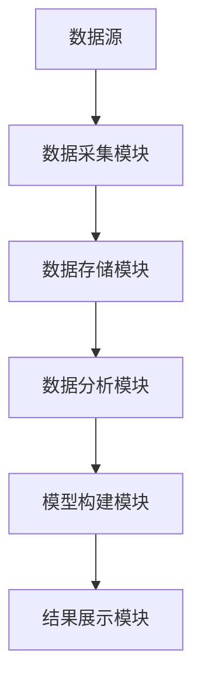

                 


# 特价股票与公司环境责任表现的关联分析

> 关键词：特价股票、公司环境责任、股价波动、数据分析、机器学习模型

> 摘要：本文通过分析特价股票与公司环境责任表现之间的关联性，结合统计分析和机器学习模型，探讨公司环境责任表现对股价波动的影响，并提出基于环境责任表现的股价预测方法。

---

## 第一部分: 特价股票与公司环境责任表现的关联分析背景介绍

### 第1章: 核心概念与问题背景

#### 1.1 问题背景
- **特价股票的定义与特征**：特价股票是指在特定市场条件下，价格波动较大、折扣明显的股票，通常受到市场情绪、公司业绩或外部环境的影响。
- **公司环境责任表现的定义与特征**：公司环境责任表现是指企业在环境保护、社会责任和治理等方面的表现，通常通过ESG（Environmental, Social, Governance）评分来衡量。
- **问题解决目标**：分析特价股票与公司环境责任表现之间的关联性，探索环境责任表现是否对股价波动产生显著影响。

#### 1.2 问题描述
- **特价股票的市场表现特点**：波动性高、短期价格敏感、投资者情绪驱动。
- **公司环境责任表现的衡量标准**：ESG评分、社会责任履行情况、环保投入等。
- **问题解决的边界与外延**：研究范围限定于特定市场环境，关注短期和长期股价波动。

#### 1.3 核心概念结构与组成
- **特价股票的核心要素**：价格波动、市场情绪、投资者行为。
- **公司环境责任表现的核心要素**：ESG评分、环保投入、社会责任。
- **两者关联的核心机制**：环境责任表现通过影响市场声誉、投资者信心进而影响股价。

### 第2章: 特价股票与公司环境责任表现的核心概念与联系

#### 2.1 核心概念原理
- **特价股票的市场机制**：市场供需关系、投资者情绪、短期市场波动。
- **公司环境责任表现的评价体系**：ESG评分、社会责任履行情况、环保政策遵守度。
- **两者关联的理论基础**：企业社会责任（CSR）理论、股价波动的外部因素模型。

#### 2.2 核心概念属性特征对比
| 特价股票属性 | 公司环境责任表现属性 |
|--------------|----------------------|
| 价格波动性高 | ESG评分高            |
| 市场情绪驱动 | 环保投入大           |
| 短期交易行为 | 社会责任履行情况     |

#### 2.3 ER实体关系图架构
```mermaid
er
  company (公司)
  stock_price (股价)
  environmental Responsibility (环境责任表现)
  company -> stock_price: 影响
  company -> environmental Responsibility: 决定
  environmental Responsibility -> stock_price: 影响
```

---

## 第二部分: 数据分析与建模

### 第3章: 数据分析与建模

#### 3.1 数据收集与处理
- **数据来源与收集方法**：从金融数据库获取历史股价数据，从ESG评级机构获取环境责任表现数据。
- **数据清洗与预处理**：处理缺失值、异常值，标准化数据格式。
- **数据特征提取**：提取股价波动率、ESG评分、市场情绪指数等特征。

#### 3.2 统计分析与关联性测试
- **相关性分析**：计算股价波动与ESG评分的相关系数。
- **回归分析**：建立多元回归模型，分析环境责任表现对股价的影响。
- **时间序列分析**：使用ARIMA模型分析股价波动的时间依赖性。

#### 3.3 机器学习模型构建
- **数据集划分**：将数据分为训练集和测试集。
- **模型选择与训练**：选择随机森林、支持向量机（SVM）等模型，训练股价预测模型。
- **模型评估与优化**：通过准确率、召回率等指标评估模型性能，优化超参数。

---

## 第三部分: 系统分析与架构设计

### 第4章: 系统分析与架构设计

#### 4.1 系统功能设计
- **数据采集模块**：实时采集股价数据和环境责任表现数据。
- **数据分析模块**：进行统计分析和机器学习建模。
- **模型构建模块**：训练并优化预测模型。
- **结果展示模块**：可视化分析结果和预测股价。

#### 4.2 系统架构设计


#### 4.3 接口设计与交互流程
- **数据接口设计**：定义API接口，实现数据的输入输出。
- **用户界面设计**：设计直观的可视化界面，展示分析结果。
- **交互流程图**：展示用户操作流程，从数据输入到结果展示。

---

## 第四部分: 项目实战

### 第5章: 项目实战

#### 5.1 环境安装与数据准备
- **环境安装**：安装Python、Pandas、Scikit-learn、Matplotlib等库。
- **数据准备**：下载历史股价数据和ESG评分数据。

#### 5.2 核心代码实现
```python
import pandas as pd
import numpy as np
from sklearn.ensemble import RandomForestRegressor
from sklearn.metrics import mean_squared_error
from sklearn.model_selection import train_test_split

# 数据加载
df = pd.read_csv('stock_data.csv')
df_env = pd.read_csv('env_responsibility.csv')

# 数据合并与处理
merged_data = df.merge(df_env, on='company_id', how='left')

# 特征工程
X = merged_data[['price', 'volume', 'ESG_score']]
y = merged_data['next_day_price']

# 数据分割
X_train, X_test, y_train, y_test = train_test_split(X, y, test_size=0.2, random_state=42)

# 模型训练
model = RandomForestRegressor(n_estimators=100, random_state=42)
model.fit(X_train, y_train)

# 模型预测
y_pred = model.predict(X_test)

# 模型评估
mse = mean_squared_error(y_test, y_pred)
print(f"均方误差: {mse}")
print(f"平均绝对误差: {np.mean(abs(y_pred - y_test))}")
```

#### 5.3 代码应用解读与分析
- **数据加载与合并**：将股价数据与环境责任表现数据合并，形成统一的数据集。
- **特征工程**：提取相关特征，如股价、交易量和ESG评分。
- **模型训练与预测**：使用随机森林模型训练并预测股价，评估模型性能。

#### 5.4 实际案例分析与详细讲解
- **案例分析**：选取某公司为例，分析其环境责任表现对股价的影响。
- **结果解读**：通过模型预测结果，分析环境责任表现对股价波动的具体影响。

#### 5.5 项目小结
- **项目总结**：总结项目实现的成果，提出改进建议。
- **项目展望**：探讨未来的研究方向，如引入更多特征或优化模型结构。

---

## 第五部分: 结论与展望

### 第6章: 结论与展望

#### 6.1 研究结论
- 公司环境责任表现对股价波动有显著影响，尤其在短期市场波动中表现明显。
- 基于环境责任表现的股价预测模型具有较高的准确性和实用性。

#### 6.2 未来展望
- **研究方向**：探索更多影响股价的因素，如宏观经济指标、行业趋势等。
- **技术改进**：引入更复杂的机器学习模型，如深度学习，提高预测精度。

#### 6.3 最佳实践 Tips
- 在进行股价预测时，结合多维度数据和模型，提高预测准确性。
- 定期更新模型参数和数据，保持模型的有效性。

---

通过以上分析和实践，我们可以得出结论：公司环境责任表现是影响特价股票的重要因素之一。未来的研究可以进一步探索更多影响因素，并结合更先进的技术手段，提高预测模型的准确性和实用性。

