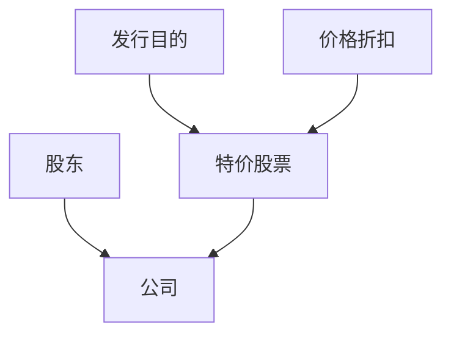
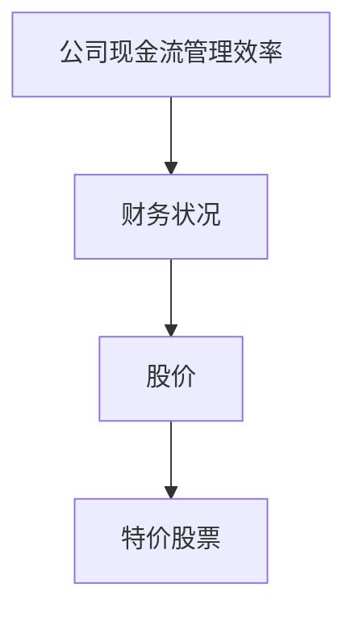
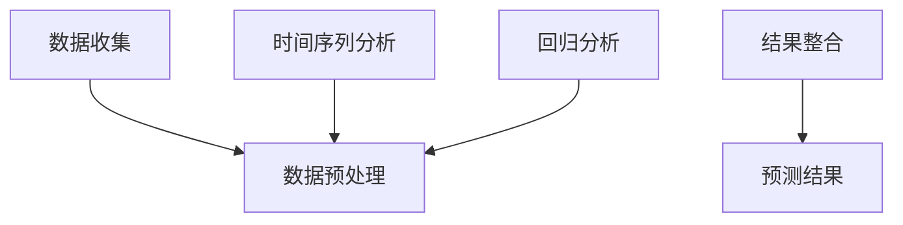
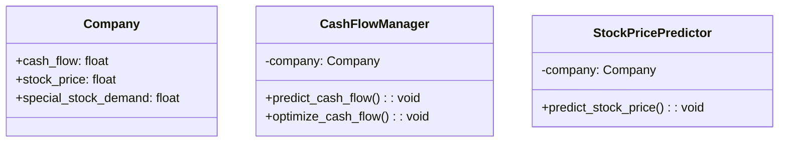
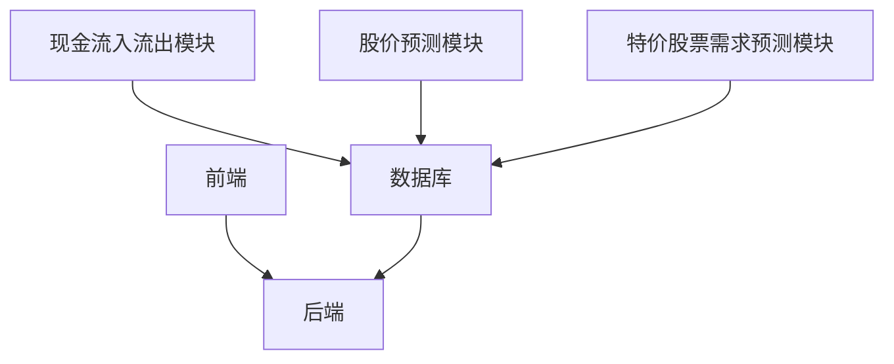
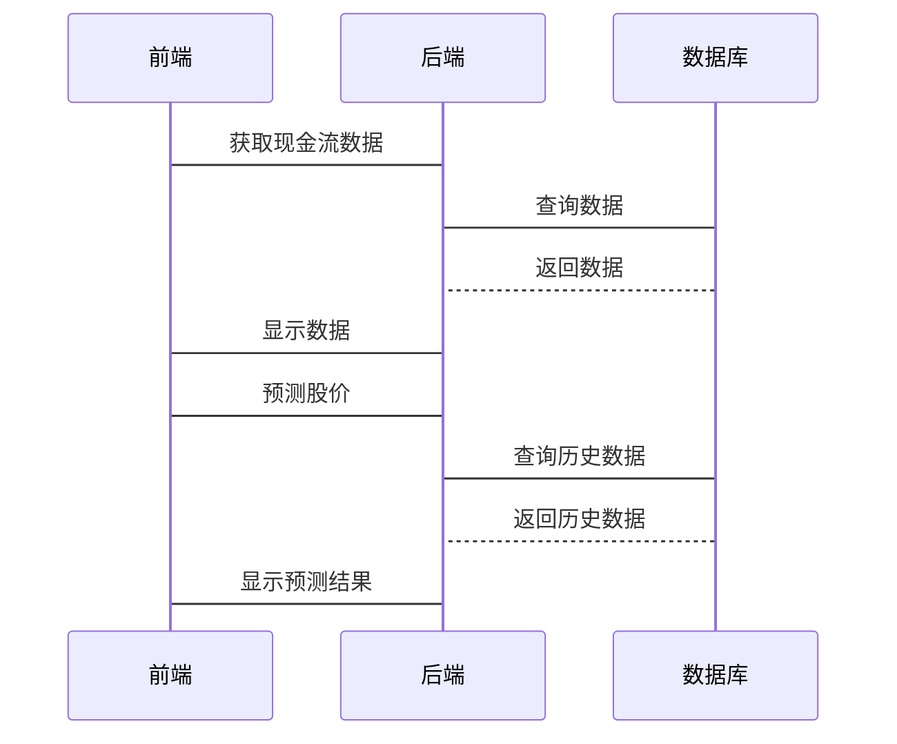

                 


# 特价股票与公司现金流管理效率的关系

## 关键词：特价股票、现金流管理效率、股票价格预测、现金流预测、企业财务分析

## 摘要：本文深入探讨了特价股票与公司现金流管理效率之间的关系。通过分析特价股票的定义、特点及公司现金流管理效率的核心概念，结合数学模型和算法，预测公司现金流与股价的关系，并通过系统架构设计和实际案例分析，展示如何通过优化现金流管理效率来提升公司股价。

---

# 第一部分: 特价股票与公司现金流管理效率的背景与概念

## 第1章: 特价股票与公司现金流管理效率的背景介绍

### 1.1 特价股票的定义与特点
#### 1.1.1 特价股票的定义
特价股票是指发行价格低于面值的股票，通常用于吸引投资者或奖励现有股东。其特点是价格低廉，风险较高，回报潜力大。

#### 1.1.2 特价股票的特点
- 价格低于面值
- 风险高，回报潜力大
- 通常用于公司资本结构调整或激励计划

#### 1.1.3 特价股票的分类与应用场景
- 普通特价股票
- 优先特价股票
- 可转换特价股票

### 1.2 公司现金流管理效率的定义与特点
#### 1.2.1 公司现金流管理效率的定义
公司现金流管理效率是指公司通过有效管理现金流入和流出，最大化现金流净额的能力。

#### 1.2.2 公司现金流管理效率的特点
- 现金流预测的准确性
- 现金流使用的效率
- 现金储备的合理性

#### 1.2.3 公司现金流管理效率的分类与应用场景
- 现金流预测效率
- 现金流使用效率
- 现金流储备效率

### 1.3 特价股票与公司现金流管理效率的关系
#### 1.3.1 特价股票与公司现金流管理效率的背景
现金流状况直接影响公司股价，特价股票反映了公司财务状况的紧张或优化。

#### 1.3.2 特价股票与公司现金流管理效率的内在联系
- 现金流管理效率影响公司财务健康状况
- 财务健康状况影响股价
- 特价股票是公司现金流管理优化的体现

#### 1.3.3 特价股票与公司现金流管理效率的边界与外延
- 特价股票的发行与公司现金流管理效率有关
- 现金流管理效率的优化可以改善股价
- 特价股票的市场反应与现金流管理效率相关

### 1.4 本章小结
本章介绍了特价股票和公司现金流管理效率的定义、特点及其关系，为后续分析奠定了基础。

---

# 第二部分: 特价股票与公司现金流管理效率的核心概念与联系

## 第2章: 特价股票与公司现金流管理效率的核心概念

### 2.1 特价股票的核心概念
#### 2.1.1 特价股票的核心要素
- 股票面值
- 发行价格
- 发行目的

#### 2.1.2 特价股票的属性特征
- 价格折扣
- 投资吸引力
- 股权结构变化

#### 2.1.3 特价股票的实体关系图（Mermaid流程图）


### 2.2 公司现金流管理效率的核心概念
#### 2.2.1 公司现金流管理效率的核心要素
- 现金流入
- 现金流出
- 现金净额

#### 2.2.2 公司现金流管理效率的属性特征
- 现金流预测能力
- 现金流使用效率
- 现金储备合理性

#### 2.2.3 公司现金流管理效率的实体关系图（Mermaid流程图）


### 2.3 特价股票与公司现金流管理效率的联系
#### 2.3.1 特价股票与公司现金流管理效率的对比分析（属性特征对比表格）
| 特性             | 特价股票                | 公司现金流管理效率       |
|------------------|-------------------------|--------------------------|
| 核心要素         | 股票价格、发行目的       | 现金流入、流出、净额     |
| 属性特征         | 价格折扣、投资吸引力     | 预测能力、使用效率、储备合理性 |
| 实体关系         | 股东-公司-特价股票       | 公司-现金流入-现金流出   |

#### 2.3.2 特价股票与公司现金流管理效率的内在联系
- 现金流管理效率影响公司财务状况，进而影响股价
- 特价股票的发行是公司现金流管理的一部分
- 优化现金流管理可以提升股价，减少特价股票的需求

#### 2.3.3 特价股票与公司现金流管理效率的关系模型


### 2.4 本章小结
本章通过对比分析和关系模型，详细阐述了特价股票与公司现金流管理效率的核心概念及其联系。

---

# 第三部分: 特价股票与公司现金流管理效率的算法原理讲解

## 第3章: 特价股票与公司现金流管理效率的算法原理

### 3.1 特价股票与公司现金流管理效率的预测算法
#### 3.1.1 算法原理概述
- 使用时间序列分析预测现金流
- 使用回归分析预测股价
- 结合现金流和股价预测特价股票的需求

#### 3.1.2 算法流程图（Mermaid流程图）


#### 3.1.3 算法实现
##### 3.1.3.1 数据收集与预处理
```python
import pandas as pd

# 数据收集
data = pd.read_csv('financial_data.csv')

# 数据预处理
data['date'] = pd.to_datetime(data['date'])
data.set_index('date', inplace=True)
data = data[['cash_flow', 'stock_price']]
```

##### 3.1.3.2 时间序列分析
```python
from statsmodels.tsa.arima_model import ARIMA

# 时间序列模型
model = ARIMA(data['cash_flow'], order=(1, 1, 1))
model_fit = model.fit()

# 预测现金流
forecast_cash_flow = model_fit.forecast(steps=10)
```

##### 3.1.3.3 回归分析
```python
import statsmodels.api as sm

# 回归分析
X = data['cash_flow']
Y = data['stock_price']

# 模型拟合
model = sm.OLS(Y, sm.add_constant(X))
results = model.fit()

# 回归系数
print(results.params)
```

#### 3.1.4 预测结果整合
```python
import numpy as np

# 整合现金流和股价预测
predicted_stock_price = results.predict(sm.add_constant(forecast_cash_flow))
```

### 3.2 特价股票需求预测的数学模型
#### 3.2.1 数学模型概述
- 假设特价股票需求与现金流净额和股价相关
- 使用线性回归模型预测需求

#### 3.2.2 数学公式
$$
\text{Demand}_t = \beta_0 + \beta_1 \times \text{CashFlowNet}_t + \beta_2 \times \text{StockPrice}_t + \epsilon_t
$$

其中，$\text{CashFlowNet}_t$ 是现金流净额，$\text{StockPrice}_t$ 是股价，$\epsilon_t$ 是误差项。

#### 3.2.3 模型实现
```python
# 需求预测
X_demand = data[['cash_flow', 'stock_price']]
Y_demand = data['special_stock_demand']

model_demand = sm.OLS(Y_demand, sm.add_constant(X_demand))
results_demand = model_demand.fit()

print(results_demand.params)
```

### 3.3 本章小结
本章通过算法和数学模型，展示了如何预测现金流和股价，进而预测特价股票的需求。

---

# 第四部分: 特价股票与公司现金流管理效率的系统分析与架构设计

## 第4章: 特价股票与公司现金流管理效率的系统分析与架构设计

### 4.1 问题场景介绍
- 公司现金流管理效率低，导致股价波动
- 特价股票发行频率高，影响市场信心

### 4.2 项目介绍
- 开发一个现金流管理与股价预测系统
- 分析系统功能需求

### 4.3 系统功能设计（领域模型Mermaid类图）


### 4.4 系统架构设计（Mermaid架构图）


### 4.5 系统接口设计
- 前端接口：显示现金流、股价和特价股票需求
- 后端接口：处理数据预测和优化

### 4.6 系统交互设计（Mermaid序列图）


### 4.7 本章小结
本章通过系统架构设计，展示了如何通过优化现金流管理来提升股价，减少特价股票需求。

---

# 第五部分: 特价股票与公司现金流管理效率的项目实战

## 第5章: 特价股票与公司现金流管理效率的项目实战

### 5.1 项目环境安装
- 安装Python和相关库
- 数据库连接配置

### 5.2 系统核心实现
#### 5.2.1 数据预处理
```python
import pandas as pd

data = pd.read_csv('financial_data.csv')
data['date'] = pd.to_datetime(data['date'])
data.set_index('date', inplace=True)
```

#### 5.2.2 现金流预测
```python
from statsmodels.tsa.arima_model import ARIMA

model = ARIMA(data['cash_flow'], order=(1, 1, 1))
model_fit = model.fit()

forecast_cash_flow = model_fit.forecast(steps=10)
```

#### 5.2.3 股价预测
```python
import statsmodels.api as sm

X = data['cash_flow']
Y = data['stock_price']

model = sm.OLS(Y, sm.add_constant(X))
results = model.fit()

predicted_stock_price = results.predict(sm.add_constant(forecast_cash_flow))
```

#### 5.2.4 特价股票需求预测
```python
X_demand = data[['cash_flow', 'stock_price']]
Y_demand = data['special_stock_demand']

model_demand = sm.OLS(Y_demand, sm.add_constant(X_demand))
results_demand = model_demand.fit()

predicted_demand = results_demand.predict(sm.add_constant(forecast_cash_flow))
```

### 5.3 项目小结
通过项目实战，验证了现金流管理优化对股价和特价股票需求的影响。

---

# 第六部分: 特价股票与公司现金流管理效率的最佳实践

## 第6章: 特价股票与公司现金流管理效率的最佳实践

### 6.1 小结
- 现金流管理效率直接影响股价
- 特价股票是公司财务状况的体现
- 优化现金流管理可以提升股价，减少特价股票需求

### 6.2 注意事项
- 确保现金流预测的准确性
- 合理分配现金流用途
- 定期评估现金流管理效果

### 6.3 拓展阅读
- 《现金流管理实战手册》
- 《股票价格预测与分析》
- 《企业财务管理优化策略》

### 6.4 本章小结
本章总结了全文，并提供了实践建议和拓展阅读方向。

---

# 结语
本文通过理论分析、算法实现和项目实战，深入探讨了特价股票与公司现金流管理效率的关系，展示了如何通过优化现金流管理来提升公司股价，减少特价股票需求。希望本文能为相关领域的研究和实践提供有价值的参考。

