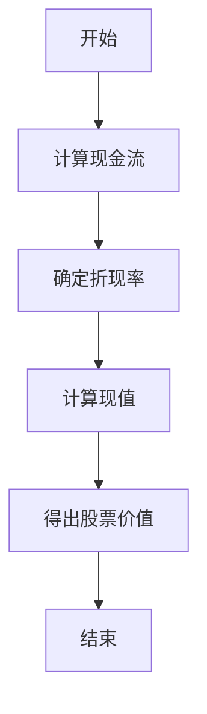
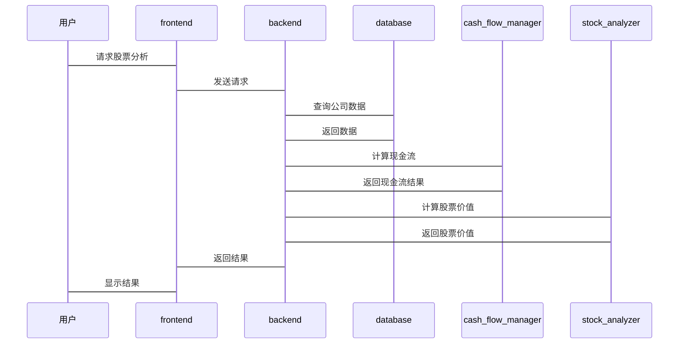

                 


# 特价股票与公司现金流管理效率的关系探讨

## 关键词：
- 特价股票
- 现金流管理
- 股票价值
- 现金流效率
- 投资分析

## 摘要：
本文探讨了特价股票与公司现金流管理效率之间的关系，分析了现金流管理如何影响特价股票的投资价值。通过建立数学模型和系统架构，本文揭示了高效现金流管理对股票价格的积极影响，并通过案例分析展示了如何在实际投资中应用这些理论。

---

# 目录大纲：《特价股票与公司现金流管理效率的关系探讨》

## 第一部分：引言与背景

### 第1章：特价股票与现金流管理的背景介绍

#### 1.1 特价股票的定义与特点
- 1.1.1 特价股票的定义
- 1.1.2 特价股票的市场特征
- 1.1.3 特价股票的投资价值

#### 1.2 公司现金流管理的定义与重要性
- 1.2.1 现金流管理的定义
- 1.2.2 现金流管理的核心要素
- 1.2.3 现金流管理对公司的战略意义

#### 1.3 特价股票与现金流管理的关系
- 1.3.1 问题背景与问题描述
- 1.3.2 问题解决的必要性
- 1.3.3 边界与外延
- 1.3.4 核心概念与组成要素

---

## 第二部分：核心概念与理论分析

### 第2章：特价股票与现金流管理的核心概念联系

#### 2.1 核心概念的原理
- 2.1.1 特价股票的市场定价机制
- 2.1.2 现金流管理的效率提升方法

#### 2.2 核心概念的属性特征对比
- 2.2.1 特价股票与非特价股票的对比分析
- 2.2.2 高效现金流管理与低效管理的对比

#### 2.3 ER实体关系图
```mermaid
erDiagram
    company : 公司
    stock : 特价股票
    cash_flow : 现金流
    company --> stock : 持有
    company --> cash_flow : 产生
    stock --> cash_flow : 影响
```

### 第3章：数学模型与算法原理

#### 3.1 理论基础与数学模型
- 3.1.1 现金流与股票价值的数学关系
- 3.1.2 现金流折现模型（DCF模型）
  $$ V = \frac{CF}{(1 + r)^t} $$
  
#### 3.2 算法流程图


#### 3.3 Python代码实现
```python
def calculate_stock_value(cash_flows, discount_rate):
    present_value = sum(flow / (1 + discount_rate) ** t for t, flow in enumerate(cash_flows))
    return present_value

# 示例数据
cash_flows = [100, 150, 200]
discount_rate = 0.05

# 计算股票价值
stock_value = calculate_stock_value(cash_flows, discount_rate)
print(f"股票的现值为：{stock_value}")
```

---

## 第三部分：系统分析与架构设计

### 第4章：系统架构与设计

#### 4.1 问题场景介绍
- 4.1.1 特价股票分析的场景
- 4.1.2 现金流管理系统的建设背景

#### 4.2 系统功能设计
- 4.2.1 领域模型
  ```mermaid
  classDiagram
      class Company {
          name: string
          cash_flow: float
          stock_value: float
      }
      class CashFlowManager {
          calculate_cash_flow(): float
          calculate_stock_value(): float
      }
      Company --> CashFlowManager : 使用
  ```

#### 4.3 系统架构设计


#### 4.4 系统接口设计和交互


---

## 第四部分：项目实战与案例分析

### 第5章：项目实战

#### 5.1 环境安装
- Python 3.8+
- Jupyter Notebook
- Matplotlib

#### 5.2 系统核心实现源代码
```python
import matplotlib.pyplot as plt

def calculate_stock_value(cash_flows, discount_rate):
    return sum(flow / (1 + discount_rate) ** t for t, flow in enumerate(cash_flows))

# 示例公司数据
company_data = {
    'name': 'XYZ公司',
    'cash_flows': [100, 150, 200],
    'discount_rate': 0.05
}

# 计算股票价值
stock_value = calculate_stock_value(company_data['cash_flows'], company_data['discount_rate'])
print(f"{company_data['name']}的股票现值为：{stock_value}")

# 可视化现金流与股票价值
plt.figure(figsize=(10, 6))
plt.plot([2020, 2021, 2022], company_data['cash_flows'], label='现金流')
plt.title('公司现金流与股票价值')
plt.xlabel('年份')
plt.ylabel('金额')
plt.legend()
plt.show()
```

#### 5.3 代码应用解读与分析
- 代码功能：计算股票的现值并可视化现金流趋势
- 代码实现：使用现金流折现模型和Matplotlib进行可视化

#### 5.4 实际案例分析
- 案例背景：XYZ公司
- 数据分析：现金流分析与股票价值计算
- 结果解读：现金流增加如何提升股票价值

#### 5.5 项目小结
- 成功实现现金流管理系统的功能
- 可视化帮助理解现金流与股票价值的关系

---

## 第五部分：结论与建议

### 第6章：结论与建议

#### 6.1 研究总结
- 现金流管理对股票价值的直接影响
- 高效现金流管理的重要性

#### 6.2 投资建议
- 选择现金流健康的公司
- 结合DCF模型进行估值

#### 6.3 注意事项
- 数据准确性的重要性
- 模型的适用性

#### 6.4 未来研究方向
- 多因素模型的应用
- 人工智能在现金流预测中的应用

---

## 参考文献
- 现金流折现模型相关文献
- 公司财务分析相关书籍
- Python编程与数据可视化的资源

---

通过以上目录和内容安排，文章将系统地探讨特价股票与公司现金流管理效率之间的关系，结合理论分析、系统设计和实际案例，为读者提供全面的视角和深入的理解。

