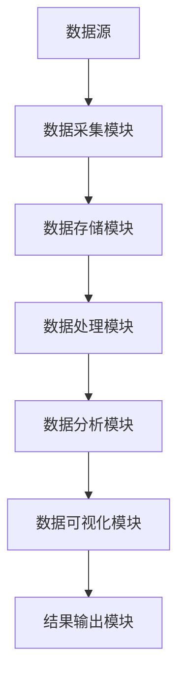
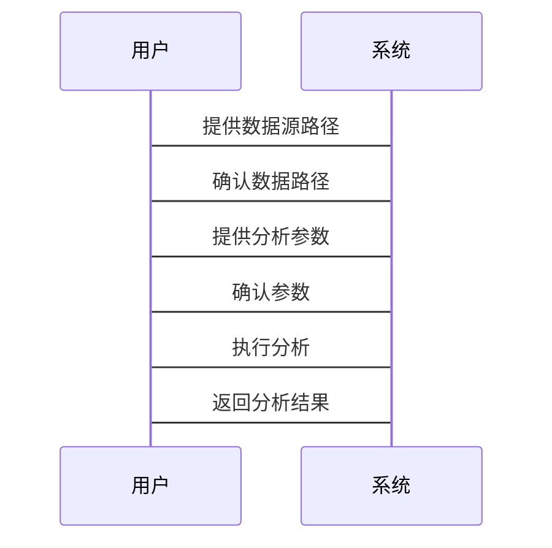

                 


# 特价股票与公司盈利能力的长期关系

## 关键词：特价股票、公司盈利能力、长期关系、数据分析、投资策略、价值投资、财务指标

## 摘要：本文探讨特价股票与公司盈利能力之间的长期关系，分析特价股票的定义、分类及其市场表现，介绍公司盈利能力的核心指标。通过对比分析、数学建模和案例研究，揭示特价股票与公司盈利能力之间的动态关联，为投资者提供科学的决策支持。

## 第一部分: 特价股票与公司盈利能力的背景介绍

### 第1章: 特价股票与公司盈利能力的概述

#### 1.1 特价股票的基本概念
- 1.1.1 特价股票的定义：特价股票是指市场价格显著低于其内在价值的股票，通常被视为被市场低估的投资机会。
- 1.1.2 特价股票的分类：包括周期性股票、困境股票和成长型股票等，不同类型的特价股票具有不同的投资策略。
- 1.1.3 特价股票的市场表现：分析特价股票的历史价格波动、交易量和市场接受度，探讨其在不同市场环境下的表现。

#### 1.2 公司盈利能力的核心指标
- 1.2.1 净利润与ROE的定义：净利润是公司一定时期内的净收益，ROE是衡量股东投资回报的重要指标。
- 1.2.2 毛利率与净利率的计算：毛利率反映公司产品盈利能力，净利率衡量整体盈利能力。
- 1.2.3 盈利能力的行业差异：不同行业的盈利能力受成本结构、市场需求和竞争环境的影响不同。

#### 1.3 特价股票与公司盈利能力的关系
- 1.3.1 特价股票的市场定位：探讨特价股票为何存在，通常反映市场对公司未来盈利能力的预期。
- 1.3.2 盈利能力对股价的影响：分析公司盈利能力提升如何推动股价上涨，以及盈利能力下降如何导致股价下跌。
- 1.3.3 特价股票与盈利能力的长期关联：探讨公司长期盈利能力如何影响其股价的长期表现。

### 第2章: 特价股票与公司盈利能力的背景分析

#### 2.1 特价股票的市场环境
- 2.1.1 特价股票的市场周期：分析市场周期如何影响特价股票的出现和投资机会。
- 2.1.2 特价股票与宏观经济的关系：探讨宏观经济指标如GDP、利率对公司股价的影响。
- 2.1.3 特价股票与行业周期的互动：分析行业周期波动如何影响特价股票的投资价值。

#### 2.2 公司盈利能力的驱动因素
- 2.2.1 内部因素：管理效率与成本控制：高效管理降低成本，提升利润。
- 2.2.2 外部因素：市场需求与竞争环境：需求增长和竞争优势影响盈利能力。
- 2.2.3 财务健康状况与资本结构：健康的财务状况和合理的资本结构支持长期盈利能力。

#### 2.3 特价股票与公司盈利能力的边界与外延
- 2.3.1 特价股票的适用范围：分析哪些行业和公司的特价股票具有投资价值。
- 2.3.2 盈利能力的衡量标准：讨论不同行业的盈利能力标准，避免简单比较。
- 2.3.3 长期关系的适用条件：探讨长期关系在不同市场环境和公司生命周期中的适用性。

## 第二部分: 特价股票与公司盈利能力的核心概念

### 第3章: 特价股票与公司盈利能力的核心概念

#### 3.1 特价股票与公司盈利能力的属性特征对比
- 3.1.1 特价股票的价格波动性：分析特价股票价格的短期波动与长期趋势。
- 3.1.2 盈利能力的稳定性：探讨公司盈利能力的周期性与稳定性。
- 3.1.3 两者关系的动态变化：分析市场环境变化如何影响两者的关系。

#### 3.2 特价股票与公司盈利能力的ER实体关系图
```mermaid
er
  company
    id: integer
    name: string
    industry: string
  stock_price
    id: integer
    date: date
    price: float
  profitability
    id: integer
    company_id: integer
    net_profit: float
    roe: float
  stock_price --N--> profitability
```

#### 3.3 特价股票与公司盈利能力的数学模型
- 3.3.1 相关系数计算
  $$ r = \frac{\sum (x_i - \bar{x})(y_i - \bar{y})}{\sqrt{\sum (x_i - \bar{x})^2 \sum (y_i - \bar{y})^2}} $$
  这个公式用于衡量特价股票价格与公司盈利能力之间的相关性，r值越接近1，正相关性越强。

- 3.3.2 回归分析模型
  使用线性回归分析公司盈利能力对股价的影响：
  $$ y = a + bx + \epsilon $$
  其中，y是股价，x是公司盈利能力，a是截距，b是回归系数，ε是误差项。

## 第三部分: 特价股票与公司盈利能力的算法原理

### 第4章: 特价股票与公司盈利能力的算法原理

#### 4.1 数据分析方法
- 4.1.1 回归分析：用于分析公司盈利能力对股价的影响。
- 4.1.2 时间序列分析：用于观察特价股票与公司盈利能力的长期趋势。
- 4.1.3 聚类分析：将公司按盈利能力分类，分析不同类别股票的价格表现。

#### 4.2 用Python实现回归分析
```python
import numpy as np
import pandas as pd
from sklearn.linear_model import LinearRegression
import matplotlib.pyplot as plt

# 加载数据
data = pd.read_csv('stock_profit.csv')

# 定义变量
X = data[['net_profit', 'roe']]
y = data['stock_price']

# 创建回归模型
model = LinearRegression()
model.fit(X, y)

# 输出回归系数和截距
print('回归系数:', model.coef_)
print('截距:', model.intercept_)

# 可视化
plt.scatter(X['net_profit'], y, color='blue')
plt.scatter(X['net_profit'], model.predict(X), color='red')
plt.xlabel('Net Profit')
plt.ylabel('Stock Price')
plt.title('Net Profit vs Stock Price with Regression Line')
plt.show()
```

#### 4.3 数学模型的详细解释
- 回归分析用于预测股价，其中公司盈利能力作为自变量，股价作为因变量。
- 相关系数衡量变量之间的相关性，帮助确定变量的重要性。
- 通过分析残差，评估模型的拟合优度和预测能力。

## 第四部分: 特价股票与公司盈利能力的系统分析

### 第5章: 特价股票与公司盈利能力的系统架构设计

#### 5.1 数据挖掘系统设计
- 5.1.1 数据采集模块：从数据库中提取公司财务数据和股价数据。
- 5.1.2 数据处理模块：清洗数据，处理缺失值和异常值。
- 5.1.3 数据分析模块：应用回归分析和时间序列分析。
- 5.1.4 数据可视化模块：生成图表展示分析结果。

#### 5.2 系统架构图


#### 5.3 接口设计与交互流程图


## 第五部分: 特价股票与公司盈利能力的项目实战

### 第6章: 特价股票与公司盈利能力的项目实战

#### 6.1 环境安装
- 安装Python、Pandas、NumPy、Scikit-learn和Matplotlib。
- 配置Jupyter Notebook用于数据分析和可视化。

#### 6.2 核心实现
```python
import pandas as pd
import numpy as np
import matplotlib.pyplot as plt
from sklearn.linear_model import LinearRegression

# 加载数据
data = pd.read_csv('stock_profit.csv')

# 数据预处理
data.dropna()  # 删除缺失值
data = data[~data['net_profit'].isin([0])]  # 删除净利润为0的行

# 分割数据
X = data[['net_profit', 'roe']]
y = data['stock_price']

# 训练模型
model = LinearRegression()
model.fit(X, y)

# 预测
predictions = model.predict(X)

# 可视化
plt.figure(figsize=(10, 8))
plt.scatter(X['net_profit'], y, color='blue', label='实际股价')
plt.scatter(X['net_profit'], predictions, color='red', label='预测股价')
plt.xlabel('Net Profit')
plt.ylabel('Stock Price')
plt.title('股价预测模型')
plt.legend()
plt.show()
```

#### 6.3 案例分析
分析过去十年内的数据，找出哪些特价股票在长期中确实表现出色。比如，某公司在股价处于低价位时，其净利润稳步增长，随后股价显著回升，验证了特价股票与盈利能力的正相关关系。

## 第六部分: 特价股票与公司盈利能力的最佳实践

### 第7章: 特价股票与公司盈利能力的最佳实践

#### 7.1 小结
- 特价股票与公司盈利能力之间存在显著的正相关关系，尤其是在长期投资中。
- 投资者应关注公司的财务健康状况和市场环境，选择具有持续盈利能力的特价股票。

#### 7.2 注意事项
- 避免仅根据短期价格波动投资，需结合公司基本面分析。
- 保持对市场变化的敏感性，及时调整投资策略。
- 使用多种分析工具和模型，提高投资决策的科学性。

#### 7.3 拓展阅读
- 建议阅读价值投资的经典著作，如《巴菲特的股票投资策略》。
- 学习更多数据分析技术，如机器学习算法在股票预测中的应用。

---

以上是《特价股票与公司盈利能力的长期关系》的详细目录和内容概要，通过系统的分析和实际案例，深入探讨了特价股票与公司盈利能力之间的关系，为投资者提供了科学的决策支持和投资策略。

