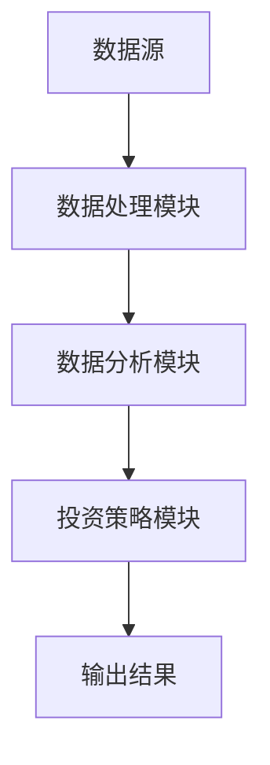
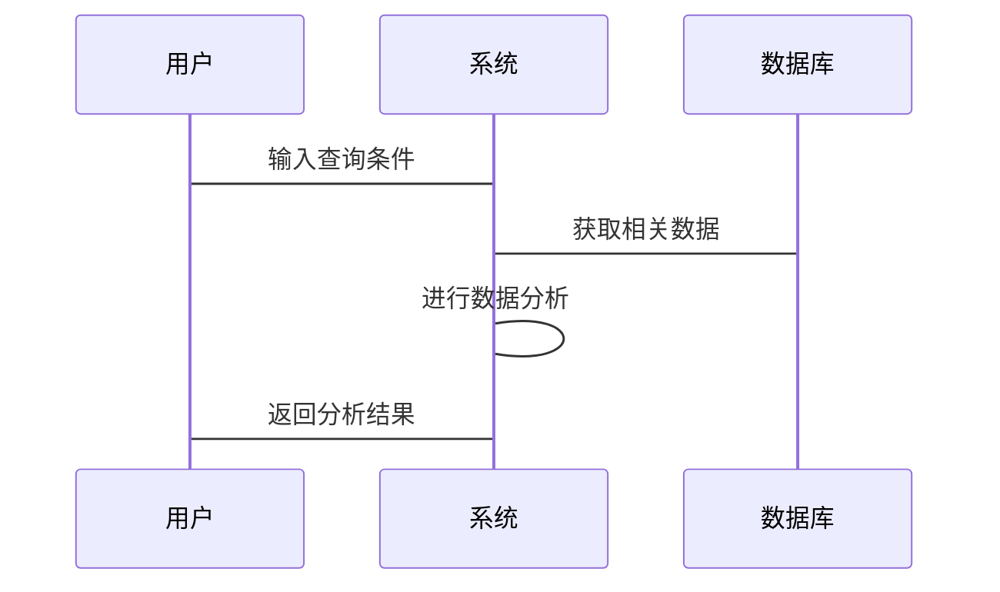

                 

# 特价股票与公司盈利质量的深度分析方法

## 关键词
特价股票、公司盈利质量、财务分析、投资策略、量化分析

## 摘要
本文深入探讨了特价股票与公司盈利质量的分析方法，通过背景介绍、核心概念、算法原理、数学模型、系统设计、项目实战和最佳实践等多个维度，详细阐述了如何利用技术手段和深度分析来评估特价股票的潜在价值。文章结合实际案例，提供了从理论到实践的完整解决方案，帮助投资者做出更明智的投资决策。

---

# 第一部分: 特价股票与公司盈利质量的背景与概述

## 第1章: 特价股票与公司盈利质量的定义与背景

### 1.1 特价股票的定义与特征
#### 1.1.1 特价股票的定义
特价股票是指市场价格显著低于其内在价值的股票。这些股票通常被认为被市场低估，具有较大的上涨潜力。

#### 1.1.2 特价股票的特征
- **低估值**：市盈率、市净率等估值指标远低于行业平均水平。
- **市场忽视**：可能属于小盘股或被市场遗忘的股票。
- **潜在上涨空间**：由于低估，未来有较大的增值空间。

#### 1.1.3 特价股票与市场周期的关系
特价股票的出现往往与市场周期性波动有关，尤其是在市场低迷或衰退时期，许多优质股票可能被错杀，形成特价股票的机会。

### 1.2 公司盈利质量的定义与重要性
#### 1.2.1 公司盈利质量的定义
公司盈利质量是指公司在一定时期内实现的利润的质量，包括利润的可持续性、稳定性以及来源的健康性。

#### 1.2.2 盈利质量的核心指标
- **净利润率**：净利润与营业收入的比率，反映公司的盈利能力。
- **毛利率**：毛利与营业收入的比率，反映产品或服务的盈利能力。
- **现金流**：经营活动产生的现金流，反映公司的实际盈利能力和流动性。

#### 1.2.3 盈利质量与公司价值的关系
盈利质量是决定公司价值的核心因素之一。高质量的盈利表明公司具有持续的盈利能力，能够为股东创造长期价值。

### 1.3 特价股票与公司盈利质量的关联
#### 1.3.1 特价股票的市场机会
特价股票通常出现在市场低迷时期，此时许多优质公司被低估，提供了买入的机会。

#### 1.3.2 盈利质量对投资决策的影响
公司盈利质量是评估股票价值的重要指标，高质量的盈利表明公司具有持续的盈利能力，能够支撑股价的上涨。

#### 1.3.3 特价股票与盈利质量的结合
投资者需要同时关注股票的价格和公司的盈利质量，找到那些价格低估且盈利质量优良的股票，才能获得超额收益。

---

## 第2章: 特价股票与公司盈利质量的分析框架

### 2.1 特价股票的分析维度
#### 2.1.1 市场周期分析
分析市场周期，确定是否处于低估阶段，从而识别潜在的特价股票。

#### 2.1.2 技术分析
通过技术指标（如K线图、均线等）判断股票的买卖信号，辅助投资决策。

#### 2.1.3 财务指标分析
利用财务指标（如市盈率、市净率等）评估股票的估值，识别低估股票。

### 2.2 公司盈利质量的分析维度
#### 2.2.1 盈利能力分析
分析公司的盈利能力，包括净利润率、毛利率等指标。

#### 2.2.2 资产质量分析
评估公司的资产结构和质量，包括存货周转率、应收账款周转率等指标。

#### 2.2.3 现金流分析
分析公司的现金流状况，确保公司具有健康的现金流。

### 2.3 特价股票与盈利质量的综合分析框架
#### 2.3.1 综合分析模型
结合市场周期、技术分析和财务分析，构建综合分析模型，评估股票的潜在价值。

#### 2.3.2 分析步骤与流程
1. 识别市场周期，确定潜在的特价股票。
2. 利用技术分析筛选出具备买入信号的股票。
3. 进行财务分析，评估公司的盈利质量。
4. 综合分析，确定最终的投资标的。

---

# 第二部分: 公司盈利质量的深度分析方法

## 第3章: 盈利质量的核心指标与分析方法

### 3.1 盈利能力指标
#### 3.1.1 净利润率
净利润率 = 净利润 / 营业收入
- 表示公司每单位收入中的净利润，反映公司的盈利能力。

#### 3.1.2 毛利率
毛利率 = (营业收入 - 营业成本) / 营业收入
- 表示公司产品或服务的盈利能力，毛利率越高，盈利能力越强。

#### 3.1.3 营业利润率
营业利润率 = 营业利润 / 营业收入
- 表示公司每单位收入中的营业利润，反映公司核心业务的盈利能力。

### 3.2 资产质量指标
#### 3.2.1 存货周转率
存货周转率 = 营业成本 / 平均存货
- 表示公司存货的周转速度，周转率越高，存货管理越高效。

#### 3.2.2 应收账款周转率
应收账款周转率 = 营业收入 / 平均应收账款
- 表示公司应收账款的周转速度，周转率越高，资金回收越快。

#### 3.2.3 资产负债率
资产负债率 = 负债总额 / 资产总额
- 表示公司资产的杠杆程度，负债率越高，财务风险越大。

### 3.3 现金流指标
#### 3.3.1 经营活动现金流
经营活动现金流 = 营业收入 - 营业成本 - 其他费用
- 表示公司经营活动产生的现金流，反映公司的流动性。

#### 3.3.2 投资活动现金流
投资活动现金流 = 投资收益 - 投资支出
- 表示公司投资活动的现金流，反映公司的投资能力。

#### 3.3.3 筹资活动现金流
筹资活动现金流 = 筹资活动的净流入或净流出
- 表示公司筹资活动的现金流，反映公司的融资能力。

---

## 第4章: 盈利质量的多维度分析

### 4.1 财务报表分析
#### 4.1.1 利润表分析
通过利润表分析公司的收入、成本和利润情况，评估公司的盈利能力。

#### 4.1.2 资产负债表分析
通过资产负债表分析公司的资产、负债和所有者权益情况，评估公司的财务健康状况。

#### 4.1.3 现金流量表分析
通过现金流量表分析公司的现金流情况，评估公司的流动性。

### 4.2 盈利质量的多维度评估
#### 4.2.1 盈利能力评估
综合分析公司的净利润率、毛利率等指标，评估公司的盈利能力。

#### 4.2.2 资产质量评估
综合分析公司的存货周转率、应收账款周转率等指标，评估公司的资产质量。

#### 4.2.3 现金流评估
综合分析公司的经营活动现金流、投资活动现金流等指标，评估公司的现金流状况。

### 4.3 盈利质量的综合评分
#### 4.3.1 评分指标
- 净利润率
- 毛利率
- 存货周转率
- 应收账款周转率
- 现金流

#### 4.3.2 评分方法
- 为每个指标赋予权重，计算综合评分。
- 根据评分结果，将公司分为不同等级。

---

## 第5章: 特价股票的量化分析与投资策略

### 5.1 量化分析方法
#### 5.1.1 市盈率法
市盈率 = 股价 / 每股收益
- 市盈率低于行业平均水平的股票可能为特价股票。

#### 5.1.2 市净率法
市净率 = 股价 / 每股净资产
- 市净率低于行业平均水平的股票可能为特价股票。

#### 5.1.3 盈利质量评分法
综合考虑公司的盈利质量，选择评分高的公司。

### 5.2 投资策略
#### 5.2.1 策选策略
- 选择市盈率、市净率低于行业平均水平，且盈利质量评分高的公司。

#### 5.2.2 买入时机
- 在市场低迷或衰退时期，寻找被低估的股票。

#### 5.2.3 风险控制
- 设定止损点，控制投资风险。

---

## 第6章: 系统设计与实现

### 6.1 系统功能设计
#### 6.1.1 数据收集模块
- 从金融数据库获取股票数据，包括价格、财务指标等。

#### 6.1.2 数据分析模块
- 计算市盈率、市净率等指标，评估股票的估值。
- 计算盈利质量评分，评估公司的盈利质量。

#### 6.1.3 投资策略模块
- 根据量化分析结果，生成投资建议。

### 6.2 系统架构设计

### 6.3 系统接口设计
- 数据接口：与金融数据库对接，获取股票数据。
- 用户界面：提供用户友好的界面，展示分析结果。

### 6.4 系统交互设计

---

## 第7章: 项目实战与案例分析

### 7.1 项目背景
分析一家公司的财务数据，判断其是否为特价股票。

### 7.2 数据收集
从金融数据库获取该公司的股价、财务指标等数据。

### 7.3 数据分析
- 计算市盈率、市净率等指标，评估股票的估值。
- 计算盈利质量评分，评估公司的盈利质量。

### 7.4 投资策略
根据分析结果，判断是否为特价股票，生成投资建议。

### 7.5 案例分析
以某公司为例，详细解读分析过程和结果。

---

## 第8章: 最佳实践与小结

### 8.1 最佳实践
- 定期进行市场分析，识别潜在的特价股票。
- 综合考虑市场周期、技术分析和财务分析，制定投资策略。
- 设定止损点，控制投资风险。

### 8.2 小结
通过深度分析特价股票和公司盈利质量，投资者可以更有效地识别潜在的市场机会，制定科学的投资策略。

---

## 第9章: 未来展望与挑战

### 9.1 未来展望
随着人工智能和大数据技术的发展，量化分析将更加精准，投资决策将更加科学。

### 9.2 挑战
- 数据获取的难度。
- 模型的准确性和稳定性。
- 市场的不确定性和波动性。

---

通过本文的分析和实践，投资者可以更好地理解和应用特价股票与公司盈利质量的分析方法，做出更明智的投资决策。

