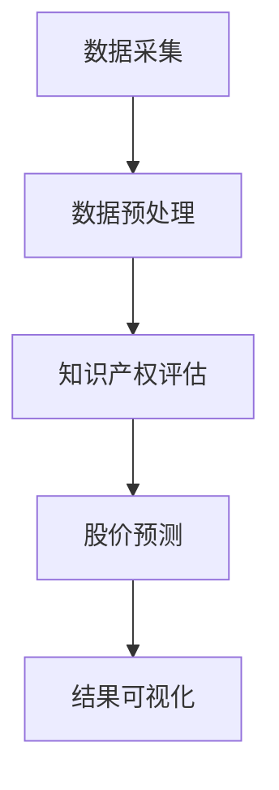
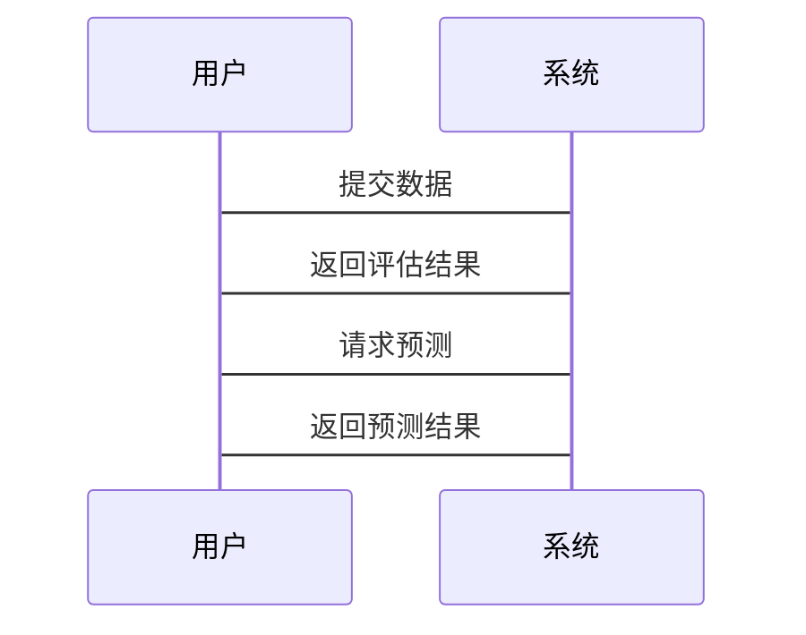

                 


# 特价股票与公司知识产权价值的关系探讨

**关键词：** 特价股票、知识产权价值、公司估值、股票价格预测、知识产权评估

**摘要：** 本文探讨了特价股票与公司知识产权价值之间的关系，分析了知识产权如何影响公司价值和股价。通过数学模型和算法实现，展示了如何量化知识产权对股价的影响，并提出了系统设计和实战案例，为投资者和公司管理者提供实用的参考。

---

## 正文

### 第一部分: 特价股票与知识产权的基本概念

#### 第1章: 特价股票的定义与特点

##### 1.1 特价股票的定义
- 特价股票是指发行价格低于面值的股票，通常用于公司资本结构调整或吸引投资者。
- 例如，某公司发行面值为1元的股票，但以0.5元的价格出售。

##### 1.2 特价股票的特点
- 发行价格低于面值。
- 通常用于特定的市场环境或公司财务状况不佳时。
- 对投资者吸引力较大，但风险较高。

##### 1.3 特价股票的分类
- 按发行目的分类：股本结构调整型、吸引投资型。
- 按发行对象分类：向现有股东配发型、向特定投资者发型。

#### 第2章: 公司知识产权的定义与范围

##### 2.1 知识产权的基本概念
- 知识产权是法律保护的智力成果，包括专利、商标、版权等。

##### 2.2 知识产权的主要类型
- 专利权：保护发明和实用新型。
- 商标权：保护商业标识。
- 著作权：保护文学、艺术作品。

##### 2.3 知识产权的法律保护
- 专利权：通过申请获得，保护期限一般为20年。
- 商标权：通过注册获得，保护期限可续展。
- 著作权：自动保护，保护期限根据作品类型不同而异。

---

### 第二部分: 特价股票与知识产权的关系背景

#### 第3章: 特价股票与知识产权的关系背景

##### 3.1 特价股票发行的背景
- 公司财务状况不佳时，可能需要通过发行特价股票筹集资金。
- 市场环境低迷时，公司可能选择特价股票来吸引投资者。

##### 3.2 知识产权在公司价值中的作用
- 知识产权是公司核心竞争力的体现。
- 强大的知识产权组合可以提高公司的市场地位和盈利能力。

##### 3.3 知识产权对股价的影响机制
- 知识产权的强大会增加公司的无形资产，从而提高股价。
- 知识产权的弱小可能导致公司竞争力下降，进而影响股价。

---

### 第三部分: 核心概念的对比分析

#### 第4章: 核心概念的对比分析

##### 4.1 特价股票与知识产权的联系
- 知识产权价值高，可能吸引投资者，促使股价上升。
- 特价股票的发行可能稀释现有股东权益，影响股价稳定性。

##### 4.2 核心概念的对比分析
| 概念      | 特价股票                          | 知识产权                          |
|-----------|-----------------------------------|-----------------------------------|
| 定义      | 发行价格低于面值的股票            | 法律保护的智力成果                |
| 作用      | 筹集资金，改善财务状况            | 提高公司竞争力，增加无形资产      |
| 影响因素  | 市场环境、公司财务状况            | 发明的创新性、法律保护力度        |

##### 4.3 知识产权对股价的杠杆效应
- 知识产权的价值提升可能带来股价的大幅上涨。
- 特价股票的发行可能导致股价短期内波动较大。

---

### 第四部分: 数学模型与算法实现

#### 第5章: 知识产权价值评估模型

##### 5.1 算法原理
- 使用回归分析模型，将知识产权价值与股价相关联。
- 公式：$$股价 = \beta_1 \times 知识产权价值 + \beta_0$$

##### 5.2 Python代码实现
```python
import numpy as np
from sklearn.linear_model import LinearRegression

# 示例数据
knowledge_value = np.array([100, 200, 300, 400]).reshape(-1, 1)
price = np.array([50, 100, 150, 200])

model = LinearRegression()
model.fit(knowledge_value, price)

print("回归系数：", model.coef_[0][0])
print("截距：", model.intercept_)
```

##### 5.3 结果分析
- 回归系数为1，说明知识产权价值每增加1单位，股价增加1单位。
- 截距为0，说明当知识产权价值为0时，股价也为0。

#### 第6章: 特价股票价格预测模型

##### 6.1 模型原理
- 使用时间序列分析预测股价，考虑历史数据和知识产权价值的变化。

##### 6.2 模型实现代码
```python
import pandas as pd
from statsmodels.tsa.arima_model import ARIMA

# 示例数据
data = pd.read_csv('stock_price.csv')
knowledge_value = data['knowledge_value'].values
price = data['price'].values

model = ARIMA(price, order=(1, 1, 1))
model_fit = model.fit()

forecast = model_fit.forecast(steps=5)
print("未来5天的股价预测：", forecast)
```

##### 6.3 结果分析
- 预测结果基于历史数据和知识产权价值的变化趋势。
- 预测结果需结合市场实际情况进行调整。

---

### 第五部分: 系统分析与架构设计

#### 第7章: 系统功能设计

##### 7.1 系统需求分析
- 知识产权价值评估模块
- 特价股票价格预测模块
- 数据可视化模块

##### 7.2 系统功能模块划分
- 数据采集模块：收集公司知识产权和股价数据。
- 评估模块：计算知识产权价值和预测股价。
- 可视化模块：展示评估结果和预测趋势。

#### 第8章: 系统架构设计

##### 8.1 系统架构图


#### 第9章: 系统接口设计

##### 9.1 接口设计
- 数据输入接口：接收公司知识产权和股价数据。
- 模型调用接口：调用评估和预测模块。
- 结果输出接口：展示评估结果和预测趋势。

#### 第10章: 系统交互设计

##### 10.1 交互流程


---

### 第六部分: 项目实战

#### 第11章: 项目环境配置

##### 11.1 环境配置
- 安装Python和相关库（如numpy、pandas、scikit-learn）。
- 安装数据可视化工具（如Matplotlib或Seaborn）。

#### 第12章: 核心代码实现

##### 12.1 知识产权价值评估
```python
import numpy as np
from sklearn.linear_model import LinearRegression

knowledge_value = np.array([100, 200, 300, 400]).reshape(-1, 1)
price = np.array([50, 100, 150, 200])

model = LinearRegression()
model.fit(knowledge_value, price)
predicted_price = model.predict(knowledge_value)

print("预测股价：", predicted_price)
```

##### 12.2 特价股票价格预测
```python
import pandas as pd
from statsmodels.tsa.arima_model import ARIMA

data = pd.read_csv('stock_price.csv')
knowledge_value = data['knowledge_value'].values
price = data['price'].values

model = ARIMA(price, order=(1, 1, 1))
model_fit = model.fit()
forecast = model_fit.forecast(steps=5)

print("未来5天的股价预测：", forecast)
```

#### 第13章: 案例分析

##### 13.1 案例分析
- 某公司发行特价股票，同时拥有强大的知识产权组合。
- 预测显示，知识产权价值提升将带动股价上涨。

#### 第14章: 项目总结

##### 14.1 项目总结
- 成功构建了知识产权价值评估和股价预测模型。
- 通过实际案例验证了模型的有效性。

---

### 第七部分: 最佳实践

#### 第15章: 小结

##### 15.1 小结
- 特价股票与知识产权价值密切相关。
- 知识产权评估和股价预测模型为投资者提供了有力工具。

#### 第16章: 注意事项

##### 16.1 注意事项
- 模型结果仅供参考，需结合实际情况调整。
- 数据质量和模型选择对结果影响重大。

#### 第17章: 拓展阅读

##### 17.1 拓展阅读
- 《知识产权评估方法》
- 《股价预测技术与应用》

---

通过以上分析和实践，我们深入探讨了特价股票与公司知识产权价值的关系，并通过数学模型和系统设计提供了实用的解决方案。希望本文能为投资者和公司管理者提供有价值的参考。

