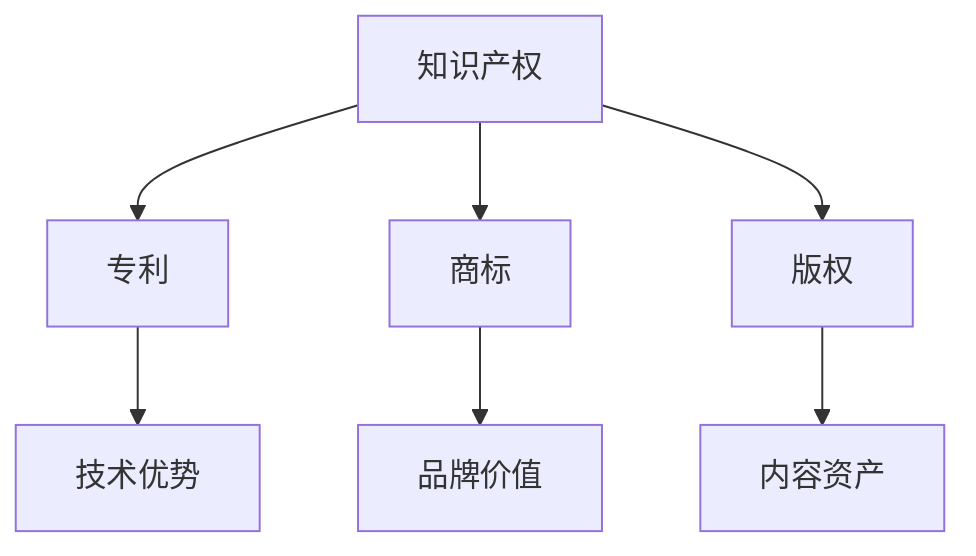
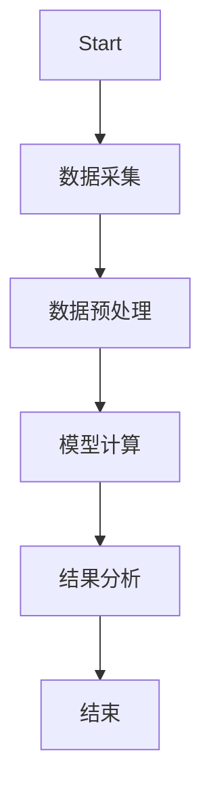

                 

### 目录大纲

# 特价股票与公司知识产权生态系统的价值评估

> **关键词**：特价股票、知识产权、价值评估、生态系统、数学模型、系统设计、项目实战

> **摘要**：本文系统地探讨了特价股票与公司知识产权生态系统之间的关系，分析了知识产权在公司价值中的重要性，并提出了基于数学模型的价值评估方法。文章结合实际案例，详细阐述了从理论到实践的全过程，为投资者和企业提供了一种新的价值评估视角。

---

### 第1章：特价股票与知识产权的背景介绍

#### 1.1 特价股票的基本概念
- 1.1.1 特价股票的定义与特征
- 1.1.2 特价股票的市场现状与趋势
- 1.1.3 特价股票的投资价值与风险

#### 1.2 知识产权的基本概念
- 1.2.1 知识产权的定义与范围
- 1.2.2 知识产权的主要类型与特点
- 1.2.3 知识产权在公司价值中的作用

#### 1.3 特价股票与知识产权的关联性
- 1.3.1 知识产权对股价的影响
- 1.3.2 特价股票中的知识产权机会
- 1.3.3 知识产权对市场风险的缓冲作用

---

### 第2章：知识产权生态系统的核心概念

#### 2.1 知识产权生态系统的组成
- 2.1.1 专利、商标、版权的核心属性
- 2.1.2 知识产权的生命周期与价值实现
- 2.1.3 生态系统中各主体的角色与关系

#### 2.2 知识产权的经济价值评估
- 2.2.1 知识产权的市场价值与潜在收益
- 2.2.2 知识产权的无形资产特性与量化方法
- 2.2.3 知识产权对股价的直接影响

#### 2.3 知识产权的法律保护与管理
- 2.3.1 知识产权的法律保护框架
- 2.3.2 知识产权的管理策略与风险控制
- 2.3.3 知识产权的国际布局与合作

---

### 第3章：知识产权价值评估的理论与方法

#### 3.1 知识产权价值评估的基本原理
- 3.1.1 价值评估的定义与原则
- 3.1.2 知识产权评估的复杂性与挑战
- 3.1.3 评估方法的适用场景与优劣势

#### 3.2 常见的知识产权价值评估方法
- 3.2.1 市场法：基于市场交易数据的评估
- 3.2.2 收益法：基于未来收益的贴现评估
- 3.2.3 成本法：基于研发投入的重置成本评估

#### 3.3 综合评估模型的构建
- 3.3.1 综合评估模型的构建思路
- 3.3.2 模型的数学表达与公式推导
- 3.3.3 模型的验证与优化

---

### 第4章：基于知识产权的股票价值评估模型

#### 4.1 模型的设计思路
- 4.1.1 模型的目标与基本假设
- 4.1.2 模型的核心逻辑与流程
- 4.1.3 模型的输入变量与输出结果

#### 4.2 模型的数学表达
- 4.2.1 综合价值评估公式
- 4.2.2 权重分配的确定方法
- 4.2.3 模型的适用范围与限制

#### 4.3 模型的实现步骤
- 4.3.1 数据的收集与预处理
- 4.3.2 数据的输入与模型运行
- 4.3.3 结果的解读与分析

---

### 第5章：知识产权生态系统与股票价值的系统设计

#### 5.1 系统设计的背景与目标
- 5.1.1 系统设计的必要性
- 5.1.2 系统设计的目标与范围
- 5.1.3 系统设计的原则与约束

#### 5.2 系统的功能模块设计
- 5.2.1 数据采集模块：知识产权数据的获取与处理
- 5.2.2 评估计算模块：综合价值评估模型的实现
- 5.2.3 可视化展示模块：评估结果的直观呈现

#### 5.3 系统的架构设计
- 5.3.1 系统的整体架构图
- 5.3.2 各模块之间的交互关系
- 5.3.3 系统的可扩展性与维护性

---

### 第6章：项目实战与案例分析

#### 6.1 项目背景与目标
- 6.1.1 项目背景介绍
- 6.1.2 项目目标与范围
- 6.1.3 项目的关键里程碑

#### 6.2 项目环境与工具配置
- 6.2.1 开发环境的安装与配置
- 6.2.2 数据源的选择与获取
- 6.2.3 工具的安装与使用

#### 6.3 项目核心代码实现
- 6.3.1 数据处理模块的实现
- 6.3.2 模型计算模块的实现
- 6.3.3 可视化展示模块的实现

#### 6.4 项目结果与分析
- 6.4.1 实验结果的展示与解读
- 6.4.2 结果与预期的对比分析
- 6.4.3 项目的价值与意义

---

### 第7章：总结与展望

#### 7.1 主要结论
- 7.1.1 知识产权对股票价值的影响
- 7.1.2 综合价值评估模型的优势与局限
- 7.1.3 系统设计的创新点与实用性

#### 7.2 未来展望
- 7.2.1 模型的优化与改进方向
- 7.2.2 系统功能的扩展与增强
- 7.2.3 知识产权与股票价值研究的未来趋势

---

### 图表与公式示例

#### 图1：知识产权生态系统的核心要素组成

#### 图2：综合价值评估模型的流程图

#### 公式示例：
综合价值评估公式：
$$
V = \alpha \cdot P + \beta \cdot R + \gamma \cdot C
$$
其中，$P$ 表示专利价值，$R$ 表示品牌价值，$C$ 表示版权价值，$\alpha$、$\beta$、$\gamma$ 是对应的权重系数。

---

希望这个目录大纲能满足您的需求！如果需要进一步调整或补充，请随时告知。

