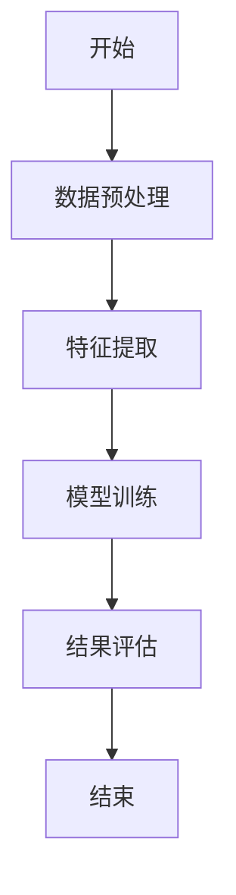
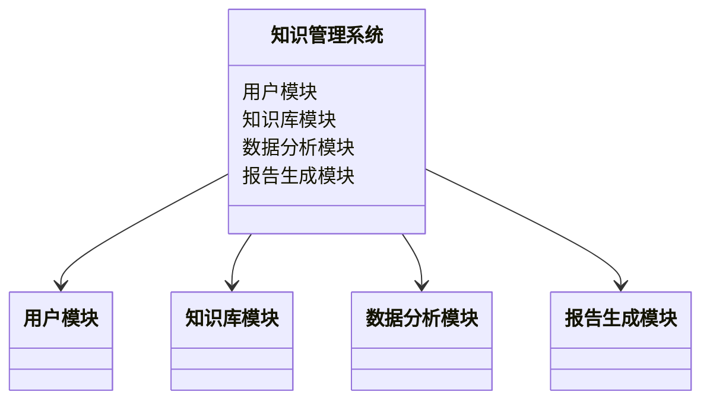
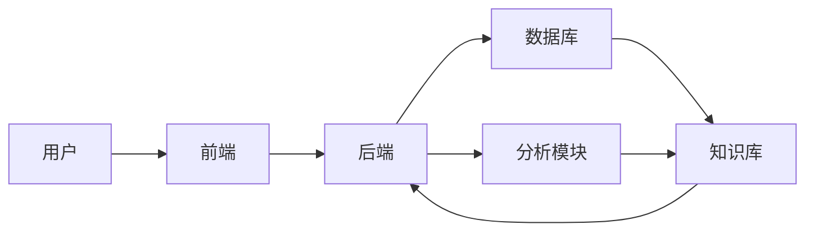
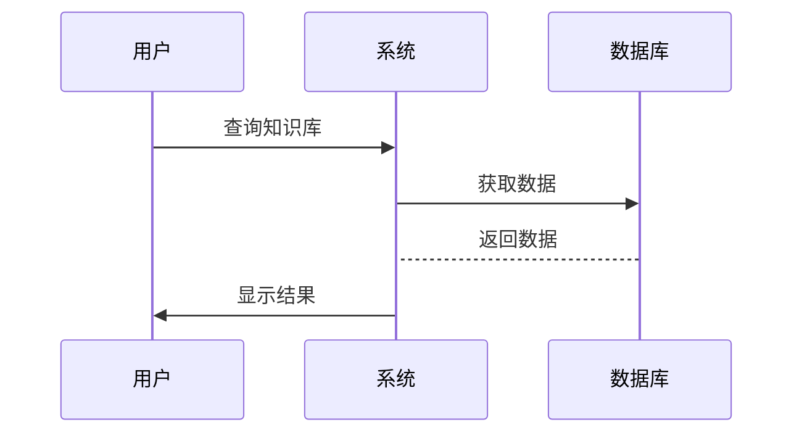

                 


# 特价股票与公司知识管理效率的关系探讨

> 关键词：特价股票、知识管理效率、公司治理、数据挖掘、算法模型

> 摘要：本文探讨了特价股票与公司知识管理效率之间的关系，通过分析知识管理效率的核心要素和特价股票的市场属性，揭示了两者在企业管理和价值创造中的相互影响。文章结合算法模型和数学公式，深入分析了如何通过优化知识管理效率来提升特价股票的价值，并通过实际案例和系统设计，展示了如何在企业中实现这一目标。

---

## 第1章：特价股票与公司知识管理效率的背景介绍

### 1.1 特价股票的基本概念

#### 1.1.1 特价股票的定义与分类
特价股票是指面值低于市场价的股票，通常分为优先股和普通股两类。优先股具有优先分红权，而普通股则享有投票权。

#### 1.1.2 特价股票的市场背景与现状
当前市场中，特价股票的流通量大，但波动性较高，尤其是在经济不景气时，投资者更倾向于购买特价股票以获取短期收益。

#### 1.1.3 特价股票与公司治理的关系
特价股票的持有者对公司治理有直接影响，尤其是当股东持有的股票达到一定比例时，可以对公司重大决策施加影响。

### 1.2 知识管理效率的基本概念

#### 1.2.1 知识管理的定义与内涵
知识管理是指通过系统化的方法，将组织中的隐性知识和显性知识进行整合、共享和应用的过程。

#### 1.2.2 知识管理效率的衡量标准
知识管理效率可以通过知识的传播速度、应用效果和创新产出等指标来衡量。

#### 1.2.3 知识管理在企业管理中的作用
知识管理是提升企业竞争力的核心因素，能够优化决策过程、提高创新能力，并降低运营成本。

### 1.3 特价股票与知识管理效率的关系概述

#### 1.3.1 特价股票对知识管理效率的影响
持有特价股票的投资者可能通过参与公司治理，推动知识管理的优化，从而提升公司的整体效率。

#### 1.3.2 知识管理效率对特价股票的反向影响
高效的knowledge management能够提升公司的整体价值，从而间接提高特价股票的市场价值。

#### 1.3.3 两者关系的边界与外延
本文将从公司治理的角度出发，分析特价股票持有者如何通过知识管理影响公司价值，同时探讨知识管理效率提升如何促进特价股票的增值。

---

## 第2章：知识管理效率与特价股票的关系分析

### 2.1 知识管理效率的核心要素

#### 2.1.1 知识的获取与整合
知识管理的第一步是通过各种渠道获取信息，并将其整合为可操作的知识资本。

#### 2.1.2 知识的共享与应用
通过知识共享平台，将分散在不同部门的知识整合起来，提升整体的决策效率。

#### 2.1.3 知识的创新与优化
持续优化知识结构，推动创新，是提升知识管理效率的关键。

### 2.2 特价股票的核心属性

#### 2.2.1 特价股票的市场价值
特价股票的市场价值受多种因素影响，包括公司基本面、市场流动性等。

#### 2.2.2 特价股票的风险与机会
持有特价股票的风险较高，但潜在收益也较大，尤其是在公司基本面改善时。

#### 2.2.3 特价股票与公司财务状况的关系
公司的财务状况直接影响特价股票的价值，良好的财务表现通常会提升股价。

### 2.3 知识管理效率与特价股票的联系

#### 2.3.1 知识管理效率对特价股票价值的影响
高效的knowledge management能够提升公司的整体价值，从而提高特价股票的市场价值。

#### 2.3.2 特价股票市场对公司知识管理的反馈作用
投资者通过购买特价股票，间接影响公司的治理结构，推动知识管理的优化。

#### 2.3.3 两者关系的动态变化
随着市场环境的变化，知识管理效率和特价股票的关系也会动态调整，需要企业持续关注和优化。

---

## 第3章：知识管理效率的算法模型

### 3.1 数据挖掘与知识管理效率

#### 3.1.1 数据挖掘的基本概念
数据挖掘是从大量数据中提取有价值信息的过程，广泛应用于商业智能和知识管理等领域。

#### 3.1.2 数据挖掘在知识管理中的应用
通过数据挖掘技术，可以识别知识中的模式和趋势，为决策提供支持。

#### 3.1.3 数据挖掘算法对知识管理效率的提升
使用聚类分析、分类算法等数据挖掘技术，可以提高知识管理的效率和准确性。

### 3.2 知识管理效率的数学模型

#### 3.2.1 知识管理效率的公式推导
$$ \text{知识管理效率} = \frac{\text{知识应用效果}}{\text{知识获取成本}} $$

#### 3.2.2 算法流程图


#### 3.2.3 实例分析
通过分析某公司的知识管理数据，验证算法模型的有效性，并提出改进建议。

---

## 第4章：数学模型与公式推导

### 4.1 知识管理效率与特价股票的数学关系

#### 4.1.1 模型的建立
$$ V = k \times E + c $$

其中，\( V \) 表示特价股票的价值，\( E \) 表示知识管理效率，\( k \) 和 \( c \) 是常数。

#### 4.1.2 公式解读
通过公式可以看出，知识管理效率的提升能够显著提高特价股票的价值。

#### 4.1.3 实例分析
以某公司为例，计算其知识管理效率对股票价值的影响，并验证模型的准确性。

---

## 第5章：系统分析与架构设计方案

### 5.1 问题场景介绍

#### 5.1.1 系统目标
构建一个高效的知识管理系统，提升公司的整体效率，并优化特价股票的价值。

#### 5.1.2 项目介绍
通过系统设计，实现知识的自动化管理，并提供数据分析功能，支持决策。

### 5.2 系统功能设计

#### 5.2.1 领域模型


#### 5.2.2 系统架构设计


### 5.3 系统接口设计

#### 5.3.1 API接口
提供RESTful API，支持数据的上传、查询和分析功能。

#### 5.3.2 接口调用示例
```python
import requests

response = requests.get('http://localhost:8080/api/knowledge')
data = response.json()
print(data)
```

### 5.4 系统交互设计

#### 5.4.1 用户与系统交互


---

## 第6章：项目实战

### 6.1 环境安装

#### 6.1.1 开发环境
安装Python、Jupyter Notebook和相关库（如pandas、numpy）。

#### 6.1.2 数据库安装
使用MySQL或MongoDB作为知识库的存储系统。

### 6.2 核心实现

#### 6.2.1 知识管理系统代码
```python
import pandas as pd

def analyze_knowledge_efficiency(data):
    # 数据预处理
    cleaned_data = data.dropna()
    # 特征提取
    features = cleaned_data[['feature1', 'feature2']]
    # 模型训练
    model = ...  # 示例代码
    return model

# 示例数据
data = pd.DataFrame({
    'feature1': [1, 2, 3],
    'feature2': [4, 5, 6]
})
result = analyze_knowledge_efficiency(data)
print(result)
```

#### 6.2.2 数据分析代码
```python
import matplotlib.pyplot as plt

# 示例数据
x = [1, 2, 3]
y = [4, 5, 6]

plt.plot(x, y)
plt.xlabel('知识管理效率')
plt.ylabel('股票价值')
plt.title('知识管理效率与股票价值的关系')
plt.show()
```

### 6.3 实际案例分析

#### 6.3.1 案例背景
以某公司为例，分析其知识管理效率对股票价值的影响。

#### 6.3.2 数据分析与解读
通过数据分析，验证模型的准确性，并提出优化建议。

---

## 第7章：总结与展望

### 7.1 本章小结
本文通过分析特价股票与知识管理效率的关系，提出了优化知识管理效率的策略，并展示了如何通过算法模型和系统设计实现这一目标。

### 7.2 未来研究方向
未来可以进一步研究知识管理效率对不同类型股票的影响，以及如何在不同行业应用这些方法。

### 7.3 最佳实践 tips
- 定期评估知识管理效率，及时优化系统。
- 结合市场趋势，调整知识管理策略。

### 7.4 注意事项
- 数据分析时，需注意数据的完整性和准确性。
- 在实际应用中，需结合公司实际情况，灵活调整策略。

---

通过以上章节的详细分析和系统设计，本文为读者提供了全面了解特价股票与知识管理效率关系的视角，并通过实际案例和系统设计，展示了如何在企业中优化知识管理效率，提升股票价值。

