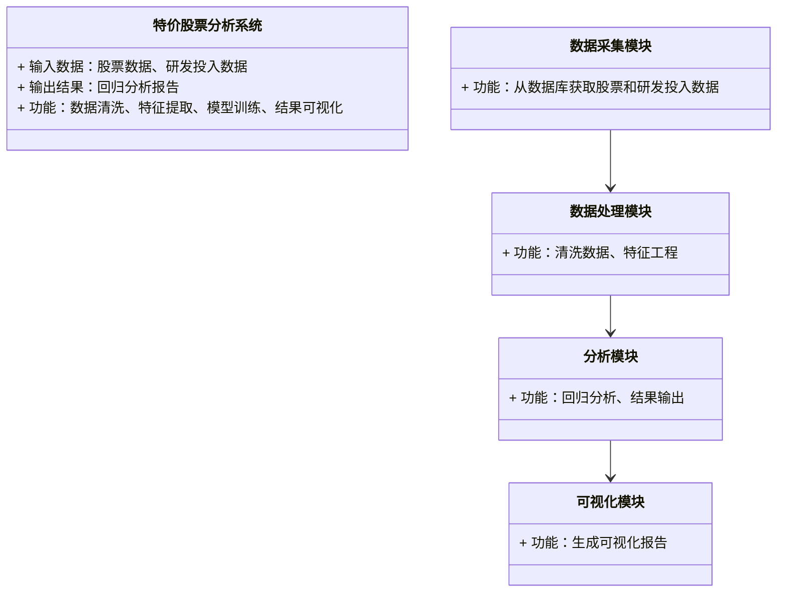
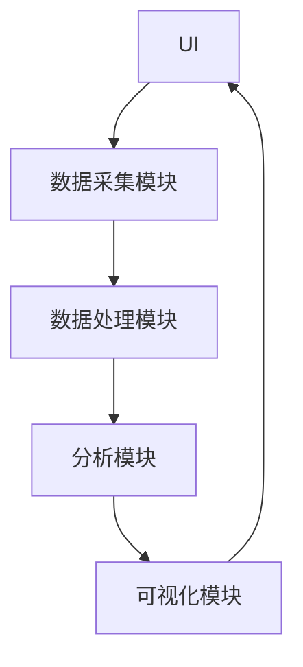
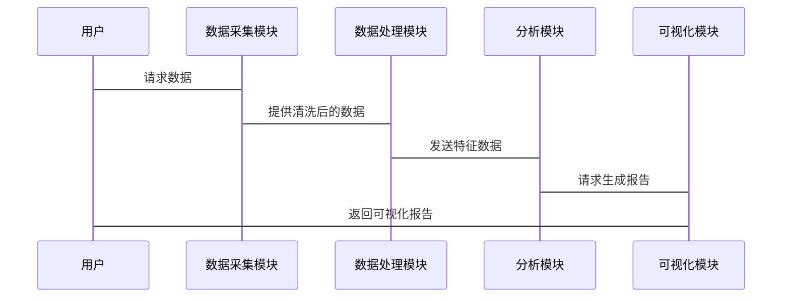

                 


```markdown
# 特价股票与公司研发投入效率的关系分析

> 关键词：特价股票、研发投入效率、回归分析、数学模型、数据分析系统

> 摘要：本文通过分析特价股票与公司研发投入效率之间的关系，探讨如何利用数学模型和数据分析方法量化研发投入效率对股价的影响。文章首先介绍特价股票和研发投入效率的基本概念，然后构建数学模型，使用Python代码实现算法，通过实际案例分析验证模型的有效性，并提出最佳实践和优化建议。

---

## 第一部分：背景介绍

### 第1章：特价股票的基本概念与特性

#### 1.1 特价股票的定义与分类
- **1.1.1 特价股票的定义**  
  特价股票是指价格低于面值的股票，通常反映公司财务状况不佳或市场对公司的未来盈利能力持怀疑态度。
  
- **1.1.2 特价股票的分类**  
  - 按公司规模：小盘股、中盘股、大盘股  
  - 按行业：科技、金融、制造业等  

- **1.1.3 特价股票的市场特征**  
  - 波动性高  
  - 流动性低  

#### 1.2 特价股票的形成机制
- **1.2.1 市场供需关系**  
  投资者对公司的信心不足导致股价下跌，形成特价股票。

- **1.2.2 公司基本面分析**  
  公司盈利能力下降、财务状况恶化等因素导致股价下跌。

- **1.2.3 市场情绪影响**  
  投资者情绪波动加剧，进一步推动股价下跌。

### 第2章：公司研发投入效率的核心概念

#### 2.1 研发投入效率的定义与衡量标准
- **2.1.1 研发投入效率的定义**  
  研发投入效率是指公司在研发上的投入与实际产出之间的关系，通常以研发成果的数量和质量来衡量。

- **2.1.2 研发投入效率的衡量指标**  
  - 研发投入占收入的比例（R&D-to-Revenue Ratio）  
  - 研发周期（Time-to-Market）  
  - 研发成果的市场表现（如专利数量、新产品成功率）  

- **2.1.3 研发投入效率的影响因素**  
  - 公司规模与资源  
  - 行业竞争状况  
  - 管理层的战略决策  

#### 2.2 研发投入效率与公司绩效的关系
- **2.2.1 研发投入效率对公司盈利能力的影响**  
  高效的研发投入能够提高公司的创新能力，从而增强盈利能力。

- **2.2.2 研发投入效率对股价的影响**  
  研发投入效率高通常意味着公司具备长期发展潜力，能够吸引投资者，推高股价。

- **2.2.3 研发投入效率与公司成长性的关系**  
  研发投入效率高的公司通常具备更强的市场竞争力，能够实现持续成长。

---

## 第二部分：核心概念与联系

### 第3章：特价股票与公司研发投入效率的原理分析

#### 3.1 特价股票与公司研发投入效率的原理对比

| 特价股票特性 | 研发投入效率特性 |
|---------------|-------------------|
| 价格低于面值 | 研发投入与产出匹配 |
| 市场流动性低  | 研发成果高效转化 |
| 投资者信心不足 | 公司创新能力较强 |

#### 3.2 特价股票与公司研发投入效率的ER实体关系图

```mermaid
er
    %%{init: 'flowchart'}%%

    entity 特价股票 {
        id
        股票代码
        股票价格
        上市公司
    }

    entity 研发投入效率 {
        id
        公司代码
        研发投入比例
        研发周期
        研发成果数量
    }

    relationship 关系 {
        特价股票 --> 研发投入效率 : 影响
        研发投入效率 --> 特价股票 : 反映
    }
```

---

## 第三部分：算法原理讲解

### 第4章：数学模型与公式推导

#### 4.1 特价股票与研发投入效率的回归分析

- **模型假设**  
  股价（Y）与研发投入效率（X）之间存在线性关系。

- **数学模型**  
  $$ Y = \beta_0 + \beta_1 X + \epsilon $$  
  其中，$$\beta_0$$ 是截距，$$\beta_1$$ 是回归系数，$$\epsilon$$ 是误差项。

- **公式推导**  
  使用最小二乘法估计 $$\beta_0$$ 和 $$\beta_1$$：
  $$ \hat{\beta_1} = \frac{\sum (X_i - \bar{X})(Y_i - \bar{Y})}{\sum (X_i - \bar{X})^2} $$  
  $$ \hat{\beta_0} = \bar{Y} - \hat{\beta_1} \bar{X} $$  

#### 4.2 算法实现

```python
import numpy as np
import pandas as pd
from sklearn.linear_model import LinearRegression

# 数据预处理
data = pd.read_csv('stock_data.csv')
X = data[['研发费用率']]
y = data['股价']

# 模型训练
model = LinearRegression()
model.fit(X, y)

# 模型结果
print(f'截距：{model.intercept_}')
print(f'回归系数：{model.coef_}')
```

#### 4.3 代码解读与分析
- 数据预处理：读取数据，提取研发投入效率和股价。
- 模型训练：使用线性回归模型拟合数据。
- 模型结果：输出回归系数和截距，解释变量之间的关系。

---

## 第四部分：系统分析与架构设计方案

### 第5章：数据分析系统的构建

#### 5.1 系统功能设计



#### 5.2 系统架构设计



#### 5.3 接口设计与交互流程



---

## 第五部分：项目实战

### 第6章：实战分析与案例解读

#### 6.1 环境安装与数据准备
- **安装环境**  
  安装Python、Pandas、Scikit-learn、Mermaid等工具。

- **数据准备**  
  下载股票数据和公司研发投入数据，保存为CSV格式。

#### 6.2 核心代码实现

```python
import numpy as np
import pandas as pd
from sklearn.linear_model import LinearRegression
import matplotlib.pyplot as plt

# 数据加载
data = pd.read_csv('stock_data.csv')
X = data[['研发费用率']].values
y = data['股价'].values

# 模型训练
model = LinearRegression()
model.fit(X, y)

# 模型预测
y_pred = model.predict(X)

# 可视化
plt.scatter(X, y, color='blue', label='真实值')
plt.plot(X, y_pred, color='red', label='预测值')
plt.xlabel('研发费用率')
plt.ylabel('股价')
plt.legend()
plt.show()
```

#### 6.3 代码解读与实际案例分析
- 数据加载：从CSV文件中读取数据。
- 模型训练：使用线性回归模型拟合数据。
- 模型预测：基于研发投入效率预测股价。
- 可视化：绘制真实值与预测值的散点图，直观展示模型效果。

---

## 第六部分：最佳实践与总结

### 第7章：总结与优化建议

#### 7.1 最佳实践
- **数据质量管理**  
  确保数据的准确性和完整性。

- **模型优化**  
  引入更多特征变量，如公司规模、行业因素等，提高模型准确性。

- **持续监控**  
  定期更新模型，跟踪市场变化和公司动态。

#### 7.2 注意事项
- 特价股票市场波动大，投资需谨慎。
- 模型结果仅供参考，需结合其他分析方法综合判断。

#### 7.3 拓展阅读
- 推荐阅读相关书籍：《股票技术分析实战》、《数据分析的的艺术》。

---

## 附录

### 附录A：数学公式补充说明
- 回归分析公式：
  $$ Y = \beta_0 + \beta_1 X + \epsilon $$  

### 附录B：系统架构图补充说明
- 系统架构图展示数据流从用户到各个模块的处理流程。

---

通过以上内容，本文系统地分析了特价股票与公司研发投入效率之间的关系，从理论到实践，结合数学模型和实际案例，为读者提供了一套完整的分析框架和实践指南。
```

