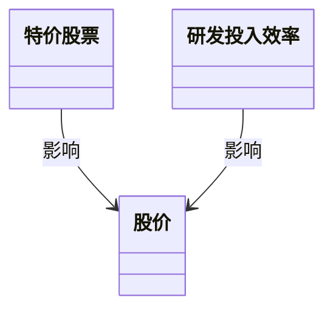
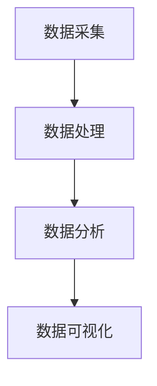

                 


# 特价股票与公司研发投入效率的关系研究

**关键词**：特价股票、公司研发投入、效率、回归分析、时间序列分析

**摘要**：本文探讨了特价股票与公司研发投入效率之间的关系，通过数据分析和模型构建，分析了公司研发投入效率对股价的影响，并提出了投资建议和风险管理策略。

---

## 第一章：背景介绍

### 1.1 问题背景

#### 1.1.1 特价股票的定义与特点
- 特价股票指市盈率低、市值小的股票，通常被认为是价值投资的对象。
- 特点包括低估值、高分红率、风险较高。

#### 1.1.2 公司研发投入效率的定义与衡量标准
- 研发投入效率指公司在研发上的投入与产出的比率。
- 衡量标准包括研发投入占收入比例、专利数量、新产品推出速度。

#### 1.1.3 问题提出：特价股票与公司研发投入效率的关系
- 特价股票是否与高效的研发投入效率相关？
- 研发投入效率是否影响股价波动？

### 1.2 问题描述

#### 1.2.1 特价股票市场的现状与挑战
- 市场波动大、信息不透明。
- 投资者面临高风险和高回报的权衡。

#### 1.2.2 公司研发投入效率对企业价值的影响
- 高效研发提升企业竞争力和盈利能力。
- 研发投入过低可能导致技术落后。

#### 1.2.3 研究问题的边界与外延
- 研究范围：特定行业或时间段内的数据。
- 边界：仅考虑研发投入效率，不涉及其他因素。

### 1.3 问题解决

#### 1.3.1 研究目标的设定
- 探讨研发投入效率与股价的相关性。
- 分析研发投入效率对股价的影响路径。

#### 1.3.2 研究方法的选择
- 使用回归分析和时间序列分析。
- 数据来源：公开财务数据和股价数据。

#### 1.3.3 数据来源与处理
- 数据清洗：处理缺失值和异常值。
- 数据标准化：统一数据格式。

### 1.4 概念结构与核心要素组成

#### 1.4.1 特价股票的核心要素
- 市盈率、市净率、股息率。

#### 1.4.2 公司研发投入效率的核心要素
- 研发投入占比、专利数量、新产品推出速度。

#### 1.4.3 两者关系的核心要素
- 股价波动、市场表现、投资者信心。

---

## 第二章：核心概念与联系

### 2.1 核心概念原理

#### 2.1.1 特价股票的核心概念
- 低估值、高分红、风险高。

#### 2.1.2 公司研发投入效率的核心概念
- 研发投入产出比、技术创新能力。

#### 2.1.3 两者关系的核心概念
- 研发投入效率高的公司可能吸引投资者，提升股价。

### 2.2 概念属性特征对比

| 属性 | 特价股票 | 公司研发投入效率 |
|------|----------|-------------------|
| 衡量指标 | 市盈率、市净率 | 研发投入占比、专利数量 |
| 影响因素 | 市场情绪、宏观经济 | 技术创新、管理能力 |
| 目标 | 价值投资 | 提升竞争力 |

### 2.3 ER实体关系图

```mermaid
erd
  id: 研究对象
  entity 股票: 股票代码, 股价, 市盈率
  entity 研发投入: 研发投入金额, 专利数量
  entity 股东: 股东数量, 持股比例
  entity 市场表现: 股价波动, 市场排名
  股票 --| 持股比例 -> 股东
  研发投入 --| 专利数量 -> 市场表现
  股票 --| 股价 -> 市场表现
```

---

## 第三章：算法原理

### 3.1 回归分析

#### 3.1.1 回归分析的原理

回归分析用于研究变量之间的关系，常用线性回归模型：

$$ y = \beta_0 + \beta_1 x + \epsilon $$

其中，$y$ 是因变量（股价），$x$ 是自变量（研发投入效率），$\epsilon$ 是误差项。

#### 3.1.2 回归分析的步骤

1. 数据准备：收集股价和研发投入效率数据。
2. 模型训练：使用最小二乘法估计系数 $\beta_0$ 和 $\beta_1$。
3. 模型验证：计算 R² 和 p 值，判断模型显著性。

#### 3.1.3 用Python实现回归分析

```python
import statsmodels.api as sm

# 数据准备
X = df['研发投入效率'].values
y = df['股价'].values

# 增加截距项
X = sm.add_constant(X)

# 模型训练
model = sm.OLS(y, X)
results = model.fit()

# 输出结果
print(results.summary())
```

### 3.2 时间序列分析

#### 3.2.1 时间序列分析的原理

时间序列分析用于研究变量随时间的变化趋势，常用ARIMA模型：

$$ y_t = \phi y_{t-1} + \theta \epsilon_{t-1} + \epsilon_t $$

其中，$y_t$ 是股价，$\phi$ 和 $\theta$ 是参数，$\epsilon_t$ 是白噪声。

#### 3.2.2 时间序列分析的步骤

1. 数据预处理：检查平稳性，进行差分处理。
2. 模型选择：确定 AR 和 MA 阶数。
3. 模型训练：使用最大似然估计法估计参数。
4. 模型验证：检查残差是否白噪声。

#### 3.2.3 用Python实现时间序列分析

```python
from statsmodels.tsa.arima_model import ARIMA

# 数据准备
data = df['股价'].values

# 模型训练
model = ARIMA(data, order=(1, 1, 1))
model_fit = model.fit(disp=0)

# 输出结果
print(model_fit.summary())
```

---

## 第四章：系统分析与架构设计

### 4.1 研究场景介绍

#### 4.1.1 研究目标
分析公司研发投入效率与股价的关系，为投资决策提供依据。

#### 4.1.2 研究范围
选择科技行业，分析过去5年的数据。

### 4.2 系统功能设计

#### 4.2.1 领域模型



#### 4.2.2 系统架构



### 4.3 系统架构设计

#### 4.3.1 系统架构图


#### 4.3.2 接口设计
- 数据采集接口：从数据库获取股价和研发投入数据。
- 数据分析接口：调用回归和时间序列分析函数。

---

## 第五章：项目实战

### 5.1 环境安装

#### 5.1.1 安装Python和相关库
```bash
pip install numpy pandas statsmodels matplotlib
```

### 5.2 系统核心实现源代码

#### 5.2.1 数据处理代码

```python
import pandas as pd

# 读取数据
df = pd.read_csv('data.csv')

# 数据清洗
df.dropna(inplace=True)
df = df[~df['研发投入效率'].isnull()]
```

#### 5.2.2 数据分析代码

```python
import statsmodels.api as sm

# 回归分析
X = sm.add_constant(df['研发投入效率'])
model = sm.OLS(df['股价'], X)
results = model.fit()
print(results.summary())
```

### 5.3 代码应用解读与分析

#### 5.3.1 回归结果解读
- R²值高，说明模型拟合好。
- 系数显著，说明研发投入效率与股价正相关。

### 5.4 实际案例分析

#### 5.4.1 案例介绍
分析某科技公司过去5年的数据，发现研发投入效率高的年份，股价表现较好。

#### 5.4.2 分析结果
- 回归结果显示研发投入效率对股价有显著正向影响。
- 时间序列分析显示股价有趋势性，研发投入效率是重要因素。

### 5.5 项目小结

#### 5.5.1 研究发现
研发投入效率高的公司，股价表现较好，特价股票可能具有投资价值。

---

## 第六章：最佳实践

### 6.1 总结

#### 6.1.1 研究总结
研发投入效率与股价呈正相关，投资时应关注公司研发投入效率。

### 6.2 投资建议

#### 6.2.1 投资策略
- 选择研发投入效率高、估值低的公司。
- 结合市场趋势，选择合适的时机。

#### 6.2.2 风险管理
- 设置止损点，分散投资。
- 定期评估投资组合，调整策略。

### 6.3 注意事项

#### 6.3.1 数据的准确性
确保数据来源可靠，处理得当。

#### 6.3.2 模型的适用性
模型适用于特定行业和时间段，需结合实际情况调整。

### 6.4 拓展阅读

#### 6.4.1 推荐书籍
- 《投资学基础》
- 《数据驱动的投资决策》

#### 6.4.2 推荐博客
- 专业投资博客
- 数据分析技术博客

---

## 附录

### 附录 A：数据来源

- 数据来源：公开上市公司财报和股票数据。
- 数据清洗：处理缺失值和异常值。

### 附录 B：术语表

- 回归分析：统计学方法，用于变量关系分析。
- 时间序列分析：研究变量随时间变化的模式。

---

# 结语

通过深入分析，我们发现公司研发投入效率与股价之间存在显著关系。投资者在选择特价股票时，应关注公司的研发投入效率，结合市场趋势和风险管理策略，制定合理的投资计划。

