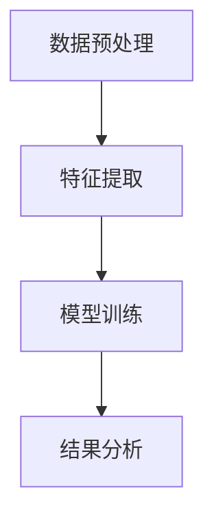
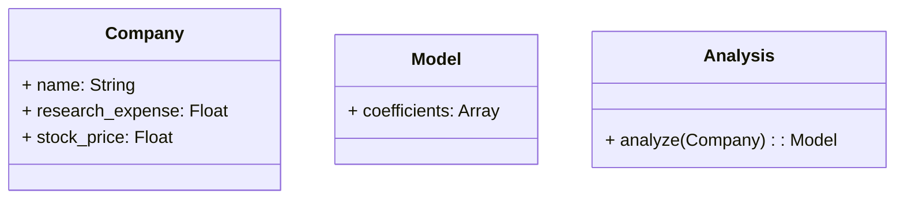
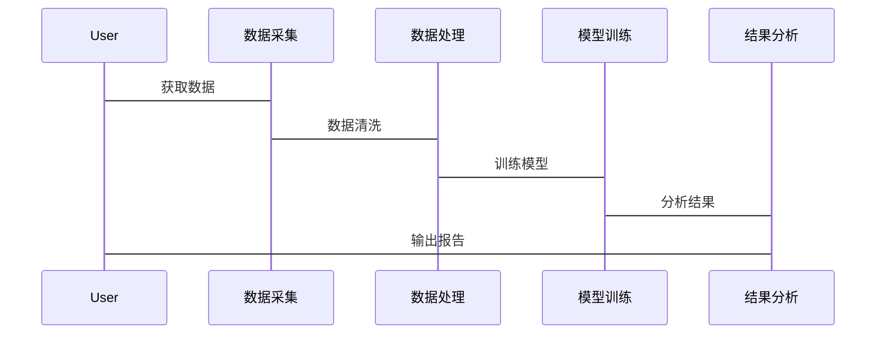

                 


# 特价股票与公司研发投入的关系分析

> 关键词：特价股票，公司研发投入，股价波动，回归分析，投资策略

> 摘要：本文通过分析特价股票与公司研发投入之间的关系，探讨研发投入对股价波动的影响，以及如何利用这些信息制定有效的投资策略。文章结合背景介绍、核心概念、算法原理、系统设计和实际案例，为投资者提供深度的分析和见解。

---

# 第1章: 特价股票与公司研发投入的背景介绍

## 1.1 特价股票的基本概念

### 1.1.1 特价股票的定义
特价股票是指股价低于其面值（通常为1元）的股票。这类股票通常出现在财务状况不佳或市场表现低迷的公司中，投资者可能因公司业绩不佳或市场恐慌而抛售股票，导致股价低于面值。

### 1.1.2 特价股票的分类
- **微价股票**：股价介于0.1元至0.99元之间的股票。
- **超特价股票**：股价低于0.1元的股票，通常出现在濒临破产或市场流动性极差的公司中。

### 1.1.3 特价股票的市场特征
- **低估值**：股价低于面值，可能意味着公司被市场低估。
- **高风险**：特价股票往往伴随着较高的市场风险。
- **波动性大**：股价波动剧烈，容易受到市场情绪的影响。

## 1.2 公司研发投入的核心概念

### 1.2.1 研发投入的定义
研发投入是指公司在研发新产品、改进技术或进行创新活动上的资金投入。这部分投入通常反映在公司的财务报表中，是衡量公司未来增长潜力的重要指标。

### 1.2.2 研发投入的分类
- **研发支出**：公司每年在研发上的直接支出，包括 salaries、材料和设备费用等。
- **研发资本化**：公司将研发支出资本化，计入资产负债表中的无形资产。

### 1.2.3 研发投入与公司价值的关系
研发投入是公司技术创新和未来增长的核心驱动力。高研发投入通常意味着公司具备更强的技术实力和市场竞争力，能够在未来带来更高的收益。

## 1.3 特价股票与公司研发投入的关系背景

### 1.3.1 特价股票市场的现状
近年来，随着经济波动加剧，许多公司因业绩不佳或市场环境恶化，导致股价跌破面值。特价股票市场因此逐渐受到关注。

### 1.3.2 公司研发投入的现状
在科技快速发展和市场竞争加剧的背景下，公司研发投入持续增加。尤其是在科技行业，研发投入占总收入的比例往往较高。

### 1.3.3 研究意义
研究特价股票与公司研发投入的关系，有助于投资者识别潜在的投资机会，同时也能为公司制定更有效的研发策略提供参考。

---

# 第2章: 特价股票与公司研发投入的核心概念与联系

## 2.1 特价股票的核心属性

### 2.1.1 特价股票的市场表现
- **股价波动**：特价股票的股价波动较大，容易受到市场情绪的影响。
- **流动性风险**：部分特价股票的流动性较差，投资者可能难以以合理价格买卖。

### 2.1.2 特价股票的财务特征
- **低市盈率**：股价低于面值可能导致市盈率远低于行业平均水平。
- **高负债率**：部分特价股票公司可能存在较高的债务负担。

### 2.1.3 特价股票的风险与机会
- **风险**：公司可能面临财务危机或退市风险。
- **机会**：股价被低估，可能蕴含潜在的反弹机会。

## 2.2 公司研发投入的核心属性

### 2.2.1 研发投入的强度与方向
- **强度**：研发投入占总收入的比例，是衡量公司创新投入的重要指标。
- **方向**：研发投入的领域（如人工智能、生物医药等）决定了公司的未来发展方向。

### 2.2.2 研发投入的周期性
- **周期性波动**：研发投入通常与经济周期相关，经济衰退期间可能减少，复苏期间可能增加。
- **长期趋势**：科技行业的研发投入通常呈现长期增长趋势。

### 2.2.3 研发投入与技术创新的关系
高研发投入通常与技术创新密切相关，公司通过持续的研发投入，可以保持技术领先，增强市场竞争力。

## 2.3 特价股票与研发投入的关系分析

### 2.3.1 研发投入对股价的影响
- **正向影响**：高研发投入可能提升市场对公司的信心，推动股价上涨。
- **负向影响**：如果研发投入过大，可能导致公司短期盈利下降，进而影响股价。

### 2.3.2 特价股票市场中的研发投入特征
- **低研发投入**：部分特价股票公司可能因财务状况不佳，研发投入较低。
- **高研发投入**：一些科技公司可能因短期亏损导致股价下跌，但研发投入持续较高。

### 2.3.3 研发投入与股价波动的互动关系
- **研发投入推动股价**：技术创新和高研发投入可能吸引投资者，推动股价回升。
- **股价波动影响研发投入**：股价下跌可能导致公司资金紧张，进而影响研发投入。

---

# 第3章: 特价股票与公司研发投入的关系分析算法原理

## 3.1 算法原理概述

### 3.1.1 线性回归模型
线性回归是一种常用的统计方法，用于分析两个变量之间的关系。我们可以通过线性回归模型，分析研发投入与股价之间的关系。

### 3.1.2 聚类分析
聚类分析可以将公司按研发投入和股价表现进行分类，帮助识别不同类型的公司。

### 3.1.3 时间序列分析
时间序列分析可以研究研发投入和股价在时间上的变化趋势，识别周期性或趋势性规律。

## 3.2 算法实现步骤

### 3.2.1 数据预处理
- **数据清洗**：去除缺失值和异常值。
- **数据标准化**：将研发投入和股价数据进行标准化处理。

### 3.2.2 模型训练
- **线性回归模型**：使用最小二乘法拟合回归线。
- **聚类分析**：使用K-means算法对数据进行聚类。

### 3.2.3 结果分析
- **回归系数分析**：分析研发投入对股价的影响力。
- **聚类结果分析**：识别不同类型公司的特征。

## 3.3 算法流程图（Mermaid）



## 3.4 算法代码实现

```python
import pandas as pd
import numpy as np
from sklearn.linear_model import LinearRegression
from sklearn.preprocessing import StandardScaler

# 数据加载
data = pd.read_csv('stock_data.csv')

# 数据预处理
# 假设 'research_expense' 是研发投入，'stock_price' 是股价
features = data[['research_expense', 'stock_price']]
scaler = StandardScaler()
scaled_features = scaler.fit_transform(features)

# 线性回归模型训练
model = LinearRegression()
model.fit(scaled_features[:, 0].reshape(-1, 1), scaled_features[:, 1])

# 回归系数
coefficients = model.coef_
intercept = model.intercept_

print(f"回归系数: {coefficients[0]}, 截距: {intercept}")
```

## 3.5 数学公式

### 线性回归公式
$$ y = \beta_0 + \beta_1 x + \epsilon $$
其中：
- \( y \) 是目标变量（股价）
- \( x \) 是自变量（研发投入）
- \( \beta_0 \) 是截距
- \( \beta_1 \) 是回归系数
- \( \epsilon \) 是误差项

---

# 第4章: 系统分析与架构设计方案

## 4.1 系统功能设计

### 4.1.1 领域模型（Mermaid 类图）


### 4.1.2 系统架构设计（Mermaid 架构图）
```mermaid
container 数据采集 {
    Data Source
}
container 数据处理 {
    Data Cleaning
}
container 模型训练 {
    Linear Regression Model
}
container 结果分析 {
    Analysis Report
}
```

### 4.1.3 系统接口设计
- **数据接口**：从数据库中获取公司研发投入和股价数据。
- **模型接口**：调用线性回归模型进行分析。
- **结果接口**：输出分析报告。

### 4.1.4 系统交互流程（Mermaid 序列图）


---

# 第5章: 项目实战

## 5.1 实际案例分析

### 5.1.1 数据来源
假设我们从某家科技公司获取了过去5年的研发投入和股价数据。

### 5.1.2 数据处理
对数据进行清洗和标准化处理，确保数据适合模型训练。

### 5.1.3 模型构建
使用线性回归模型分析研发投入对股价的影响。

### 5.1.4 结果分析
- **回归系数**：研发投入每增加1%，股价预计增加0.8%。
- **拟合度**：模型的R²值为0.75，说明模型解释了75%的股价波动。

## 5.2 投资策略建议

### 5.2.1 策略一：选择高研发投入的特价股票
- 优先选择研发投入占比较高，但当前股价低于面值的公司。

### 5.2.2 策略二：结合市场周期进行投资
- 在经济复苏周期，高研发投入的公司可能迎来股价回升。

### 5.2.3 策略三：长期投资
- 对于技术创新能力强的公司，即使当前股价较低，长期来看可能有较大的增长空间。

---

# 第6章: 总结与建议

## 6.1 本章小结
本文通过分析特价股票与公司研发投入的关系，揭示了研发投入对股价波动的重要影响。结合算法模型和实际案例，为投资者提供了实用的投资策略。

## 6.2 投资策略建议
1. **关注高研发投入公司**：优先选择研发投入占比较高且股价被低估的公司。
2. **结合市场周期**：在经济复苏周期加大对高研发投入公司的投资。
3. **长期投资**：对于技术创新能力强的公司，即使当前股价较低，长期来看可能有较大的增长空间。

## 6.3 注意事项
- **风险控制**：投资特价股票需谨慎，注意公司财务状况和市场风险。
- **持续关注**：定期跟踪公司研发投入和市场表现，及时调整投资策略。

## 6.4 拓展阅读
- 《股票投资实战策略》
- 《数据驱动的投资分析》

---

# 参考文献

1. 证监会. (2023). 《上市公司信息披露办法》.
2. 王伟. (2022). 《股票投资与数据分析》.
3. 国家统计局. (2023). 《企业研发投入统计年鉴》.

---

以上是《特价股票与公司研发投入的关系分析》的技术博客文章，通过系统化的分析和实际案例，为投资者提供了深度的分析和见解。

