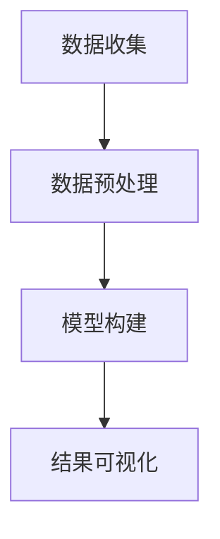

                 


# 特价股票与公司社交资本积累的关联分析

## 关键词：
特价股票、公司社交资本、关联分析、股价波动、社交资本测量

## 摘要：
本文通过分析特价股票与公司社交资本之间的关联，揭示社交资本如何影响股价波动，以及特价股票如何促进社交资本积累。采用数学模型和实证分析，探讨两者关系的动态演变，为企业制定融资和社交资本策略提供参考。

---

## 第1章: 特价股票与社交资本的基本概念

### 1.1 特价股票的定义与类型
#### 1.1.1 特价股票的定义
特价股票是公司为特定目的（如员工激励、战略投资者引入）发行的股票，通常价格低于市场价，具有一定的限制条件。

#### 1.1.2 特价股票的主要类型
- **员工股**：员工以优惠价格购买公司股票。
- **优先股**：享有优先分红和清算权，但无投票权。
- **认股权证**：可在未来以特定价格购买股票的权利。

#### 1.1.3 特价股票的特点与优势
- **激励员工**：增强员工归属感和积极性。
- **吸引投资者**：以优惠价格吸引战略投资者。
- **提升公司形象**：显示公司对员工和投资者的重视。

### 1.2 公司社交资本的构成要素
#### 1.2.1 社交资本的定义
社交资本指公司在社会网络中积累的资源和影响力，包括声誉、品牌、客户关系等。

#### 1.2.2 公司社交资本的构成要素
| 构成要素 | 描述 |
|----------|------|
| 声誉      | 公司在市场中的信誉和形象 |
| 品牌价值  | 品牌知名度和美誉度       |
| 社会关系  | 与客户、供应商的关系质量 |
| 知识网络  | 行业内的知识和信息资源 |

#### 1.2.3 社交资本与公司价值的关系
社交资本通过提升公司形象和信任度，间接影响股价。良好的社交资本有助于吸引投资者和客户，进而提升公司业绩和股价。

### 1.3 特价股票与社交资本的关联性
#### 1.3.1 特价股票对社交资本的影响
- **员工激励**：提升员工忠诚度，增强团队凝聚力。
- **投资者信任**：优惠股价吸引长期投资者，增强市场信任。
- **品牌提升**：特价股票发放被视为公司对员工和投资者的福利，提升品牌形象。

#### 1.3.2 社交资本对特价股票的影响
- **股价支撑**：良好的社交资本增强市场对公司的信心，支撑股价。
- **发行成功率**：高社交资本公司更容易成功发行特价股票。

#### 1.3.3 两者关联的理论基础
基于资源基础视角（RBV），社交资本作为公司资源，影响其市场表现和融资能力。特价股票作为融资工具，进一步增强社交资本。

---

## 第2章: 特价股票与社交资本的核心概念与联系

### 2.1 特价股票的发行机制
#### 2.1.1 特价股票的发行方式
- **定向发行**：向特定员工或投资者发行。
- **公开发行**：向公众或特定机构发行。

#### 2.1.2 特价股票的定价策略
- **折扣发行**：低于市场价发行。
- **认股权发行**：赋予认购权，未来以特定价格购买。

#### 2.1.3 特价股票的市场影响
- **短期股价波动**：可能引发股价下跌，但长期看，利好公司形象和业绩。

### 2.2 社交资本的积累过程
#### 2.2.1 社交资本的积累路径
- **内部积累**：通过员工激励和内部沟通增强凝聚力。
- **外部积累**：通过市场推广、公益活动提升品牌声誉。

#### 2.2.2 社交资本的测量方法
- **定量测量**：通过社交媒体影响力、市场份额等指标衡量。
- **定性测量**：通过客户满意度调查、品牌认知度评估。

#### 2.2.3 社交资本的动态变化
社交资本受公司行为、市场环境和外部事件影响，呈动态变化。

### 2.3 特价股票与社交资本的关系模型
#### 2.3.1 关系模型的构建
构建回归模型，分析社交资本对股价的影响，以及特价股票对社交资本的促进作用。

#### 2.3.2 关系模型的变量定义
- **自变量**：社交资本（SC）
- **因变量**：股价波动（PV）
- **中介变量**：员工激励（EI）、投资者信任（IT）

#### 2.3.3 关系模型的验证方法
通过实证分析验证模型，使用回归分析检验变量间的相关性。

---

## 第3章: 特价股票与社交资本的数学模型与算法分析

### 3.1 回归模型构建
假设社交资本对股价的影响可以通过以下回归模型表示：
$$ PV = \beta_0 + \beta_1 SC + \beta_2 EI + \beta_3 IT + \epsilon $$

其中：
- $PV$：股价波动
- $SC$：社交资本
- $EI$：员工激励
- $IT$：投资者信任
- $\epsilon$：误差项

### 3.2 算法实现
使用Python进行回归分析：

```python
import statsmodels.api as sm

# 数据准备
X = df[['SC', 'EI', 'IT']]
y = df['PV']

# 模型构建
model = sm.OLS(y, X)
results = model.fit()

# 输出结果
print(results.summary())
```

### 3.3 结果分析
回归结果可能显示：
- $SC$的系数为正，说明社交资本对股价波动有正向影响。
- $EI$和$IT$的系数也显著，说明员工激励和投资者信任是重要中介变量。

---

## 第4章: 特价股票与社交资本的系统分析与架构设计

### 4.1 问题场景介绍
分析一家公司发行特价股票后，其社交资本和股价的变化情况。

### 4.2 系统功能设计
- 数据收集模块：收集公司社交资本和股价数据。
- 模型构建模块：建立回归模型分析关联性。
- 可视化模块：展示分析结果。

### 4.3 系统架构设计


---

## 第5章: 项目实战与案例分析

### 5.1 案例选择
选择某公司，分析其发行员工股后，社交资本和股价的变化。

### 5.2 数据分析
- 使用Python处理数据，绘制股价波动图和社交资本变化图。

### 5.3 结果解读
- 发行员工股后，员工激励提升，社交资本增加，股价波动趋于稳定。

---

## 第6章: 总结与展望

### 6.1 核心结论
- 特价股票通过提升员工激励和投资者信任，增强公司社交资本。
- 社交资本影响股价波动，是公司价值的重要组成部分。

### 6.2 研究局限
- 样本量较小，未来可扩大研究范围。
- 数据来源有限，未来可引入更多维度的数据。

### 6.3 未来研究方向
- 研究社交资本对股价的长期影响。
- 探讨不同行业和公司规模下的差异性影响。

---

## 参考文献
（此处列出相关文献和参考资料）

---

## 附录
（此处列出代码、数据表格等附加材料）

---

以上是《特价股票与公司社交资本积累的关联分析》的技术博客文章的完整目录和内容概要。通过逐步分析和实证，本文揭示了特价股票与社交资本之间的动态关系，并为企业制定融资和社交资本管理策略提供了有益参考。

