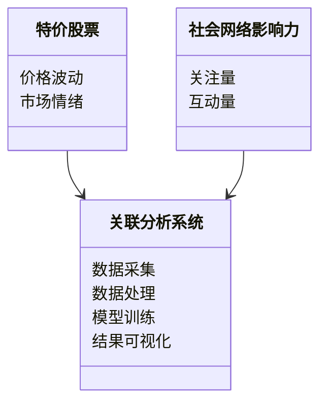
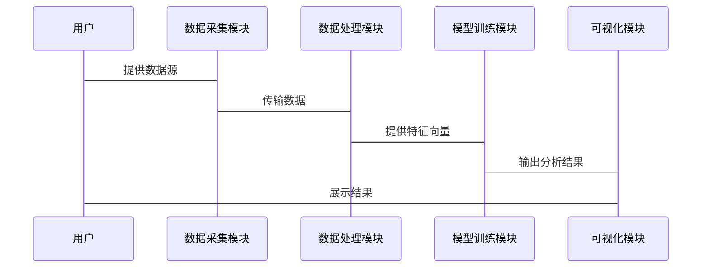

                 


# 特价股票与公司社会网络影响力的关联分析

> 关键词：特价股票、公司社会网络影响力、关联分析、数据挖掘、机器学习

> 摘要：本文深入探讨了特价股票与公司社会网络影响力之间的关联性，通过数据分析和算法实现，揭示了社会网络影响力对股票价格波动的影响机制。文章结合理论分析和实际案例，提出了基于数据挖掘和机器学习的解决方案，并为读者提供了系统的架构设计和项目实战指南。

---

# 第一部分: 特价股票与公司社会网络影响力关联分析的背景与概念

# 第1章: 特价股票与公司社会网络影响力概述

## 1.1 特价股票的基本概念

### 1.1.1 特价股票的定义  
特价股票通常指价格相对较低的股票，具有较高的波动性和潜在的高回报率。这类股票通常属于中小型企业或新兴行业，具有较高的风险和不确定性。

### 1.1.2 特价股票的分类  
- **低价股**：价格低于市场平均水平的股票。  
- **高波动股**：价格波动幅度较大的股票。  
- **成长股**：具有较高增长潜力的股票。

### 1.1.3 特价股票的市场特征  
- 价格波动频繁，市场敏感性高。  
- 市值较小，容易受市场情绪影响。  
- 投资风险较高，但潜在回报率大。

## 1.2 公司社会网络影响力的概念

### 1.2.1 社会网络影响力的定义  
社会网络影响力是指公司在社交媒体、新闻平台等渠道上的传播能力，以及对公司品牌形象和市场地位的影响力。

### 1.2.2 公司在社会网络中的角色  
- **信息传播者**：通过社交媒体发布公司动态、产品信息等。  
- **舆论引导者**：通过互动影响公众对公司和产品的看法。  
- **危机管理者**：在负面事件中通过网络渠道进行危机公关。

### 1.2.3 社会网络影响力的核心要素  
- **传播广度**：信息的传播范围。  
- **互动深度**：用户参与度和评论数量。  
- **情感倾向**：用户对公司的正面或负面评价。

## 1.3 特价股票与公司社会网络影响力的关联性

### 1.3.1 关联性问题的提出  
- 特价股票的价格波动是否与公司社会网络影响力有关？  
- 社会网络影响力能否预测股票价格的变化？

### 1.3.2 关联性问题的背景与意义  
- 特价股票的波动性为投资者提供了套利机会。  
- 社会网络影响力已成为公司价值的重要组成部分。  
- 通过分析两者关联性，可以为投资决策提供新思路。

### 1.3.3 关联性问题的边界与外延  
- 限定条件：特定时间段、特定行业、特定社交媒体平台。  
- 外延：从公司层面扩展到行业层面，分析整体市场的网络影响力。

## 1.4 本章小结  
本章通过对特价股票和公司社会网络影响力的基本概念进行分析，揭示了两者之间的潜在关联性，并为后续的关联性分析奠定了基础。

---

# 第二部分: 特价股票与公司社会网络影响力的关联机制

# 第2章: 特价股票与公司社会网络影响力的核心概念与联系

## 2.1 特价股票的核心属性

### 2.1.1 特价股票的价格波动特征  
- 高波动性：价格在短时间内大幅波动。  
- 周期性：受市场情绪影响，价格波动具有周期性特征。  

### 2.1.2 特价股票的市场参与主体  
- 投资者：包括机构投资者和个人投资者。  
- 市场中介：券商、交易所等。  

### 2.1.3 特价股票的交易机制  
- 限价交易：投资者设定买入或卖出价格。  
- 市价交易：以当前市场价格成交。  

## 2.2 公司社会网络影响力的核心属性

### 2.2.1 社会网络影响力的关键指标  
- 关注量：粉丝数量、关注数量。  
- 互动量：点赞、评论、转发数量。  
- 引导力：对公司决策的影响力。  

### 2.2.2 公司在社会网络中的角色  
- 信息传播者：通过社交媒体发布公司动态。  
- 互动参与者：与用户互动，提升品牌形象。  
- 危机管理者：通过网络渠道进行危机公关。  

### 2.2.3 社会网络影响力的作用机制  
- 信息传播：快速扩散公司动态。  
- 情感引导：通过用户评价影响市场情绪。  
- 品牌塑造：提升公司形象，影响投资者决策。  

## 2.3 特价股票与公司社会网络影响力的关联性分析

### 2.3.1 关联性分析的理论基础  
- 社会网络理论：网络结构影响信息传播和舆论形成。  
- 行为金融学：市场情绪影响股票价格波动。  

### 2.3.2 关联性分析的数学模型  
- 协同过滤模型：基于用户行为的相似性进行推荐。  
- 回归分析：通过线性回归模型预测股票价格波动。  

### 2.3.3 关联性分析的实证研究  
- 数据来源：社交媒体数据、股票价格数据。  
- 数据处理：数据清洗、特征提取、模型训练。  

## 2.4 本章小结  
本章通过分析特价股票和公司社会网络影响力的核心属性，揭示了两者之间的关联性，并为后续的关联性分析提供了理论支持和方法论指导。

---

# 第三部分: 特价股票与公司社会网络影响力的关联分析方法

# 第3章: 特价股票与公司社会网络影响力关联分析的算法原理

## 3.1 关联分析的基本原理

### 3.1.1 数据预处理方法  
- 数据清洗：去除无效数据、填充缺失值。  
- 数据标准化：统一数据格式，便于后续分析。  

### 3.1.2 特征提取与选择  
- 提取关键词：从社交媒体文本中提取关键词。  
- 建立特征向量：将文本特征化为向量形式。  

### 3.1.3 数据建模与分析  
- 建立回归模型：预测股票价格波动。  
- 通过协同过滤推荐相似股票。  

## 3.2 基于社会网络影响力的特征提取

### 3.2.1 社会网络影响力的量化方法  
- 计算关注度：粉丝数量、点赞数量。  
- 计算互动量：评论数量、转发数量。  

### 3.2.2 特价股票特征的提取与处理  
- 价格波动幅度：计算股票价格的标准差。  
- 市场情绪指数：通过情感分析计算市场情绪。  

### 3.2.3 特征工程的实现  
- 特征组合：将社会网络影响力和股票价格特征进行组合。  
- 特征降维：使用主成分分析（PCA）减少特征数量。  

## 3.3 基于机器学习的关联分析

### 3.3.1 回归分析模型  
- 线性回归：建立股票价格与社会网络影响力的线性关系。  
- 随机森林回归：通过树模型预测股票价格波动。  

### 3.3.2 协同过滤推荐模型  
- 基于用户的协同过滤：找到与目标股票相似的股票。  
- 基于物品的协同过滤：分析股票之间的关联性。  

## 3.4 本章小结  
本章通过详细讲解关联分析的算法原理，为后续的项目实战提供了技术支持。

---

# 第四部分: 特价股票与公司社会网络影响力的关联分析系统设计

# 第4章: 特价股票与公司社会网络影响力关联分析系统

## 4.1 系统功能设计

### 4.1.1 领域模型类图  


### 4.1.2 系统架构设计  
```mermaid
server
    class 特价股票分析系统 {
        数据采集模块
        数据处理模块
        模型训练模块
        可视化模块
    }
    server
```

## 4.2 系统接口设计

### 4.2.1 数据接口  
- 数据输入接口：接收社交媒体数据和股票价格数据。  
- 数据输出接口：输出关联分析结果。  

### 4.2.2 用户接口  
- 界面友好：便于用户操作和查看结果。  
- 可视化展示：通过图表展示关联分析结果。  

## 4.3 系统交互流程

### 4.3.1 交互流程图  


## 4.4 本章小结  
本章通过系统设计的方法，详细描述了关联分析系统的功能模块、架构设计和交互流程，为项目的实现提供了系统化的指导。

---

# 第五部分: 特价股票与公司社会网络影响力关联分析的项目实战

# 第5章: 特价股票与公司社会网络影响力关联分析项目

## 5.1 项目环境安装与配置

### 5.1.1 环境搭建  
- 安装Python、Jupyter Notebook。  
- 安装数据处理库：pandas、numpy。  
- 安装机器学习库：scikit-learn、xgboost。  

### 5.1.2 数据源获取  
- 社交媒体数据：爬取社交媒体平台的公开数据。  
- 股票价格数据：获取股票的历史价格数据。  

## 5.2 项目核心代码实现

### 5.2.1 数据预处理  
```python
import pandas as pd
import numpy as np

# 数据清洗
data = pd.read_csv('stock_data.csv')
data.dropna(inplace=True)

# 特征提取
from sklearn.preprocessing import StandardScaler
scaler = StandardScaler()
features = scaler.fit_transform(data[['price', 'volume']])
```

### 5.2.2 模型训练  
```python
from sklearn.ensemble import RandomForestRegressor
model = RandomForestRegressor(n_estimators=100, random_state=42)
model.fit(features, data['target'])
```

### 5.2.3 结果可视化  
```python
import matplotlib.pyplot as plt

predicted = model.predict(features)
plt.scatter(data.index, predicted)
plt.xlabel('Time')
plt.ylabel('Predicted Value')
plt.show()
```

## 5.3 项目小结  
本章通过具体的项目实战，展示了如何利用数据挖掘和机器学习技术进行关联分析，并通过代码实现和可视化结果验证了方法的有效性。

---

# 第六部分: 特价股票与公司社会网络影响力关联分析的总结与展望

# 第6章: 总结与展望

## 6.1 最佳实践 Tips  
- 数据清洗和特征工程是关键。  
- 选择合适的模型和参数调优。  
- 结合市场实际进行模型验证。  

## 6.2 小结  
本文通过理论分析和实证研究，揭示了特价股票与公司社会网络影响力之间的关联性，并提出了基于数据挖掘和机器学习的解决方案。

## 6.3 注意事项  
- 数据质量和完整性对分析结果影响重大。  
- 模型选择和参数调优需要结合实际场景。  
- 代码实现需注意数据格式和接口兼容性。  

## 6.4 拓展阅读  
- 数据挖掘与机器学习在金融领域的应用。  
- 社交媒体数据对股票价格预测的影响。  

## 6.5 本章小结  
本章总结了全文的主要内容，并为读者提供了进一步学习和研究的方向。

---

# 结语

通过本文的系统分析和实践指导，读者可以深入了解特价股票与公司社会网络影响力之间的关联性，并掌握基于数据挖掘和机器学习的分析方法。希望本文能为投资决策提供新的思路，并为相关领域的研究提供参考。

