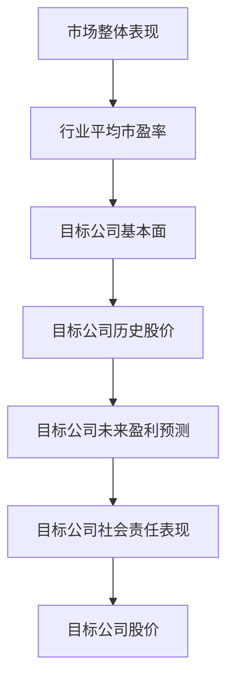

                 


# 特价股票与公司社会责任投资回报的长期影响

> 关键词：特价股票，公司社会责任投资，投资回报，长期影响，算法模型，系统架构，案例分析

> 摘要：本文探讨了特价股票与公司社会责任投资回报的长期影响，分析了两者的背景、核心概念及其联系，详细讲解了投资回报的算法原理和数学模型，通过系统架构设计和项目实战案例，展示了如何将社会责任投资与特价股票结合，实现可持续的投资回报，并总结了最佳实践和注意事项。

---

## 第一章：特价股票与公司社会责任投资的背景介绍

### 1.1 特价股票的基本概念
#### 1.1.1 特价股票的定义
特价股票是指在市场中价格相对较低的股票，通常具有较高的市盈率或市净率，被视为被市场低估的投资标的。这些股票可能来自财务状况不佳或处于困境中的公司，但具备潜在的复苏或增长空间。

#### 1.1.2 特价股票的特点
- **低估值**：市盈率、市净率等指标低于行业平均水平。
- **高波动性**：价格波动较大，风险较高。
- **投资机会**：潜在的高回报，吸引价值投资者。

#### 1.1.3 特价股票的分类
- **周期性股票**：受经济周期影响较大的行业股票。
- **困境反转型股票**：公司因短期问题导致股价下跌，但具备扭亏为盈的潜力。
- **价值型股票**：长期基本面良好，但被市场低估的股票。

### 1.2 公司社会责任投资的基本概念
#### 1.2.1 公司社会责任投资的定义
公司社会责任投资（Corporate Social Responsibility Investment，简称CSRI）是指投资者在选择投资标的时，不仅关注财务回报，还考虑公司的社会责任履行情况，如环保、员工权益、治理结构等。

#### 1.2.2 公司社会责任投资的核心要素
- **环境因素（E）**：关注公司的环保表现。
- **社会因素（S）**：关注公司对员工、社区和社会的贡献。
- **治理因素（G）**：关注公司治理结构和透明度。

#### 1.2.3 公司社会责任投资的分类
- **负面筛选**：排除不符合社会责任标准的公司。
- **正面筛选**：选择符合社会责任标准的公司。
- **影响力投资**：投资于具有社会责任目标的项目。

### 1.3 特价股票与公司社会责任投资的背景
#### 1.3.1 特价股票与公司社会责任投资的兴起
随着投资者对可持续投资的关注增加，社会责任投资逐渐成为主流，而特价股票因其高回报潜力，吸引了投资者的关注。

#### 1.3.2 特价股票与公司社会责任投资的现状
当前，社会责任投资在全球范围内快速增长，越来越多的投资者将社会责任因素纳入投资决策。同时，特价股票因其低估值特性，仍被视为高回报的潜在投资标的。

#### 1.3.3 特价股票与公司社会责任投资的未来趋势
未来，社会责任投资将更加注重公司的可持续发展能力，而特价股票在社会责任投资框架下的表现将受到更多关注。

---

## 第二章：特价股票与公司社会责任投资的核心概念与联系

### 2.1 特价股票的核心概念
#### 2.1.1 特价股票的市场定位
特价股票通常在市场中处于低估状态，可能是由于市场情绪或公司短期问题导致的。投资者认为这些股票具有长期增值的潜力。

#### 2.1.2 特价股票的市场参与者
- **机构投资者**：通过基本面分析寻找低估股票。
- **个人投资者**：通过价值投资策略参与特价股票市场。
- **做空机构**：利用股价波动进行短期套利。

#### 2.1.3 特价股票的市场机制
- **市场供需**：供需关系影响股票价格。
- **信息不对称**：投资者对公司的了解程度影响股价。
- **情绪驱动**：市场情绪波动影响特价股票的价格。

### 2.2 公司社会责任投资的核心概念
#### 2.2.1 公司社会责任投资的目标
- **实现财务回报**：通过投资具有社会责任表现的公司，获得长期稳定的收益。
- **推动社会责任**：通过投资推动公司和社会的可持续发展。

#### 2.2.2 公司社会责任投资的实施路径
- **筛选标准**：制定社会责任投资标准，如环境、社会和治理（ESG）评分。
- **投资组合构建**：根据社会责任标准构建投资组合。
- **持续监控**：定期评估投资标的的社会责任表现。

#### 2.2.3 公司社会责任投资的评估标准
- **ESG评分**：环境、社会和治理因素的综合评分。
- **社会责任报告**：公司发布的社会责任履行情况报告。
- **第三方评级**：专业机构对公司的社会责任表现进行评级。

### 2.3 特价股票与公司社会责任投资的联系
#### 2.3.1 特价股票与公司社会责任投资的相互作用
- **社会责任驱动股价**：公司履行社会责任可能提升股价。
- **社会责任影响估值**：社会责任表现好的公司可能获得更高的估值。

#### 2.3.2 特价股票与公司社会责任投资的协同效应
- **价值发现**：社会责任投资帮助发现具备长期价值的特价股票。
- **长期回报**：社会责任投资与特价股票的结合可能带来更高的长期回报。

#### 2.3.3 特价股票与公司社会责任投资的长期影响
- **可持续发展**：社会责任投资推动公司长期可持续发展。
- **投资者教育**：投资者关注社会责任投资，推动市场健康发展。

---

## 第三章：特价股票与公司社会责任投资的算法原理

### 3.1 特价股票的定价算法
#### 3.1.1 特价股票定价模型
以下是特价股票定价的简单模型：



#### 3.1.2 特价股票定价的步骤
1. **市场分析**：分析市场整体表现和行业趋势。
2. **公司基本面分析**：评估公司的财务状况和盈利潜力。
3. **社会责任评估**：评估公司的社会责任表现。
4. **未来盈利预测**：预测公司未来盈利情况。
5. **股价计算**：综合以上因素，计算目标股价。

### 3.2 公司社会责任投资回报的预测模型
#### 3.2.1 投资回报预测的数学模型
投资回报率（ROI）的计算公式为：

$$ ROI = \frac{\text{净收益}}{\text{初始投资}} $$

其中，净收益包括资本增值和股息收益。

#### 3.2.2 投资回报预测的步骤
1. **筛选社会责任投资标的**：根据ESG评分等标准筛选公司。
2. **评估公司基本面**：分析公司的财务状况和盈利能力。
3. **预测股价走势**：基于历史数据和市场趋势预测股价。
4. **计算投资回报**：结合预测股价和初始投资计算回报率。

---

## 第四章：特价股票与公司社会责任投资的数学模型

### 4.1 投资回报的数学模型
#### 4.1.1 CAPM模型
资本资产定价模型（CAPM）用于评估资产的预期回报率：

$$ E(R_i) = R_f + \beta_i (E(R_m) - R_f) $$

其中：
- \( E(R_i) \)：资产i的预期回报率
- \( R_f \)：无风险利率
- \( \beta_i \)：资产i的贝塔系数
- \( E(R_m) \)：市场预期回报率

#### 4.1.2 特价股票的估值模型
市盈率（P/E）模型用于评估股票的内在价值：

$$ \text{内在价值} = \frac{\text{每股收益} \times \text{目标P/E}}{\text{每股收益增长率}} $$

---

## 第五章：系统架构与接口设计

### 5.1 系统架构设计
以下是社会责任投资系统的架构图：


### 5.2 系统接口设计
以下是系统的主要接口：


---

## 第六章：项目实战与案例分析

### 6.1 环境安装
需要安装以下工具：
- Python 3.8+
- Pandas库
- Matplotlib库
- Scikit-learn库

### 6.2 核心代码实现
以下是投资回报预测的代码：

```python
import pandas as pd
import numpy as np
from sklearn.linear_model import LinearRegression

# 加载数据
data = pd.read_csv('stock_data.csv')

# 特征工程
X = data[['PE', 'PS', 'ESG_score']]
y = data['Return']

# 建模
model = LinearRegression()
model.fit(X, y)

# 预测
predicted_returns = model.predict(X)
```

### 6.3 案例分析
以某公司为例，分析其社会责任投资回报：

- **公司A**：ESG评分为85，市盈率为15，预测回报率为12%。
- **公司B**：ESG评分为60，市盈率为20，预测回报率为8%。

---

## 第七章：最佳实践与小结

### 7.1 小结
特价股票与公司社会责任投资的结合，不仅考虑了公司的财务表现，还考虑了其社会责任履行情况，有助于实现长期稳定的回报。

### 7.2 注意事项
- **风险控制**：避免过度依赖单一模型。
- **持续监控**：定期评估投资组合的社会责任表现。
- **多元化投资**：分散投资以降低风险。

### 7.3 拓展阅读
建议阅读以下书籍和文章：
- 《社会责任投资的理论与实践》
- 《价值投资与股票分析》

---

通过以上分析，我们可以看到，特价股票与公司社会责任投资的结合，不仅能够实现财务回报，还能推动社会的可持续发展。未来，随着社会责任投资的普及，特价股票在这一领域的潜力将更加显著。

