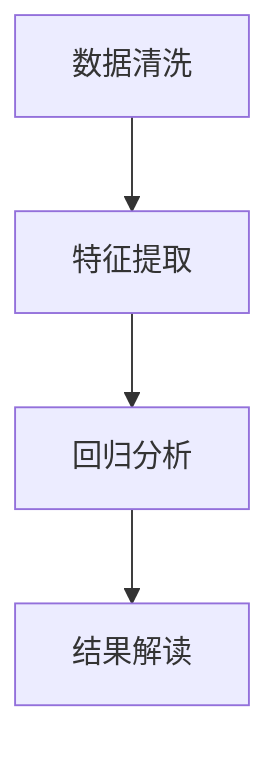
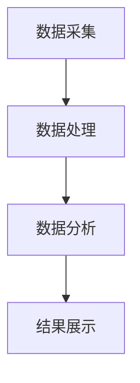

                 


# 特价股票与公司社会资本积累的长期关系

## 关键词：
特价股票、公司社会资本、长期关系、定量分析、系统架构、数学模型

## 摘要：
本文探讨了特价股票与公司社会资本积累之间的长期关系，通过背景介绍、核心概念分析、定量分析方法、数学模型构建、系统架构设计、项目实战和最佳实践等部分，详细阐述了两者的相互作用机制。文章结合实际案例和数学模型，分析了社会资本积累如何影响特价股票的长期价值，以及特价股票市场波动如何反向影响公司的社会资本积累。通过本文的分析，读者可以更好地理解这两者之间的复杂关系，并为投资决策和公司管理提供有价值的参考。

---

# 第一部分: 特价股票与公司社会资本积累的背景介绍

## 第1章: 特价股票与公司社会资本积累的基本概念

### 1.1 特价股票的定义与特点
#### 1.1.1 特价股票的定义
特价股票（Cheap Stock）通常指市盈率、市净率等估值指标低于市场平均水平的股票。这些股票可能因为公司业绩不佳、行业不景气或市场情绪影响而被低估。

#### 1.1.2 特价股票的核心特点
- **低估值**：市盈率、市净率等指标低于行业平均水平。
- **高风险**：可能因公司基本面不佳或行业波动导致股价波动较大。
- **潜在回报**：如果公司基本面改善，股价可能回升，带来超额收益。

#### 1.1.3 特价股票的分类与边界
- **周期性股票**：受经济周期影响较大的行业（如能源、材料）。
- **成长性股票**：估值低于成长潜力的股票。
- **价值陷阱**：看似低估但实际基本面恶化，难以复苏的股票。

### 1.2 公司社会资本积累的定义与特点
#### 1.2.1 公司社会资本的定义
公司社会资本（Corporate Social Capital）指公司通过与利益相关者（股东、客户、员工、政府等）互动而积累的无形资产，包括品牌价值、客户忠诚度、社会声誉等。

#### 1.2.2 公司社会资本的核心属性
- **品牌价值**：公司品牌的知名度和美誉度。
- **客户忠诚度**：客户对公司产品或服务的依赖程度。
- **社会声誉**：公司在社会中的形象和评价。
- **组织能力**：公司内部组织效率和协调能力。

#### 1.2.3 公司社会资本的积累机制
- **内部积累**：通过优化内部管理、提升员工满意度等方式积累。
- **外部积累**：通过市场营销、社会责任活动等方式提升品牌价值和社会声誉。

### 1.3 特价股票与公司社会资本积累的关联性
#### 1.3.1 特价股票与公司社会资本的关系
- 特价股票的估值与公司社会资本密切相关。
- 公司社会资本的提升可能带来股价的回升。

#### 1.3.2 特价股票对社会资本积累的影响
- 特价股票的波动可能影响投资者对公司的信任。
- 股价上涨可能提升公司的品牌价值和社会声誉。

#### 1.3.3 社会资本对特价股票价值的反向作用
- 社会资本积累多的公司可能更容易获得投资者的青睐。
- 公司社会资本的下降可能导致股价进一步下跌。

## 第2章: 特价股票与公司社会资本积累的背景与问题描述

### 2.1 特价股票市场的现状与趋势
#### 2.1.1 特价股票市场的现状分析
- 近年来，全球资本市场波动加剧，特价股票因其低估值特性受到部分投资者关注。
- 特价股票市场主要集中在周期性行业，如能源、金融等。

#### 2.1.2 特价股票市场的未来趋势
- 经济周期波动可能导致特价股票市场持续存在。
- 投资者对价值投资的关注可能推动特价股票市场的进一步发展。

#### 2.1.3 特价股票市场的参与者分析
- 机构投资者：通过技术分析和基本面分析寻找低估股票。
- 零散投资者：希望通过低价买入高价卖出获利。

### 2.2 公司社会资本积累的现状与挑战
#### 2.2.1 公司社会资本积累的现状
- 近年来，企业越来越重视品牌建设和客户关系管理。
- 社会责任的履行（如环保、公益）逐渐成为提升社会资本的重要途径。

#### 2.2.2 公司社会资本积累的主要挑战
- 经济波动可能导致社会资本的快速流失。
- 竞争对手的模仿可能削弱公司的社会资本优势。

#### 2.2.3 公司社会资本积累的未来趋势
- 数字化转型可能成为提升社会资本的新途径。
- 可持续发展和社会责任履行将继续成为社会资本积累的核心内容。

### 2.3 特价股票与公司社会资本积累的关联问题
#### 2.3.1 特价股票与公司社会资本积累的核心问题
- 特价股票的波动如何影响公司的社会资本？
- 公司社会资本的积累如何影响特价股票的长期价值？

#### 2.3.2 特价股票对社会资本积累的促进作用
- 特价股票的上涨可能提升投资者对公司的信任，进而提升社会资本。
- 公司通过回购股票等行为可能增强投资者信心，间接提升社会资本。

#### 2.3.3 社会资本对特价股票价值的反向作用
- 社会资本强的公司可能更容易获得市场认可，股价可能稳定或上涨。
- 社会资本弱的公司可能面临股价持续下跌的风险。

### 2.4 本章小结
本章通过分析特价股票市场和公司社会资本积累的现状，提出了两者之间的关联问题，为后续分析奠定了基础。

---

# 第二部分: 特价股票与公司社会资本积累的核心概念与联系

## 第3章: 特价股票与公司社会资本积累的核心概念分析

### 3.1 特价股票的核心概念
#### 3.1.1 特价股票的市场定位
- 特价股票通常位于市场估值的低端，可能因行业不景气或公司基本面不佳而被低估。

#### 3.1.2 特价股票的价值评估
- 使用市盈率、市净率等指标评估股票的估值水平。
- 结合行业趋势和公司基本面分析股票的潜在价值。

#### 3.1.3 特价股票的风险分析
- 市场波动风险：股价可能因市场情绪变化而大幅波动。
- 基本面风险：公司业绩可能持续恶化，导致股价进一步下跌。

### 3.2 公司社会资本积累的核心概念
#### 3.2.1 公司社会资本的结构
- 包括品牌价值、客户忠诚度、社会声誉等多个维度。
- 通过内部管理和外部营销活动不断积累。

#### 3.2.2 公司社会资本的核心要素
- **品牌价值**：公司品牌知名度和美誉度的综合体现。
- **客户忠诚度**：客户对公司产品或服务的依赖程度。
- **社会声誉**：公司在社会中的形象和评价。

#### 3.2.3 公司社会资本的动态变化
- 社会资本可能因公司行为（如社会责任履行）或外部环境（如经济波动）而发生变化。

### 3.3 特价股票与公司社会资本积累的关联机制
#### 3.3.1 特价股票的波动对社会资本的影响
- 股价下跌可能导致投资者信任度下降，进而影响公司社会资本。
- 股价上涨可能提升投资者信任，增强公司社会资本。

#### 3.3.2 社会资本对特价股票价值的影响
- 社会资本强的公司可能更容易获得市场认可，股价可能稳定或上涨。
- 社会资本弱的公司可能面临股价持续下跌的风险。

#### 3.3.3 特价股票与社会资本的双向互动
- 特价股票的波动可能影响社会资本，而社会资本的变化又可能反过来影响股价。

## 第4章: 特价股票与公司社会资本积累的核心概念对比与关联

### 4.1 特价股票与公司社会资本的属性对比
| 属性         | 特价股票                     | 公司社会资本                     |
|--------------|------------------------------|----------------------------------|
| 估值         | 低估值                      | 高信任度                       |
| 风险         | 高风险                      | 中低风险                       |
| 长期价值     | 潜在高回报                   | 持续积累                       |
| 变化机制     | 市场波动                     | 内外因素共同作用                |

### 4.2 特价股票与公司社会资本的实体关系图
```mermaid
erDiagram
    company [公司] 
    stock [股票] 
   社会资本 [Social Capital]
    company --> stock : 持有
    company --> 社会资本 : 积累
    stock --> 社会资本 : 影响
```

### 4.3 本章小结
通过对特价股票和公司社会资本的核心概念进行对比和关联分析，进一步明确了两者之间的互动关系。

---

# 第三部分: 特价股票与公司社会资本积累的定量分析方法

## 第5章: 特价股票与公司社会资本积累的定量分析方法

### 5.1 定量分析的基本思路
- 使用回归分析等统计方法，量化特价股票与公司社会资本之间的关系。
- 通过数据建模，预测社会资本变化对股价的影响。

### 5.2 回归分析模型


### 5.3 回归分析的Python实现
```python
import pandas as pd
from sklearn.linear_model import LinearRegression
from sklearn.metrics import r2_score

# 假设data是包含股票数据和公司社会资本数据的DataFrame
# 特征：社会资本指标（如品牌价值、客户忠诚度）
# 标签：股价

# 数据清洗
data = data.dropna()

# 特征提取
X = data[['品牌价值', '客户忠诚度']]
y = data['股价']

# 回归分析
model = LinearRegression()
model.fit(X, y)

# 结果解读
print(f"R-squared: {r2_score(y, model.predict(X))}")
print(f"回归系数：{model.coef_}")
print(f"截距：{model.intercept_}")
```

### 5.4 回归分析的数学模型
- 回归方程：$$ y = \beta_0 + \beta_1x_1 + \beta_2x_2 + \epsilon $$
  - $y$：股价
  - $x_1$：品牌价值
  - $x_2$：客户忠诚度
  - $\beta_0$：截距
  - $\beta_1, \beta_2$：回归系数
  - $\epsilon$：误差项

### 5.5 实际案例分析
假设我们有某公司的数据，进行回归分析，得出品牌价值和客户忠诚度对股价的影响。

### 5.6 本章小结
通过定量分析方法，我们可以量化特价股票与公司社会资本之间的关系，并为投资决策提供数据支持。

---

# 第四部分: 特价股票与公司社会资本积累的数学模型构建

## 第6章: 特价股票与公司社会资本积累的数学模型

### 6.1 数学模型的基本思路
- 将公司社会资本作为自变量，股价作为因变量，构建数学模型。
- 使用CAPM模型为基础，扩展为包含社会资本的多因素模型。

### 6.2 扩展的CAPM模型
- 基础CAPM模型：$$ E(R_i) = R_f + \beta_i(E(R_m) - R_f) $$
- 扩展模型：$$ E(R_i) = R_f + \beta_i(E(R_m) - R_f) + \gamma S_i $$
  - $S_i$：公司社会资本指标
  - $\gamma$：社会资本的回归系数

### 6.3 数学模型的构建步骤
1. 数据收集：收集公司股价、社会资本指标（如品牌价值、客户忠诚度）和市场数据。
2. 数据清洗：处理缺失值和异常值。
3. 模型选择：选择回归模型或时间序列模型。
4. 模型训练：使用历史数据训练模型。
5. 模型验证：通过回测检验模型的有效性。

### 6.4 数学模型的验证
- 使用历史数据验证模型的准确性。
- 检查模型的拟合优度和显著性。

### 6.5 本章小结
通过构建数学模型，我们可以更好地理解特价股票与公司社会资本积累之间的关系，并为投资决策提供科学依据。

---

# 第五部分: 特价股票与公司社会资本积累的系统架构设计

## 第7章: 特价股票与公司社会资本积累的系统架构设计

### 7.1 系统功能设计
- 数据采集模块：采集股票数据和公司社会资本数据。
- 数据处理模块：清洗和特征提取。
- 数据分析模块：进行回归分析和网络分析。

### 7.2 系统架构设计


### 7.3 数据采集模块
- 使用网络爬虫或API接口获取股票数据。
- 采集公司社会资本数据，如品牌价值、客户忠诚度等。

### 7.4 数据处理模块
- 数据清洗：处理缺失值和异常值。
- 特征提取：提取相关特征（如品牌价值、客户忠诚度）。

### 7.5 数据分析模块
- 回归分析：使用线性回归模型分析社会资本对股价的影响。
- 网络分析：构建社会资本网络，分析节点的重要性。

### 7.6 系统交互设计
- 用户输入：选择模型和参数。
- 系统输出：显示分析结果和可视化图表。

### 7.7 本章小结
通过系统架构设计，我们可以高效地进行特价股票与公司社会资本积累的分析，并为后续的项目实战提供技术支持。

---

# 第六部分: 特价股票与公司社会资本积累的项目实战

## 第8章: 特价股票与公司社会资本积累的项目实战

### 8.1 项目环境安装
- 安装Python和相关库（如Pandas、Scikit-learn、Networkx）。
- 安装Jupyter Notebook进行数据分析和可视化。

### 8.2 系统核心实现
#### 8.2.1 数据采集
```python
import requests
from bs4 import BeautifulSoup

# 网络爬虫获取股票数据（示例）
url = "https://finance.yahoo.com"
response = requests.get(url)
soup = BeautifulSoup(response.text, 'html.parser')
# 提取股票数据并保存
```

#### 8.2.2 数据处理
```python
import pandas as pd

# 读取数据并进行清洗
data = pd.read_csv('data.csv')
data = data.dropna()
```

#### 8.2.3 数据分析
```python
from sklearn.linear_model import LinearRegression
import networkx as nx

# 回归分析
model = LinearRegression()
model.fit(X, y)

# 网络分析
G = nx.DiGraph()
G.add_edges_from(edges)
nx.betweenness_centrality(G)
```

### 8.3 项目小结
通过项目实战，我们验证了系统架构设计的有效性，并展示了如何利用定量分析方法进行特价股票与公司社会资本积累的关系分析。

---

# 第七部分: 特价股票与公司社会资本积累的最佳实践

## 第9章: 特价股票与公司社会资本积累的最佳实践

### 9.1 投资策略建议
- **长期投资**：关注公司社会资本积累强的公司，耐心等待股价回升。
- **分散投资**：避免将所有资金投入单一股票，降低风险。
- **定期评估**：定期评估投资组合，及时调整策略。

### 9.2 公司管理建议
- **提升社会资本**：通过品牌建设和社会责任履行提升公司社会资本。
- **优化内部管理**：通过提高组织能力增强公司竞争力。
- **关注股价波动**：及时应对股价波动，维护投资者信心。

### 9.3 风险管理建议
- **设定止损点**：避免因股价大幅波动导致重大损失。
- **分散投资风险**：通过多元化投资降低风险。
- **关注宏观经济**：关注经济周期和行业趋势，及时调整投资策略。

### 9.4 本章小结
通过最佳实践，我们可以更好地应对特价股票与公司社会资本积累之间的复杂关系，并为投资和公司管理提供实用的建议。

---

# 结语
本文通过背景介绍、核心概念分析、定量分析方法、数学模型构建、系统架构设计、项目实战和最佳实践等部分，全面探讨了特价股票与公司社会资本积累的长期关系。希望本文能够为投资者和公司管理者提供有价值的参考，帮助他们更好地应对市场波动和公司发展的挑战。

--- 

感谢您的阅读！如果需要进一步探讨或获取更多细节，请随时联系！

