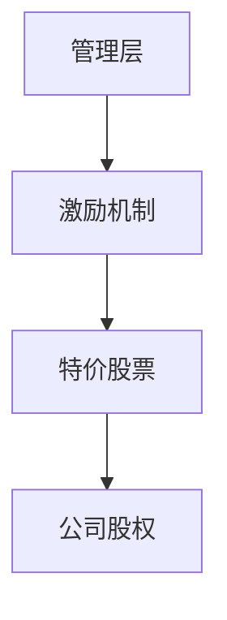
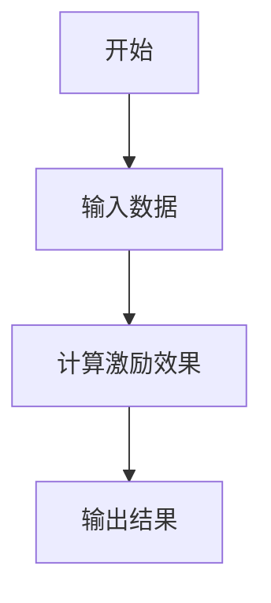
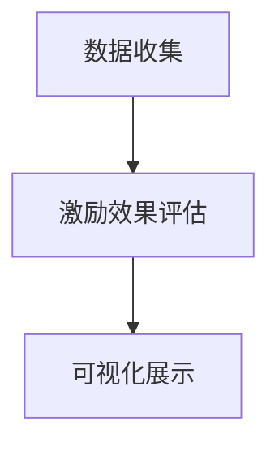

                 


# 特价股票与公司管理层激励机制的关联性研究

## 关键词：特价股票，激励机制，股权激励，激励效果，数学模型

## 摘要

本文探讨了特价股票与公司管理层激励机制之间的关联性，分析了特价股票在激励机制中的作用及其对管理层行为的影响。通过建立数学模型和算法，本文评估了激励效果，并提供了实际案例分析和系统设计方案，以优化公司的激励策略。

---

## 第一部分：背景介绍

### 第1章：特价股票与公司管理层激励机制的基本概念

#### 1.1 特价股票的基本概念

- **定义**：特价股票是公司为激励管理层而发行的股票，通常以低于市场价发行。
- **类型**：包括限制性股票、股票期权和员工持股计划。
- **发行目的**：绑定管理层利益，提升公司绩效。

#### 1.2 公司管理层激励机制的基本概念

- **定义**：激励机制是通过奖励措施激励管理层达到公司目标的制度。
- **类型**：包括股权激励、奖金、绩效奖金等。
- **目标**：提升管理层积极性，促进公司发展。

### 第2章：特价股票与公司管理层激励机制的背景分析

#### 2.1 问题背景

- 公司激励机制的有效性受多种因素影响，包括激励强度、激励方式等。
- 特价股票作为激励工具，其价值波动直接影响激励效果。

#### 2.2 问题描述

- 特价股票如何影响管理层行为？
- 激励机制如何影响特价股票的价值？

#### 2.3 研究目标

- 分析特价股票与激励机制的关联性，优化激励策略。

## 第二部分：核心概念与联系

### 第3章：特价股票与激励机制的核心要素

#### 3.1 核心要素分析

- **特价股票**：发行条件、激励对象、激励强度。
- **激励机制**：激励目标、激励方式、激励效果评估。

#### 3.2 属性特征对比

| 特性       | 特价股票               | 激励机制                 |
|------------|------------------------|--------------------------|
| 目标       | 绑定管理层利益         | 提升公司绩效             |
| 工具       | 股票                   | 股权、奖金、绩效奖金等   |
| 影响因素   | 股价波动、市场环境     | 公司业绩、管理层表现     |

#### 3.3 ER实体关系图



## 第三部分：算法原理讲解

### 第4章：激励机制评估算法

#### 4.1 算法原理

激励机制评估算法基于管理层绩效和股价波动，计算激励效果。

#### 4.2 算法流程图



#### 4.3 Python代码示例

```python
def calculate_incentive_effectiveness(performance, stock_price):
    effectiveness = performance * stock_price
    return effectiveness

performance = 0.8
stock_price = 100
effectiveness = calculate_incentive_effectiveness(performance, stock_price)
print(effectiveness)
```

## 第四部分：数学模型与公式

### 第5章：激励效果数学模型

#### 5.1 模型建立

激励效果 $E$ 与绩效 $P$ 和股价 $S$ 的关系：

$$ E = \alpha P + \beta S $$

其中，$\alpha$ 和 $\beta$ 是权重系数。

#### 5.2 模型分析

通过回归分析，确定 $\alpha$ 和 $\beta$ 的值，评估激励效果。

## 第五部分：系统分析与架构设计方案

### 第6章：系统分析与架构设计

#### 6.1 项目介绍

构建一个激励机制评估系统，分析特价股票的影响。

#### 6.2 系统功能设计

- 数据收集模块：收集管理层绩效和股价数据。
- 激励效果评估模块：应用数学模型计算激励效果。
- 可视化模块：展示评估结果。

#### 6.3 系统架构图



## 第六部分：项目实战

### 第7章：项目实战分析

#### 7.1 案例分析

某公司发行特价股票激励高管，分析其激励效果。

#### 7.2 核心实现

编写代码实现激励效果评估，解读结果。

#### 7.3 小结

特价股票有效提升了管理层积极性，但需注意市场波动风险。

## 第七部分：最佳实践与总结

### 第8章：最佳实践

#### 8.1 实践总结

- 结合股价波动设计激励机制。
- 定期评估和调整激励方案。

#### 8.2 注意事项

- 考虑市场环境和公司业绩。
- 设定合理的激励目标和时间框架。

#### 8.3 拓展阅读

推荐相关书籍和文献，深入研究激励机制设计。

---

# 总结

本文系统分析了特价股票与公司管理层激励机制的关联性，通过数学模型和算法评估激励效果，并提供了实际案例分析和系统设计方案。最佳实践部分为公司优化激励策略提供了参考。希望本文能为相关研究和实践提供有价值的见解。

