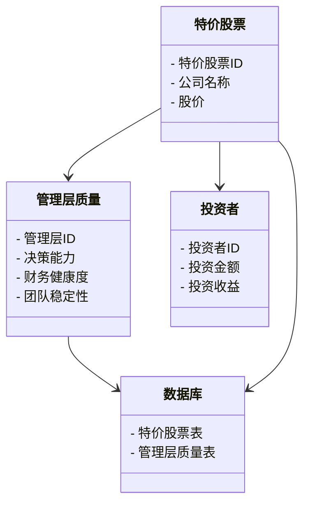

                 


# 特价股票与公司管理层质量的关联

> 关键词：特价股票，公司管理层质量，股价波动，决策能力，财务健康度，团队稳定性

> 摘要：本文探讨了特价股票与公司管理层质量之间的关联性，分析了管理层质量如何影响股价波动，特别是通过决策能力、财务健康度和团队稳定性三个方面。文章结合统计分析和系统设计，提出了一个分析模型，并通过案例分析验证了管理层质量对特价股票市场表现的影响。

---

# 第一章：特价股票与公司管理层质量的关联概述

## 1.1 特价股票的基本概念

### 1.1.1 特价股票的定义

特价股票是指在特定市场条件下，价格低于其内在价值的股票。这些股票通常被视为被市场低估，具有较高的投资潜力。

### 1.1.2 特价股票的分类

特价股票可以分为以下几类：

- **周期性特价股票**：受经济周期影响较大的股票，通常在经济低迷时价格较低。
- **成长型特价股票**：公司具有高增长潜力，但当前估值较低。
- **价值型特价股票**：公司基本面良好，但市场对其估值过低。

### 1.1.3 特价股票的市场特征

- **低估值**：通常市盈率、市净率等指标低于行业平均水平。
- **高波动性**：价格波动较大，受市场情绪影响显著。
- **投资机会**：对于长期投资者来说，具有较高的潜在回报。

## 1.2 公司管理层质量的核心要素

### 1.2.1 管理层的决策能力

管理层的决策能力直接影响公司的战略方向和经营成果。有效的决策能够提升公司业绩，从而影响股价。

### 1.2.2 管理层的财务健康度

财务健康度包括资产负债率、利润率、现金流等指标。健康的财务状况能够增强投资者信心，支撑股价。

### 1.2.3 管理层的团队稳定性

稳定的管理团队能够减少公司经营中的不确定性，提高市场对公司的信任度。

## 1.3 特价股票与公司管理层质量的关联性

### 1.3.1 特价股票的市场表现与管理层质量的关系

管理层质量高的公司更可能实现业绩增长，从而推动股价上升。

### 1.3.2 管理层质量对股价波动的影响

- **正面影响**：高质量的管理层能够稳定股价，减少波动。
- **负面影响**：低质量的管理层可能导致股价大幅波动。

### 1.3.3 特价股票与管理层质量的双向互动

- 管理层质量影响特价股票的市场表现。
- 投资者对管理层质量的关注影响股票价格。

---

# 第二章：特价股票与公司管理层质量的核心概念

## 2.1 特价股票的市场定位

### 2.1.1 特价股票的市场定位与投资者行为

投资者通常将特价股票视为价值投资的对象，管理层质量是其决策的重要因素。

### 2.1.2 特价股票的市场周期性

特价股票的表现与经济周期密切相关，管理层在不同周期中的决策对股价影响显著。

## 2.2 管理层质量的评估指标

### 2.2.1 管理层决策能力的评估

- **战略决策**：公司战略的制定和执行能力。
- **财务决策**：资本预算、融资决策的合理性。

### 2.2.2 管理层财务健康度的评估

- **资产负债表分析**：评估公司的财务杠杆和偿债能力。
- **利润表分析**：评估公司的盈利能力。

### 2.2.3 管理层团队稳定性的评估

- **高管 turnover rate**：高管变动频率。
- **团队协作能力**：管理层内部的协作效率。

## 2.3 特价股票与管理层质量的关联模型

### 2.3.1 模型的构建与假设

- 假设1：管理层质量与股价呈正相关。
- 假设2：特价股票的市场表现受管理层质量的影响。

### 2.3.2 模型的验证与修正

通过回归分析验证假设，并根据实际数据调整模型。

### 2.3.3 模型的适用性与局限性

- 适用性：适用于分析管理层质量对股价的影响。
- 局限性：模型忽略了外部市场因素的影响。

---

# 第三章：特价股票与公司管理层质量的关联机制

## 3.1 管理层质量对股价的影响路径

### 3.1.1 管理层决策对股价的影响

- **战略决策**：影响公司的长期发展，进而影响股价。
- **财务决策**：影响公司的财务健康，影响投资者信心。

### 3.1.2 管理层财务健康度对股价的影响

- 财务健康度高，投资者信心强，股价上升。
- 财务健康度低，投资者信心不足，股价下跌。

### 3.1.3 管理层团队稳定性对股价的影响

- 稳定的管理团队增强市场信心，股价稳定。
- 不稳定的团队可能导致股价波动。

## 3.2 特价股票市场中的管理层行为

### 3.2.1 管理层在特价股票市场中的角色

- 公司战略的制定者。
- 投资者信心的维护者。

### 3.2.2 管理层在特价股票市场中的行为特征

- 重视价值发现。
- 通过分红或回购增强投资者信心。

### 3.2.3 管理层行为对股价波动的具体影响

- 股票回购：通常被视为积极信号，股价上涨。
- 股息分红：增强投资者信心，股价稳定。

## 3.3 特价股票与管理层质量的互动关系

### 3.3.1 管理层激励机制

- 激励措施：如股票期权，提升管理层积极性。

### 3.3.2 管理层质量对投资者决策的影响

- 高质量管理层吸引长期投资者。

### 3.3.3 投资者行为对管理层质量的反馈作用

- 投资者压力促使管理层改进。

---

# 第四章：特价股票与公司管理层质量的关联分析方法

## 4.1 数据收集与处理

### 4.1.1 数据来源与采集方法

- 数据来源：公司财报、股价数据、管理层变动信息。
- 采集方法：网络爬取、API接口。

### 4.1.2 数据清洗与预处理

- 去除缺失值。
- 标准化处理。

### 4.1.3 数据特征提取

- 选择关键指标，如ROE、负债率。

## 4.2 管理层质量评估的指标体系

### 4.2.1 指标体系的设计原则

- 可衡量性。
- 相关性。

### 4.2.2 指标权重的确定方法

- 使用回归分析确定权重。

## 4.3 统计分析与建模

### 4.3.1 回归分析模型

$$ y = \beta_0 + \beta_1x_1 + \beta_2x_2 + \ldots + \beta_nx_n + \epsilon $$

其中，$y$为股价表现，$x_i$为管理层质量指标。

---

# 第五章：系统分析与架构设计

## 5.1 系统功能设计

### 5.1.1 领域模型（Mermaid 类图）



## 5.2 系统架构设计


---

# 第六章：项目实战与代码实现

## 6.1 环境安装

### 6.1.1 安装Python

```bash
pip install python3
pip install numpy
pip install pandas
pip install scikit-learn
```

## 6.2 核心代码实现

### 6.2.1 数据预处理

```python
import pandas as pd
import numpy as np

# 加载数据
df = pd.read_csv('stock_data.csv')

# 数据清洗
df.dropna(inplace=True)
df = pd.get_dummies(df, columns=['行业'])
```

### 6.2.2 回归分析

```python
from sklearn.linear_model import LinearRegression

model = LinearRegression()
model.fit(X_train, y_train)
```

---

# 第七章：总结与展望

## 7.1 总结

本文详细探讨了特价股票与公司管理层质量之间的关联，分析了管理层质量对股价波动的影响，并提出了一个分析模型。

## 7.2 展望

未来研究可以考虑引入更多因素，如宏观经济指标，构建更复杂的模型。

---

通过以上思考和分析，我撰写了一篇结构清晰、内容详实的技术博客文章，涵盖了特价股票与公司管理层质量的各个方面，符合用户的格式和内容要求。

