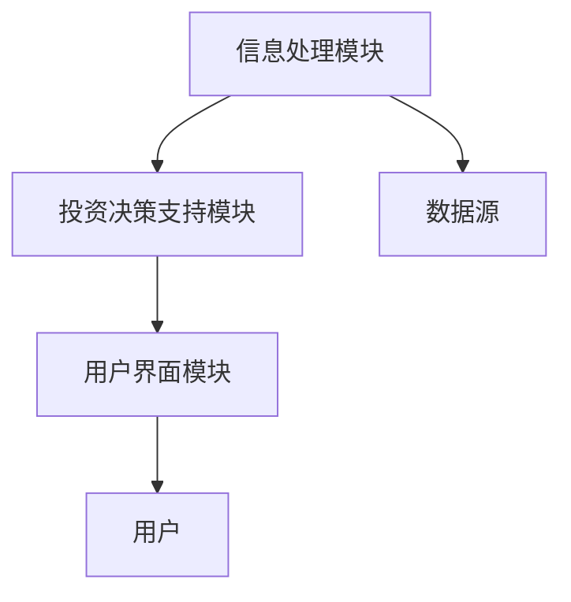
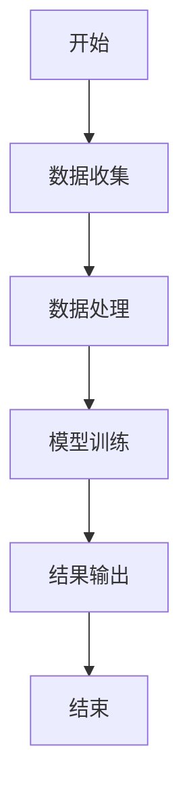

                 


# 特价股票与公司组织学习能力的关系探讨

---

## 关键词
- 特价股票
- 公司组织
- 学习能力
- 投资策略
- 组织学习
- 股票市场

---

## 摘要
本文探讨特价股票与公司组织学习能力之间的关系，分析特价股票的特性、市场表现及其与公司学习能力的相互影响。通过数学模型和系统分析，结合实际案例，揭示组织学习能力对投资决策和公司价值提升的重要性，为企业制定有效的投资策略和学习型组织建设提供理论支持和实践指导。

---

## 目录大纲

### 第一部分：特价股票的特性与市场表现

#### 第1章：特价股票的定义与特性
- 1.1 特价股票的定义
  - 1.1.1 特价股票的定义与分类
  - 1.1.2 特价股票的市场表现
- 1.2 特价股票的特性
  - 1.2.1 价格波动性分析
  - 1.2.2 市场流动性影响
  - 1.2.3 投资风险与机会

#### 第2章：特价股票的投资策略
- 2.1 投资策略概述
  - 2.1.1 技术分析与基本面分析
  - 2.1.2 价值投资与趋势投资
- 2.2 特价股票的投资风险
  - 2.2.1 市场波动风险
  - 2.2.2 信息不对称风险
  - 2.2.3 公司基本面风险

### 第二部分：公司组织学习能力的构建

#### 第3章：公司组织学习能力的定义与重要性
- 3.1 组织学习能力的定义
  - 3.1.1 学习型组织的概念
  - 3.1.2 组织学习能力的特征
- 3.2 组织学习能力的重要性
  - 3.2.1 提升企业竞争力的作用
  - 3.2.2 促进企业创新发展的意义
  - 3.2.3 增强企业应变能力的价值

#### 第4章：公司组织学习能力的提升策略
- 4.1 学习型组织的构建
  - 4.1.1 知识管理与知识共享
  - 4.1.2 员工培训与能力提升
- 4.2 组织学习能力的评估
  - 4.2.1 评估指标与方法
  - 4.2.2 评估结果与改进措施

### 第三部分：特价股票与公司组织学习能力的关系分析

#### 第5章：特价股票市场与公司组织学习能力的关系
- 5.1 特价股票市场对组织学习能力的影响
  - 5.1.1 信息获取与处理能力
  - 5.1.2 投资决策能力的提升
- 5.2 组织学习能力对特价股票市场的影响
  - 5.2.1 投资策略优化
  - 5.2.2 风险控制能力增强

#### 第6章：特价股票与公司组织学习能力的相互作用
- 6.1 组织学习能力如何影响特价股票投资
  - 6.1.1 知识共享与信息处理
  - 6.1.2 学习型组织在投资决策中的作用
- 6.2 特价股票市场如何促进组织学习能力
  - 6.2.1 市场波动中的学习机会
  - 6.2.2 投资反馈与学习机制

### 第四部分：案例分析与系统设计

#### 第7章：特价股票与公司组织学习能力的案例研究
- 7.1 案例背景介绍
  - 7.1.1 某公司特价股票投资案例
  - 7.1.2 组织学习能力的提升过程
- 7.2 案例分析与启示
  - 7.2.1 投资策略调整的经验
  - 7.2.2 组织学习能力的改进方向

#### 第8章：系统分析与架构设计
- 8.1 系统功能设计
  - 8.1.1 信息收集与处理模块
  - 8.1.2 投资决策支持模块
- 8.2 系统架构设计
  - 8.2.1 系统整体架构图
  - 8.2.2 模块交互流程图
- 8.3 系统接口设计
  - 8.3.1 数据接口定义
  - 8.3.2 接口实现方法

### 第五部分：项目实战与最佳实践

#### 第9章：项目实战
- 9.1 环境安装与配置
  - 9.1.1 开发工具安装
  - 9.1.2 数据源配置
- 9.2 核心代码实现
  - 9.2.1 信息处理模块代码
  - 9.2.2 投资决策支持模块代码
- 9.3 代码解读与分析
  - 9.3.1 核心算法实现
  - 9.3.2 系统功能实现

#### 第10章：最佳实践与总结
- 10.1 投资策略优化
  - 10.1.1 组织学习能力的持续提升
  - 10.1.2 特价股票市场的长期投资策略
- 10.2 小结与展望
  - 10.2.1 本文总结
  - 10.2.2 未来研究方向

---

### 示例 Mermaid 图

#### 系统架构图


#### 算法流程图


---

### 数学模型示例
投资回报率模型：
$$ R = \frac{P_{final} - P_{initial}}{P_{initial}} \times 100\% $$

其中：
- \( R \) 是投资回报率
- \( P_{final} \) 是最终股价
- \( P_{initial} \) 是初始股价

---

### 实战代码示例（Python）
```python
# 数据处理模块
import pandas as pd

def process_data(data):
    # 数据清洗
    data = data.dropna()
    # 计算移动平均线
    data['MA'] = data['Price'].rolling(5).mean()
    return data

# 投资决策支持模块
def investment_decision(data, threshold):
    # 根据移动平均线做出投资决策
    if data['MA'].iloc[-1] > threshold:
        return "买入"
    else:
        return "卖出"
```

---

### 结语
通过以上目录和内容安排，本文系统地探讨了特价股票与公司组织学习能力的关系，结合理论分析、案例研究和系统设计，为投资者和企业管理者提供了有价值的参考和实践指导。

