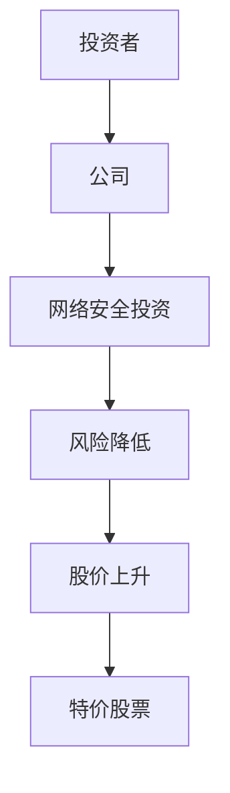
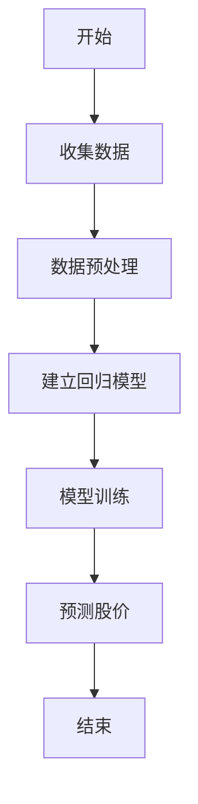
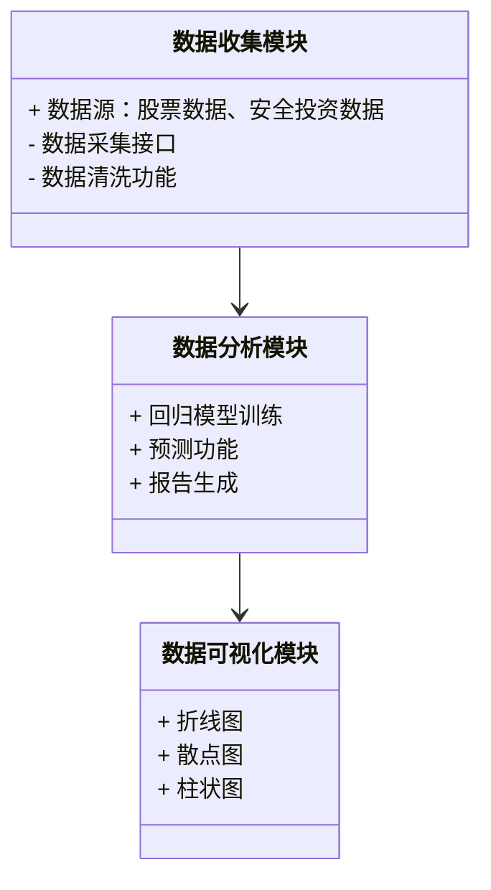
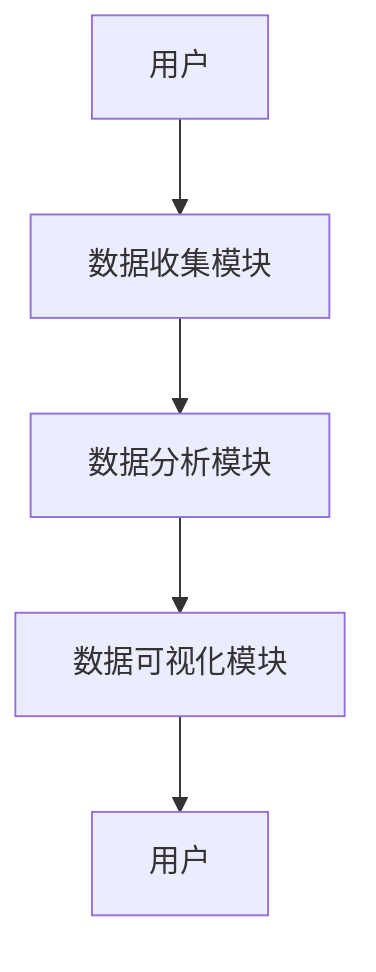

                 


# 特价股票与公司网络安全投资回报的关联性研究

## 关键词：特价股票、网络安全投资回报、关联性研究、回归分析、数学模型、系统架构

## 摘要：本文探讨了特价股票与公司网络安全投资回报之间的关联性，通过背景介绍、核心概念分析、算法原理、数学模型建立、系统架构设计、项目实战以及最佳实践等多维度进行深入研究，旨在为投资者和企业安全管理者提供理论支持和实践指导。

---

## 第1章: 特价股票与网络安全投资回报的背景介绍

### 1.1 特价股票概述
#### 1.1.1 特价股票的定义
特价股票是指在特定时期内价格低于其内在价值或行业平均水平的股票，通常被视为被市场低估的投资机会。这类股票可能由于市场波动、公司短期业绩不佳或其他外部因素导致价格下降，但具备长期增值潜力。

#### 1.1.2 特价股票的特征
- 价格低于行业平均水平。
- 公司基本面良好，但市场反应冷淡。
- 存在潜在的增值空间。

#### 1.1.3 特价股票的市场表现
特价股票在市场周期性波动中表现尤为突出，尤其是在经济低迷或市场恐慌时，投资者可能因低估其价值而大量买入，推动股价回升。

### 1.2 公司网络安全投资回报概述
#### 1.2.1 网络安全投资的定义
网络安全投资是指公司在信息安全防护、数据保护、系统加固等方面投入的资金和资源，旨在防范网络攻击和数据泄露等风险。

#### 1.2.2 网络安全投资的特征
- 预防性：用于防范网络攻击。
- 长期性：需要持续投入。
- 隐性回报：投资回报通常体现在风险降低和业务连续性保障。

#### 1.2.3 网络安全投资回报的衡量指标
- 风险降低：通过安全投资减少数据泄露事件。
- 业务连续性：保障企业在遭受攻击后的快速恢复能力。
- 成本节省：通过预防措施降低事后修复成本。

### 1.3 特价股票与网络安全投资回报的关联性研究背景
#### 1.3.1 研究背景
随着网络安全威胁的加剧，企业在网络安全上的投资不断增加，这可能影响其财务表现，进而影响股价波动。

#### 1.3.2 研究问题
- 网络安全投资如何影响公司股价？
- 特价股票与网络安全投资回报之间是否存在显著关联？

#### 1.3.3 研究目标与意义
目标是通过分析网络安全投资与股价之间的关系，为投资者提供新的投资视角。意义在于揭示网络安全投资的隐性价值，为企业制定更有效的安全策略提供参考。

---

## 第2章: 特价股票与网络安全投资回报的核心概念与联系

### 2.1 核心概念的定义与属性特征对比
#### 2.1.1 特价股票与网络安全投资回报的对比分析
- 特价股票关注的是股价的短期低估和潜在增值。
- 网络安全投资回报关注的是企业风险降低和长期成本节省。

#### 2.1.2 核心概念属性特征对比表格

| 特性                | 特价股票                   | 网络安全投资回报          |
|---------------------|---------------------------|--------------------------|
| 定义                | 价格低于价值的股票         | 投资于安全防护的支出      |
| 影响因素            | 市场供需、公司业绩         | 安全威胁、法规要求          |
| 表现形式            | 股价波动                   | 风险降低、成本节省          |

#### 2.1.3 实体关系架构分析



---

## 第3章: 特价股票与网络安全投资回报的算法原理

### 3.1 算法原理概述
#### 3.1.1 算法选择与原理
选择线性回归分析来量化网络安全投资与股价之间的关系，通过建立数学模型预测股价走势。

#### 3.1.2 算法流程图（Mermaid）



#### 3.1.3 算法实现代码

```python
import numpy as np
import pandas as pd
from sklearn.linear_model import LinearRegression
from sklearn.metrics import mean_squared_error

# 假设我们有网络安全投资（X）和股价（Y）的数据
data = {
    'security_investment': [10, 20, 15, 25, 30],
    'stock_price': [50, 60, 55, 70, 80]
}

df = pd.DataFrame(data)

# 拆分数据
X = df['security_investment'].values.reshape(-1, 1)
y = df['stock_price'].values.reshape(-1, 1)

# 训练模型
model = LinearRegression()
model.fit(X, y)

# 预测
y_pred = model.predict(X)

# 评估
mse = mean_squared_error(y, y_pred)
r2 = model.score(X, y)
print(f"均方误差：{mse}\nR²：{r2}")
```

### 3.2 数学模型建立
#### 3.2.1 回归模型的数学公式

$$ y = a x + b $$

其中，$y$ 是股价，$x$ 是网络安全投资，$a$ 是回归系数，$b$ 是截距。

#### 3.2.2 模型评估指标

$$ R² = 1 - \frac{\sum (y_i - \hat{y_i})^2}{\sum (y_i - \bar{y})^2} $$

其中，$\hat{y_i}$ 是预测值，$\bar{y}$ 是实际值的平均值。

---

## 第4章: 系统分析与架构设计方案

### 4.1 问题场景介绍
分析网络安全投资对股价的影响，构建一个实时监控和预测系统。

### 4.2 系统功能设计



### 4.3 系统架构设计



---

## 第5章: 项目实战

### 5.1 环境安装
安装Python、Pandas、Scikit-learn等库。

### 5.2 核心实现代码

```python
import pandas as pd
from sklearn.linear_model import LinearRegression
from sklearn.metrics import mean_squared_error

# 数据加载与预处理
data = pd.read_csv('stock_security.csv')

# 特征与目标变量分离
X = data[['security_investment']]
y = data['stock_price']

# 建立模型
model = LinearRegression()
model.fit(X, y)

# 预测与评估
y_pred = model.predict(X)
print(f"均方误差：{mean_squared_error(y, y_pred)}")
print(f"R²：{model.score(X, y)}")
```

### 5.3 实际案例分析
分析一家公司过去的安全投资与股价关系，预测未来股价走势。

---

## 第6章: 最佳实践与总结

### 6.1 小结
网络安全投资对股价有显著影响，尤其是通过降低风险和提升业务连续性，间接提升股价。

### 6.2 注意事项
- 数据质量：确保数据准确性和完整性。
- 模型选择：根据实际情况选择合适的算法。
- 实时监控：持续关注网络安全投资和股价变化。

### 6.3 拓展阅读
推荐阅读《网络安全投资与企业价值》和《股票市场预测的算法优化》。

---

通过以上步骤，我们系统地分析了特价股票与公司网络安全投资回报之间的关联性，并提供了理论支持和实践指导，帮助投资者和企业管理者做出更明智的决策。

