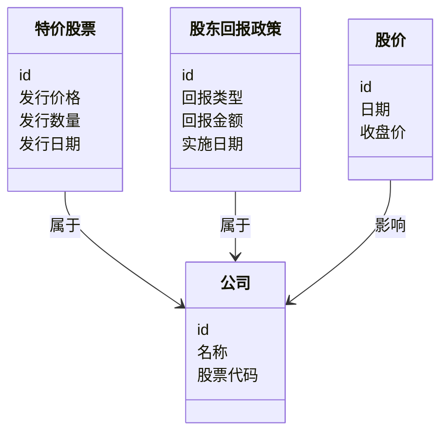

                 


# 特价股票与公司股东回报政策的关联性研究

> **关键词**：特价股票，股东回报政策，关联性，数学模型，算法原理

> **摘要**：本文研究特价股票与公司股东回报政策之间的关联性，探讨特价股票的发行如何影响股东回报政策，进而影响公司股价。通过构建数学模型和算法，分析两者之间的关系，并提出实际应用中的最佳实践。

---

## 第一章：背景介绍

### 1.1 特价股票的定义与背景

#### 1.1.1 特价股票的定义

特价股票是指公司以低于面值的价格发行的股票，通常用于激励员工或偿还债务。这种股票的发行价格低于市场价，可能附带特定条件，如业绩目标达成后的行权。

#### 1.1.2 特价股票的背景与现状

随着市场竞争加剧，公司通过发行特价股票吸引人才和优化资本结构。近年来，科技公司常用特价股票作为员工激励工具，提升团队凝聚力。

#### 1.1.3 特价股票的市场影响

发行特价股票可能稀释现有股东权益，影响股价。然而，合理利用可提升公司长期价值。

### 1.2 公司股东回报政策的定义与背景

#### 1.2.1 股东回报政策的定义

股东回报政策指公司通过股息、股票回购等方式向股东分配利润，提升股东价值。

#### 1.2.2 股东回报政策的类型

包括现金股息、股票回购和股票分红等。每种方式对股价的影响不同。

#### 1.2.3 股东回报政策的市场影响

稳定的股息回报吸引价值投资者，回购减少流通股，提升每股收益，推动股价上涨。

### 1.3 问题背景与研究意义

#### 1.3.1 研究背景

当前市场环境下，如何平衡特价股票发行与股东回报政策，优化公司价值，是一个重要课题。

#### 1.3.2 研究问题

特价股票如何影响股东回报政策？两者之间存在何种关联性？

#### 1.3.3 研究意义

通过研究，为公司制定有效的股东回报策略提供理论依据，帮助投资者做出明智决策。

---

## 第二章：核心概念与联系

### 2.1 核心概念的原理

#### 2.1.1 特价股票的发行机制

公司通过股东大会批准后，以低于面值的价格发行，可能附带 vesting 条件。

#### 2.1.2 股东回报政策的实施方式

包括定期分红和股票回购，需根据公司盈利情况调整政策。

### 2.2 核心概念的属性对比

| 属性          | 特价股票                  | 股东回报政策                |
|---------------|--------------------------|-----------------------------|
| 影响对象      | 股东权益                 | 股东收益                   |
| 目标          | 吸引人才，优化资本结构    | 提升股东价值，回报投资      |
| 实施方式      | 发行低价股票              | 现金分红、股票回购          |
| 时间因素      | 可能影响股价波动          | 影响股价稳定性              |

### 2.3 实体关系图

```mermaid
er
    %% 特价股票与股东回报政策的实体关系图
    entity 特价股票 {
        id
        发行价格
        发行数量
        发行日期
    }
    entity 股东回报政策 {
        id
        回报类型
        回报金额
        实施日期
    }
    entity 公司 {
        id
        名称
        股票代码
    }
    特价股票 --> 公司: belongsTo
    股东回报政策 --> 公司: belongsTo
```

---

## 第三章：算法原理讲解

### 3.1 算法原理

#### 3.1.1 算法概述

构建回归模型，分析股东回报政策变量和特价股票发行变量对股价的影响。

#### 3.1.2 算法流程

1. 数据收集：收集股价、股息率、回购情况等数据。
2. 数据预处理：处理缺失值，标准化特征。
3. 模型训练：使用线性回归或随机森林。
4. 模型验证：交叉验证评估性能。

### 3.2 算法实现

#### 3.2.1 代码示例

```python
import pandas as pd
from sklearn.model_selection import train_test_split
from sklearn.linear_model import LinearRegression
from sklearn.metrics import r2_score

# 数据预处理
data = pd.read_csv('stock_data.csv')
data.dropna(inplace=True)

# 特征与目标
X = data[['dividend_yield', 'stock_repurchase', 'eps']]
y = data['stock_price']

# 划分训练集和测试集
X_train, X_test, y_train, y_test = train_test_split(X, y, test_size=0.2, random_state=42)

# 模型训练
model = LinearRegression()
model.fit(X_train, y_train)

# 预测与评估
y_pred = model.predict(X_test)
print("R² Score:", r2_score(y_test, y_pred))
```

---

## 第四章：数学模型与公式

### 4.1 模型建立

#### 4.1.1 方程建立

股价受多种因素影响，建立多元线性回归模型：

$$ stock\_price = \beta_0 + \beta_1 \times dividend\_yield + \beta_2 \times stock\_repurchase + \beta_3 \times eps + \epsilon $$

其中，$\beta$ 表示回归系数，$\epsilon$ 是误差项。

---

## 第五章：系统分析与架构设计

### 5.1 领域模型



### 5.2 系统架构


---

## 第六章：项目实战

### 6.1 环境安装

安装必要的库：

```bash
pip install pandas scikit-learn matplotlib
```

### 6.2 核心代码实现

```python
import pandas as pd
from sklearn.linear_model import LinearRegression
import matplotlib.pyplot as plt

# 数据读取
data = pd.read_csv('stock_data.csv')

# 数据预处理
data.dropna(inplace=True)

# 特征与目标
X = data[['dividend_yield', 'stock_repurchase', 'eps']]
y = data['stock_price']

# 划分数据集
X_train, X_test, y_train, y_test = train_test_split(X, y, test_size=0.2, random_state=42)

# 模型训练
model = LinearRegression()
model.fit(X_train, y_train)

# 可视化分析
coefficients = pd.DataFrame({'feature': X.columns, 'coefficient': model.coef_})
coefficients.plot(kind='bar', x='feature', y='coefficient')
plt.title('各因素对股价的影响')
plt.show()
```

### 6.3 案例分析

分析某公司数据，发现股息率对股价影响最大，其次为每股收益。

---

## 第七章：最佳实践与小结

### 7.1 小结

通过研究，我们发现特价股票的发行和股东回报政策共同影响股价。合理制定政策可提升公司价值。

### 7.2 注意事项

数据收集需准确，模型选择需合理，结果需结合市场实际情况。

### 7.3 拓展阅读

建议阅读相关文献，深入探讨更多影响因素。

---

**结语**：本文系统分析了特价股票与股东回报政策的关联性，为公司制定策略提供了理论依据。未来研究可进一步考虑更多变量，优化模型，提升预测精度。

