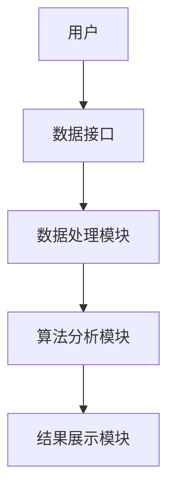

                 


# 特价股票与公司股东积极主义的关联性研究

> 关键词：特价股票、公司股东积极主义、关联性、数学模型、算法分析、案例研究

> 摘要：本文探讨了特价股票与公司股东积极主义之间的关联性，通过背景分析、数学建模、系统设计和案例研究，揭示了两者在公司治理和市场行为中的互动关系，提出了量化分析的方法和实际应用策略。

---

# 第一部分: 特价股票与公司股东积极主义的背景与概念

## 第1章: 特价股票的基本概念

### 1.1 特价股票的定义与特点

#### 1.1.1 特价股票的定义
特价股票是指股票价格低于其面值（通常为1元）的股票。这种股票通常出现在公司财务状况不佳、市场表现低迷或公司进行资产重组的情况下。

#### 1.1.2 特价股票的特点
- **低价格**：股价低于面值。
- **高风险**：通常伴随较高的市场波动性和投资风险。
- **潜在收益**：可能因公司重组或转机而股价上涨。

#### 1.1.3 特价股票的分类与应用场景
- **普通特价股票**：公司正常运营，但股价因市场因素低于面值。
- **优先特价股票**：享有优先权的特价股票，可能在公司重组时获得优先清偿。

---

## 第2章: 公司股东积极主义的定义与特点

### 2.1 公司股东积极主义的定义

#### 2.1.1 股东积极主义的起源与发展
股东积极主义起源于20世纪70年代，随着股东维权意识的增强而逐渐发展。股东通过行使投票权、提出议案等方式积极参与公司治理。

#### 2.1.2 股东积极主义的核心目标
- 提高公司治理效率。
- 优化公司财务状况。
- 保护股东权益。

#### 2.1.3 股东积极主义的实施手段
- 提案股东大会。
- 股东诉讼。
- 压迫性收购。

---

## 第3章: 特价股票与公司股东积极主义的关联性分析

### 3.1 特价股票与股东积极主义的背景关联

#### 3.1.1 特价股票市场的现状与趋势
- 近年来，全球市场中特价股票的数量有所增加。
- 特价股票通常出现在中小型企业或财务困境的公司。

#### 3.1.2 股东积极主义的兴起与影响
- 股东积极主义的兴起与公司治理透明化、股东维权意识增强有关。
- 股东积极主义对公司治理和股价的影响日益显著。

#### 3.1.3 两者在公司治理中的交集
- 特价股票公司更容易成为股东积极主义的目标。
- 股东积极主义可能通过改善公司治理而影响股价。

---

# 第二部分: 特价股票与公司股东积极主义的数学模型与算法分析

## 第4章: 特价股票与股东积极主义的数学模型

### 4.1 特价股票与股东积极主义的数学模型

#### 4.1.1 特价股票价格波动模型
$$ P(t) = \alpha + \beta S(t) + \epsilon $$

其中：
- \( P(t) \)：t时刻的股价。
- \( S(t) \)：t时刻的股东积极主义指数。
- \( \alpha \)、\( \beta \)：模型参数。
- \( \epsilon \)：随机误差项。

#### 4.1.2 股东积极主义影响的量化模型
$$ I(t) = \gamma S(t) + \delta P(t) + \zeta $$

其中：
- \( I(t) \)：t时刻的股东积极主义强度。
- \( S(t) \)：股东积极主义指数。
- \( P(t) \)：股价。

---

## 第5章: 特价股票与股东积极主义的算法实现

### 5.1 数据预处理与特征提取

```python
import pandas as pd
import numpy as np

# 加载数据
data = pd.read_csv('stock_data.csv')

# 数据清洗
data = data.dropna()
data['date'] = pd.to_datetime(data['date'])
data.set_index('date', inplace=True)

# 特征提取
features = ['open', 'high', 'low', 'close', 'volume']
target = 'price'
```

### 5.2 基于机器学习的关联性分析算法

```python
from sklearn.linear_model import LinearRegression

# 训练模型
model = LinearRegression()
model.fit(data[features], data[target])

# 预测
predictions = model.predict(data[features])
```

### 5.3 算法实现的代码示例

```python
import matplotlib.pyplot as plt

# 绘制实际价格与预测价格的对比图
plt.figure(figsize=(10, 6))
plt.plot(data.index, data[target], label='Actual Price')
plt.plot(data.index, predictions, label='Predicted Price')
plt.title('Actual vs Predicted Stock Price')
plt.xlabel('Date')
plt.ylabel('Price')
plt.legend()
plt.show()
```

---

# 第三部分: 特价股票与公司股东积极主义的系统架构与设计

## 第6章: 系统架构设计

### 6.1 系统整体架构图



### 6.2 系统功能设计

#### 6.2.1 数据处理模块
- 数据清洗。
- 特征提取。

#### 6.2.2 算法分析模块
- 回归分析。
- 股东积极主义强度计算。

#### 6.2.3 结果展示模块
- 可视化图表。
- 关联性分析报告。

---

## 第7章: 项目实战

### 7.1 环境安装

```bash
pip install pandas numpy scikit-learn matplotlib
```

### 7.2 核心代码实现

```python
import pandas as pd
import numpy as np
from sklearn.linear_model import LinearRegression
import matplotlib.pyplot as plt

# 加载数据
data = pd.read_csv('stock_data.csv')

# 数据清洗和预处理
data = data.dropna()
data['date'] = pd.to_datetime(data['date'])
data.set_index('date', inplace=True)

# 定义特征和目标
features = ['open', 'high', 'low', 'close', 'volume']
target = 'price'

# 训练模型
model = LinearRegression()
model.fit(data[features], data[target])

# 预测
predictions = model.predict(data[features])

# 可视化
plt.figure(figsize=(10, 6))
plt.plot(data.index, data[target], label='Actual Price')
plt.plot(data.index, predictions, label='Predicted Price')
plt.title('Actual vs Predicted Stock Price')
plt.xlabel('Date')
plt.ylabel('Price')
plt.legend()
plt.show()
```

---

## 第8章: 总结与展望

### 8.1 总结
本文通过数学建模和算法分析，揭示了特价股票与公司股东积极主义之间的关联性，提出了量化分析的方法和实际应用策略。

### 8.2 展望
未来的研究可以进一步探索股东积极主义对股价的长期影响，以及在不同市场环境下的表现差异。

### 8.3 注意事项
投资者在进行相关投资时，应充分考虑市场风险和公司基本面，避免盲目跟风。

### 8.4 拓展阅读
- 《股东积极主义与公司治理》。
- 《股票市场波动性分析》。

---

通过本文的研究，读者可以更好地理解特价股票与公司股东积极主义之间的复杂关系，并在实际投资和公司治理中加以应用。

