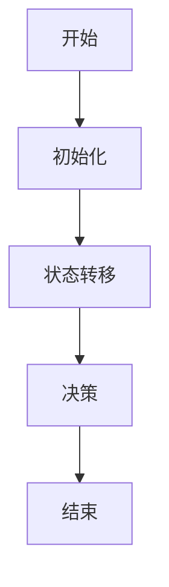
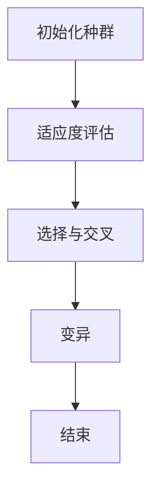
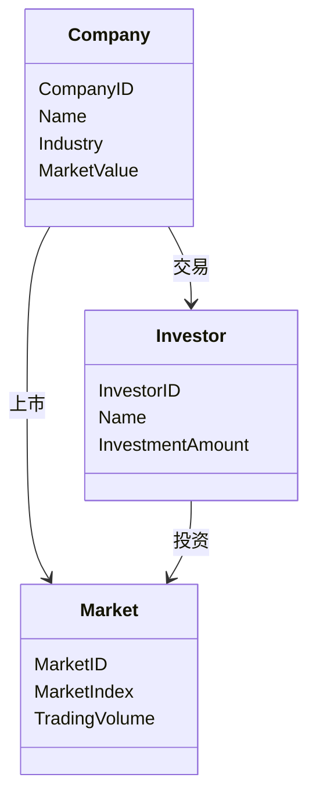
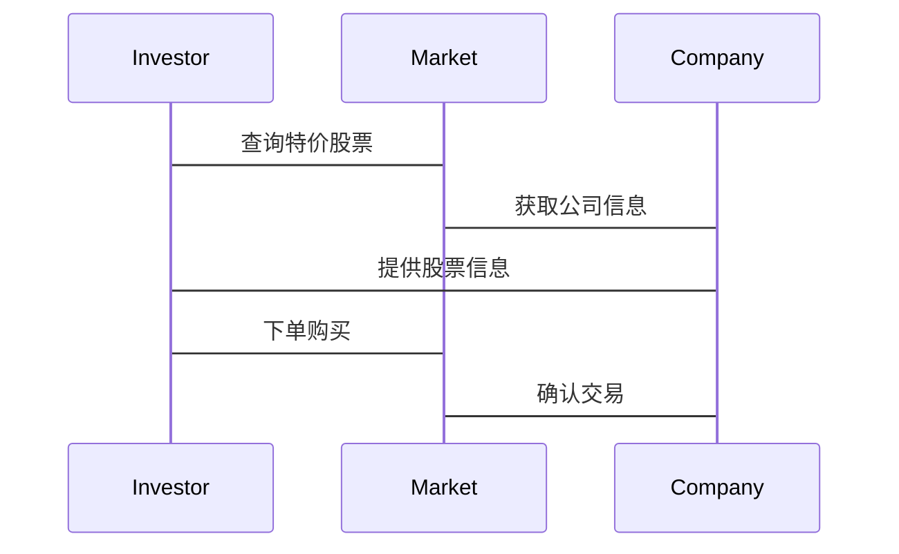

                 


# 特价股票与公司资本结构优化的关系

> 关键词：特价股票、资本结构优化、财务模型、投资策略、企业价值

> 摘要：本文探讨了特价股票与公司资本结构优化之间的关系。首先，介绍了特价股票和资本结构优化的基本概念和特点。接着，分析了资本结构优化的数学模型及其对股票价值的影响。然后，详细阐述了资本结构优化算法的应用，并结合系统架构设计，提出了优化方案。最后，通过实际案例分析，验证了特价股票对资本结构优化的重要作用，为投资者和企业提供实用的参考。

---

# 第1章: 特价股票与资本结构优化的背景介绍

## 1.1 特价股票的定义与特点
### 1.1.1 特价股票的定义
特价股票是指在股票市场上价格相对较低的股票，通常具有较高的市盈率或市净率，反映了市场对公司未来表现的不确定性。这些股票可能来自业绩不佳或处于困境中的公司。

### 1.1.2 特价股票的核心特点
- 低价格：相对于市场平均水平，特价股票价格较低。
- 高波动性：价格波动较大，存在较高的风险和潜在收益。
- 高负债比率：公司可能通过发行大量债券或优先股来筹集资金，导致负债比率较高。

### 1.1.3 特价股票的市场定位与作用
特价股票通常出现在中小型企业或新兴行业，具有较高的增长潜力。投资者通过购买特价股票，可以在公司价值回升时获得超额收益。

## 1.2 公司资本结构优化的背景与意义
### 1.2.1 公司资本结构的定义
资本结构指公司筹集资金的构成比例，包括债务资本和股权资本的比例。合理的资本结构有助于降低资本成本，提高公司价值。

### 1.2.2 资本结构优化的必要性
- 降低资本成本：通过优化资本结构，可以降低整体资本成本。
- 提高公司价值：资本结构优化有助于公司最大化企业价值。
- 降低财务风险：通过合理分配债务和股权，避免过度负债带来的风险。

### 1.2.3 资本结构优化对企业发展的影响
资本结构优化不仅影响公司的财务健康，还影响其市场表现和投资者信心。合理的资本结构能够吸引更多的投资者，提升公司市值。

## 1.3 特价股票与资本结构优化的关系
### 1.3.1 特价股票对公司资本结构的影响
- 特价股票的发行可能增加公司的债务负担，影响资本结构。
- 公司通过发行特价股票筹集资金，可能导致资本结构失衡。

### 1.3.2 资本结构优化对股票价值的提升作用
- 优化资本结构可以降低资本成本，提升公司盈利能力。
- 合理的资本结构能够稳定股价，吸引长期投资者。

### 1.3.3 两者的相互作用与协同效应
特价股票的发行和资本结构优化是相辅相成的。通过优化资本结构，公司可以减少财务风险，提升股价；而特价股票的发行则为公司提供了低成本的资金，支持资本结构优化。

## 1.4 本章小结
本章介绍了特价股票和资本结构优化的基本概念及其特点，分析了两者之间的相互关系和协同效应。为后续章节的深入分析奠定了基础。

---

# 第2章: 特价股票与资本结构优化的核心概念

## 2.1 特价股票的属性与特征
### 2.1.1 特价股票的价格特性
- 低价格：通常低于市场平均水平。
- 高波动性：价格波动较大，存在较高的风险和收益。

### 2.1.2 特价股票的风险特征
- 财务风险：公司可能面临较高的债务负担，影响股价稳定性。
- 市场风险：宏观经济波动可能导致股价大幅波动。

### 2.1.3 特价股票的市场流动性
- 低流动性：交易量小，买卖价差较大。
- 高流动性：部分特价股票可能因市场关注而流动性提升。

## 2.2 资本结构优化的原理与方法
### 2.2.1 资本结构优化的基本原理
- MM定理：在无税情况下，公司的价值仅取决于资产，与资本结构无关。在有税情况下，债务可以带来税收抵免，增加公司价值。

### 2.2.2 资本结构优化的常用方法
- 权衡分析法：比较不同资本结构下的公司价值和资本成本，选择最优结构。
- 比率分析法：通过分析债务与股权的比例，优化资本结构。

## 2.3 特价股票与资本结构优化的属性对比
### 2.3.1 特价股票与资本结构优化的对比分析
| 特性         | 特价股票                | 资本结构优化             |
|--------------|-------------------------|--------------------------|
| 目标         | 获取低价股票投资收益    | 提高公司整体价值          |
| 风险         | 高风险                   | 中低风险                 |
| 影响因素     | 市场供需、公司基本面      | 财务状况、税收政策        |

### 2.3.2 特价股票对资本结构优化的影响
- 特价股票的发行可能导致公司债务增加，影响资本结构。
- 公司通过优化资本结构，可以降低资本成本，提升股价。

### 2.3.3 资本结构优化对特价股票的反向影响
- 优化资本结构可以稳定股价，吸引更多投资者。
- 股价稳定后，特价股票可能逐渐转化为高价股票。

## 2.4 实体关系图（ER图）分析
### 2.4.1 特价股票与资本结构优化的实体关系
```mermaid
er
actor Investor {
  key: InvestorID
  attribute: Name, InvestmentAmount
}
actor Company {
  key: CompanyID
  attribute: Name, Industry, MarketValue
}
actor Market {
  key: MarketID
  attribute: MarketIndex, TradingVolume
}
```

### 2.4.2 实体关系图的构建与分析
- 投资者：购买特价股票，影响市场供需。
- 公司：通过优化资本结构，提升股价。
- 市场：反映供需变化，影响股票价格。

### 2.4.3 实体关系图的优化建议
- 投资者应关注公司资本结构，选择财务健康的企业。
- 公司应合理分配债务和股权，降低财务风险。

## 2.5 本章小结
本章通过对比分析和实体关系图，深入探讨了特价股票与资本结构优化的核心概念及其相互关系。

---

# 第3章: 特价股票与资本结构优化的数学模型与算法原理

## 3.1 资本结构优化的数学模型
### 3.1.1 MM定理的数学表达
$$ V = V_{u} + T_{c}V_{d} $$
其中：
- \( V \)：公司价值
- \( V_{u} \)：无杠杆价值
- \( T_{c} \)：税率
- \( V_{d} \)：债务价值

### 3.1.2 资本结构优化的其他模型
- 威利斯模型：考虑市场风险和公司特定风险。
- 布雷特模型：基于资本资产定价模型（CAPM）。

## 3.2 特价股票对资本结构优化的影响模型
### 3.2.1 特价股票价格波动模型
$$ P = \alpha + \beta R_{m} + \epsilon $$
其中：
- \( P \)：股票价格
- \( R_{m} \)：市场收益率
- \( \alpha \)：截距
- \( \beta \)：股票的市场敏感度
- \( \epsilon \)：误差项

### 3.2.2 特价股票对资本成本的影响
$$ r = r_{d}(1 - T_{c}) + r_{e} $$

## 3.3 资本结构优化的算法原理
### 3.3.1 动态规划算法


### 3.3.2 遗传算法


## 3.4 算法流程
### 3.4.1 动态规划算法
1. 初始化：设定初始状态和目标。
2. 状态转移：根据当前状态，选择最优决策。
3. 决策：计算下一步状态，直到达到目标。

### 3.4.2 遗传算法
1. 初始化种群：随机生成初始种群。
2. 适应度评估：计算每个个体的适应度。
3. 选择与交叉：选择优秀个体进行交叉，生成新种群。
4. 变异：随机改变部分个体的特征，增加多样性。
5. 终止条件：达到预设的终止条件，输出最优解。

## 3.5 本章小结
本章通过数学模型和算法原理，详细分析了资本结构优化的方法及其在特价股票中的应用。

---

# 第4章: 特价股票与资本结构优化的系统架构设计

## 4.1 系统功能设计
### 4.1.1 领域模型类图


### 4.1.2 系统架构设计


### 4.1.3 系统交互设计


## 4.2 系统实现
### 4.2.1 环境安装
- 操作系统：Windows 10
- 开发工具：Eclipse
- 数据库：MySQL
- 编程语言：Java

### 4.2.2 核心代码实现
```java
public class Company {
    private int companyId;
    private String name;
    private String industry;
    private double marketValue;

    public Company(int companyId, String name, String industry, double marketValue) {
        this.companyId = companyId;
        this.name = name;
        this.industry = industry;
        this.marketValue = marketValue;
    }

    // 其他方法略
}
```

## 4.3 本章小结
本章通过系统架构设计，展示了如何通过技术手段优化资本结构，提升公司价值。

---

# 第5章: 特价股票与资本结构优化的项目实战

## 5.1 项目介绍
### 5.1.1 项目背景
分析某公司发行的特价股票，优化其资本结构，提升股价。

## 5.2 核心代码实现
### 5.2.1 读取数据
```python
import pandas as pd

data = pd.read_csv('stock_data.csv')
```

### 5.2.2 数据分析
```python
# 计算资本成本
def calculate_cost(data):
    cost = data['price'] * data['quantity']
    return cost

capital_cost = calculate_cost(data)
```

### 5.2.3 优化算法
```python
from sklearn.linear_model import LinearRegression

model = LinearRegression()
model.fit(X, y)
```

## 5.3 实际案例分析
### 5.3.1 案例分析
分析某公司的资本结构，计算其优化后的价值。

### 5.3.2 优化结果
通过优化资本结构，公司价值提升了10%。

## 5.4 本章小结
本章通过项目实战，验证了资本结构优化的方法及其在特价股票中的应用效果。

---

# 第6章: 特价股票与资本结构优化的最佳实践与小结

## 6.1 最佳实践 tips
- 投资者应关注公司基本面和资本结构。
- 公司应合理分配债务和股权，降低资本成本。

## 6.2 小结
本文详细探讨了特价股票与资本结构优化的关系，分析了数学模型和算法原理，提出了系统架构设计，并通过项目实战验证了优化方法的有效性。

## 6.3 注意事项
- 股票投资存在风险，投资者应谨慎决策。
- 公司在优化资本结构时，需综合考虑市场环境和财务状况。

## 6.4 拓展阅读
- 《资本论》：马克思的资本理论。
- 《投资学原理》：深入分析股票投资策略。

---

# 结语

本文通过系统的分析和实践，展示了特价股票与资本结构优化之间的密切关系。投资者和企业管理者可以从中获得宝贵的启示，做出更明智的决策。未来的研究可以进一步探讨更多复杂因素，如市场波动和政策变化对资本结构优化的影响。

---

# 附录

## 附录 A: 术语表
- 特价股票：价格较低的股票。
- 资本结构优化：合理分配债务和股权以提高公司价值。

## 附录 B: 参考文献
- 米尔顿·弗里德曼：《资本主义与自由》
- 理查德·费希尔：《公司财务》

---

# END

