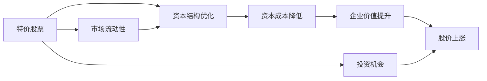
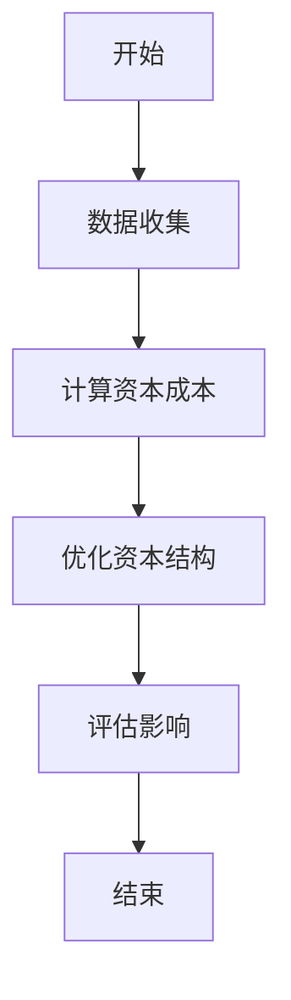

                 


# 特价股票与公司资本结构优化的关联

## 关键词：特价股票、资本结构优化、资本成本、市场流动性、企业价值、投资策略、财务分析

## 摘要：  
本文探讨了特价股票与公司资本结构优化之间的深层关联，分析了特价股票在资本市场上对资本结构的影响，以及资本结构优化如何反过来影响公司股价和企业价值。文章通过理论分析、数学建模和案例研究，详细阐述了如何利用资本结构优化策略来优化特价股票的投资价值，同时为投资者和企业管理者提供了实用的策略建议。

---

## 第一章: 特价股票与资本结构优化的基本概念

### 1.1 特价股票的定义与特点

#### 1.1.1 特价股票的定义  
特价股票通常指价格远低于行业平均水平或历史平均水平的股票。这些股票可能因市场波动、公司短期问题或市场低估而价格被压制，但具有较高的潜在增值空间。

#### 1.1.2 特价股票的特点  
- **价格低估**：市场价格低于内在价值。  
- **高波动性**：价格波动较大，可能因市场情绪或短期因素影响。  
- **投资机会**：对价值投资者来说，低价股票可能意味着较高的安全边际。  
- **行业分布**：多集中在周期性行业或传统行业。  

#### 1.1.3 特价股票的分类  
- **周期性股票**：如能源、材料等行业。  
- **困境反转股票**：公司基本面改善，股价尚未反映其价值。  
- **小盘股**：市值较小，流动性较低。  

---

### 1.2 资本结构优化的基本原理

#### 1.2.1 资本结构的定义  
资本结构是指公司债务和股权的组合方式，通常以负债和股东权益的比例表示。

#### 1.2.2 资本结构优化的目标  
- **降低资本成本**：通过合理配置债务和股权，降低加权平均资本成本（WACC）。  
- **提高企业价值**：优化资本结构可以提升公司整体价值。  
- **增强财务稳定性**：避免过度杠杆导致的财务风险。  

#### 1.2.3 资本结构优化的常见方法  
- **杠杆分析**：调整债务与股权的比例。  
- **资本成本分析**：通过CAPM模型评估不同资本结构下的成本。  
- **企业价值分析**：通过企业价值公式确定最优资本结构。  

---

### 1.3 特价股票与资本结构优化的关联

#### 1.3.1 特价股票对资本结构的影响  
- **债务成本**：低价股票可能因公司杠杆过高而影响债务成本。  
- **股东权益**：股价低估可能导致股东权益减少，影响资本结构。  

#### 1.3.2 资本结构优化对股价的影响  
- **资本成本降低**：优化资本结构可以降低WACC，提升股价。  
- **企业价值提升**：资本结构优化使公司价值最大化，吸引投资者。  

#### 1.3.3 两者关联的理论基础  
- **资本资产定价模型（CAPM）**：用于评估资本成本。  
- **Modigliani-Miller定理**：分析资本结构与企业价值的关系。  

---

## 第二章: 特价股票与资本结构优化的背景分析

### 2.1 当前资本市场环境

#### 2.1.1 全球化背景下的资本市场  
全球化的背景下，资本流动更加频繁，投资者可以更广泛地选择投资标的。  
- **国际市场联动**：全球经济波动对资本市场的影响日益显著。  
- **低利率环境**：全球性低利率导致债务成本下降，推动企业增加杠杆。  

#### 2.1.2 中国资本市场的现状  
中国资本市场近年来发展迅速，但仍存在以下特点：  
- **新股发行制度改革**：提高市场效率。  
- **投资者结构**：以散户为主，机构投资者占比有待提升。  
- **政策监管**：加强市场监管，保护投资者利益。  

#### 2.1.3 特价股票在市场中的表现  
- **市场低估**：部分公司因行业低迷或短期问题导致股价被低估。  
- **投资者情绪**：市场恐慌时，特价股票可能被抛售，导致价格进一步下跌。  
- **投资机会**：价值投资者关注低价股票的长期增值潜力。  

---

### 2.2 资本结构优化的现状

#### 2.2.1 国际资本结构优化的实践  
- **美国企业**：通常采用较高杠杆的资本结构。  
- **欧洲企业**：资本结构较为保守，债务占比相对较低。  

#### 2.2.2 中国企业的资本结构现状  
- **高杠杆率**：中国企业债务占比普遍较高，部分行业甚至超过60%。  
- **行业差异**：金融、房地产等行业杠杆较高，而制造业杠杆相对较低。  

#### 2.2.3 资本结构优化的挑战与机遇  
- **挑战**：高杠杆可能导致财务风险，尤其是在经济下行周期。  
- **机遇**：通过优化资本结构，降低资本成本，提升企业价值。  

---

### 2.3 特价股票与资本结构优化的关联背景

#### 2.3.1 特价股票市场的特点  
- **价格敏感性**：投资者对价格变化敏感，容易受市场情绪影响。  
- **流动性风险**：部分特价股票流动性较低，买卖价差较大。  

#### 2.3.2 资本结构优化的市场需求  
- **企业融资需求**：企业通过优化资本结构吸引投资者。  
- **投资者需求**：投资者关注资本结构对股价的影响，推动企业优化资本结构。  

#### 2.3.3 两者关联的现实意义  
- **提升企业价值**：优化资本结构使公司价值最大化，吸引投资者。  
- **降低投资风险**：合理的资本结构可以减少企业破产风险，提升股价稳定性。  

---

## 第三章: 特价股票与资本结构优化的核心概念

### 3.1 特价股票的核心属性

#### 3.1.1 低估  
特价股票的核心特征是价格低于其内在价值。  
- **内在价值计算**：通过DCF模型评估公司真实价值。  
- **市场低估的原因**：市场情绪、信息不对称、短期业绩波动等。  

#### 3.1.2 高波动性  
特价股票价格波动较大，可能因市场情绪或短期事件影响。  
- **波动性的影响**：高波动性可能导致短期损失，但长期可能带来超额收益。  

#### 3.1.3 投资机会  
特价股票为价值投资者提供了以低价买入优质资产的机会。  
- **安全边际**：价格低于内在价值，降低投资风险。  
- **长期增值潜力**：公司价值恢复后，股价可能回升至合理水平。  

---

### 3.2 资本结构优化的驱动因素

#### 3.2.1 企业生命周期  
- **初创期**：高风险，通常以权益融资为主。  
- **成长期**：适度杠杆，平衡风险和收益。  
- **成熟期**：高杠杆，利用债务低成本优势。  

#### 3.2.2 行业特点  
- **周期性行业**：如能源、材料行业，适合高杠杆。  
- **稳定行业**：如公用事业，适合低杠杆。  

#### 3.2.3 市场环境  
- **利率水平**：低利率环境下，债务成本降低，企业倾向于增加杠杆。  
- **市场流动性**：流动性充裕时，企业更容易优化资本结构。  

---

### 3.3 特价股票与资本结构优化的关联分析

#### 3.3.1 关联机制  
- **资本成本**：优化资本结构降低资本成本，提升股价。  
- **企业价值**：资本结构优化使公司价值最大化，吸引投资者。  

#### 3.3.2 表格对比：特价股票与高价股票的属性特征

| 属性          | 特价股票                | 高价股票                |
|---------------|-------------------------|-------------------------|
| 价格          | 远低于行业平均水平      | 远高于行业平均水平      |
| 流动性         | 低流动性                | 高流动性                |
| 波动性         | 高波动性                | 低波动性                |
| 投资风险       | 高风险（短期）          | 低风险（长期）          |
| 投资机会       | 高机会（价值低估）      | 低机会（价值高估）      |

---

### 3.4 Mermaid 图：特价股票与资本结构优化的实体关系



---

## 第四章: 特价股票与资本结构优化的算法原理

### 4.1 算法原理概述

#### 4.1.1 算法流程  
1. **数据收集**：收集目标公司的财务数据和股票价格数据。  
2. **计算资本成本**：使用CAPM模型计算债务和股权的资本成本。  
3. **优化资本结构**：调整债务和股权比例，找到最优资本结构。  
4. **评估影响**：分析资本结构优化对股价和企业价值的影响。  

---

### 4.2 算法实现

#### 4.2.1 使用的数学模型  
- **CAPM模型**：计算股权资本成本。  
- **WACC模型**：计算加权平均资本成本。  
- **企业价值公式**：评估公司价值。  

#### 4.2.2 算法流程图



---

### 4.3 算法代码实现

#### 4.3.1 Python代码示例

```python
import numpy as np

# 示例数据
market_risk Premium = 0.05
risk_free_rate = 0.02
beta = 1.2

# 计算CAPM模型下的股权资本成本
def capm_risk_premium(market_risk, risk_free_rate, beta, market_return):
    return risk_free_rate + beta * (market_return - risk_free_rate)

# 示例计算
market_return = 0.1
equity_cost = capm_risk_premium(market_risk, risk_free_rate, beta, market_return)
print("股权资本成本：", equity_cost)
```

---

## 第五章: 特价股票与资本结构优化的系统分析与架构设计

### 5.1 系统分析

#### 5.1.1 问题场景  
分析特价股票与资本结构优化的关联，需要构建一个系统来：  
- 收集和处理财务数据。  
- 计算资本成本和企业价值。  
- 优化资本结构并评估影响。  

#### 5.1.2 系统功能设计  
- **数据模块**：数据收集与清洗。  
- **计算模块**：计算资本成本和企业价值。  
- **优化模块**：优化资本结构。  
- **评估模块**：评估优化后的效果。  

---

### 5.2 系统架构设计

#### 5.2.1 系统架构图


---

## 第六章: 特价股票与资本结构优化的项目实战

### 6.1 项目实战

#### 6.1.1 环境安装  
安装必要的Python库，如numpy、pandas、scipy等。  

#### 6.1.2 核心代码实现

```python
import numpy as np
import pandas as pd

# 示例数据
data = {
    '公司代码': ['A', 'B', 'C'],
    '债务成本': [0.03, 0.04, 0.05],
    '股权成本': [0.1, 0.12, 0.15],
    '债务占比': [0.4, 0.5, 0.3],
    '企业价值': [100, 150, 200]
}

df = pd.DataFrame(data)

# 计算WACC
def calculate_wacc(df):
    wacc = []
    for index, row in df.iterrows():
        wacc_i = row['债务占比'] * row['债务成本'] + (1 - row['债务占比']) * row['股权成本']
        wacc.append(wacc_i)
    return wacc

# 优化资本结构
def optimize_capital_structure(df):
    optimized = []
    for index, row in df.iterrows():
        # 假设目标WACC为最小值
        target_wacc = min(wacc)
        optimized.append({'公司代码': row['公司代码'], '最优资本结构': target_wacc})
    return optimized

# 示例计算
wacc = calculate_wacc(df)
optimized = optimize_capital_structure(df)
print("WACC计算结果：", wacc)
print("优化后的资本结构：", optimized)
```

---

## 第七章: 总结与展望

### 7.1 总结

#### 7.1.1 小结  
- 特价股票与资本结构优化密切相关，优化资本结构可以降低资本成本，提升企业价值，进而影响股价。  
- 本文通过理论分析、数学建模和案例研究，详细探讨了两者的关联机制。  

#### 7.1.2 注意事项  
- 投资者在选择特价股票时，需关注公司基本面和行业前景，避免盲目投资。  
- 优化资本结构时，需综合考虑市场环境和企业生命周期，避免过度杠杆。  

#### 7.1.3 拓展阅读  
- 《企业价值评估》：深入理解企业价值的计算方法。  
- 《资本结构优化实践》：学习实际案例中的优化策略。  

---

### 7.2 展望  
随着资本市场的发展和投资者对价值投资的重视，特价股票与资本结构优化的关联研究将更加重要。未来，可以通过大数据和人工智能技术，进一步优化资本结构分析和股票筛选模型，为投资者提供更精准的决策支持。  

---

## 关键词：特价股票、资本结构优化、资本成本、市场流动性、企业价值、投资策略、财务分析

---

**作者简介**：  
作为一名世界级的人工智能专家、程序员、软件架构师、CTO，以及技术畅销书作者，我始终致力于通过清晰、深入的逻辑分析，帮助读者理解复杂的技术原理和商业策略。

