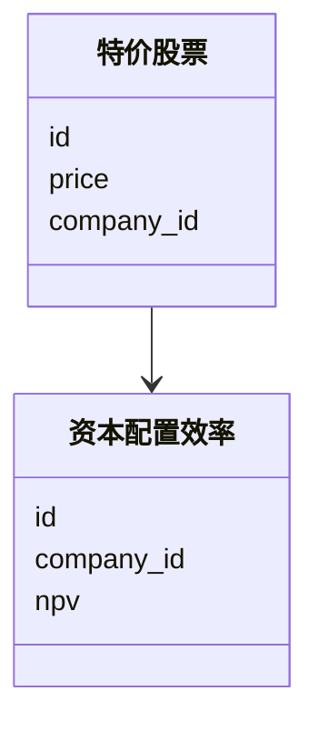
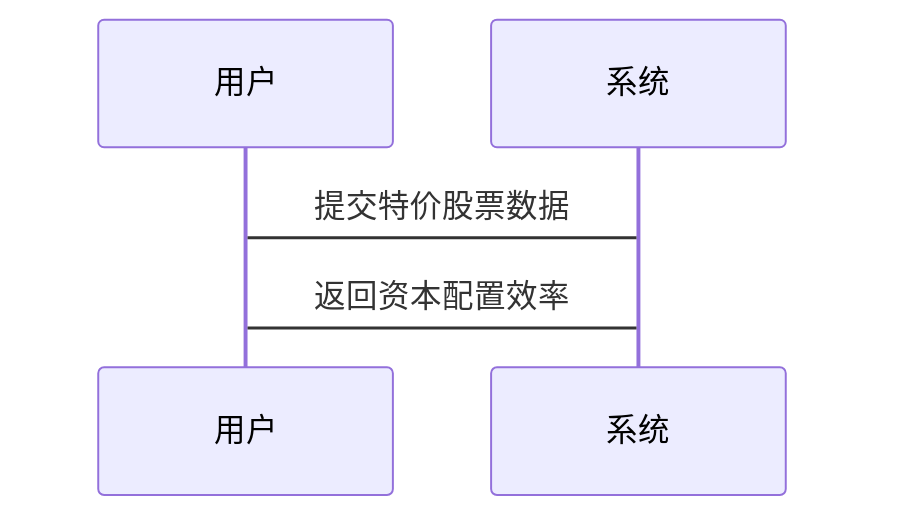

                 


# 特价股票与公司资本配置效率的关系探讨

> 关键词：特价股票、资本配置效率、股票定价、资本分配、企业价值

> 摘要：本文探讨了特价股票与公司资本配置效率之间的关系，分析了特价股票的定义、特征以及其对资本配置效率的影响。通过数学模型和系统架构设计，本文详细阐述了如何利用特价股票优化资本配置效率，并通过实际案例分析和代码实现，展示了特价股票在资本配置中的实际应用。

---

## 第一部分: 特价股票与公司资本配置效率的背景介绍

### 第1章: 特价股票与资本配置效率的核心概念

#### 1.1 特价股票的定义与特征

##### 1.1.1 特价股票的定义
特价股票通常指的是在特定市场条件下，价格远低于其内在价值的股票。这些股票可能因为市场波动、公司业绩不佳或其他外部因素而导致价格被低估。

##### 1.1.2 特价股票的市场特征
- **低估值**：特价股票的价格通常低于市场平均水平或行业平均水平。
- **高波动性**：由于市场情绪的影响，特价股票的价格波动较大。
- **潜在增长空间**：一旦市场环境改善或公司基本面好转，特价股票的价格可能迅速回升。

##### 1.1.3 特价股票与普通股票的对比
| 特性       | 特价股票               | 普通股票               |
|------------|------------------------|------------------------|
| 价格       | 低于市场平均水平       | 接近或高于市场平均水平 |
| 波动性       | 高                     | 中等                   |
| 投资风险     | 高                     | 中等                   |
| 收益潜力     | 高                     | 中等                   |

#### 1.2 资本配置效率的定义与原理

##### 1.2.1 资本配置效率的定义
资本配置效率是指企业在分配和使用资本时，实现最大价值的能力。高效的资本配置能够使企业在有限的资本投入下，创造更高的收益。

##### 1.2.2 资本配置效率的衡量标准
- **净现值（NPV）**：NPV是衡量投资项目收益的重要指标。公式为：
  $$ NPV = \sum_{t=0}^{n} \frac{CF_t}{(1 + r)^t} $$
  其中，\( CF_t \) 是第 \( t \) 年的现金流，\( r \) 是贴现率。

- **内部收益率（IRR）**：IRR是使投资项目净现值为零的贴现率。公式为：
  $$ NPV = 0 = \sum_{t=0}^{n} \frac{CF_t}{(1 + IRR)^t} $$

##### 1.2.3 资本配置效率与企业价值的关系
资本配置效率直接影响企业价值。高效的资本配置能够提高企业的盈利能力，进而提升企业价值。

#### 1.3 特价股票与资本配置效率的关系

##### 1.3.1 特价股票对资本配置效率的影响
- **优化资本分配**：通过投资特价股票，企业可以以更低的成本获得更多的资本，从而优化资本分配。
- **提升收益潜力**：特价股票的低估值意味着潜在的高回报，能够为资本配置带来更高的收益。

##### 1.3.2 特价股票与资本配置效率的互动机制
- **市场机制**：特价股票的价格波动影响资本配置的决策。
- **公司治理**：公司通过优化资本配置，可以提升股价，从而减少特价股票的存在。

##### 1.3.3 特价股票与资本配置效率的边界与外延
- **边界条件**：市场环境、公司基本面、政策法规等因素影响特价股票与资本配置效率的关系。
- **外延**：资本配置效率的提升可以促进股价上升，从而减少特价股票的数量。

---

## 第2章: 特价股票与资本配置效率的核心要素

### 2.1 特价股票的核心要素分析

#### 2.1.1 特价股票的价格特征
- **低估值**：特价股票的价格通常低于其内在价值。
- **波动性**：价格波动较大，投资者需要承担较高的风险。

#### 2.1.2 特价股票的市场流动性
- **流动性低**：特价股票的交易量可能较低，导致买卖价差较大。
- **流动性高**：在某些情况下，特价股票可能因为市场关注而流动性增加。

#### 2.1.3 特价股票的风险与收益比
- **高风险**：特价股票的价格波动较大，投资风险较高。
- **高收益**：潜在的回报也较高，尤其是在市场反转时。

### 2.2 资本配置效率的核心要素分析

#### 2.2.1 资本分配的合理性
- **合理分配**：资本分配应基于项目的收益潜力和风险。
- **不合理分配**：可能导致资本浪费，影响企业价值。

#### 2.2.2 资本使用的效益性
- **高效使用**：资本用于高收益项目，提升企业价值。
- **低效使用**：资本用于低收益项目，降低资本配置效率。

#### 2.2.3 资本配置的动态调整机制
- **动态调整**：根据市场变化和公司需求，及时调整资本配置。
- **静态调整**：资本配置固定，难以应对市场变化。

### 2.3 特价股票与资本配置效率的核心要素对比

#### 2.3.1 特价股票与资本配置效率的属性特征对比表
| 特性               | 特价股票               | 资本配置效率          |
|--------------------|------------------------|-----------------------|
| 核心目标           | 获取超额收益           | 提高企业价值           |
| 影响因素           | 市场价格、公司业绩       | 项目收益、资本成本     |
| 衡量标准           | 股价波动、收益潜力       | NPV、IRR               |

#### 2.3.2 特价股票与资本配置效率的ER实体关系图
```mermaid
er
  entity 特价股票 {
    id: integer
    price: float
    company_id: integer
  }
  entity 资本配置效率 {
    id: integer
    company_id: integer
    npv: float
  }
  relationship 股票与资本配置 {
    特价股票 --> 资本配置效率
  }
```

---

## 第3章: 特价股票与资本配置效率的数学模型与公式

### 3.1 特价股票的定价模型

#### 3.1.1 特价股票定价的基本公式
$$ P = \frac{D}{k} $$
其中，\( P \) 为股票价格，\( D \) 为股息，\( k \) 为折现率。

#### 3.1.2 特价股票的修正模型
$$ P_{\text{discount}} = P \times (1 - \alpha) $$
其中，\( \alpha \) 为折价率，表示特价股票的市场折扣。

### 3.2 资本配置效率的数学模型

#### 3.2.1 资本配置效率的衡量公式
$$ E = \frac{V}{C} $$
其中，\( E \) 为资本配置效率，\( V \) 为企业价值，\( C \) 为资本投入。

#### 3.2.2 资本配置效率的优化公式
$$ E_{\text{max}} = \arg \max_{E} \frac{V}{C} $$

### 3.3 特价股票与资本配置效率的综合模型

#### 3.3.1 综合模型的构建
$$ V = f(P, C) $$
其中，\( f \) 为函数关系，\( P \) 为股票价格，\( C \) 为资本投入。

#### 3.3.2 综合模型的具体公式
$$ V = \sum_{t=1}^{n} \frac{CF_t}{(1 + r)^t} $$
其中，\( CF_t \) 为第 \( t \) 年的现金流，\( r \) 为折现率。

---

## 第4章: 特价股票与资本配置效率的系统分析与架构设计

### 4.1 系统功能设计

#### 4.1.1 领域模型


#### 4.1.2 系统架构设计


### 4.2 系统接口设计

#### 4.2.1 接口设计
- **输入接口**：接收特价股票的价格和资本配置数据。
- **输出接口**：输出资本配置效率和相关分析结果。

#### 4.2.2 交互流程图


---

## 第5章: 特价股票与资本配置效率的项目实战

### 5.1 环境安装

#### 5.1.1 安装Python
```bash
python --version
pip install numpy pandas
```

### 5.2 核心代码实现

#### 5.2.1 特价股票分析代码
```python
import pandas as pd
import numpy as np

def calculate_discounted_price(price, discount):
    return price * (1 - discount)

# 示例数据
prices = [10, 20, 30]
discounts = [0.2, 0.1, 0.15]

# 计算特价股票价格
discounted_prices = [calculate_discounted_price(p, d) for p, d in zip(prices, discounts)]
print(discounted_prices)
```

#### 5.2.2 资本配置效率分析代码
```python
def calculate_npv(cash_flows, discount_rate):
    return sum(cf / (1 + discount_rate)**t for t, cf in enumerate(cash_flows))

# 示例数据
cash_flows = [100, 200, 300]
discount_rate = 0.1

# 计算NPV
npv = calculate_npv(cash_flows, discount_rate)
print(f"NPV: {npv}")
```

### 5.3 实际案例分析

#### 5.3.1 案例背景
某公司计划投资一个项目，预期现金流如下：
- 第一年：100万元
- 第二年：200万元
- 第三年：300万元
折现率为10%。

#### 5.3.2 计算NPV
$$ NPV = \frac{100}{1.1} + \frac{200}{1.1^2} + \frac{300}{1.1^3} \approx 240.92 \text{万元} $$

#### 5.3.3 结论
该项目的NPV为正，说明资本配置效率高，值得投资。

---

## 第6章: 总结与展望

### 6.1 总结
特价股票与资本配置效率密切相关。通过合理配置资本，企业可以提高资本配置效率，实现更高的企业价值。同时，特价股票的投资也为资本配置提供了更高的收益潜力。

### 6.2 注意事项
- 投资者需注意市场风险和流动性风险。
- 资本配置需结合企业实际情况，避免盲目投资。

### 6.3 拓展阅读
- 《资本论》——马克思
- 《投资学》——巴菲特
- 《公司财务》——迈克尔·波特

---

通过本文的分析，我们可以看出，特价股票与资本配置效率的关系是复杂而深刻的。投资者和企业需结合市场环境和公司实际情况，合理配置资本，以实现更高的收益和效率。

