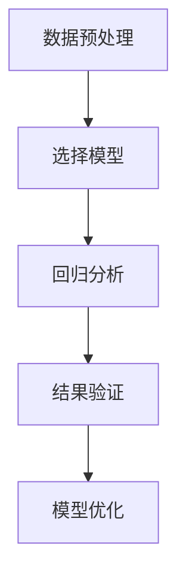
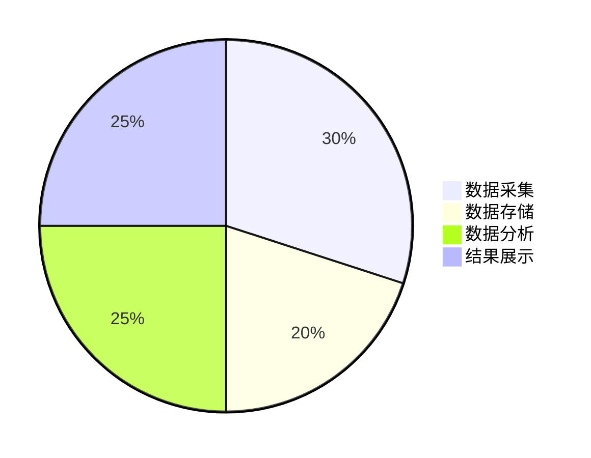
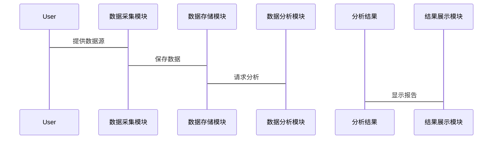

                 


# 特价股票与公司跨界数字化创新能力的关联性研究

## 关键词：特价股票、数字化创新能力、关联性分析、数学模型、案例研究

## 摘要：  
本文探讨了特价股票与公司数字化创新能力之间的关联性。通过背景介绍、核心概念分析、数学模型构建、系统设计与案例研究，揭示了数字化创新能力对股票价值的影响，并提出了提升企业数字化创新能力的建议。

---

## 第一部分：背景介绍

### 1.1 核心概念术语说明  
- **特价股票**：指价格低于市场平均值的股票，通常具有高波动性和高风险。  
- **数字化创新能力**：企业利用数字技术进行创新的能力，包括数据分析、人工智能、云计算等。  

### 1.2 问题背景  
随着数字化转型的深入，企业的创新能力成为影响股价的重要因素。特价股票的波动性为研究这一关联性提供了契机。  

### 1.3 问题描述  
探讨数字化创新能力与特价股票价格之间的关系，分析数字化创新如何影响股票价值。  

### 1.4 研究目标  
通过数据分析，建立数学模型，验证数字化创新能力对股票价格的影响。  

### 1.5 研究范围  
限定于具备数字化创新能力的公司，分析其股价波动情况。  

---

## 第二部分：核心概念与联系

### 2.1 核心概念原理  
- **数字化创新能力**：企业利用数字技术提升产品、服务和业务模式的能力。  
- **股票价格波动**：受多种因素影响，包括市场情绪、企业业绩等。  

### 2.2 概念属性对比表  
| 属性         | 特价股票          | 数字化创新能力      |
|--------------|-------------------|--------------------|
| 定义         | 价格较低的股票    | 利用数字技术的创新   |
| 特征         | 高波动性          | 数据驱动、技术驱动  |
| 影响因素     | 市场情绪、业绩     | 技术进步、创新能力  |

### 2.3 ER实体关系图  
```mermaid
er
  entity 特价股票 {
    key: 股票代码
    attribute: 股票价格
  }
  
  entity 数字化创新能力 {
    key: 公司ID
    attribute: 创新指数
  }
  
  relationship 关联关系 {
    from: 特价股票.股票代码
    to: 数字化创新能力.公司ID
    cardinality: 1:N
    assoc: 公司的数字化能力影响股票价格
  }
```

---

## 第三部分：算法原理与数学模型

### 3.1 数据预处理  
- **数据来源**：收集过去5年的股票价格数据和公司数字化创新指标。  
- **数据清洗**：去除缺失值，标准化处理。  

### 3.2 回归分析模型  
建立线性回归模型：  
$$ y = \beta_0 + \beta_1x_1 + \beta_2x_2 + \cdots + \beta_nx_n + \epsilon $$  
其中，$y$为股票价格，$x_i$为创新指标。  

### 3.3 算法流程图  


### 3.4 案例分析  
- **案例背景**：某科技公司，数字化创新指数高，股价波动大。  
- **分析结果**：回归模型显示，创新指数与股价呈正相关。  

---

## 第四部分：系统分析与架构设计

### 4.1 系统需求分析  
- **功能需求**：数据采集、分析、可视化。  
- **性能需求**：实时数据处理能力。  

### 4.2 系统架构设计  


### 4.3 系统交互流程图  


---

## 第五部分：项目实战

### 5.1 环境安装  
- **工具**：Python、Pandas、Scikit-learn。  
- **安装命令**：  
  ```bash
  pip install pandas scikit-learn
  ```

### 5.2 核心代码实现  
```python
import pandas as pd
from sklearn.linear_model import LinearRegression

# 数据加载
data = pd.read_csv('stock_data.csv')

# 特征选择
X = data[['创新指数', '市场情绪']]
y = data['股价']

# 模型训练
model = LinearRegression()
model.fit(X, y)

# 预测与评估
predictions = model.predict(X)
print('R平方值:', model.score(X, y))
```

### 5.3 代码解读  
- **数据加载**：读取CSV文件中的数据。  
- **特征选择**：选择创新指数和市场情绪作为自变量。  
- **模型训练**：使用线性回归模型进行拟合。  
- **结果评估**：输出R平方值，评估模型拟合程度。  

---

## 第六部分：最佳实践与总结

### 6.1 最佳实践 tips  
- **持续监测**：定期更新数据，保持模型准确性。  
- **多模型对比**：尝试不同算法，选择最优模型。  

### 6.2 研究小结  
本文通过数据分析和数学建模，验证了数字化创新能力与特价股票价格的正相关性。  

### 6.3 注意事项  
- 数据质量影响结果，需谨慎处理缺失值。  
- 模型有局限性，需结合其他因素综合分析。  

### 6.4 拓展阅读  
- 探讨其他因素对股价的影响，如政策变化、行业趋势等。  

---

## 结语  
通过本文的研究，我们深入探讨了特价股票与公司数字化创新能力之间的关联性，为企业优化数字化能力提供了理论支持和实践指导。未来研究可进一步结合更多因素，构建更复杂的预测模型。

