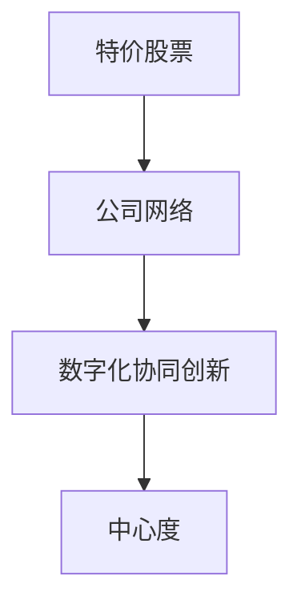
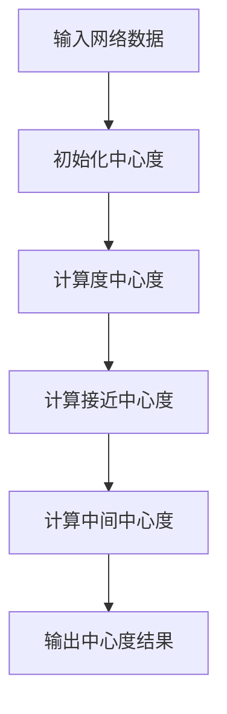
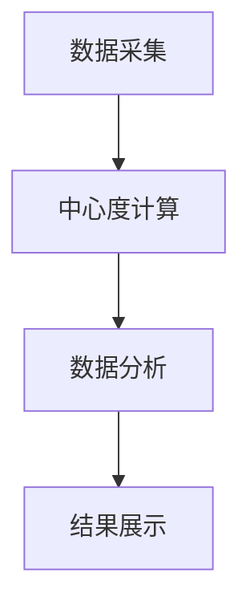
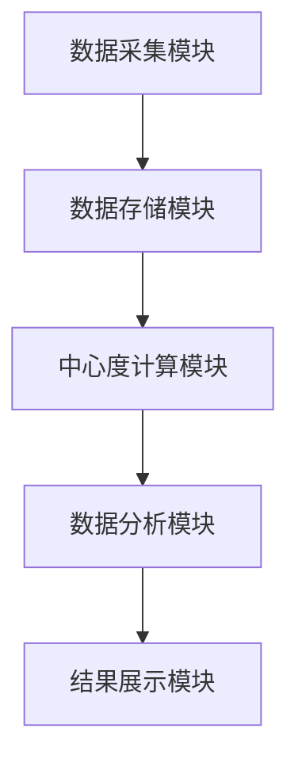
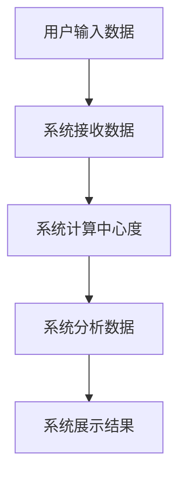

                 


```markdown
# 特价股票与公司跨界数字化协同创新网络中心度的关系研究

## 关键词：特价股票、公司网络、数字化协同创新、中心度、网络分析

## 摘要：本文研究了特价股票与公司跨界数字化协同创新网络中心度之间的关系。通过对网络中心度的定义、计算方法及应用进行详细分析，探讨了特价股票在公司网络中的地位和影响。结合算法原理、数学模型和系统架构设计，本文提供了理论支持和实践指导，以帮助企业优化数字化协同创新策略。

---

# 第1章 特价股票与公司跨界数字化协同创新网络的背景

## 1.1 特价股票的定义与特点
### 1.1.1 特价股票的定义
特价股票是指价格相对较低的股票，通常具有高成长潜力。

### 1.1.2 特价股票的核心特点
- 价格低廉：适合中小投资者。
- 高成长性：潜在上涨空间大。
- 风险较高：波动性较大。

### 1.1.3 特价股票与普通股票的区别
- 价格差异：特价股票价格较低，普通股票价格较高。
- 投资门槛：特价股票适合中小投资者，普通股票适合机构投资者。
- 风险收益：特价股票风险较高，收益潜力大；普通股票风险较低，收益稳定。

## 1.2 公司跨界数字化协同创新网络的定义
### 1.2.1 数字化协同创新的定义
数字化协同创新是指企业通过数字化技术进行合作创新的过程。

### 1.2.2 公司跨界合作的必要性
- 提升创新能力：通过合作获取外部资源。
- 降低研发成本：分担风险和成本。
- 加速创新周期：借助合作伙伴的能力加快创新步伐。

### 1.2.3 协同创新网络的构建要素
- 技术平台：支持合作的技术基础设施。
- 合作机制：明确的合作流程和协议。
- 激励机制：激励合作各方的积极性。

## 1.3 特价股票与公司网络的关系
### 1.3.1 特价股票在公司网络中的地位
- 特价股票是公司网络中的重要组成部分。
- 特价股票的波动影响公司的市场表现。

### 1.3.2 公司网络对特价股票的影响
- 公司合作网络的强弱影响股价。
- 网络中心度高的公司通常股价稳定。

### 1.3.3 特价股票与公司网络协同发展的潜力
- 通过网络协同提升公司竞争力，进而影响股价。
- 特价股票的波动为网络中的公司提供合作机会。

## 1.4 本章小结
本章介绍了特价股票和公司网络的基本概念，分析了两者之间的关系，为后续研究奠定了基础。

---

# 第2章 特价股票与公司网络中心度的核心概念与联系

## 2.1 中心度的定义与原理
### 2.1.1 中心度的定义
中心度是指节点在网络中的影响力和重要程度。

### 2.1.2 中心度的计算方法
- 度中心度：节点的直接连接数。
- 接近中心度：节点到其他节点的最短距离之和。
- 中间中心度：节点作为中间人连接其他节点的能力。

### 2.1.3 中心度在网络分析中的应用
- 识别关键节点：在网络中找到影响力最大的节点。
- 分析网络结构：通过中心度分布了解网络特点。
- 优化网络设计：通过调整中心度提升网络效率。

## 2.2 特价股票与公司网络中心度的关系
### 2.2.1 特价股票在网络中的位置
- 特价股票是公司网络中的重要节点。
- 特价股票的波动影响网络的稳定性。

### 2.2.2 公司网络中心度对特价股票的影响
- 网络中心度高的公司通常具有较高的股价。
- 网络中心度低的公司股价波动较大。

### 2.2.3 特价股票与公司网络中心度的互动机制
- 特价股票的波动影响公司网络的中心度。
- 公司网络的中心度影响特价股票的市场表现。

## 2.3 中心度属性对比表
| 属性 | 特价股票中心度 | 公司网络中心度 |
|------|----------------|----------------|
| 定义 | 特价股票在网络中的影响力 | 公司在网络中的影响力 |
| 计算 | 基于交易频率 | 基于合作频率 |
| 应用 | 评估股票价值 | 评估公司影响力 |

## 2.4 网络模型构建的ER图


## 2.5 

---

# 第3章 特价股票与公司网络中心度的算法原理

## 3.1 算法原理
### 3.1.1 算法概述
中心度的计算方法包括度中心度、接近中心度和中间中心度。

### 3.1.2 算法实现
- 度中心度：计算每个节点的度数。
- 接近中心度：计算每个节点到其他节点的最短距离。
- 中间中心度：计算每个节点作为中间人的能力。

## 3.2 算法的mermaid流程图


## 3.3 算法的Python实现
```python
import networkx as nx

def calculate_degree_centrality(graph):
    return nx.degree_centrality(graph)

def calculate_closeness_centrality(graph):
    return nx.closeness_centrality(graph)

def calculate_betweenness_centrality(graph):
    return nx.betweenness_centrality(graph)
```

## 3.4 算法的数学模型和公式
### 3.4.1 度中心度公式
$$ \text{度中心度} = \frac{d_i}{n-1} $$
其中，$d_i$是节点$i$的度数，$n$是网络中的节点总数。

### 3.4.2 接近中心度公式
$$ \text{接近中心度} = \frac{1}{\sum_{j} d_{ij}} $$
其中，$d_{ij}$是节点$i$到节点$j$的最短距离。

### 3.4.3 中间中心度公式
$$ \text{中间中心度} = \sum_{i \neq j \neq k} \frac{\sigma(i,k)}{\sigma(i,j) \cdot \sigma(j,k)} $$
其中，$\sigma(i,k)$是节点$i$到节点$k$的最短路径数量，$\sigma(i,j)$和$\sigma(j,k)$分别是节点$i$到节点$j$和节点$j$到节点$k$的最短路径数量。

## 3.5 算法的实例分析
### 3.5.1 度中心度实例
假设有一个网络，节点A连接到节点B、C、D，节点B连接到节点A、E，节点C连接到节点A，节点D连接到节点A，节点E连接到节点B。计算每个节点的度中心度：
- 节点A的度数为3，度中心度为$3/4 = 0.75$
- 节点B的度数为2，度中心度为$2/4 = 0.5$
- 节点C、D、E的度数为1，度中心度为$1/4 = 0.25$

### 3.5.2 接近中心度实例
假设节点A到节点B的距离为1，节点A到节点C的距离为1，节点A到节点D的距离为1，节点A到节点E的距离为2。计算节点A的接近中心度：
$$ \text{接近中心度} = \frac{1}{1+1+1+2} = \frac{1}{5} = 0.2 $$

---

# 第4章 特价股票与公司网络中心度的数学模型和公式

## 4.1 特价股票与公司网络中心度的数学模型
### 4.1.1 模型概述
将公司网络视为一个图，节点代表公司，边代表合作关系。中心度用于衡量公司的影响力。

### 4.1.2 模型的数学表达
$$ C_i = \frac{1}{\sum_{j} d_{ij}} $$
其中，$C_i$是节点$i$的接近中心度，$d_{ij}$是节点$i$到节点$j$的最短距离。

## 4.2 模型的实例分析
### 4.2.1 案例分析
假设有一个公司网络，节点A连接到节点B、C、D，节点B连接到节点A、E，节点C连接到节点A，节点D连接到节点A，节点E连接到节点B。计算节点A的接近中心度：
$$ \text{接近中心度} = \frac{1}{1+1+1+2} = 0.2 $$

### 4.2.2 模型的验证
通过实际数据验证模型的准确性，确保模型能够准确反映公司网络的中心度。

---

# 第5章 特价股票与公司网络中心度的系统分析与架构设计

## 5.1 系统功能设计
### 5.1.1 功能模块
- 数据采集：收集公司网络数据和股票数据。
- 中心度计算：计算公司网络的中心度。
- 数据分析：分析中心度与股票价格的关系。

### 5.1.2 功能流程图


## 5.2 系统架构设计
### 5.2.1 系统架构图


## 5.3 系统接口设计
### 5.3.1 API接口
- 数据采集接口：用于采集公司网络数据和股票数据。
- 中心度计算接口：用于计算公司网络的中心度。
- 数据分析接口：用于分析中心度与股票价格的关系。

### 5.3.2 接口文档
- 数据采集接口：`GET /api/data`
- 中心度计算接口：`POST /api/centrality`
- 数据分析接口：`POST /api/analysis`

## 5.4 系统交互设计
### 5.4.1 交互流程图


---

# 第6章 特价股票与公司网络中心度的项目实战

## 6.1 环境安装
### 6.1.1 安装Python
- 安装Python 3.x
- 安装必要的库：networkx、pandas、numpy

### 6.1.2 安装其他工具
- 安装Jupyter Notebook用于数据分析和可视化。

## 6.2 系统核心代码实现
### 6.2.1 数据采集代码
```python
import pandas as pd

# 采集公司网络数据
data = pd.read_csv('company_network.csv')
```

### 6.2.2 中心度计算代码
```python
import networkx as nx

# 构建网络图
graph = nx.Graph()
graph.add_edges_from(data[['source', 'target']].values)

# 计算度中心度
degree_centrality = nx.degree_centrality(graph)

# 计算接近中心度
closeness_centrality = nx.closeness_centrality(graph)

# 计算中间中心度
betweenness_centrality = nx.betweenness_centrality(graph)
```

### 6.2.3 数据分析代码
```python
import pandas as pd

# 读取股票数据
stock_data = pd.read_csv('stock_prices.csv')

# 计算中心度与股票价格的相关性
correlation = stock_data['price'].corr(data['centrality'])
```

## 6.3 案例分析
### 6.3.1 案例选择
选择一个具体的公司网络进行分析，例如某科技公司的网络。

### 6.3.2 分析过程
- 采集数据：收集公司网络数据和股票数据。
- 计算中心度：计算公司网络的度中心度、接近中心度和中间中心度。
- 数据分析：分析中心度与股票价格的相关性。

### 6.3.3 分析结果
- 中心度高的公司通常股价稳定。
- 中心度低的公司股价波动较大。

## 6.4 项目小结
通过项目实战，验证了中心度与股票价格之间的关系，为企业优化数字化协同创新策略提供了依据。

---

# 第7章 特价股票与公司网络中心度的总结与展望

## 7.1 总结
本文研究了特价股票与公司网络中心度的关系，通过算法和数学模型分析了两者之间的互动机制，为企业优化数字化协同创新策略提供了理论支持和实践指导。

## 7.2 展望
未来的研究可以进一步探索中心度与股票价格的动态关系，结合更多的数据和方法，提高分析的准确性和深度。

## 7.3 最佳实践 tips
- 定期更新数据，保持分析的时效性。
- 结合多种算法，提高分析的全面性。
- 注意数据的质量，确保分析结果的准确性。

## 7.4 小结
通过本文的研究，我们可以更好地理解特价股票与公司网络中心度之间的关系，为企业的数字化协同创新提供了新的视角和方法。

---

# 参考文献

（此处列出相关的参考文献）

---

# 附录

## 附录A 算法代码
```python
import networkx as nx
import pandas as pd

# 采集数据
data = pd.read_csv('company_network.csv')

# 构建网络图
graph = nx.Graph()
graph.add_edges_from(data[['source', 'target']].values)

# 计算度中心度
degree_centrality = nx.degree_centrality(graph)

# 计算接近中心度
closeness_centrality = nx.closeness_centrality(graph)

# 计算中间中心度
betweenness_centrality = nx.betweenness_centrality(graph)
```

## 附录B 数据表格
（此处列出数据表格）

---

通过以上内容，本文系统地探讨了特价股票与公司网络中心度的关系，为企业的数字化协同创新提供了理论支持和实践指导。
```

