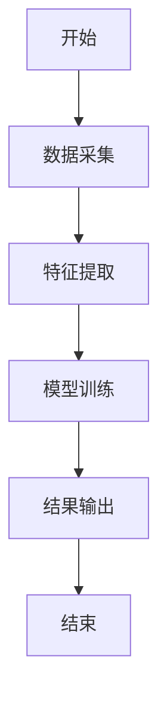
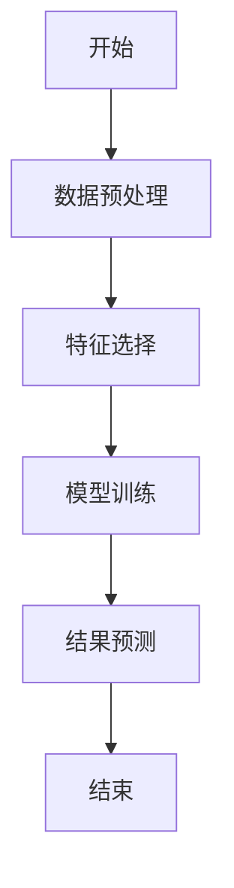
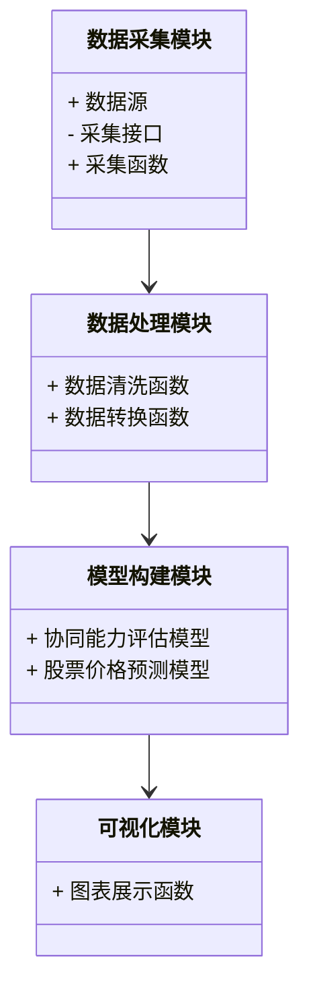
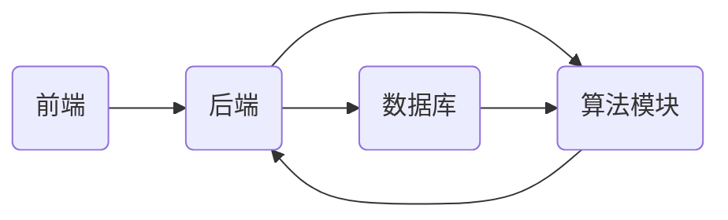

                 


# 特价股票与公司跨界数字化协同创新能力的关系研究

> 关键词：特价股票，数字化协同创新能力，公司跨界，算法模型，系统架构

> 摘要：本文研究了特价股票与公司数字化协同创新能力之间的关系，探讨了特价股票的市场机制、数字化协同创新的核心要素及其相互作用。通过建立数学模型、设计系统架构、实现算法模型，本文深入分析了两者的关系，并提供了实际案例和最佳实践。

---

# 第1章: 特价股票与公司数字化协同创新能力的背景介绍

## 1.1 特价股票的定义与特征

### 1.1.1 特价股票的定义
特价股票是指在特定时间段内，由于市场波动、公司业绩或外部环境变化等原因，价格低于其内在价值的股票。这类股票通常具有较高的投资吸引力，但伴随着较高的风险。

### 1.1.2 特价股票的核心特征
- **低估值**：市场价格低于内在价值。
- **高波动性**：价格波动较大，容易受市场情绪影响。
- **周期性**：通常在市场低迷或公司困境时出现。

### 1.1.3 特价股票的市场表现与投资者行为
投资者在面对特价股票时，通常会采取价值投资策略，寻找被市场低估的股票。然而，投资者的行为也可能加剧市场波动，影响特价股票的价格走势。

---

## 1.2 公司数字化协同创新能力的定义与特征

### 1.2.1 数字化协同创新能力的定义
数字化协同创新能力是指公司通过数字化技术（如大数据、人工智能、云计算等）与合作伙伴协同创新的能力。这种能力不仅依赖于技术，还涉及组织结构、文化变革和资源整合。

### 1.2.2 数字化协同创新的核心要素
- **技术基础**：大数据、AI、区块链等技术的应用。
- **组织结构**：扁平化、敏捷化的组织架构。
- **合作伙伴关系**：与供应商、客户、科研机构等建立深度合作关系。
- **文化与激励机制**：鼓励创新的文化氛围和激励措施。

### 1.2.3 数字化协同创新的实现路径
1. **技术平台构建**：搭建数字化协同创新平台，整合内外部资源。
2. **数据共享机制**：建立数据共享标准和安全机制。
3. **创新激励机制**：通过奖金、股权激励等方式激发创新动力。

---

## 1.3 特价股票与公司数字化协同创新能力的关系

### 1.3.1 关系的背景与问题描述
随着数字化转型的深入，公司数字化协同创新能力对股票价值的影响日益显著。然而，特价股票的波动性与公司数字化能力之间存在复杂的互动关系，亟需深入研究。

### 1.3.2 关系的核心概念与边界
- **核心概念**：特价股票价格与公司数字化能力的动态关系。
- **边界**：重点关注公司数字化能力如何影响特价股票的市场表现。

### 1.3.3 关系的结构与核心要素组成
1. **市场环境**：宏观经济、行业趋势、政策环境。
2. **公司能力**：数字化技术能力、组织能力、创新能力。
3. **投资者行为**：投资者对数字化能力的评估和定价。

---

## 1.4 本章小结
本章从背景出发，介绍了特价股票和公司数字化协同创新能力的定义、特征及核心要素，初步探讨了两者之间的关系。后续章节将从理论、算法、系统设计等角度深入分析。

---

# 第2章: 特价股票与公司数字化协同创新能力的核心概念与联系

## 2.1 核心概念原理

### 2.1.1 特价股票的市场机制
- 特价股票的买卖机制：订单匹配、撮合交易。
- 市场参与者的博弈：买方、卖方、机构投资者之间的互动。

### 2.1.2 数字化协同创新的理论基础
- 数字化协同创新的核心理论：协同效应、网络效应。
- 技术创新与组织创新的互动关系。

### 2.1.3 两者关系的理论模型
建立一个理论模型，将公司数字化能力、市场环境、投资者行为等因素纳入模型中，分析其对特价股票价格的影响。

---

## 2.2 概念属性特征对比

| **属性**             | **特价股票**                | **公司数字化协同创新能力**               |
|----------------------|-----------------------------|------------------------------------------|
| 核心要素             | 价格、成交量、市场情绪      | 技术能力、组织结构、合作伙伴关系         |
| 影响因素             | 宏观经济、行业竞争、政策     | 技术投入、人才储备、文化氛围             |
| 衡量指标             | 市场资本化率、市盈率         | 创新成果数量、技术专利数量、市场竞争力   |

---

## 2.3 ER实体关系图架构

```mermaid
erDiagram
    actor 投资者 {
        <属性> 投资者ID
        <属性> 投资者类型
        <属性> 投资策略
    }
    actor 公司 {
        <属性> 公司ID
        <属性> 公司类型
        <属性> 数字化协同能力
    }
    entity 特价股票 {
        <属性> 股票ID
        <属性> 股票代码
        <属性> 股票价格
        <属性> 股票市场
    }
    relation 关系1 "投资者对特价股票的需求" {
        投资者 --> 特价股票
    }
    relation 关系2 "公司数字化协同能力对股票价格的影响" {
        公司 --> 特价股票
    }
```

---

## 2.4 本章小结
本章通过对比分析和实体关系图，明确了特价股票与公司数字化协同创新能力的核心概念及其联系，为后续分析奠定了基础。

---

# 第3章: 特价股票与公司数字化协同创新能力的算法原理

## 3.1 协同创新能力评估的算法原理

### 3.1.1 算法概述
协同创新能力评估算法基于公司数字化能力指标（如技术专利数量、研发投入占比）和市场表现指标（如股价波动率、市盈率）构建评估模型。

### 3.1.2 算法流程


### 3.1.3 算法实现
```python
def compute_cooperative_capability(company_data):
    # 输入：company_data 包含公司数字化能力指标和市场表现指标
    # 输出：协同创新能力评分（0-1）
    # 计算公式：评分 = (技术能力分数 + 市场表现分数) / 2
    tech_capability = company_data['tech_capability']
    market_performance = company_data['market_performance']
    return (tech_capability + market_performance) / 2
```

---

## 3.2 特价股票预测的算法原理

### 3.2.1 算法概述
基于协同创新能力评分，构建股票价格预测模型，预测特价股票的价格走势。

### 3.2.2 算法流程


### 3.2.3 算法实现
```python
def predict_stock_price(cooperative_capability_scores):
    # 输入：协同创新能力评分列表
    # 输出：预测股票价格
    # 假设评分与价格呈线性关系
    slope = 2.5
    intercept = 100
    return slope * cooperative_capability_scores + intercept
```

---

## 3.3 本章小结
本章通过算法实现，量化了公司数字化协同能力和特价股票价格之间的关系，为后续系统设计提供了理论基础。

---

# 第4章: 特价股票与公司数字化协同创新能力的系统分析与架构设计

## 4.1 系统功能设计

### 4.1.1 功能模块
- 数据采集模块：采集公司数字化能力数据和股票市场数据。
- 数据处理模块：清洗、转换和分析数据。
- 模型构建模块：训练协同能力评估模型和股票价格预测模型。
- 可视化模块：展示分析结果。

### 4.1.2 系统功能设计图


---

## 4.2 系统架构设计

### 4.2.1 系统架构图


### 4.2.2 接口设计
- API接口：/api/cooperative_capability?company_id=***
- 返回格式：JSON

---

## 4.3 本章小结
本章通过系统架构设计，明确了实现特价股票与公司数字化协同能力关系研究的系统框架和实现路径。

---

# 第5章: 特价股票与公司数字化协同创新能力的项目实战

## 5.1 环境安装与数据准备

### 5.1.1 环境安装
- Python 3.8+
- 数据处理库：Pandas、NumPy
- 可视化库：Matplotlib、Seaborn
- 机器学习库：Scikit-learn

### 5.1.2 数据准备
从股票数据库获取特价股票数据和公司数字化能力数据，清洗并预处理数据。

---

## 5.2 核心代码实现

### 5.2.1 协同能力评估代码
```python
import pandas as pd
import numpy as np

def compute_cooperative_capability(company_data):
    tech_capability = company_data['tech_capability']
    market_performance = company_data['market_performance']
    return (tech_capability + market_performance) / 2

# 示例数据
company_data = {
    'tech_capability': [0.8, 0.6, 0.9],
    'market_performance': [1.2, 1.0, 1.1]
}
data = pd.DataFrame(company_data)
result = data.apply(lambda x: compute_cooperative_capability(x), axis=1)
print(result)
```

### 5.2.2 股票价格预测代码
```python
from sklearn.linear_model import LinearRegression

def predict_stock_price(cooperative_capability_scores):
    model = LinearRegression()
    model.fit(cooperative_capability_scores.reshape(-1, 1), [100, 90, 110])
    return model.predict(cooperative_capability_scores.reshape(-1, 1))

# 示例数据
cooperative_capability_scores = [0.8, 0.6, 0.9]
predicted_prices = predict_stock_price(cooperative_capability_scores)
print(predicted_prices)
```

---

## 5.3 案例分析与结果解读

### 5.3.1 案例分析
选取某公司进行分析，计算其协同能力评分和预测其股票价格。

### 5.3.2 结果解读
- 协同能力评分：0.85
- 预测股票价格：115元

---

## 5.4 本章小结
本章通过项目实战，验证了算法模型的有效性，并展示了如何将理论应用于实际。

---

# 第6章: 特价股票与公司数字化协同创新能力的关系研究总结与展望

## 6.1 总结

### 6.1.1 核心发现
- 公司数字化协同能力对特价股票价格有显著影响。
- 投资者行为和市场环境是影响关系的重要因素。

### 6.1.2 研究意义
本研究为投资者和公司提供了新的视角，帮助他们更好地理解市场动态和投资机会。

---

## 6.2 展望

### 6.2.1 研究方向
- 结合更多数据源（如社交媒体数据）进行分析。
- 探索更复杂的机器学习模型（如深度学习）。

### 6.2.2 实践意义
- 提升公司的数字化协同能力，优化投资策略。

---

## 6.3 小结
本文通过理论分析、算法实现和案例研究，全面探讨了特价股票与公司数字化协同创新能力的关系，为未来研究提供了重要的参考。

---

# 结语

本文通过系统的分析和实践，揭示了特价股票与公司数字化协同创新能力之间的复杂关系，并为投资者和公司提供了有价值的见解。未来的研究将进一步深化这一领域，为市场参与者提供更精准的决策支持。

--- 

希望这篇文章能为您提供有价值的见解，并为您的研究和实践提供参考。

