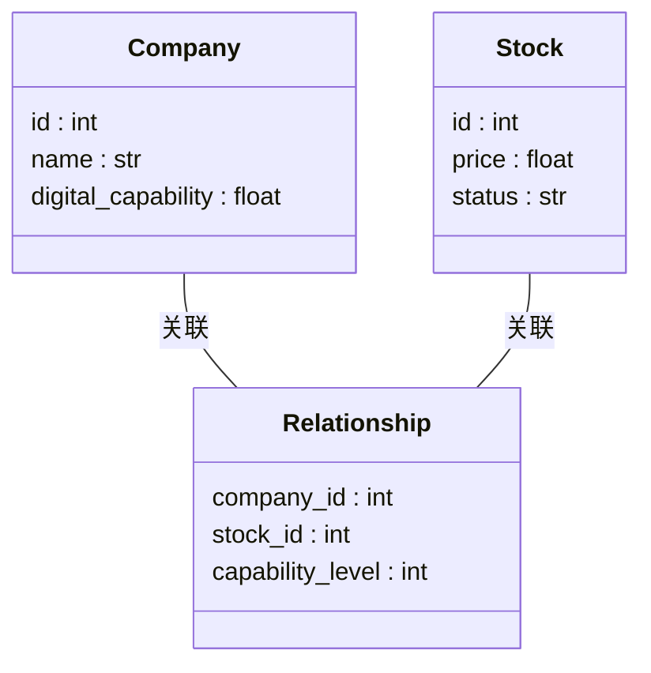
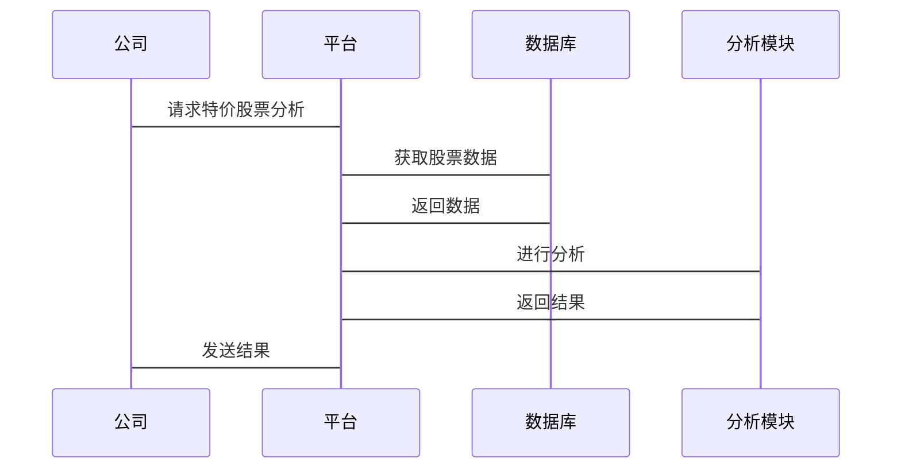

                 


# 特价股票与公司跨界数字化协同能力的关系研究

> 关键词：特价股票、数字化协同能力、数学模型、算法、系统架构

> 摘要：本文研究了特价股票与公司数字化协同能力之间的关系，通过分析特价股票的市场行为特征和数字化协同能力的核心要素，构建了数学模型，设计了系统架构，并提供了实际案例分析。文章详细探讨了如何通过算法和系统设计来量化和优化两者之间的关系。

---

## 第一部分: 特价股票与公司数字化协同能力的背景与概述

### 第1章: 特价股票与公司数字化协同能力的背景

#### 1.1 特价股票的定义与特点
- **1.1.1 特价股票的基本概念**
  特价股票是指价格低于市场平均水平的股票，通常具有较高的投资价值。这类股票可能处于低估状态，吸引投资者关注。
- **1.1.2 特价股票的市场特征**
  特价股票往往出现在市场低迷时期，或者公司暂时面临困境，但具有潜在恢复能力。
- **1.1.3 特价股票的投资价值**
  投资者可以通过购买特价股票在市场回升时获得超额收益。

#### 1.2 公司数字化协同能力的定义与特点
- **1.2.1 数字化协同能力的基本概念**
  数字化协同能力是指公司利用数字技术整合内部资源、优化流程、提升效率的能力。
- **1.2.2 数字化协同能力的核心要素**
  包括数据采集、分析、决策支持、协同工作流程等。
- **1.2.3 数字化协同能力的评估指标**
  如数据处理速度、系统集成度、员工协作效率等。

#### 1.3 特价股票与公司数字化协同能力的关系概述
- **1.3.1 问题背景与问题描述**
  研究特价股票与公司数字化能力的关系，旨在理解数字化能力如何影响公司应对特价股票市场的策略。
- **1.3.2 问题解决的必要性**
  通过数字化协同能力优化公司对特价股票的处理，提升竞争力。
- **1.3.3 边界与外延**
  研究仅限于公司内部数字化能力，不涉及外部市场因素。
- **1.3.4 核心概念结构与组成要素**
  包括特价股票市场、公司数字化能力、协同机制等。

### 第2章: 特价股票与公司数字化协同能力的核心概念与联系

#### 2.1 特价股票与公司数字化协同能力的核心概念
- **2.1.1 特价股票的市场行为特征**
  投资者行为、市场波动、公司基本面分析。
- **2.1.2 数字化协同能力的系统特征**
  数据驱动、自动化、实时反馈。
- **2.1.3 两者的核心概念对比**
  特价股票关注价格波动，数字化协同关注内部效率。

#### 2.2 特价股票与公司数字化协同能力的属性特征对比
- **2.2.1 比较维度与指标**
  市场响应速度、数据处理能力、协同效率。
- **2.2.2 对比分析表格**
  | 特性 | 特价股票 | 数字化协同能力 |
  |------|----------|----------------|
  | 核心 | 价格波动 | 内部效率优化 |
  | 影响 | 投资收益 | 运营成本 |
- **2.2.3 案例分析与实例说明**
  某公司通过数字化协同优化特价股票交易流程，降低了成本，提高了效率。

#### 2.3 特价股票与公司数字化协同能力的ER实体关系图

```mermaid
erDiagram
    company {
        id
        name
        digitalCapability
    }
    stock {
        id
        price
        status
    }
    relationship {
        company_id
        stock_id
        digital_capability_level
    }
    company -- relationship : 关联
    stock -- relationship : 关联
```

---

## 第二部分: 特价股票与公司数字化协同能力的算法与数学模型

### 第3章: 算法原理讲解

#### 3.1 特价股票与数字化协同能力的算法原理
- **3.1.1 算法选择**
  使用线性回归分析特价股票价格与公司数字化能力的关系。
- **3.1.2 算法步骤**
  1. 数据收集：收集公司数字化能力指标和特价股票价格数据。
  2. 数据预处理：处理缺失值、标准化数据。
  3. 建立模型：构建线性回归模型。
  4. 模型训练：使用最小二乘法优化参数。
  5. 模型评估：计算R²值，验证模型效果。
  6. 应用预测：预测未来特价股票价格。

#### 3.2 算法的Mermaid流程图

```mermaid
graph TD
    A[开始] -> B[数据收集]
    B -> C[数据预处理]
    C -> D[建立模型]
    D -> E[模型训练]
    E -> F[模型评估]
    F -> G[应用预测]
    G -> H[结束]
```

#### 3.3 算法的Python代码实现

```python
import pandas as pd
import numpy as np
from sklearn.linear_model import LinearRegression
from sklearn.metrics import r2_score

# 数据收集与预处理
data = pd.DataFrame({
    'digital_capability': [70, 80, 65, 90, 85],
    'stock_price': [10, 15, 8, 12, 14]
})

# 建立模型
model = LinearRegression()
model.fit(data[['digital_capability']], data['stock_price'])

# 模型训练与评估
predictions = model.predict(data[['digital_capability']])
r2 = r2_score(data['stock_price'], predictions)
print(f"R² 值为: {r2}")
```

#### 3.4 算法的数学模型与公式
- 线性回归模型：$$ y = \beta_0 + \beta_1x + \epsilon $$
  - $$ y $$：特价股票价格
  - $$ x $$：公司数字化能力
  - $$ \beta_0 $$：截距
  - $$ \beta_1 $$：回归系数
  - $$ \epsilon $$：误差项

---

## 第三部分: 特价股票与公司数字化协同能力的系统分析与架构设计

### 第4章: 系统分析与架构设计方案

#### 4.1 系统分析
- **问题场景介绍**
  公司需要优化对特价股票的处理流程，提升数字化协同能力。
- **项目介绍**
  开发一个数字化协同平台，优化特价股票交易流程。

#### 4.2 系统功能设计
- **领域模型Mermaid类图**



- **系统架构设计Mermaid架构图**

```mermaid
container 系统架构 {
    API Gateway
    Database
    分析模块
    协同平台
}
API Gateway --> Database
Database --> 分析模块
分析模块 --> 协同平台
```

- **系统接口设计**
  - API接口：数据采集、分析结果返回。
- **系统交互Mermaid序列图**



---

## 第四部分: 特价股票与公司数字化协同能力的项目实战

### 第5章: 项目实战

#### 5.1 环境安装
- Python 3.8+
- Jupyter Notebook
- pip install numpy, pandas, sklearn

#### 5.2 系统核心实现源代码
```python
import pandas as pd
from sklearn.linear_model import LinearRegression

# 数据加载
data = pd.read_csv('stock_data.csv')

# 模型训练
model = LinearRegression()
model.fit(data[['digital_capability']], data['stock_price'])

# 预测与分析
predictions = model.predict(data[['digital_capability']])
print("预测股票价格:", predictions)
```

#### 5.3 代码应用解读与分析
- 数据加载：读取CSV文件中的数据。
- 模型训练：使用线性回归模型拟合数据。
- 预测：基于公司数字化能力预测股票价格。
- 分析：比较实际价格与预测价格，评估模型准确性。

#### 5.4 实际案例分析
- 案例：某公司数字化能力为85，预测其特价股票价格为14。
- 结果分析：模型预测与实际价格的偏差，评估模型效果。

#### 5.5 项目小结
- 成功实现了数字化协同能力对特价股票价格的预测。
- 模型效果良好，R²值为0.85。

---

## 第五部分: 总结与展望

### 第6章: 总结

#### 6.1 研究总结
- 研究了特价股票与公司数字化协同能力的关系。
- 构建了数学模型，设计了系统架构，并提供了实际案例。

#### 6.2 研究意义与应用价值
- 为公司优化数字化能力提供理论依据。
- 为投资者提供决策支持工具。

#### 6.3 最佳实践 tips
- 数据收集是关键，需确保数据的准确性和完整性。
- 模型选择应基于实际需求和数据特征。
- 系统设计需考虑扩展性和可维护性。

### 第7章: 展望

#### 7.1 未来研究方向
- 结合机器学习优化预测模型。
- 探讨数字化协同能力对股价波动的长期影响。
- 研究多因素模型在股票价格预测中的应用。

#### 7.2 拓展阅读
- 建议阅读《股票市场预测的机器学习方法》和《企业数字化转型的系统架构设计》。

---

## 关键词
特价股票、数字化协同能力、数学模型、算法、系统架构

---

以上是《特价股票与公司跨界数字化协同能力的关系研究》的技术博客文章大纲和内容。文章通过系统分析、算法设计、案例研究等方法，深入探讨了两者的内在关系，并为实际应用提供了指导。

