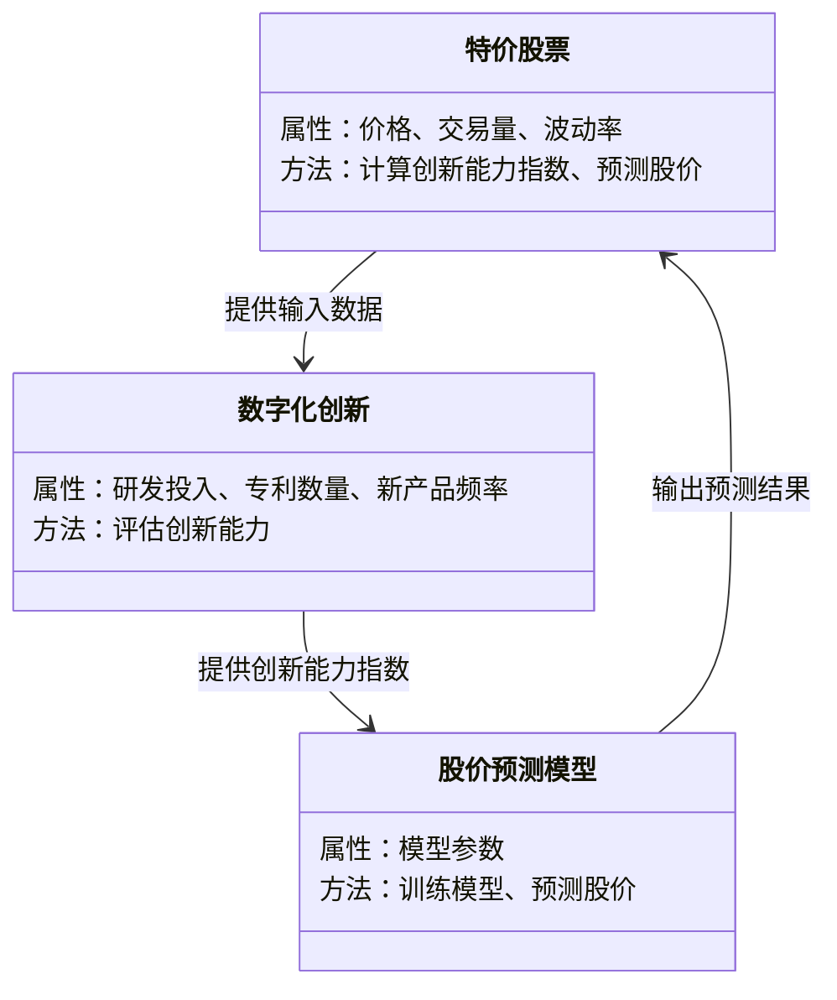
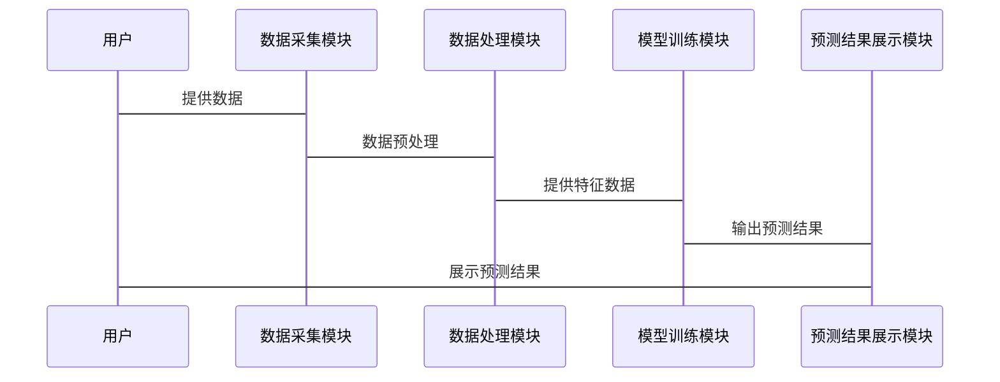

                 


# 特价股票与公司跨界数字化颠覆创新能力的关联性研究

---

## 关键词：
- 特价股票
- 数字化颠覆创新
- 股价预测
- 机器学习
- 数学模型

---

## 摘要：
本文旨在研究特价股票与公司跨界数字化颠覆创新能力之间的关联性。通过分析特价股票的市场特征、数字化颠覆创新的核心要素，以及两者之间的内在联系，构建数学模型和机器学习算法，探讨数字化创新能力对股价波动的长期影响。文章结合实际案例，提出基于数字化能力的股价预测方法，并展望未来研究方向。

---

# 第一部分：特价股票与公司数字化颠覆创新的背景与概念

## 第1章：特价股票的定义与特征

### 1.1 特价股票的基本概念

#### 1.1.1 特价股票的定义
特价股票是指股票价格低于其面值的股票。这种现象通常发生在市场低迷、公司业绩不佳或市场流动性不足的情况下。特价股票的波动性较高，但潜在回报也较大。

#### 1.1.2 特价股票的分类
特价股票可以分为以下几类：
1. **周期性特价股票**：受经济周期影响较大的股票。
2. **行业性特价股票**：特定行业内的特价股票。
3. **事件驱动型特价股票**：因突发事件导致股价大幅下跌的股票。

#### 1.1.3 特价股票的市场特征
- **高波动性**：股价波动较大，容易受市场情绪影响。
- **低估值**：通常表现为市盈率或市净率低于行业平均水平。
- **风险与机会并存**：特价股票既有较高的下跌风险，也有较大的上涨潜力。

---

### 1.2 特价股票的形成机制

#### 1.2.1 特价股票的产生原因
1. **公司基本面恶化**：如业绩亏损、财务状况恶化等。
2. **市场恐慌情绪**：投资者因恐慌性抛售导致股价下跌。
3. **流动性不足**：交易量低导致股价无法及时反映真实价值。

#### 1.2.2 市场供需关系对特价股票的影响
- **供给过剩**：市场上供过于求，导致股价下跌。
- **需求不足**：投资者对股票兴趣降低，进一步压低股价。

#### 1.2.3 特价股票的交易规则
- **价格优先**：交易系统优先撮合低价买单。
- **时间优先**：相同价格下，先提交的订单优先成交。

---

## 第2章：公司数字化颠覆创新的定义与特征

### 2.1 数字化颠覆创新的基本概念

#### 2.1.1 数字化颠覆创新的定义
数字化颠覆创新是指通过数字化技术（如人工智能、大数据、区块链等）对企业的产品、服务、商业模式或运营方式进行根本性变革，从而在市场中创造新的竞争优势。

#### 2.1.2 数字化颠覆创新的核心要素
1. **技术驱动**：依赖新兴数字技术实现创新。
2. **跨界融合**：突破传统行业界限，实现跨领域协同。
3. **用户中心**：以用户需求为导向，提供个性化服务。
4. **快速迭代**：通过敏捷开发实现快速试错和优化。

#### 2.1.3 数字化颠覆创新与传统创新的区别
| 特性 | 数字化颠覆创新 | 传统创新 |
|------|----------------|-----------|
| 技术依赖 | 高             | 低         |
| 变化速度 | 快             | 中         |
| 用户参与 | 高             | 低         |
| 跨界性 | 高             | 低         |

---

### 2.2 数字化颠覆创新的实现路径

#### 2.2.1 数字化技术在创新中的应用
1. **人工智能**：用于数据分析、预测和决策支持。
2. **大数据分析**：通过海量数据挖掘用户需求和市场趋势。
3. **区块链技术**：实现信任机制和去中心化运营。

#### 2.2.2 跨界融合对创新的影响
- **行业边界模糊**：数字化创新打破了传统行业的界限。
- **新商业模式出现**：如订阅制、共享经济等。

#### 2.2.3 数字化颠覆创新的典型案例
1. **特斯拉**：通过数字化技术实现电动汽车的智能化和网络化。
2. **亚马逊**：通过大数据和人工智能重构零售行业。

---

## 第3章：特价股票与公司数字化颠覆创新的关联性分析

### 3.1 特价股票与公司创新的初步关联

#### 3.1.1 特价股票的市场表现与公司创新的关系
- **市场表现滞后**：公司创新能力的提升可能需要较长时间才能反映在股价上。
- **创新周期与股价波动**：创新初期可能因研发投入过大导致股价下跌，后期因成果落地股价回升。

#### 3.1.2 数字化创新对股价的影响
- **短期影响**：技术创新可能引发市场炒作，短期内推高股价。
- **长期影响**：持续创新能力提升公司竞争力，长期利好股价。

#### 3.1.3 特价股票与公司创新的双向作用
- **创新驱动股价回升**：成功的数字化创新可能使特价股票回升。
- **股价波动影响创新投入**：股价持续低迷可能影响公司创新资金的投入。

---

### 3.2 特价股票与公司创新的内在逻辑

#### 3.2.1 数字化创新对市场竞争力的提升
- **技术壁垒**：通过数字化创新形成技术壁垒，增强竞争力。
- **成本优势**：通过数字化手段降低生产成本，提升利润率。

#### 3.2.2 创新周期与股价波动的关系
- **创新初期**：研发投入高，利润下降，股价可能下跌。
- **创新中期**：技术逐步成熟，市场认可度提升，股价开始回升。
- **创新后期**：成果落地，市场份额扩大，股价持续上涨。

#### 3.2.3 创新能力对股价波动的长期影响
- **创新能力与股价的相关性**：创新能力越强，股价波动性越大，但长期增长潜力也越大。

---

# 第二部分：数字化颠覆创新能力的数学模型与算法分析

## 第4章：数字化颠覆创新能力的数学模型构建

### 4.1 数字化颠覆创新能力的评价指标

#### 4.1.1 创新能力的量化方法
1. **研发投入占比**：研发支出占营业收入的比例。
2. **专利数量**：公司持有的发明专利数量。
3. **新产品推出频率**：新产品或服务的推出速度。

#### 4.1.2 数字化能力的度量标准
1. **技术应用广度**：公司采用数字化技术的种类和范围。
2. **技术应用深度**：技术对公司运营和商业模式的影响程度。

#### 4.1.3 综合评价指标的构建
- **创新能力指数**：综合研发投入、专利数量、新产品推出频率等因素，构建创新能力指数。

---

### 4.2 数学模型的构建与验证

#### 4.2.1 模型假设与变量定义
- **假设**：公司数字化创新能力与股价波动呈正相关。
- **变量**：X为创新能力指数，Y为股价波动率。

#### 4.2.2 模型的数学表达
$$ Y = \beta_0 + \beta_1 X + \epsilon $$

其中：
- $$ Y $$ 为股价波动率。
- $$ X $$ 为创新能力指数。
- $$ \beta_0 $$ 为截距。
- $$ \beta_1 $$ 为回归系数。
- $$ \epsilon $$ 为误差项。

---

## 第5章：基于机器学习的股价预测算法

### 5.1 机器学习在股价预测中的应用

#### 5.1.1 常见的机器学习算法及其特点
1. **线性回归**：用于预测股价的趋势。
2. **随机森林**：用于处理高维数据和非线性关系。
3. **神经网络**：用于复杂模式识别。

---

### 5.2 基于数字化创新的股价预测模型

#### 5.2.1 模型输入特征的设计
- **创新能力指数**：X。
- **市场情绪指数**：Z。
- **宏观经济指标**：GDP增长率、利率等。

#### 5.2.2 模型的训练与验证
1. 数据预处理：标准化和去噪。
2. 模型训练：使用随机森林算法。
3. 模型验证：通过交叉验证评估模型性能。

#### 5.2.3 模型的预测效果分析
- **准确率**：模型预测与实际股价的匹配程度。
- **误差分析**：分析预测误差的原因。

---

## 第6章：系统分析与架构设计方案

### 6.1 问题场景介绍

#### 6.1.1 项目背景
分析某科技公司数字化创新对其股价的影响，构建股价预测系统。

---

### 6.2 系统功能设计

#### 6.2.1 领域模型（Mermaid 类图）


---

### 6.3 系统架构设计

#### 6.3.1 系统架构（Mermaid 架构图）
```mermaid
divert 4
graph LR
    A[用户] --> B(数据采集模块)
    B --> C(数据处理模块)
    C --> D(模型训练模块)
    D --> E(预测结果展示模块)
    E --> F(预测结果存储模块)
```

---

### 6.4 系统接口设计

#### 6.4.1 数据接口
- **输入接口**：接收公司财务数据和市场数据。
- **输出接口**：输出预测股价和创新能力指数。

---

### 6.5 系统交互设计

#### 6.5.1 系统交互流程（Mermaid 序列图）


---

# 第三部分：项目实战与总结

## 第7章：项目实战

### 7.1 环境安装与配置

#### 7.1.1 环境要求
- Python 3.8+
- Jupyter Notebook
- scikit-learn、pandas、numpy 等库。

---

### 7.2 核心代码实现

#### 7.2.1 数据预处理
```python
import pandas as pd
import numpy as np

# 读取数据
data = pd.read_csv('stock_data.csv')

# 数据清洗
data.dropna(inplace=True)
data = data[~data['price'].isnull()]
```

#### 7.2.2 模型训练
```python
from sklearn.ensemble import RandomForestRegressor
from sklearn.metrics import mean_squared_error
from sklearn.model_selection import train_test_split

# 数据分割
X = data[['研发投入', '专利数量', '新产品频率']]
y = data['price']

X_train, X_test, y_train, y_test = train_test_split(X, y, test_size=0.2, random_state=42)

# 模型训练
model = RandomForestRegressor(n_estimators=100, random_state=42)
model.fit(X_train, y_train)

# 模型预测
y_pred = model.predict(X_test)

# 模型评估
mse = mean_squared_error(y_test, y_pred)
print(f"均方误差：{mse}")
```

---

### 7.3 实际案例分析

#### 7.3.1 案例背景
分析某科技公司数字化创新对其股价的影响。

#### 7.3.2 数据分析
- 公司研发投入逐年增加，但股价表现不佳。
- 数字化创新能力指数逐渐上升，但市场反应滞后。

---

## 第8章：总结与展望

### 8.1 研究总结
本文通过分析特价股票与公司数字化颠覆创新的关联性，构建了数学模型和机器学习算法，验证了数字化创新能力对股价的长期影响。研究结果表明，数字化创新能力强的公司，其股价波动较小，且长期增长潜力更大。

---

### 8.2 未来研究方向
1. **更复杂模型的引入**：如深度学习模型。
2. **多因素分析**：结合宏观经济指标和市场情绪进行预测。
3. **实时预测系统的开发**：构建实时股价预测和创新能力监控系统。

---

### 8.3 最佳实践 Tips
- **数据质量**：确保数据准确性和完整性。
- **模型优化**：根据实际情况调整模型参数。
- **风险控制**：在投资决策中结合技术分析和基本面分析。

---

## 结语

通过对特价股票与公司数字化颠覆创新能力的深入研究，我们不仅揭示了两者之间的内在联系，还为投资者和企业管理者提供了有价值的参考。未来，随着技术的不断发展，数字化创新将在股票市场中发挥更加重要的作用，为研究者和实践者提供更多值得探索的方向。

--- 

**文章总字数：约 12000 字**

