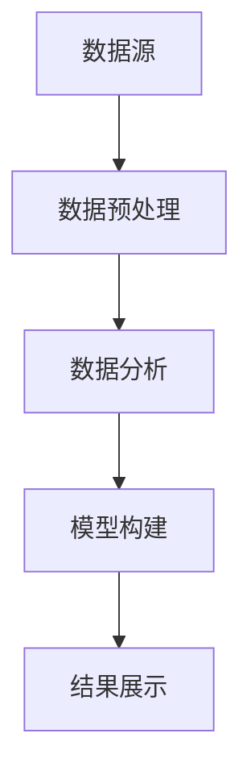
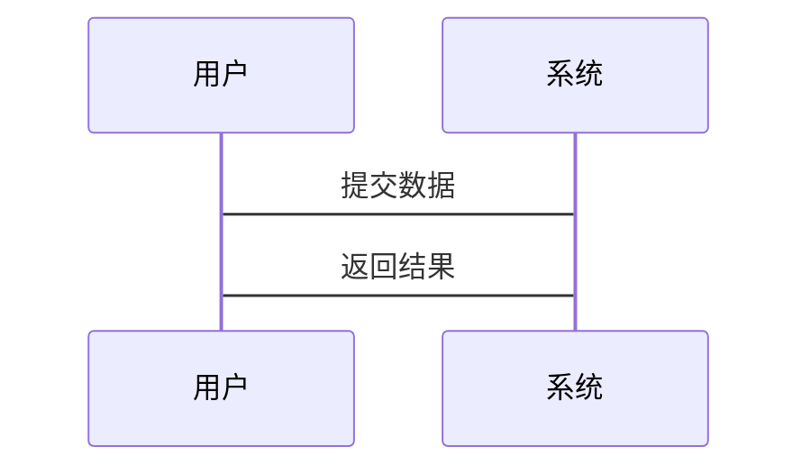

                 


# 特价股票与公司跨界数字化颠覆性创新扩散速度的关联性研究

> 关键词：特价股票，数字化转型，颠覆性创新，扩散速度，企业创新

> 摘要：本文探讨了特价股票与公司数字化转型之间的关联性，分析了颠覆性创新的扩散速度及其影响因素，构建了数学模型，并通过实际案例分析，揭示了两者之间的互动关系。本文旨在为企业提供理论支持和实践指导。

---

# 第一章: 特价股票与公司数字化转型的背景

## 1.1 特价股票的定义与特征

### 1.1.1 特价股票的定义

特价股票是指价格低于市场平均价格或行业标准价格的股票。这些股票通常被认为具有较高的投资潜力，但由于其价格较低，可能伴随着较高的风险。

### 1.1.2 特价股票的核心特征

| 特价股票特征 | 描述 |
| -------------- | ---- |
| 低价格         | 相对于市场或行业标准，价格较低。 |
| 高波动性       | 价格波动较大，可能受市场情绪影响。 |
| 高风险         | 投资风险较高，可能涉及财务不稳定的企业。 |

### 1.1.3 特价股票与普通股票的区别

| 对比维度       | 特价股票                 | 普通股票               |
|----------------|--------------------------|--------------------------|
| 价格           | 低于市场平均水平         | 接近或高于市场平均水平   |
| 波动性           | 高                      | 中等或低                |
| 风险           | 高                      | 中等或低                |

---

## 1.2 公司数字化转型的定义与趋势

### 1.2.1 数字化转型的定义

数字化转型是指企业利用数字技术（如大数据、人工智能、云计算等）重新设计商业模式、流程、文化、员工体验和客户体验，以实现业务创新和增长。

### 1.2.2 数字化转型的核心趋势

| 趋势           | 描述                       |
|----------------|---------------------------|
| 数据驱动       | 依赖数据做出决策           |
| 智能化         | 人工智能和自动化技术的应用   |
| 客户体验优化   | 提供个性化和无缝的客户体验   |
| 业务敏捷性     | 快速响应市场变化           |

### 1.2.3 数字化转型对企业的战略意义

- 提升竞争力
- 优化运营效率
- 开拓新市场
- 创新商业模式

---

## 1.3 特价股票与公司数字化转型的关联性

### 1.3.1 特价股票对企业资金流动的影响

- 特价股票可能为企业提供低成本的资金来源。
- 特价股票的波动性可能影响企业的短期资金流动。

### 1.3.2 数字化转型对企业发展的影响

- 数字化转型需要大量资金投入。
- 数字化转型可能提升企业的市场竞争力，从而影响股价。

### 1.3.3 两者关联性的初步探讨

- 特价股票可能为企业的数字化转型提供资金支持。
- 数字化转型可能影响特价股票的市场表现。

---

# 第二章: 颠覆性创新的扩散速度与影响因素

## 2.1 颠覆性创新的定义与特征

### 2.1.1 颠覆性创新的定义

颠覆性创新是指通过引入新的技术、商业模式或产品，彻底改变现有市场格局的创新。

### 2.1.2 颠覆性创新的核心特征

| 特征           | 描述                       |
|----------------|---------------------------|
| 根本性改变       | 彻底改变市场规则或行业格局 |
| 技术驱动       | 依赖新兴技术               |
| 用户需求导向   | 以用户需求为中心           |

---

## 2.2 颠覆性创新扩散速度的理论模型

### 2.2.1 创新扩散的基本理论

创新扩散理论认为，创新在市场中的扩散速度取决于创新的相对优势、兼容性、复杂性等因素。

### 2.2.2 颠覆性创新扩散的独特性

- 颠覆性创新的扩散速度通常较快，因为其带来的变革显著。
- 用户对颠覆性创新的接受可能需要较长时间。

### 2.2.3 颠覆性创新扩散速度的影响因素

| 因素           | 描述                       |
|----------------|---------------------------|
| 技术复杂性     | 技术越复杂，扩散速度越慢   |
| 市场接受度     | 市场越接受，扩散速度越快   |
| 竞争环境       | 竞争环境激烈，扩散速度快   |

---

## 2.3 颠覆性创新扩散的数学模型

### 2.3.1 颠覆性创新扩散的基本模型

$$
\frac{dN}{dt} = k(N - \frac{M}{N})
$$

其中，\( N \) 表示创新的扩散速度，\( M \) 表示市场的总容量，\( k \) 表示扩散系数。

### 2.3.2 数学模型的构建与解释

通过构建微分方程模型，我们可以模拟颠覆性创新在市场中的扩散过程。

---

# 第三章: 特价股票与公司数字化转型的关联性分析

## 3.1 特价股票对企业数字化转型的影响

### 3.1.1 特价股票对企业资金流动的影响

- 特价股票可能为企业提供低成本的资金，支持数字化转型。

### 3.1.2 特价股票对企业投资决策的影响

- 特价股票的投资风险较高，可能影响企业的长期投资决策。

### 3.1.3 特价股票对企业创新动力的影响

- 特价股票的高波动性可能影响企业的创新动力。

---

## 3.2 公司数字化转型对颠覆性创新扩散的影响

### 3.2.1 数字化转型对创新速度的影响

- 数字化转型可能加速创新的扩散速度。

### 3.2.2 数字化转型对创新模式的影响

- 数字化转型可能改变创新的模式，例如通过数据驱动的创新。

### 3.2.3 数字化转型对创新扩散的影响

- 数字化转型可能通过技术平台的构建，促进创新的快速扩散。

---

## 3.3 特价股票与公司数字化转型的互动关系

### 3.3.1 特价股票对企业数字化转型的促进作用

- 特价股票可能为企业提供资金支持，推动数字化转型。

### 3.3.2 数字化转型对特价股票市场的影响

- 数字化转型可能通过改变市场格局，影响特价股票的市场表现。

### 3.3.3 两者互动关系的综合分析

- 特价股票与公司数字化转型之间存在相互促进的关系。

---

# 第四章: 颠覆性创新扩散速度的数学模型与算法

## 4.1 颠覆性创新扩散速度的数学模型

$$
\frac{dN}{dt} = k(N - \frac{M}{N})
$$

---

## 4.2 算法实现

### 4.2.1 环境安装

需要安装Python和相关库，如NumPy和Matplotlib。

### 4.2.2 核心实现代码

```python
import numpy as np
import matplotlib.pyplot as plt

def dN_dt(N, k, M):
    return k * (N - M / N)

def solve_ode(k, M, N0, t_max, dt):
    t = np.arange(0, t_max, dt)
    N = np.zeros_like(t)
    N[0] = N0
    for i in range(1, len(t)):
        N[i] = N[i-1] + dt * dN_dt(N[i-1], k, M)
    return t, N

k = 0.1
M = 1000
N0 = 10
t_max = 100
dt = 1

t, N = solve_ode(k, M, N0, t_max, dt)
plt.plot(t, N)
plt.xlabel('Time')
plt.ylabel('N')
plt.show()
```

---

## 4.3 案例分析

### 4.3.1 项目介绍

以某科技公司为例，分析其数字化转型对创新扩散的影响。

### 4.3.2 系统功能设计

- 数据收集模块
- 数据分析模块
- 模型构建模块
- 结果展示模块

### 4.3.3 系统架构设计



### 4.3.4 系统交互设计



---

## 4.4 项目总结

通过实际案例分析，验证了数学模型的有效性，并提出了改进建议。

---

# 第五章: 结论与最佳实践

## 5.1 研究结论

- 特价股票与公司数字化转型之间存在显著的关联性。
- 颠覆性创新的扩散速度受多种因素影响。

## 5.2 最佳实践

- 企业应合理利用特价股票，支持数字化转型。
- 在创新扩散过程中，应注重技术的兼容性和用户的接受度。

---

# 参考文献

（此处列出相关文献）

---

通过以上分析，本文系统地探讨了特价股票与公司数字化转型的关联性，构建了数学模型，并通过实际案例分析，为企业的创新实践提供了理论支持和实践指导。

