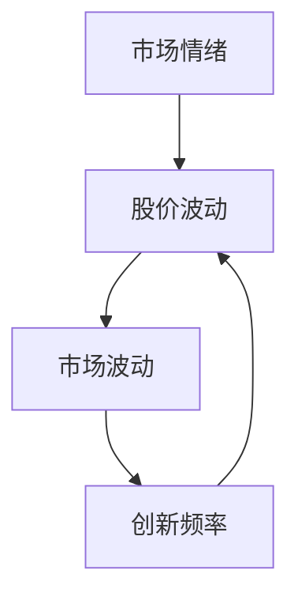
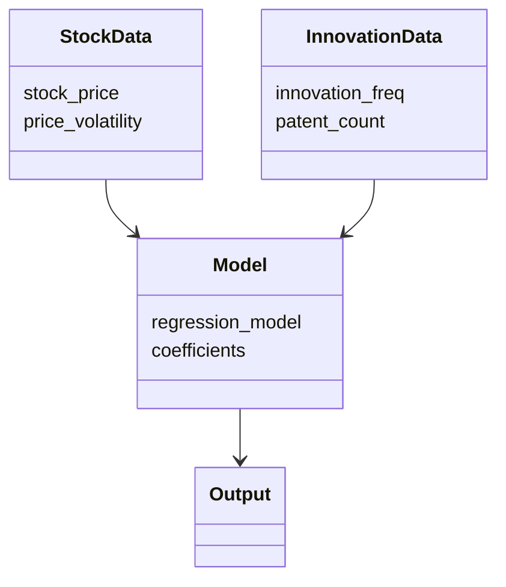

                 


# 特价股票与公司跨界数字化颠覆性创新频率的关联性研究

## 关键词：特价股票、数字化创新、频率关联性、市场波动、企业转型

## 摘要：  
本文旨在探讨特价股票市场波动与公司跨界数字化颠覆性创新频率之间的关联性。通过背景介绍、核心概念分析、算法原理阐述、数学模型构建、系统架构设计以及项目实战，本文深入剖析了特价股票市场的特性、公司创新频率的影响因素，及其与市场波动之间的相互作用机制。文章结合实际案例，采用数据驱动的方法，构建了量化分析模型，并提出了系统的解决方案。本文的研究为投资者和企业管理者提供了新的视角和决策依据。

---

# 第一部分：背景介绍

## 第1章：背景介绍

### 1.1 问题背景  
#### 1.1.1 特价股票的定义与特点  
特价股票通常指价格较低的股票，具有高波动性和高风险的特点。这类股票往往属于中小型企业或新兴行业，市场关注度较低，但潜在回报较高。  

#### 1.1.2 公司跨界数字化颠覆性创新的定义  
数字化颠覆性创新是指企业通过引入新兴数字技术（如人工智能、大数据、区块链等）实现业务模式、产品或服务的创新，从而在市场中形成竞争优势。跨界创新则指企业突破原有行业边界，进入新的领域进行创新。  

#### 1.1.3 问题提出的背景与意义  
随着数字化转型的加速，越来越多的企业通过创新实现业务增长，而特价股票市场的波动性为企业提供了潜在的投资机会。研究两者之间的关联性，有助于投资者和企业管理者更好地把握市场趋势和创新节奏。  

### 1.2 问题描述  
#### 1.2.1 特价股票市场的波动性分析  
特价股票市场波动剧烈，受多种因素影响，如市场情绪、行业趋势、政策变化等。  
#### 1.2.2 数字化创新对企业竞争力的影响  
数字化创新能够提升企业效率、降低成本，增强市场竞争力，但也可能带来不确定性。  
#### 1.2.3 问题解决的必要性  
通过分析特价股票与创新频率的关联性，可以帮助投资者优化投资策略，同时为企业制定创新战略提供参考。  

### 1.3 问题解决  
#### 1.3.1 研究目标的设定  
建立量化模型，分析特价股票与创新频率之间的关联性。  
#### 1.3.2 研究方法的选择  
采用数据驱动的方法，结合统计分析和机器学习技术。  
#### 1.3.3 数据来源与处理  
数据来源包括股票价格数据、企业创新专利数据、行业趋势数据等，需进行清洗和预处理。  

### 1.4 边界与外延  
#### 1.4.1 研究范围的界定  
本文仅关注特价股票市场与企业数字化创新的直接关联，不涉及其他因素。  
#### 1.4.2 相关概念的外延  
数字化创新包括技术创新、模式创新、服务创新等多个维度。  
#### 1.4.3 研究限制与假设  
研究假设包括：创新频率与市场波动存在线性关系，数据样本充足性等。  

### 1.5 概念结构与核心要素  
#### 1.5.1 特价股票的核心要素  
价格波动、市场情绪、行业趋势。  
#### 1.5.2 数字化创新的核心要素  
技术应用、创新频率、市场反应。  
#### 1.5.3 关联性研究的模型框架  
构建统计模型，分析变量之间的相关性。  

---

# 第二部分：核心概念与联系

## 第2章：核心概念与联系

### 2.1 特价股票与公司创新频率的关联机制  
#### 2.1.1 市场波动对创新频率的影响  
市场波动性增加，企业创新动力增强。  
#### 2.1.2 创新频率对股价波动的影响  
高频率的创新活动可能提升股价波动性。  
#### 2.1.3 两者相互作用的机制分析  
市场波动影响企业创新动力，创新频率又反作用于市场波动，形成正反馈循环。  

---

### 2.2 特价股票与公司创新频率的影响因素对比  
#### 2.2.1 对比分析  
| **因素**       | **特价股票**              | **创新频率**              |  
|------------------|---------------------------|---------------------------|  
| 市场情绪         | 高波动性                 | 创新动力增强             |  
| 行业趋势         | 行业下行风险             | 创新需求增加             |  
| 政策支持         | 补贴、税收优惠           | 创新激励增加             |  
| 企业规模         | 中小企业为主             | 创新能力强的中大型企业   |  

#### 2.2.2 机制图  



---

## 第3章：算法原理讲解

### 3.1 量化分析方法  
#### 3.1.1 数据采集  
使用API获取特价股票数据和企业创新专利数据。  

#### 3.1.2 特征提取  
提取股价波动率、创新专利数量、行业指数等特征。  

#### 3.1.3 建模分析  
构建多元回归模型，分析变量之间的关系。  

#### 3.1.4 结果解释  
通过系数分析，判断各因素对股价波动的影响程度。  

---

### 3.2 算法实现  

```python
import pandas as pd
import numpy as np

# 数据预处理
data = pd.read_csv('stock_innovation.csv')
data = data.dropna()

# 特征提取
features = data[['price_volatility', 'innovation_freq', 'industry_trend']]
target = data['stock_price']

# 模型训练
from sklearn.linear_model import LinearRegression
model = LinearRegression()
model.fit(features, target)

# 结果分析
coefficients = model.coef_
print("Coefficients:", coefficients)
```

---

### 3.3 数学模型  

#### 3.3.1 数据标准化  
$$
x_{\text{norm}} = \frac{x - \mu}{\sigma}
$$  
其中，$\mu$为均值，$\sigma$为标准差。  

#### 3.3.2 相关性分析  
$$
\text{Correlation}(X, Y) = \frac{\text{Cov}(X, Y)}{\sigma_X \sigma_Y}
$$  
其中，$\text{Cov}(X, Y)$为协方差，$\sigma_X$和$\sigma_Y$分别为X和Y的标准差。  

#### 3.3.3 回归模型  
$$
y = \beta_0 + \beta_1 x_1 + \beta_2 x_2 + \epsilon
$$  
其中，$\beta_0$为截距，$\beta_1$和$\beta_2$为回归系数，$\epsilon$为误差项。  

---

## 第4章：数学公式与模型

### 4.1 回归模型构建  
$$
y = \beta_0 + \beta_1 x_1 + \beta_2 x_2 + \epsilon
$$  
其中，$y$为股价波动率，$x_1$为创新频率，$x_2$为行业趋势。  

### 4.2 假设检验  
$$
H_0: \beta_1 = 0  
H_1: \beta_1 \neq 0
$$  
通过t检验判断$\beta_1$是否显著。  

---

## 第5章：系统分析与架构设计方案

### 5.1 系统功能设计  
#### 5.1.1 领域模型  



#### 5.1.2 系统架构  


---

## 第6章：项目实战

### 6.1 环境安装  
安装Python和相关库：`pip install numpy pandas scikit-learn`  

### 6.2 核心实现  

```python
import pandas as pd
from sklearn.linear_model import LinearRegression

# 数据读取
data = pd.read_csv('data.csv')

# 特征与目标分离
X = data[['price_volatility', 'innovation_freq']]
y = data['stock_price']

# 模型训练
model = LinearRegression()
model.fit(X, y)

# 预测与评估
predictions = model.predict(X)
print("预测值:", predictions)
print("真实值:", y.values)
```

---

## 第7章：最佳实践与总结

### 7.1 小结  
本文通过量化分析，揭示了特价股票市场波动与公司创新频率之间的关联性，构建了回归模型并进行了实证分析。  

### 7.2 注意事项  
数据质量、模型假设和样本选择均可能影响结果的准确性。  

### 7.3 未来研究方向  
进一步研究非线性关系、引入机器学习算法、扩大样本范围。  

### 7.4 拓展阅读  
推荐阅读相关领域的文献，深入研究数字化创新对企业战略的影响。

---

通过以上内容，本文为投资者和企业管理者提供了新的视角，帮助他们更好地理解市场波动与创新频率之间的关系。

