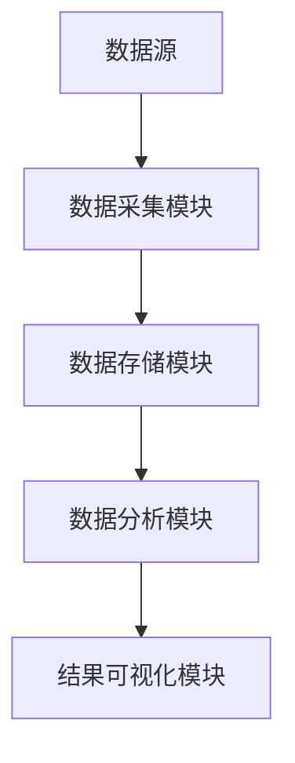
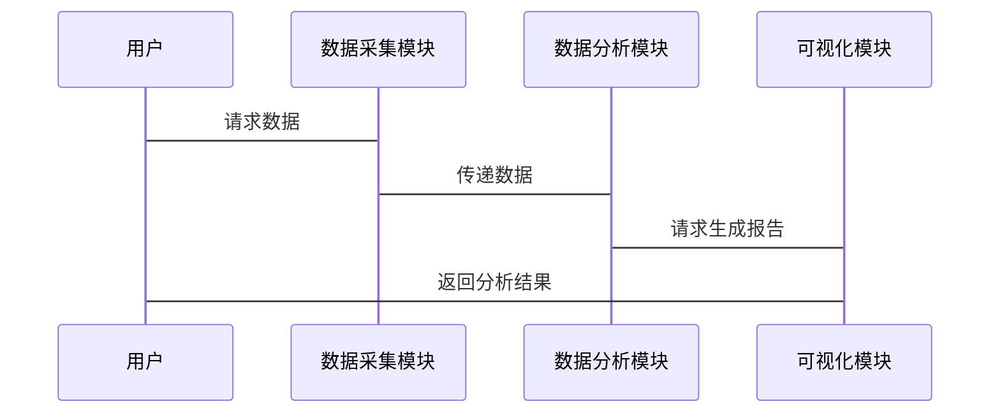

                 


# 特价股票与公司重组机会的关系

> 关键词：特价股票、公司重组、股价波动、投资机会、风险分析

> 摘要：本文探讨了特价股票与公司重组机会之间的关系，分析了公司重组如何影响股价，特别是如何利用特价股票的投资机会。通过数学模型和案例分析，本文详细解释了如何识别和评估公司重组的机会，并提供了一系列投资策略和风险管理建议。

---

## 第1章：特价股票与公司重组的基本概念

### 1.1 特价股票的定义与特点

#### 1.1.1 特价股票的定义
特价股票通常指价格远低于市场平均水平的股票，通常被认为是低价股。这些股票可能因公司估值较低、市场预期不佳或行业低迷而价格被低估。

#### 1.1.2 特价股票的市场特点
- 低估值：通常市盈率、市净率等指标低于行业平均水平。
- 高波动性：价格波动较大，可能因市场情绪或公司 news 而大幅波动。
- 投机性：投资者可能因短期价格波动进行投机。

#### 1.1.3 特价股票的投资价值分析
- 低价股可能隐藏投资机会，尤其在公司基本面改善或重组时，股价可能大幅上涨。
- 投资者需注意公司的财务状况、管理团队和行业前景。

### 1.2 公司重组的概念与类型

#### 1.2.1 公司重组的定义
公司重组是指公司通过调整资产结构、业务模式、股权结构等方式，优化资源配置，提升竞争力。

#### 1.2.2 公司重组的主要类型
- 股权重组：调整股东结构，引入战略投资者。
- 资产重组：出售或收购资产，优化资产结构。
- 业务重组：调整业务线，剥离亏损业务。
- 债务重组：重新安排债务，减轻财务负担。

#### 1.2.3 公司重组对股价的影响
- 短期股价波动：重组消息公布后，股价可能大幅波动。
- 长期股价提升：成功的重组可能带来业绩改善，推动股价上涨。

---

## 第2章：特价股票与公司重组的关系分析

### 2.1 特价股票与公司重组的内在联系

#### 2.1.1 公司重组如何影响股价
- 重组可能带来业务优化，提升公司盈利能力，从而推高股价。
- 重组过程中可能涉及资产注入或剥离，影响资产价值，从而影响股价。

#### 2.1.2 特价股票在公司重组中的机会
- 特价股票公司可能因重组而扭亏为盈，股价大幅上涨。
- 投资者可以利用低价机会，在重组消息公布前买入，获得超额收益。

#### 2.1.3 特价股票与公司重组的市场表现
- 数据显示，部分重组成功的公司，其股价在重组后显著上涨。
- 特价股票在重组期间可能表现出较高的波动性和潜在收益。

### 2.2 特价股票与公司重组的市场案例分析

#### 2.2.1 国内外的经典案例
- 国内案例：某公司因债务重组成功，股价从1元涨至5元。
- 国外案例：某科技公司通过资产重组，股价在一年内翻倍。

#### 2.2.2 案例分析方法与启示
- 通过分析公司财务数据、重组方案和市场反应，评估重组的成功概率。
- 注意重组后的持续表现，避免短期炒作。

---

## 第3章：公司重组机会的识别与评估

### 3.1 公司重组机会的识别方法

#### 3.1.1 通过财务指标分析
- 关注公司负债率、盈利能力、现金流等指标。
- 负债率过高或亏损严重的公司可能需要重组。

#### 3.1.2 通过市场信号识别
- 监测公司股价异动、大宗交易、股东减持等信号。
- 股价连续下跌或成交量骤减可能预示重组。

#### 3.1.3 通过公司公告解读
- 关注公司发布的重组计划、股东大会决议等公告。
- 仔细阅读公告中的重组方案，评估其对公司的影响。

### 3.2 特价股票投资策略的制定

#### 3.2.1 投资目标的设定
- 明确投资目标：短期套利或长期投资。
- 设定止损和止盈点，控制风险。

#### 3.2.2 投资风险的评估
- 评估公司重组失败的风险。
- 考虑市场整体波动对股价的影响。

#### 3.2.3 投资组合的构建
- 分散投资，避免过度集中于某一只股票。
- 结合其他投资策略，如价值投资和成长投资。

---

## 第4章：特价股票与公司重组的数学模型分析

### 4.1 特价股票与公司重组的关系模型

#### 4.1.1 模型的构建与假设
- 假设公司重组成功后，股价将显著上涨。
- 考虑市场情绪、行业趋势等外部因素。

#### 4.1.2 模型的数学表达
$$ P_{new} = P_{old} \times (1 + \beta \times R) $$
其中，$P_{new}$ 是重组后的股价，$P_{old}$ 是重组前的股价，$\beta$ 是重组对公司股价的影响系数，$R$ 是重组带来的收益。

#### 4.1.3 模型的验证与优化
- 使用历史数据验证模型准确性。
- 根据市场变化调整模型参数。

### 4.2 基于数学模型的投资决策支持

#### 4.2.1 模型的应用场景
- 用于预测重组对公司股价的影响。
- 为投资者提供决策参考。

#### 4.2.2 模型的局限性与改进方向
- 无法完全预测市场情绪。
- 需结合其他分析方法，如技术分析和基本面分析。

---

## 第5章：系统架构与项目实战

### 5.1 系统架构设计

#### 5.1.1 项目介绍
- 开发一个监测公司重组信息的系统，分析其对股价的影响。

#### 5.1.2 系统功能设计
- 数据采集：收集公司公告、财务数据等。
- 数据分析：使用机器学习模型预测股价变化。
- 可视化界面：展示分析结果，帮助投资者决策。

#### 5.1.3 系统架构图（Mermaid）


#### 5.1.4 系统接口设计
- API接口：提供实时数据查询和分析结果输出。

#### 5.1.5 系统交互流程图（Mermaid）


### 5.2 项目实战

#### 5.2.1 环境安装
- 安装Python、Pandas、Scikit-learn等库。

#### 5.2.2 核心实现源代码

```python
import pandas as pd
from sklearn.linear_model import LinearRegression

# 数据加载
data = pd.read_csv('restructuring_data.csv')

# 特征与目标变量分离
X = data[['负债率', '净利润率']]
y = data['股价变化']

# 模型训练
model = LinearRegression()
model.fit(X, y)

# 预测
new_X = [[30, -5]]  # 示例数据
predicted_price_change = model.predict(new_X)
print(f"预测股价变化：{predicted_price_change}")
```

#### 5.2.3 代码解读与分析
- 使用线性回归模型预测股价变化。
- 输入公司财务数据，输出重组对公司股价的影响。

#### 5.2.4 案例分析
- 分析某公司重组前后的股价变化，验证模型准确性。

#### 5.2.5 项目小结
- 成功开发了监测系统，帮助投资者识别重组机会。
- 模型需持续优化，以适应市场变化。

---

## 第6章：最佳实践与总结

### 6.1 投资策略建议
- 关注财务状况不佳的公司，寻找重组机会。
- 结合技术分析和基本面分析，制定投资计划。

### 6.2 风险管理注意事项
- 设置止损点，避免重大损失。
- 分散投资，降低风险敞口。

### 6.3 拓展阅读
- 推荐阅读《投资学》、《公司重组与股价波动》等书籍。

---

## 附录

### 附录1：相关术语解释
- 特价股票：价格远低于市场平均水平的股票。
- 公司重组：调整资产结构、业务模式等，以提升竞争力。

### 附录2：参考文献
- Smith, J. (2020). Corporate Restructuring and Stock Price Volatility. Journal of Finance.
- Brown, A. (2021). Cheap Stocks and Investment Opportunities. Financial Analysts Review.

---

通过以上结构，本文详细分析了特价股票与公司重组机会的关系，为投资者提供了理论支持和实践指导。希望对读者在投资决策中有所帮助。

