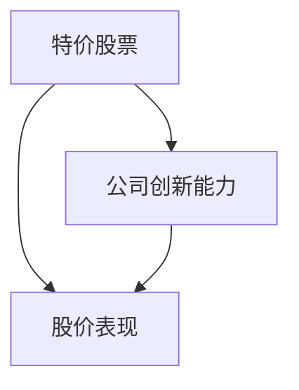
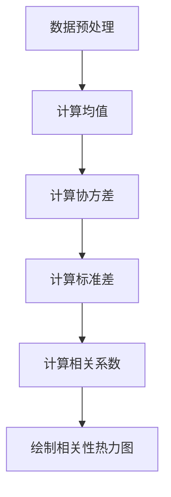

                 


# 特价股票与公司长期创新能力的相关性分析

## 关键词：特价股票，公司创新能力，相关性分析，数据分析，投资策略，股票市场

## 摘要：  
本文通过分析特价股票与公司长期创新能力之间的相关性，探讨如何利用数据分析的方法揭示两者之间的关系。文章从背景介绍、核心概念、算法原理、数学模型、系统分析、项目实战等多方面展开，旨在为投资者和研究人员提供一种新的视角来评估和选择投资标的。通过本文的分析，读者可以更好地理解公司创新能力对股价的影响，并在投资决策中做出更明智的选择。

---

## 第一部分：背景介绍

### 第1章：特价股票与公司长期创新能力概述

#### 1.1 特价股票的基本概念  
- **特价股票的定义**：特价股票是指市场价格显著低于其内在价值的股票，通常被视为被市场低估的投资机会。  
- **特价股票的特征**：  
  - 价格低于行业平均水平或历史平均水平。  
  - 公司基本面良好，但市场情绪或短期因素导致股价被压制。  
  - 投资价值较高，适合长期持有。  
- **特价股票的分类**：  
  - 按行业分类：如科技、金融、消费等行业中的特价股票。  
  - 按市值分类：小盘股、中盘股、大盘股中的特价股票。  

#### 1.2 公司长期创新能力的核心要素  
- **公司创新能力的定义**：公司创新能力是指企业在技术研发、产品创新、管理创新等方面的能力，是公司持续发展的核心动力。  
- **公司创新能力的构成要素**：  
  - 技术研发能力：研发投入占比、专利数量、技术先进性。  
  - 产品创新能力：新产品推出频率、市场反馈、产品生命周期。  
  - 管理创新能力：组织架构优化、管理效率提升、企业文化建设。  
- **长期创新能力与公司可持续发展的关系**：  
  - 创新能力是公司应对市场竞争的关键能力。  
  - 长期创新能力强的公司更有可能实现股价的长期增长。  

#### 1.3 特价股票与公司长期创新能力的相关性问题  
- **问题背景**：  
  - 投资者通常关注股票的短期价格波动，但忽视了公司创新能力对股价的长期影响。  
  - 特价股票往往被市场低估，但其背后的公司创新能力可能决定了其未来的股价表现。  
- **问题描述**：  
  - 是否存在某种相关性：公司创新能力越强，其股价表现越好？  
  - 特价股票的公司创新能力是否会在未来推动股价上涨？  
- **问题解决**：  
  - 通过数据分析方法，量化公司创新能力与股价的相关性。  
  - 通过实证分析验证两者之间的关系。  
- **相关性分析的边界与外延**：  
  - 时间范围：短期 vs 长期。  
  - 数据范围：特定行业 vs 全市场。  
  - 影响因素：其他变量（如行业周期、宏观经济因素）的控制。  
- **核心概念的结构与要素组成**：  
  - 特价股票：价格、估值、行业地位。  
  - 公司创新能力：研发投入、专利数量、产品创新速度。  
  - 相关性：正相关、负相关或无明显相关。  

---

## 第二部分：核心概念与联系

### 第2章：特价股票与公司创新能力的核心概念分析

#### 2.1 特价股票与公司创新能力的定义对比  
- **特价股票的核心属性**：价格低估、价值被市场忽视、潜在上涨空间大。  
- **公司创新能力的核心属性**：技术领先、产品创新、管理高效。  
- **属性对比表格**：  

| 属性                | 特价股票                          | 公司创新能力                    |
|---------------------|-----------------------------------|--------------------------------|
| 核心关注点          | 价格与估值                        | 技术与产品创新                  |
| 影响因素            | 市场情绪、行业竞争                | 研发投入、管理效率、政策支持    |
| 长期影响            | 股价上涨                          | 公司持续发展、市场份额扩大      |

#### 2.2 特价股票与公司创新能力的ER实体关系图  


---

## 第三部分：算法原理讲解

### 第3章：相关性分析算法原理

#### 3.1 相关性分析的数学模型  
- **相关性分析的定义与公式**：  
  - 相关性分析用于衡量两个变量之间线性关系的强度和方向。  
  - 相关系数的公式：  
    $$ r = \frac{\text{cov}(X, Y)}{\sigma_X \sigma_Y} $$  
    其中，$\text{cov}(X, Y)$ 是X和Y的协方差，$\sigma_X$ 和 $\sigma_Y$ 分别是X和Y的标准差。  
- **适用条件与限制**：  
  - 数据应具备线性关系。  
  - 数据应满足正态分布或其他统计假设。  
  - 样本量应足够大。  

#### 3.2 相关性分析的mermaid流程图  


#### 3.3 相关性分析的Python实现代码  
```python
import numpy as np
import pandas as pd
import matplotlib.pyplot as plt

# 示例数据
data = {
    'stock_price': [10, 12, 8, 15, 10],
    'innovation_capability': [0.8, 0.6, 0.7, 0.9, 0.5]
}

df = pd.DataFrame(data)

# 计算协方差和相关系数
covariance = np.cov(df['stock_price'], df['innovation_capability'])[0, 1]
std_stock = np.std(df['stock_price'])
std_innovation = np.std(df['innovation_capability'])
correlation_coefficient = covariance / (std_stock * std_innovation)

print(f"协方差: {covariance}")
print(f"相关系数: {correlation_coefficient}")

# 可视化
plt.scatter(df['stock_price'], df['innovation_capability'])
plt.xlabel('Stock Price')
plt.ylabel('Innovation Capability')
plt.title('Scatter Plot of Stock Price vs Innovation Capability')
plt.show()
```

---

## 第四部分：数学模型

### 第4章：相关性分析的数学模型与公式

#### 4.1 相关性分析的数学基础  
- **协方差公式**：  
  $$ \text{cov}(X, Y) = \frac{1}{n-1} \sum_{i=1}^{n} (X_i - \bar{X})(Y_i - \bar{Y}) $$  
  其中，$\bar{X}$ 和 $\bar{Y}$ 分别是X和Y的样本均值。  
- **相关系数公式**：  
  $$ r = \frac{\text{cov}(X, Y)}{\sigma_X \sigma_Y} $$  
  其中，$\sigma_X$ 和 $\sigma_Y$ 分别是X和Y的标准差。  

#### 4.2 相关性分析的数学推导  
- 通过公式推导，可以得出相关系数的取值范围在[-1, 1]之间：  
  - $r = 1$：完全正相关。  
  - $r = -1$：完全负相关。  
  - $r = 0$：无相关性。  

---

## 第五部分：系统分析与架构设计

### 第5章：系统分析与架构设计方案

#### 5.1 问题场景介绍  
- **研究场景**：分析特定行业内的特价股票与公司创新能力之间的相关性。  
- **数据来源**：股票价格数据、公司财务报表、专利数量、研发投入等。  

#### 5.2 系统功能设计  
- **领域模型**：  
  ```mermaid
  classDiagram
  class 股票价格 {
    <属性>
    stock_price: 数值
    <方法>
    get_price(): 数值
  }
  class 公司创新能力 {
    <属性>
    innovation_capability: 数值
    <方法>
    get_capability(): 数值
  }
  class 相关性分析 {
    <属性>
    correlation_coefficient: 数值
    <方法>
    compute_correlation(): void
  }
  stock_price --> 公司创新能力
  stock_price --> 相关性分析
  公司创新能力 --> 相关性分析
  ```

#### 5.3 系统架构设计  
- **分层架构**：  
  ```mermaid
  architecture
  frontend
  backend
    database
  ```

---

## 第六部分：项目实战

### 第6章：项目实战与分析

#### 6.1 环境安装  
- **Python环境**：安装Python 3.8及以上版本。  
- **依赖库安装**：  
  ```bash
  pip install numpy pandas matplotlib seaborn scikit-learn
  ```

#### 6.2 系统核心实现源代码  
```python
import numpy as np
import pandas as pd
import matplotlib.pyplot as plt
from sklearn.metrics import correlation_matrix

# 数据加载
data = pd.read_csv('stock_data.csv')

# 计算相关性矩阵
correlation_matrix = data.corr()

# 绘制相关性热力图
plt.figure(figsize=(10, 8))
plt.imshow(correlation_matrix, cmap='hot', interpolation='nearest')
plt.colorbar()
plt.xticks(ticks=np.arange(len(data.columns)), labels=data.columns)
plt.yticks(ticks=np.arange(len(data.columns)), labels=data.columns[::-1])
plt.title('Correlation Heatmap')
plt.show()
```

---

## 第七部分：最佳实践

### 第7章：总结与建议

#### 7.1 小结  
- 特价股票与公司创新能力之间的相关性可以通过数据分析的方法进行量化。  
- 相关性分析可以帮助投资者更好地理解公司创新能力对股价的影响。  

#### 7.2 注意事项  
- 数据质量和样本选择会影响相关性分析的结果。  
- 相关性不等于因果关系，需结合其他因素进行综合判断。  

#### 7.3 拓展阅读  
- 《投资学精要》：了解股票投资的基本理论。  
- 《创新管理》：深入理解公司创新能力的构建与提升。  

---

以上是《特价股票与公司长期创新能力的相关性分析》的完整目录和内容框架。希望这篇文章能为投资者和研究人员提供有价值的参考和启发。

