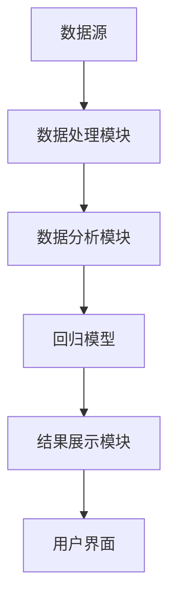
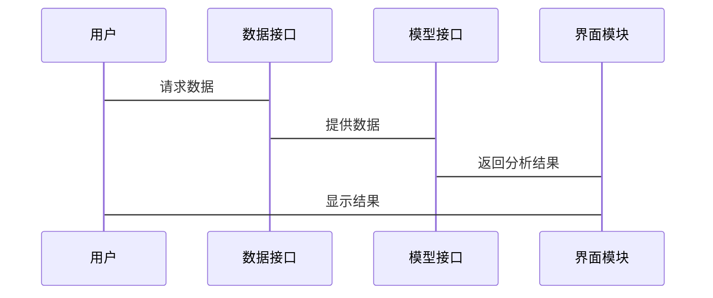

                 


# 特价股票与公司长期技术融合创新韧性的相关性分析

## 关键词：
- 特价股票
- 技术融合创新
- 相关性分析
- 创新韧性
- 数据分析

## 摘要：
本文系统地分析了特价股票与公司长期技术融合创新韧性的相关性。通过背景介绍、数据分析、系统架构设计、项目实战等多角度，探讨了特价股票市场波动与公司创新能力之间的关系。结合统计分析、回归模型构建和系统架构设计，本文提出了一套分析框架，并通过实际案例验证了模型的有效性，为投资者和公司战略决策提供了有益的参考。

---

# 目录大纲：《特价股票与公司长期技术融合创新韧性的相关性分析》

## 第一部分：背景与概述

### 第1章：特价股票的基本概念

#### 1.1 特价股票的定义与特点
- 1.1.1 特价股票的定义
- 1.1.2 特价股票的市场特点
- 1.1.3 特价股票的投资者行为分析

#### 1.2 特价股票的市场现状
- 1.2.1 特价股票市场的规模与结构
- 1.2.2 特价股票市场的参与者分析
- 1.2.3 特价股票市场的波动性与风险

### 第2章：公司长期技术融合创新韧性的概念

#### 2.1 公司技术融合创新的定义
- 2.1.1 技术融合创新的定义
- 2.1.2 技术融合创新的特征
- 2.1.3 技术融合创新的关键因素

#### 2.2 公司创新韧性的定义与评估
- 2.2.1 创新韧性的定义
- 2.2.2 创新韧性评估的指标体系
- 2.2.3 创新韧性与公司长期发展的关系

## 第二部分：数据分析与建模

### 第3章：相关性分析方法

#### 3.1 相关性分析的基本概念
- 3.1.1 相关性分析的定义
- 3.1.2 相关性分析的类型
- 3.1.3 相关性分析的应用场景

#### 3.2 数据预处理与变量选择
- 3.2.1 数据清洗与标准化
- 3.2.2 变量的选取与筛选
- 3.2.3 数据的可视化分析

### 第4章：相关性分析模型的构建

#### 4.1 回归分析模型
- 4.1.1 线性回归模型
- 4.1.2 逐步回归分析
- 4.1.3 回归模型的评估与优化

#### 4.2 因果分析模型
- 4.2.1 因果关系的定义与特征
- 4.2.2 因果分析模型的构建
- 4.2.3 因果分析与相关性分析的对比

## 第三部分：系统分析与架构设计

### 第5章：技术融合创新的系统架构

#### 5.1 技术融合创新的系统结构
- 5.1.1 系统功能模块划分
- 5.1.2 系统数据流分析
- 5.1.3 系统功能实体关系图（Mermaid）

#### 5.2 系统架构设计
- 5.2.1 分层架构设计
- 5.2.2 微服务架构设计
- 5.2.3 系统扩展性分析

### 第6章：系统接口设计

#### 6.1 数据接口设计
- 6.1.1 数据输入接口设计
- 6.1.2 数据输出接口设计
- 6.1.3 数据接口的交互流程（Mermaid）

#### 6.2 模型接口设计
- 6.2.1 模型输入接口设计
- 6.2.2 模型输出接口设计
- 6.2.3 模型接口的交互流程（Mermaid）

## 第四部分：项目实战

### 第7章：项目实施与案例分析

#### 7.1 项目背景与目标
- 7.1.1 项目背景
- 7.1.2 项目目标
- 7.1.3 项目范围

#### 7.2 数据采集与处理
- 7.2.1 数据来源
- 7.2.2 数据清洗与预处理
- 7.2.3 数据存储与管理

#### 7.3 模型构建与验证
- 7.3.1 回归模型构建
- 7.3.2 模型验证与优化
- 7.3.3 模型效果评估

### 第8章：项目成果与总结

#### 8.1 项目成果展示
- 8.1.1 分析报告展示
- 8.1.2 模型展示
- 8.1.3 数据可视化展示

#### 8.2 成果分析与总结
- 8.2.1 成果的意义
- 8.2.2 项目中的挑战与解决方案
- 8.2.3 项目经验总结

## 第五部分：结论与展望

### 第9章：结论与建议

#### 9.1 研究总结
- 9.1.1 研究的主要结论
- 9.1.2 研究的创新点
- 9.1.3 研究的局限性

#### 9.2 实际应用价值
- 9.2.1 投资者的应用价值
- 9.2.2 公司战略的应用价值
- 9.2.3 行业研究的应用价值

### 第10章：未来研究方向

#### 10.1 可能的未来研究方向
- 10.1.1 更复杂的模型构建
- 10.1.2 数据来源的扩展
- 10.1.3 应用场景的拓展

#### 10.2 最佳实践与注意事项
- 10.2.1 数据分析中的注意事项
- 10.2.2 模型构建中的注意事项
- 10.2.3 实际应用中的注意事项

## 附录

### 附录A：相关性分析代码示例

```python
import pandas as pd
import numpy as np
import matplotlib.pyplot as plt
from sklearn.linear_model import LinearRegression
from sklearn.metrics import mean_squared_error

# 示例数据加载
data = pd.DataFrame({
    'Price': [10, 12, 15, 14, 16],
    'Innovation': [0.8, 0.9, 0.7, 0.6, 0.9]
})

# 数据可视化
plt.scatter(data['Innovation'], data['Price'])
plt.xlabel('Innovation')
plt.ylabel('Price')
plt.title('Scatter Plot of Innovation vs Price')
plt.show()

# 回归分析
model = LinearRegression()
model.fit(data[['Innovation']], data['Price'])
predictions = model.predict(data[['Innovation']])
mse = mean_squared_error(data['Price'], predictions)
r_squared = model.score(data[['Innovation']], data['Price'])

print(f'回归系数：{model.coef_}')
print(f'截距：{model.intercept_}')
print(f'R²值：{r_squared}')
print(f'MSE：{mse}')
```

### 附录B：系统架构图



### 附录C：系统接口交互流程图



---

## 结语：
通过以上详细的目录大纲，我们可以看到，文章从背景介绍到数据分析，再到系统设计和项目实战，最后总结与展望，全面覆盖了特价股票与公司技术融合创新韧性的相关性分析的各个方面。这种结构化的分析方法不仅有助于读者理解复杂的理论，还能够指导实际的操作和应用。

