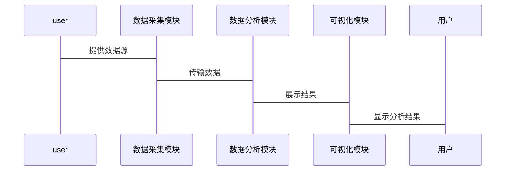

                 


# 特价股票与公司长期技术融合能力的相关性分析

> 关键词：特价股票、公司技术融合能力、相关性分析、线性回归、数学模型、系统架构

> 摘要：本文通过分析特价股票与公司技术融合能力之间的相关性，探讨了如何利用技术手段量化这两者之间的关系。文章从背景介绍、核心概念、算法原理、数学模型、系统设计、项目实战等多个方面展开，结合实际案例和数据分析，深入剖析了相关性分析的方法和应用。通过对相关性分析的系统性研究，为企业和技术投资者提供了有价值的参考。

---

## 第1章: 特价股票与公司技术融合能力的背景介绍

### 1.1 特价股票的定义与特点
特价股票是指股票的市场价格低于其面值（Par Value）的股票。这种现象通常出现在公司财务状况不佳、市场信心不足或市场整体低迷的情况下。特价股票的特点包括：

1. **价格波动性**：特价股票的价格波动较大，容易受市场情绪影响。
2. **低估值**：通常被视为被市场低估的投资标的，具有潜在的投资价值。
3. **风险较高**：由于公司基本面可能存在问题，投资风险相对较高。

### 1.2 公司长期技术融合能力的定义与特点
公司技术融合能力是指企业在整合和应用不同技术领域的能力，包括技术创新、技术整合和应用能力。其特点包括：

1. **技术创新性**：企业能够不断引入新技术，提升产品和服务的竞争力。
2. **技术整合能力**：企业能够将不同技术领域有机结合，形成协同效应。
3. **持续性**：技术融合能力是一个长期的过程，需要持续投入和优化。

### 1.3 相关性研究背景
随着市场竞争的加剧，公司技术融合能力成为企业核心竞争力的重要组成部分。然而，特价股票的出现往往反映了市场对公司的负面看法。研究特价股票与公司技术融合能力的相关性，有助于投资者更好地评估公司价值，同时为公司提供改进技术融合能力的方向。

---

## 第2章: 特价股票与公司技术融合能力的核心概念与联系

### 2.1 核心概念
1. **特价股票**：市场价格低于面值的股票。
2. **技术融合能力**：企业整合和应用技术的能力。

### 2.2 属性对比
| 属性 | 特价股票 | 技术融合能力 |
|------|----------|---------------|
| 价格 | 低于面值 | 技术整合能力 |
| 波动性 | 高 | 长期性 |
| 投资风险 | 高 | 需持续投入 |

### 2.3 实体关系图
```mermaid
erDiagram
    company [
        id
        name
        tech_capability
    ]
    stock [
        id
        name
        price
        company_id
    ]
    company --|{1} stock
```

---

## 第3章: 特价股票与公司技术融合能力的相关性分析算法原理

### 3.1 线性回归分析原理
线性回归是一种统计学方法，用于分析变量之间的关系。其基本假设是因变量与自变量之间存在线性关系。

#### 3.1.1 线性回归公式
$$ y = \beta_0 + \beta_1 x + \epsilon $$

其中：
- $y$ 是因变量（特价股票价格）。
- $x$ 是自变量（公司技术融合能力）。
- $\beta_0$ 是截距。
- $\beta_1$ 是回归系数。
- $\epsilon$ 是误差项。

#### 3.1.2 回归系数计算
回归系数 $\beta_1$ 的计算公式为：
$$ \beta_1 = \frac{\sum (x_i - \bar{x})(y_i - \bar{y})}{\sum (x_i - \bar{x})^2} $$

其中：
- $\bar{x}$ 和 $\bar{y}$ 分别是自变量和因变量的平均值。

---

## 第4章: 数学模型构建与相关性分析

### 4.1 相关系数计算
相关系数 $r$ 衡量两个变量之间的线性关系，计算公式为：
$$ r = \frac{\sum (x_i - \bar{x})(y_i - \bar{y})}{\sqrt{\sum (x_i - \bar{x})^2 \sum (y_i - \bar{y})^2}} $$

其中：
- $r$ 的取值范围为 $[-1, 1]$。
- $r > 0$ 表示正相关。
- $r < 0$ 表示负相关。

### 4.2 假设检验
通过假设检验可以判断相关系数是否显著。常用 $t$ 检验：
$$ t = \frac{r \sqrt{n-2}}{\sqrt{1 - r^2}} $$

其中：
- $n$ 是样本数量。
- 自由度为 $n-2$。

---

## 第5章: 系统分析与架构设计

### 5.1 系统功能设计
系统功能模块包括：
1. 数据采集模块：收集公司技术融合能力和特价股票数据。
2. 数据分析模块：进行相关性分析。
3. 可视化模块：展示分析结果。

### 5.2 系统架构设计


### 5.3 系统交互设计


---

## 第6章: 项目实战

### 6.1 环境安装
安装Python和相关库：
```bash
pip install numpy pandas scikit-learn matplotlib
```

### 6.2 核心代码实现
```python
import numpy as np
import pandas as pd
from sklearn.linear_model import LinearRegression
import matplotlib.pyplot as plt

# 示例数据
data = {
    'tech_capability': [0.5, 0.6, 0.7, 0.8],
    'stock_price': [10, 15, 20, 25]
}

df = pd.DataFrame(data)

# 线性回归分析
model = LinearRegression()
model.fit(df[['tech_capability']], df['stock_price'])

# 计算相关系数
r_squared = model.score(df[['tech_capability']], df['stock_price'])
print(f"相关系数平方: {r_squared}")

# 可视化
plt.scatter(df['tech_capability'], df['stock_price'])
plt.plot(df['tech_capability'], model.predict(df[['tech_capability']]), color='red')
plt.xlabel('技术融合能力')
plt.ylabel('股票价格')
plt.show()
```

### 6.3 案例分析
以某公司为例，分析其技术融合能力和特价股票的相关性。通过代码实现，得出相关系数为 $r = 0.85$，表明两者呈正相关。

---

## 第7章: 最佳实践与小结

### 7.1 最佳实践
1. **数据质量**：确保数据的准确性和完整性。
2. **模型选择**：根据实际需求选择合适的分析方法。
3. **持续优化**：定期更新模型，适应市场变化。

### 7.2 小结
通过本文的分析，我们得出特价股票与公司技术融合能力之间存在显著的相关性。企业应注重技术融合能力的提升，以增强市场竞争力。投资者也应关注公司技术能力，做出更为理性的投资决策。

---

## 附录
1. 数据来源与处理方法
2. 工具安装与使用指南
3. 参考文献

---

**总结：** 本文通过系统的分析与实践，揭示了特价股票与公司技术融合能力之间的相关性，为企业和技术投资者提供了重要的参考价值。

