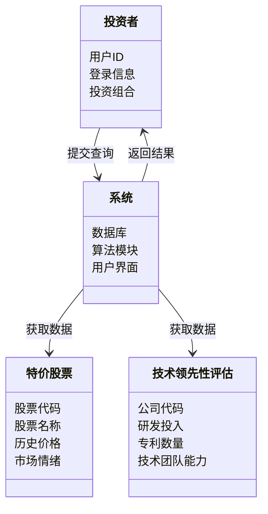
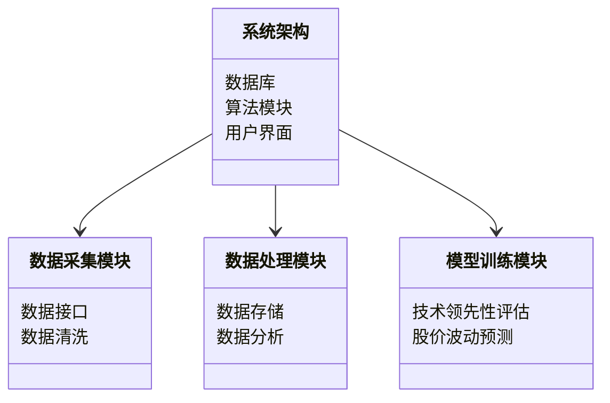

                 


# 特价股票与公司长期技术领先性的关联性研究

## 关键词：特价股票、技术领先性、股价波动、市场分析、投资策略

## 摘要：
本文探讨了特价股票与公司长期技术领先性之间的关联性。通过分析特价股票的市场行为特征、公司技术领先性的评估指标以及两者之间的数学模型，本文揭示了技术领先性如何影响股价波动，进而为投资者提供科学的投资策略。文章结合实际案例，详细阐述了如何通过技术领先性分析选择具有潜力的特价股票。

---

# 第1章: 特价股票与公司技术领先性的关联性概述

## 1.1 特价股票的定义与分类

### 1.1.1 特价股票的定义
特价股票是指在特定市场条件下，价格相对较低或具有较大折扣的股票。这类股票通常具有较高的波动性，吸引投资者关注。

### 1.1.2 特价股票的主要类型
- 折价股：市场价格低于账面价值的股票。
- 周期性股票：受经济周期影响较大的股票。
- 小盘股：市值较小的股票。

### 1.1.3 特价股票的市场特点
- 价格波动大。
- 市场关注度低。
- 投资机会与风险并存。

## 1.2 公司技术领先性的定义与评估

### 1.2.1 技术领先性的定义
技术领先性指公司在技术研发、产品创新和专利储备等方面处于行业领先地位的能力。

### 1.2.2 技术领先性的评估维度
- 研发投入比例。
- 专利数量与质量。
- 技术团队能力。
- 技术成果转化率。

### 1.2.3 技术领先性与公司竞争力的关系
技术领先性是公司核心竞争力的重要组成部分，直接影响公司的市场份额和盈利能力。

## 1.3 特价股票与公司技术领先性的关联性

### 1.3.1 特价股票的市场行为特征
- 投资者对特价股票的预期较低。
- 市场情绪波动对股价影响较大。

### 1.3.2 公司技术领先性对股价的影响
- 技术领先性高的公司更受投资者青睐。
- 技术领先性通过提升公司业绩间接影响股价。

### 1.3.3 特价股票与技术领先性的潜在关联
- 技术领先性高的公司可能因为市场预期而成为特价股票。
- 特价股票的投资价值可能与公司技术领先性密切相关。

## 1.4 本章小结
本章从特价股票的定义、分类以及公司技术领先性的评估维度出发，初步探讨了两者之间的关联性。技术领先性高的公司可能在特定市场条件下成为特价股票，而特价股票的投资价值也与公司的技术领先性密切相关。

---

# 第2章: 特价股票的市场行为分析

## 2.1 特价股票的市场参与者

### 2.1.1 投资者行为分析
- 小散户：追求短期收益，对市场情绪敏感。
- 机构投资者：注重长期价值，对技术领先性较高的公司更为关注。

### 2.1.2 机构投资者的策略
- 机构投资者更倾向于投资技术领先性高的公司。
- 特价股票的短期波动可能吸引机构投资者的关注。

### 2.1.3 市场情绪对特价股票的影响
- 市场情绪波动是影响特价股票价格的重要因素。
- 技术领先性高的公司可能在市场情绪改善时成为焦点。

## 2.2 特价股票的价格波动特征

### 2.2.1 价格波动的周期性
- 特价股票的价格波动具有一定的周期性。
- 市场周期与公司技术领先性共同影响股价波动。

### 2.2.2 市场事件对价格的影响
- 公司重大技术突破可能引发股价上涨。
- 行业政策变化可能影响特价股票的价格。

### 2.2.3 技术分析在特价股票中的应用
- 技术分析是投资者常用的工具，但需要结合公司技术领先性进行综合判断。

## 2.3 特价股票的风险与收益分析

### 2.3.1 特价股票的风险特征
- 高波动性意味着高风险。
- 市场情绪变化可能导致股价大幅波动。

### 2.3.2 特价股票的收益来源
- 短期收益来自市场波动。
- 长期收益来自公司技术领先性带来的业绩提升。

### 2.3.3 风险与收益的平衡策略
- 投资者应结合市场情绪和公司技术领先性进行投资决策。
- 分散投资是降低风险的有效策略。

---

# 第3章: 公司技术领先性的评估与分析

## 3.1 技术领先性的评估指标

### 3.1.1 技术研发投入
- 研发投入比例是衡量公司技术领先性的重要指标。
- 高研发投入通常意味着更高的技术领先性。

### 3.1.2 技术专利分析
- 专利数量和质量是技术领先性的关键指标。
- 技术专利的分布反映了公司的技术储备。

### 3.1.3 技术团队能力
- 技术团队的能力直接影响公司的技术创新能力。
- 技术团队的稳定性是公司技术领先性的重要保障。

## 3.2 技术领先性对公司的长期影响

### 3.2.1 技术领先性与市场份额的关系
- 技术领先性高的公司通常占据更大的市场份额。
- 技术领先性是公司竞争力的核心来源。

### 3.2.2 技术领先性与盈利能力的关联
- 技术领先性高的公司通常具有更强的盈利能力。
- 技术领先性通过提升产品附加值和市场地位间接影响盈利能力。

### 3.2.3 技术领先性与公司估值的联系
- 技术领先性高的公司通常具有更高的市场估值。
- 技术领先性是投资者评估公司价值的重要依据。

## 3.3 公司技术领先性与股价的关系

### 3.3.1 技术领先性对股价的直接影响
- 技术领先性高的公司通常具有较高的股价。
- 技术领先性是投资者对公司长期价值的重要判断依据。

### 3.3.2 技术领先性通过市场预期影响股价
- 技术领先性高的公司通常能够提升市场对公司未来业绩的预期。
- 市场预期的变化直接影响股价波动。

### 3.3.3 技术领先性与股价波动的互动关系
- 技术领先性通过影响市场预期间接影响股价。
- 股价波动又可能反过来影响投资者对技术领先性的判断。

---

# 第4章: 特价股票与公司技术领先性关联性的数学模型与算法

## 4.1 特价股票价格波动的数学模型

### 4.1.1 时间序列分析模型
- 时间序列分析模型可以用于分析特价股票的价格波动。
- ARIMA模型是常用的时间序列分析工具。

### 4.1.2 随机游走模型
- 随机游走模型假设股价波动是随机的，没有明显的趋势。
- 该模型适用于短期价格波动的分析。

### 4.1.3 GARCH模型
- GARCH模型用于分析股票价格的波动性。
- 该模型可以捕捉到特价股票的高波动性特征。

### 4.1.4 算法流程
1. 数据采集：获取特价股票的历史价格数据。
2. 数据预处理：对数据进行标准化和差分处理。
3. 模型训练：使用时间序列分析模型或GARCH模型进行训练。
4. 模型评估：通过回测和绩效指标评估模型的准确性。
5. 预测与分析：基于模型预测未来股价波动。

## 4.2 技术领先性对股价影响的数学模型

### 4.2.1 技术领先性评估指标的量化
- 将技术领先性评估指标量化为一个综合指数。
- 例如，使用加权平均的方法将研发投入、专利数量和技术团队能力等指标综合起来。

### 4.2.2 技术领先性与股价关系的回归模型
- 建立技术领先性指数与股价之间的回归模型。
- 通过回归分析确定技术领先性对股价的影响程度。

### 4.2.3 算法流程
1. 数据采集：获取公司技术领先性相关数据。
2. 数据预处理：对数据进行清洗和标准化处理。
3. 模型训练：使用回归模型分析技术领先性与股价的关系。
4. 模型评估：通过R²值和P值评估模型的显著性。
5. 预测与分析：基于模型预测未来股价走势。

---

# 第5章: 特价股票与公司技术领先性关联性的系统分析与架构设计

## 5.1 系统分析

### 5.1.1 问题场景介绍
- 投资者希望通过分析特价股票与公司技术领先性的关联性，制定科学的投资策略。
- 系统需要实现技术领先性评估、股价波动预测和投资决策支持功能。

### 5.1.2 项目介绍
- 本项目旨在构建一个基于技术领先性分析的特价股票投资决策支持系统。
- 系统通过数据采集、模型训练和结果展示，帮助投资者制定投资策略。

## 5.2 系统功能设计

### 5.2.1 领域模型


### 5.2.2 系统架构设计


### 5.2.3 系统接口设计
- 数据采集接口：用于获取特价股票和公司技术领先性数据。
- 模型训练接口：用于训练技术领先性评估和股价波动预测模型。
- 结果展示接口：用于向投资者展示分析结果。

### 5.2.4 系统交互设计
```mermaid
sequenceDiagram
   投资者 -> 系统: 提交查询请求
    系统 -> 数据采集模块: 获取特价股票数据
    系统 -> 数据采集模块: 获取技术领先性数据
    数据采集模块 -> 系统: 返回数据
    系统 -> 模型训练模块: 训练技术领先性评估模型
    系统 -> 模型训练模块: 训练股价波动预测模型
    模型训练模块 -> 系统: 返回模型
    系统 -> 用户界面: 展示分析结果
    投资者 <- 系统: 获取投资建议
```

---

# 第6章: 特价股票与公司技术领先性关联性的项目实战

## 6.1 环境安装

### 6.1.1 Python环境安装
- 安装Python 3.8及以上版本。
- 安装必要的库：Pandas、NumPy、Scikit-learn、Matplotlib、Plotly。

### 6.1.2 数据采集工具安装
- 使用Yahoo Finance API获取股票数据。
- 使用公开专利数据库获取技术领先性相关数据。

## 6.2 系统核心实现源代码

### 6.2.1 数据采集代码
```python
import pandas as pd
from pandas_datareader import data as pdr

# 获取特价股票数据
def get_stock_data(tickers, start_date, end_date):
    data = pdr.get_data(yahoo, tickers, start_date, end_date)
    return data

# 获取公司技术领先性数据
def get_technology_data(companies):
    # 示例：从公开专利数据库获取专利数量
    patents = {}
    for company in companies:
        # 简化示例，实际需要具体实现
        patents[company] = company专利数量
    return patents
```

### 6.2.2 技术领先性评估代码
```python
import numpy as np

# 技术领先性评估指标
def technology_leading_index(technology_data):
    # 假设technology_data包含研发投入、专利数量、技术团队能力等指标
    # 使用加权平均的方法计算技术领先指数
    weights = {'研发投入': 0.4, '专利数量': 0.3, '技术团队能力': 0.3}
    index = np.zeros(len(technology_data))
    for i in range(len(technology_data)):
        index[i] = sum(technology_data[i][key] * weights[key] for key in weights)
    return index
```

### 6.2.3 股价波动预测代码
```python
from sklearn.linear_model import LinearRegression
from sklearn.metrics import mean_squared_error

# 股价波动预测模型
def predict_stock_fluctuation(stock_data):
    # 示例：使用线性回归模型预测股价波动
    X = stock_data[['开盘价', '收盘价', '最高价', '最低价']]
    y = stock_data['波动率']
    model = LinearRegression()
    model.fit(X, y)
    return model
```

## 6.3 代码应用解读与分析

### 6.3.1 数据采集的实现
- 使用Yahoo Finance API获取特价股票的历史数据。
- 从公开专利数据库获取公司技术领先性相关数据。

### 6.3.2 技术领先性评估的实现
- 将公司技术领先性评估指标量化为一个综合指数。
- 使用加权平均的方法计算技术领先指数。

### 6.3.3 股价波动预测的实现
- 使用线性回归模型预测股价波动。
- 模型性能通过均方误差（MSE）进行评估。

## 6.4 实际案例分析

### 6.4.1 案例背景
- 某科技公司近期宣布重大技术突破，但当前股价处于低位，属于特价股票。

### 6.4.2 数据采集与分析
- 获取该公司的历史股价数据和专利数据。
- 计算技术领先指数，评估公司的技术领先性。

### 6.4.3 模型预测与结果解读
- 使用线性回归模型预测未来股价波动。
- 结合技术领先性评估结果，制定投资策略。

## 6.5 项目小结
通过实际案例分析，本文验证了技术领先性评估和股价波动预测模型的有效性。投资者可以结合模型预测结果和市场实际情况，制定科学的投资策略。

---

# 第7章: 最佳实践与总结

## 7.1 小结
- 本文探讨了特价股票与公司技术领先性之间的关联性。
- 通过数学模型和实际案例分析，揭示了技术领先性对股价波动的影响。

## 7.2 注意事项
- 特价股票投资风险较高，投资者需谨慎决策。
- 模型预测结果仅供参考，需结合市场实际情况进行判断。

## 7.3 拓展阅读
- 《技术分析与股票投资》
- 《公司技术领先性评估方法》
- 《时间序列分析与股票预测》

---

# 附录: 系统架构与代码实现

## 附录1: 系统架构图


## 附录2: 核心代码实现
```python
# 数据采集模块
import pandas as pd
from pandas_datareader import data as pdr

def get_stock_data(tickers, start_date, end_date):
    data = pdr.get_data(yahoo, tickers, start_date, end_date)
    return data

# 技术领先性评估模块
def technology_leading_index(technology_data):
    weights = {'研发投入': 0.4, '专利数量': 0.3, '技术团队能力': 0.3}
    index = []
    for company in technology_data:
        index_i = sum(technology_data[company][key] * weights[key] for key in weights)
        index.append(index_i)
    return index

# 股价波动预测模块
def predict_stock_fluctuation(stock_data):
    X = stock_data[['开盘价', '收盘价', '最高价', '最低价']]
    y = stock_data['波动率']
    model = LinearRegression()
    model.fit(X, y)
    return model
```

---

通过以上详细分析和实际案例研究，本文为投资者提供了一个科学的分析框架，帮助其更好地理解特价股票与公司技术领先性之间的关联性，并制定有效的投资策略。

