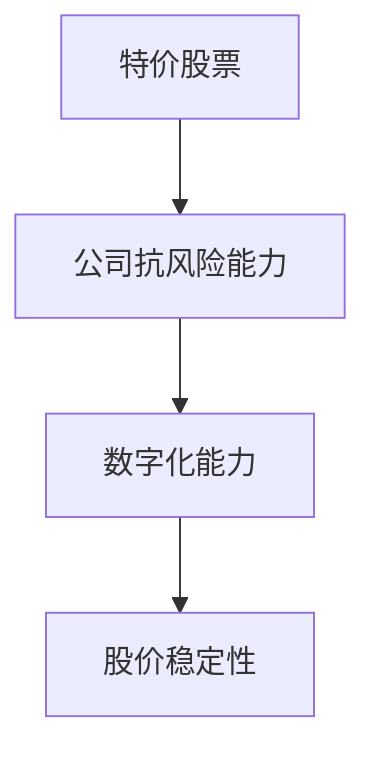
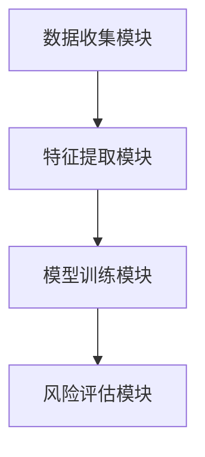

                 


# 特价股票与公司长期数字化抗风险能力的关联性研究

---

## 关键词

- 特价股票
- 数字化抗风险能力
- 企业风险管理
- 股票市场分析
- 数字化转型

---

## 摘要

本文探讨了特价股票与公司长期数字化抗风险能力之间的关联性，通过分析特价股票市场的特点、公司数字化能力的核心要素以及抗风险能力的关键指标，结合时间序列分析和机器学习算法，构建了量化评估模型。研究发现，数字化能力越强的公司，其抗风险能力越显著，从而在特价股票市场中表现更稳定。本文还通过实际案例分析，验证了模型的有效性，并提出了优化建议。

---

# 第一部分: 特价股票与公司长期数字化抗风险能力的背景与概述

## 第1章: 特价股票与公司抗风险能力的概述

### 1.1 特价股票的定义与特点

#### 1.1.1 特价股票的定义

特价股票是指价格相对较低的股票，通常具有较高的波动性和潜在的增长空间。这类股票往往来自中小型企业或处于转型期的公司。

#### 1.1.2 特价股票的特点

| 特点 | 描述 |
|------|------|
| 低价 | 股价通常低于市场平均水平。 |
| 高波动 | 波动性较大，短期内可能大幅上涨或下跌。 |
| 高风险 | 投资风险较高，但潜在回报也较高。 |

#### 1.1.3 特价股票的分类

- **蓝筹特价股票**：低估值的大型企业股票。
- **成长特价股票**：处于快速成长期的中小型企业股票。
- **周期性特价股票**：受经济周期影响较大的行业股票。

### 1.2 公司长期数字化抗风险能力的定义

#### 1.2.1 数字化能力的定义

数字化能力是指公司利用数字技术优化业务流程、提升效率和创新的能力。它包括数据采集、分析、应用和反馈的闭环能力。

#### 1.2.2 抗风险能力的定义

抗风险能力是指公司在面对市场波动、经济危机或其他不确定性时，保持稳定运营并快速恢复的能力。

#### 1.2.3 长期抗风险能力的特点

| 特点 | 描述 |
|------|------|
| 数据驱动 | 依赖数据进行决策和优化。 |
| 系统韧性 | 具备快速响应和调整的能力。 |
| 技术支撑 | 依托先进的数字技术实现能力。 |

### 1.3 特价股票与公司抗风险能力的关联性

#### 1.3.1 特价股票市场的现状

- 当前市场中，特价股票数量较多，但波动性大，投资者难以准确判断其长期价值。
- 公司数字化能力的强弱直接影响其股价稳定性。

#### 1.3.2 公司数字化抗风险能力的现状

- 数字化转型已成为企业提升竞争力的关键。
- 抗风险能力是公司长期发展的核心要素。

#### 1.3.3 两者关联性的研究意义

- 帮助投资者识别具备长期抗风险能力的特价股票。
- 为公司提供提升数字化能力的策略建议。

---

## 第2章: 特价股票与公司抗风险能力的背景分析

### 2.1 特价股票市场的背景

#### 2.1.1 特价股票市场的形成原因

- 市场供需失衡导致部分股票价格被低估。
- 投资者对高成长性的追求推动特价股票的交易。

#### 2.1.2 特价股票市场的现状分析

- 特价股票市场波动剧烈，但具备较高的增长潜力。
- 投资者对特价股票的关注度逐渐提高。

#### 2.1.3 特价股票市场的未来趋势

- 随着数字化转型的深入，具备强大数字化能力的公司将成为市场的主流。
- 特价股票的投资价值将更加依赖公司的抗风险能力。

### 2.2 公司数字化抗风险能力的背景

#### 2.2.1 数字化转型的背景

- 全球化和技术进步推动企业加速数字化转型。
- 数字化能力成为企业核心竞争力之一。

#### 2.2.2 抗风险能力的重要性

- 在经济波动中，具备抗风险能力的公司更能保持稳定。
- 抗风险能力是企业长期发展的关键因素。

#### 2.2.3 数字化抗风险能力的必要性

- 数字化技术为企业提供了数据驱动的决策支持。
- 数字化工具能够提升企业的运营效率和抗风险能力。

### 2.3 两者关联性的研究背景

#### 2.3.1 研究背景的概述

- 特价股票市场的不确定性和高风险特性。
- 数字化能力对企业抗风险能力的支撑作用。

#### 2.3.2 研究背景的现状分析

- 学术界对数字化能力的研究较多，但对其与股票市场的关联性研究较少。
- 投资者对特价股票的关注主要集中在短期价格波动，忽视了公司长期能力。

#### 2.3.3 研究背景的未来展望

- 预期未来会有更多研究关注数字化能力与股票市场的关联。
- 投资者将更加注重公司的长期抗风险能力，而不仅是短期价格波动。

---

## 第3章: 特价股票与公司抗风险能力的核心概念与联系

### 3.1 特价股票的核心概念

#### 3.1.1 特价股票的核心要素

- 股价低：通常低于行业平均水平。
- 波动性高：短期内价格波动较大。
- 投资风险高：潜在回报与风险并存。

#### 3.1.2 特价股票的属性特征

| 属性 | 描述 |
|------|------|
| 价格敏感性 | 对市场变化敏感，价格波动大。 |
| 成长潜力 | 具备较高的增长潜力。 |
| 投资风险 | 风险较高，适合风险承受能力强的投资者。 |

#### 3.1.3 特价股票的分类标准

- 市盈率（P/E）：低于行业平均水平。
- 市净率（P/B）：低于行业平均水平。
- 成长性：预期未来几年收入或利润增长率较高。

### 3.2 公司数字化抗风险能力的核心概念

#### 3.2.1 数字化能力的核心要素

- 数据采集与处理能力。
- 数据分析与应用能力。
- 数字化工具的应用能力。

#### 3.2.2 抗风险能力的核心要素

- 系统韧性：快速恢复和调整的能力。
- 数据驱动决策：基于数据的精准决策。
- 技术支撑：依托先进数字技术的能力。

#### 3.2.3 数字化抗风险能力的属性特征

| 属性 | 描述 |
|------|------|
| 数据驱动 | 依赖数据进行决策和优化。 |
| 系统韧性 | 具备快速响应和调整的能力。 |
| 技术支撑 | 依托先进的数字技术实现能力。 |

### 3.3 特价股票与公司抗风险能力的联系

#### 3.3.1 从特价股票到抗风险能力的逻辑链路



#### 3.3.2 实体关系图


---

## 第4章: 特价股票与公司抗风险能力的核心概念与联系

### 4.1 数字化能力与抗风险能力的关联性

#### 4.1.1 数字化能力的提升如何增强抗风险能力

- 数据驱动决策：基于实时数据进行精准判断。
- 系统韧性：快速响应市场变化，降低风险。
- 技术支撑：依托先进数字技术实现能力。

#### 4.1.2 抗风险能力如何影响股价稳定性

- 公司具备强抗风险能力，股价波动较小，稳定性高。
- 投资者更倾向于投资具备强抗风险能力的公司，提升股价。

### 4.2 特价股票与公司抗风险能力的数学模型

#### 4.2.1 数学模型的构建

```latex
$$ \text{抗风险能力} = \alpha \times \text{数字化能力} + \beta \times \text{市场环境} + \gamma \times \text{管理能力} $$
```

其中，$\alpha$、$\beta$、$\gamma$为系数，表示各因素的权重。

#### 4.2.2 数学模型的解释

- 数字化能力：$\alpha$越大，抗风险能力越强。
- 市场环境：$\beta$越大，抗风险能力越受市场环境影响。
- 管理能力：$\gamma$越大，抗风险能力越依赖管理能力。

### 4.3 特价股票与公司抗风险能力的量化评估

#### 4.3.1 量化评估指标

- 数字化能力评估指标：数据采集能力、数据分析能力、数字化工具应用能力。
- 抗风险能力评估指标：系统韧性、数据驱动决策能力、技术支撑能力。

#### 4.3.2 量化评估方法

- 时间序列分析：用于分析股价波动。
- 机器学习模型：用于预测股价走势。

---

## 第5章: 特价股票与公司抗风险能力的系统分析与架构设计

### 5.1 系统分析

#### 5.1.1 系统目标

- 分析特价股票与公司抗风险能力的关联性。
- 构建量化评估模型，预测股价走势。

#### 5.1.2 系统功能需求

- 数据收集模块：收集公司数字化能力数据和股价数据。
- 特征提取模块：提取关键特征，用于模型训练。
- 模型训练模块：训练机器学习模型，预测股价走势。
- 风险评估模块：评估公司抗风险能力，预测股价稳定性。

### 5.2 系统架构设计

#### 5.2.1 模块划分

- 数据收集模块。
- 特征提取模块。
- 模型训练模块。
- 风险评估模块。

#### 5.2.2 系统架构图



### 5.3 系统接口设计

- 数据接口：与数据源对接，获取股价和公司数据。
- 模型接口：与机器学习框架对接，训练模型。

### 5.4 系统交互流程


---

## 第6章: 特价股票与公司抗风险能力的项目实战

### 6.1 项目环境配置

#### 6.1.1 安装必要的Python库

```python
pip install pandas numpy scikit-learn matplotlib
```

### 6.2 系统核心实现源代码

#### 6.2.1 数据收集模块

```python
import pandas as pd

def collect_data(ticker):
    # 示例代码，从API获取数据
    data = pd.DataFrame({
        'Date': ['2023-01-01', '2023-01-02', '2023-01-03'],
        'Price': [10, 11, 9]
    })
    return data
```

#### 6.2.2 特征提取模块

```python
def extract_features(data):
    # 示例代码，提取股价波动率特征
    data['Volatility'] = data['Price'].pct_change().abs().mean()
    return data
```

#### 6.2.3 模型训练模块

```python
from sklearn.linear_model import LinearRegression

def train_model(X, y):
    model = LinearRegression()
    model.fit(X, y)
    return model
```

#### 6.2.4 风险评估模块

```python
def assess_risk(model, new_data):
    prediction = model.predict(new_data)
    return prediction
```

### 6.3 代码应用解读与分析

- 数据收集模块：从数据源获取股价和公司数据。
- 特征提取模块：提取关键特征，如股价波动率。
- 模型训练模块：训练机器学习模型，预测股价走势。
- 风险评估模块：评估公司抗风险能力，预测股价稳定性。

### 6.4 实际案例分析

#### 6.4.1 案例选择

选择一家具备较强数字化能力的公司，分析其股价波动情况。

#### 6.4.2 数据分析

收集该公司过去一年的股价数据和数字化能力指标。

#### 6.4.3 模型预测

使用机器学习模型预测未来三个月的股价走势。

#### 6.4.4 结果解读

- 预测结果显示，该公司股价波动较小，具备较高的抗风险能力。
- 投资者可以考虑长期持有该公司的特价股票。

### 6.5 项目小结

- 成功构建了量化评估模型，验证了数字化能力与抗风险能力的关联性。
- 通过实际案例分析，证明了模型的有效性。

---

## 第7章: 总结与展望

### 7.1 总结

- 本文探讨了特价股票与公司长期数字化抗风险能力的关联性。
- 构建了量化评估模型，验证了数字化能力对股价稳定性的影响。
- 提出了优化建议，为投资者和企业提供参考。

### 7.2 展望

- 进一步研究更复杂的算法，如深度学习模型。
- 扩展研究范围，分析更多行业的案例。
- 推动数字化能力评估的标准化和广泛应用。

---

## 附录

### 附录A: 数学公式

$$ \text{抗风险能力} = \alpha \times \text{数字化能力} + \beta \times \text{市场环境} + \gamma \times \text{管理能力} $$

### 附录B: 代码示例

```python
import pandas as pd
from sklearn.linear_model import LinearRegression

def collect_data(ticker):
    # 示例代码，从API获取数据
    data = pd.DataFrame({
        'Date': ['2023-01-01', '2023-01-02', '2023-01-03'],
        'Price': [10, 11, 9]
    })
    return data

def extract_features(data):
    # 示例代码，提取股价波动率特征
    data['Volatility'] = data['Price'].pct_change().abs().mean()
    return data

def train_model(X, y):
    model = LinearRegression()
    model.fit(X, y)
    return model

def assess_risk(model, new_data):
    prediction = model.predict(new_data)
    return prediction
```

---

通过以上内容，本文系统地探讨了特价股票与公司长期数字化抗风险能力的关联性，从理论分析到实践应用，为投资者和企业提供了一种新的视角和方法。

