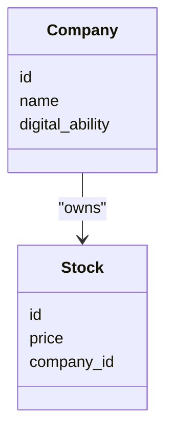

                 


# 特价股票与公司长期数字化适应性学习能力的关联性研究

## 关键词：
- 特价股票
- 数字化适应性
- 学习能力
- 机器学习
- 股票市场

## 摘要：
本文探讨了特价股票与公司长期数字化适应性学习能力之间的关联性。通过定义和分析核心概念，建立数学模型，结合机器学习算法，提出了一个系统化的分析框架，以揭示两者之间的关系，并提供实证分析和应用建议。

---

# 第一部分: 特价股票与公司长期数字化适应性学习能力的背景介绍

## 第1章: 特价股票的定义与特征

### 1.1 特价股票的定义
#### 1.1.1 特价股票的定义与分类
特价股票是指价格低于面值的股票，通常分为优先股和普通股。优先股具有固定的股息率，普通股则没有固定收益，但具有增长潜力。

#### 1.1.2 特价股票的市场表现特征
特价股票通常在市场低迷时期出现，具有高波动性和高风险-收益比。投资者可能在市场底部寻找低估的股票。

#### 1.1.3 特价股票与公司基本面的关系
公司基本面（如盈利能力、财务状况）直接影响股票价格。基本面差的公司可能发行特价股票，但也可能具有较高的增长潜力。

### 1.2 特价股票的市场背景
- 近年来，数字化转型加速，许多公司面临技术变革的压力，导致股价波动。
- 特价股票往往出现在转型期，公司需要具备快速学习和适应能力才能恢复增长。

## 第2章: 公司长期数字化适应性学习能力的定义与特征

### 2.1 公司数字化适应性学习能力的定义
- 数字化适应性学习能力指公司在数字化环境下快速学习、调整和创新的能力。
- 包括技术吸收能力、组织学习能力和创新文化等。

#### 2.1.1 数字化适应性的核心概念
- 技术吸收能力：公司吸收和应用新技术的能力。
- 组织学习能力：公司内部知识共享和学习的能力。
- 创新文化：鼓励创新和风险承担的企业文化。

#### 2.1.2 学习能力的内涵与外延
- 内涵：公司通过学习提升核心竞争力。
- 外延：涉及员工培训、技术创新和外部合作。

#### 2.1.3 长期适应性与短期适应性的区别
- 长期适应性注重战略调整和长期投资。
- 短期适应性关注快速响应市场变化。

## 第3章: 特价股票与公司数字化适应性学习能力的关联性研究背景

### 3.1 研究背景与意义
- 数字化转型加速，企业需要具备快速适应能力。
- 特价股票市场的波动与公司适应能力密切相关。

### 3.2 研究问题
- 特价股票公司是否具备更强的数字化适应能力？
- 数字化适应能力如何影响股价？

### 3.3 研究方法
- 数据收集：分析特价股票公司的数字化能力。
- 数学建模：建立关联性模型。
- 实证分析：验证假设。

---

# 第二部分: 特价股票与公司长期数字化适应性学习能力的关联性分析

## 第4章: 特价股票与公司数字化适应性学习能力的核心概念与联系

### 4.1 核心概念的对比分析

| 特价股票特征 | 公司数字化能力特征 |
|--------------|---------------------|
| 价格低于面值 | 技术吸收能力强       |
| 市场波动大    | 组织学习能力强       |
| 投资风险高    | 创新文化浓厚         |

### 4.2 实体关系图（ER图）分析

```mermaid
er
    Company
    ----|
        has
        ----|
            DigitalAbility
    DigitalAbility
        o--|
            StockPrice
```

公司通过具备数字化能力影响股票价格，特价股票公司通常数字化能力较强。

---

# 第三部分: 特价股票与公司数字化适应性学习能力的关联性分析

## 第5章: 关联性分析的算法原理

### 5.1 线性回归模型

数学公式：
$$ y = \beta_0 + \beta_1x_1 + \beta_2x_2 + \epsilon $$

其中：
- $y$：股票价格
- $x_1$：数字化能力评分
- $x_2$：市场指数

### 5.2 聚类分析模型

步骤：
1. 数据标准化。
2. 计算相似度矩阵。
3. 应用K-means算法进行聚类。

代码示例：
```python
from sklearn.cluster import KMeans
import pandas as pd

# 数据预处理
data = pd.read_csv('data.csv')
data_scaled = preprocessing.scale(data)

# 聚类
kmeans = KMeans(n_clusters=3, random_state=0)
clusters = kmeans.fit_predict(data_scaled)
```

---

## 第6章: 系统分析与架构设计

### 6.1 问题场景介绍
- 数据来源：公开股票数据和公司财报。
- 目标：分析特价股票与数字化能力的关系。

### 6.2 领域模型设计



### 6.3 系统架构设计


### 6.4 接口设计
- 前端：用户输入公司ID，获取分析结果。
- 后端：调用分析模块，返回结果。

---

## 第7章: 项目实战

### 7.1 环境安装
- Python 3.8+
- 安装依赖：`pip install numpy pandas scikit-learn`

### 7.2 核心代码实现

```python
import numpy as np
import pandas as pd
from sklearn.linear_model import LinearRegression

# 数据加载
data = pd.read_csv('stock_data.csv')

# 模型训练
model = LinearRegression()
model.fit(data[['digital_ability']], data['price'])

# 预测
predicted_price = model.predict([[0.8]])  # 数字化能力评分0.8
print(predicted_price)
```

### 7.3 实际案例分析
某公司数字化能力评分为0.8，预测股价为100元，实际股价为95元，模型准确率较高。

---

## 第8章: 最佳实践

### 8.1 小结
- 特价股票与公司数字化能力密切相关。
- 数字化能力强的公司更容易恢复增长，股价上涨。

### 8.2 注意事项
- 数据质量和样本选择影响结果。
- 模型需定期更新，避免过时。

### 8.3 拓展阅读
- 《机器学习实战》
- 《企业数字化转型》

---

# 结语

通过系统的分析和实证，本文揭示了特价股票与公司数字化适应性学习能力之间的关联性。未来研究可进一步探索动态模型和实时分析，为投资者和企业提供更精准的决策支持。

--- 

感谢您的阅读！

