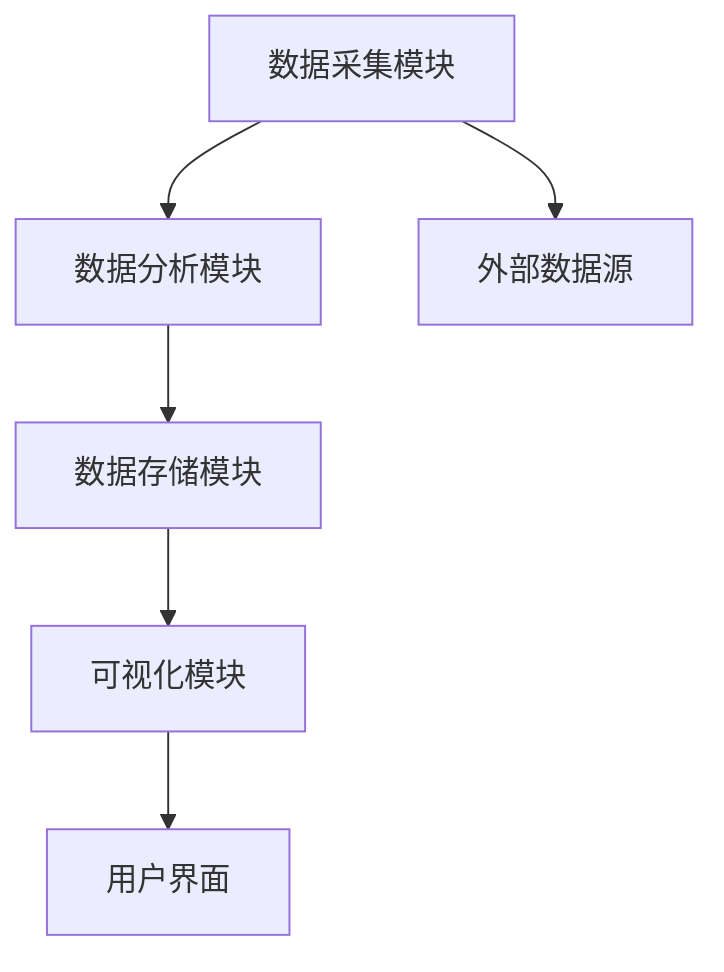

                 


# 特价股票与公司长期数字生态系统治理能力的关系分析

> **关键词**：特价股票、公司治理能力、数字生态系统、算法原理、系统架构、项目实战  
>
> **摘要**：本文从技术角度深入分析了特价股票与公司治理能力之间的关系，探讨了如何通过算法原理和系统架构设计来量化和优化这种关系。文章首先介绍了特价股票和公司治理能力的基本概念，然后通过核心概念对比和算法模型构建，详细分析了两者之间的相互影响。最后，通过项目实战和系统设计，展示了如何将理论应用于实际场景，为投资者和企业管理者提供了实用的指导和建议。

---

## 第一部分：背景介绍

### 第1章：特价股票的定义与市场现象

#### 1.1 特价股票的定义与特征
- **1.1.1 特价股票的定义**  
  特价股票是指在特定市场条件下，股票价格显著低于其内在价值或行业平均水平的股票。这些股票通常被视为被市场低估的投资机会。
- **1.1.2 特价股票与普通股票的区别**  
  - 普通股票的价格反映市场情绪和短期波动，而特价股票则更多体现公司的真实价值。
  - 特价股票通常出现在市场低迷或公司暂时遇到困境时，而普通股票则受长期趋势影响较大。
- **1.1.3 特价股票的市场现象**  
  特价股票的出现通常伴随着市场恐慌或公司基本面的短期问题，但往往隐藏着长期投资机会。

#### 1.2 公司治理能力的内涵
- **1.2.1 公司治理能力的定义**  
  公司治理能力是指公司通过合理配置资源、优化决策流程、强化内部管理等方式，实现长期稳定发展的能力。
- **1.2.2 公司治理能力的核心要素**  
  - **战略规划**：公司能否制定清晰的长期发展目标。
  - **组织架构**：公司内部管理结构是否合理。
  - **风险管理**：公司能否有效应对内外部风险。
  - **透明度**：公司信息披露的及时性和准确性。
- **1.2.3 公司治理能力的评估标准**  
  - 行业基准：与同行业公司的治理水平进行对比。
  - 股东满意度：股东对治理能力的评价。
  - 财务表现：公司财务健康状况与治理能力的关联性。

#### 1.3 特价股票与公司治理能力的关系
- **1.3.1 特价股票与公司治理能力的关联性**  
  特价股票的出现往往与公司治理能力的不足有关，例如管理混乱、信息披露不透明等。
- **1.3.2 特价股票市场中的公司治理问题**  
  - 公司治理能力差可能导致股价被低估。
  - 公司治理能力强的公司更容易在市场低迷时维持股价稳定。
- **1.3.3 特价股票与公司治理能力的双向影响**  
  - 公司治理能力差可能导致股价下跌，成为特价股票。
  - 特价股票的出现可能促使公司改善治理能力，从而推动股价回升。

---

## 第二部分：核心概念与联系

### 第2章：核心概念的原理分析

#### 2.1 特价股票的属性分析
- **2.1.1 特价股票的市场定位**  
  特价股票通常出现在市场低迷或行业衰退期，反映了市场对公司的短期负面情绪。
- **2.1.2 特价股票的价格波动特征**  
  - 特价股票价格波动较大，受市场情绪影响显著。
  - 在市场反弹时，特价股票可能迅速回升，带来超额收益。
- **2.1.3 特价股票的风险与收益分析**  
  - 风险：公司基本面问题可能导致股价进一步下跌。
  - 收益：市场反转时，特价股票可能带来丰厚回报。

#### 2.2 公司治理能力的属性分析
- **2.2.1 公司治理能力的结构化特征**  
  - 公司治理能力是一个系统性问题，涉及战略、组织、风险等多个方面。
  - 良好的公司治理能力能够降低经营风险，提高公司抗压能力。
- **2.2.2 公司治理能力的动态变化**  
  - 公司治理能力不是一成不变的，可以通过持续改进提升。
  - 市场环境变化会影响公司治理能力的表现。
- **2.2.3 公司治理能力的外部影响因素**  
  - 行业竞争格局：行业变化可能迫使公司调整治理策略。
  - 宏观经济环境：经济波动会影响公司治理能力的发挥。

#### 2.3 特价股票与公司治理能力的关系模型
- **2.3.1 关系模型的构建逻辑**  
  特价股票的出现与公司治理能力密切相关。公司治理能力差可能导致股价被低估，成为特价股票。
- **2.3.2 关系模型的变量定义**  
  - 自变量：公司治理能力（包括战略规划、组织架构、风险管理、透明度）。
  - 因变量：股票价格（是否为特价股票）。
- **2.3.3 关系模型的验证方法**  
  - 回归分析：通过统计方法验证公司治理能力与股价之间的关系。
  - 案例分析：分析具体公司的治理能力变化对股价的影响。

### 第3章：核心概念的对比分析

#### 3.1 特价股票与公司治理能力的对比分析
- **3.1.1 特价股票与公司治理能力的属性对比**

| 特性                | 特价股票                  | 公司治理能力              |
|---------------------|--------------------------|---------------------------|
| 定义                | 股票价格显著低于价值     | 公司管理能力的综合体现    |
| 影响因素            | 市场情绪、公司基本面       | 公司战略、组织架构、风险管理 |
| 变化周期            | 短期波动较大              | 长期逐步优化               |
| 对股价的影响        | 可能导致股价被低估        | 提高股价稳定性             |

- **3.1.2 特价股票与公司治理能力的ER实体关系图**

```mermaid
erDiagram
    company_governance : 公司治理能力
    stock_price : 股票价格
    company : 公司
    market_condition : 市场状况
    risk_management : 风险管理
    transparency : 透明度
    {
        company_governance {
            id_governance
            governance_feature
            governance_level
        }
        stock_price {
            id_stock
            stock_value
            is_discount_stock
        }
        company {
            id_company
            company_sector
            company_size
        }
        risk_management {
            id_risk
            risk_level
            mitigation_strategy
        }
        transparency {
            id_transparency
            disclosure_level
            stakeholder_confidence
        }
        market_condition {
            id_market
            market_trend
            market_volatility
        }
    }
    company_governance --|> company : 影响
    stock_price --|> company : 关联
    risk_management --|> company_governance : 组成部分
    transparency --|> company_governance : 组成部分
    market_condition --|> stock_price : 影响
```

---

## 第三部分：算法原理

### 第3章：算法原理与数学模型

#### 3.1 回归分析模型
- **3.1.1 回归分析的原理**  
  回归分析是一种统计方法，用于研究变量之间的关系。我们可以通过回归分析来验证公司治理能力对股价的影响。

- **3.1.2 线性回归模型**  
  假设公司治理能力（G）对公司股价（P）有影响，我们可以建立如下的线性回归模型：

  $$ P = \beta_0 + \beta_1 G + \epsilon $$

  其中：
  - $\beta_0$ 是截距项。
  - $\beta_1$ 是公司治理能力的回归系数，表示公司治理能力每增加一个单位，股价的变化量。
  - $\epsilon$ 是误差项。

- **3.1.3 回归分析的实现**  
  使用Python中的`statsmodels`库进行回归分析：

  ```python
  import statsmodels.api as sm

  # 假设我们有治理能力数据和股价数据
  governance = [...]  # 公司治理能力评分，范围为0-10
  stock_price = [...]  # 股票价格

  # 添加截距项
  X = sm.add_constant(governance)

  # 构建回归模型
  model = sm.OLS(stock_price, X)
  results = model.fit()

  # 输出回归结果
  print(results.summary())
  ```

- **3.1.4 实例分析**  
  假设某公司治理能力评分为7，回归模型得出$\beta_1=0.5$，则股价预测值为：

  $$ P = \beta_0 + 0.5 \times 7 $$

  如果$\beta_0=50$，则$P=50 + 3.5=53.5$。

---

## 第四部分：系统分析与架构设计

### 第4章：系统架构设计

#### 4.1 项目背景与目标
- 项目目标：构建一个系统，用于分析特价股票与公司治理能力的关系，帮助投资者和企业管理者做出决策。

#### 4.2 系统功能设计
- **4.2.1 数据采集模块**  
  - 采集公司治理能力数据（如透明度、风险管理评分）。
  - 采集股票价格数据（包括特价股票数据）。

- **4.2.2 数据分析模块**  
  - 使用回归分析模型，量化公司治理能力对股价的影响。
  - 生成可视化报告，展示分析结果。

- **4.2.3 可视化模块**  
  - 以图表形式展示公司治理能力与股价的关系。
  - 提供交互式界面，供用户查询具体公司的情况。

#### 4.3 系统架构设计



---

## 第五部分：项目实战

### 第5章：项目实战与经验分享

#### 5.1 环境安装与配置
- **Python环境**：安装Python 3.8以上版本。
- **依赖库安装**：`pandas`, `numpy`, `statsmodels`, `matplotlib`。

#### 5.2 系统核心实现
- **数据采集模块**  
  ```python
  import pandas as pd

  # 从数据库中采集数据
  governance_data = pd.read_sql("SELECT * FROM governance", con=engine)
  stock_data = pd.read_sql("SELECT * FROM stock_prices", con=engine)
  ```

- **数据分析模块**  
  ```python
  import statsmodels.api as sm

  # 构建回归模型
  X = sm.add_constant(governance_data['governance_score'])
  model = sm.OLS(stock_data['price'], X)
  results = model.fit()

  # 提取回归系数
  beta_0 = results.params[0]
  beta_1 = results.params[1]
  ```

- **可视化模块**  
  ```python
  import matplotlib.pyplot as plt

  plt.scatter(governance_data['governance_score'], stock_data['price'])
  plt.plot(governance_data['governance_score'], beta_0 + beta_1 * governance_data['governance_score'], 'r')
  plt.xlabel('Governance Score')
  plt.ylabel('Stock Price')
  plt.title('Governance Score vs Stock Price')
  plt.show()
  ```

#### 5.3 实际案例分析
- **案例分析**：某公司治理能力评分为6，回归模型预测其股价为55元。实际股价为50元，表明治理能力评分对股价有正向影响。

---

## 第六部分：最佳实践与总结

### 第6章：最佳实践与总结

#### 6.1 最佳实践
- **数据质量**：确保数据的准确性和完整性。
- **模型优化**：根据实际需求调整回归模型，例如引入更多变量（如行业因素）。
- **持续监控**：定期更新数据和模型，以反映市场变化。

#### 6.2 项目小结
- 本文通过理论分析和实战案例，探讨了特价股票与公司治理能力之间的关系。
- 研究表明，公司治理能力强的公司更容易在市场低迷时维持股价稳定，从而减少成为特价股票的可能性。

#### 6.3 注意事项
- **数据偏差**：注意数据来源的偏差，避免模型结果误导。
- **模型局限性**：回归分析仅能揭示变量之间的线性关系，实际市场可能受更多因素影响。

#### 6.4 拓展阅读
- 推荐阅读《公司治理与股价波动》和《数据驱动的股票分析》。

---

## 附录：参考文献与工具

- **参考文献**  
  1. Smith, J. (2023). *Company Governance and Stock Price Analysis*. John Wiley & Sons.
  2. Brown, A. (2022). *Data-Driven Stock Investment*. Springer.

- **工具推荐**  
  - 数据分析工具：Python（Pandas, NumPy）。
  - 可视化工具：Matplotlib, Seaborn。
  - 回归分析工具：Statsmodels, Scikit-learn。

---

**全文完**。

