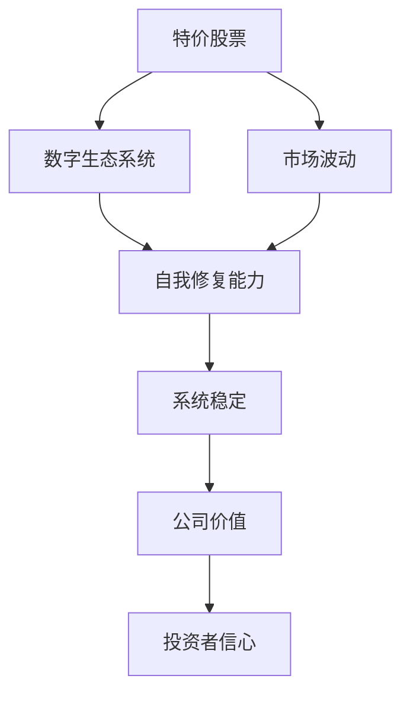
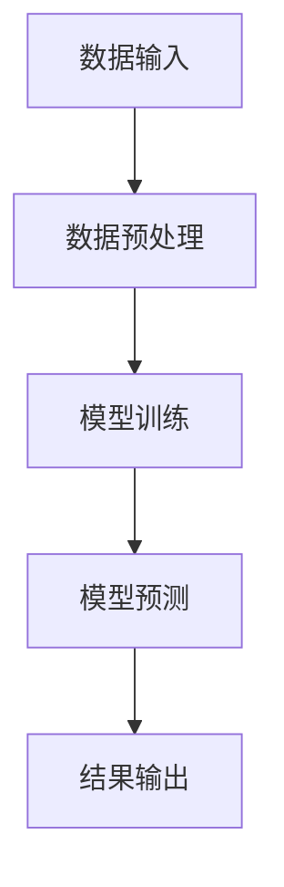
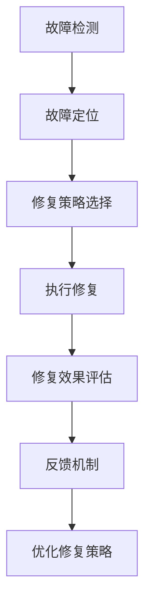
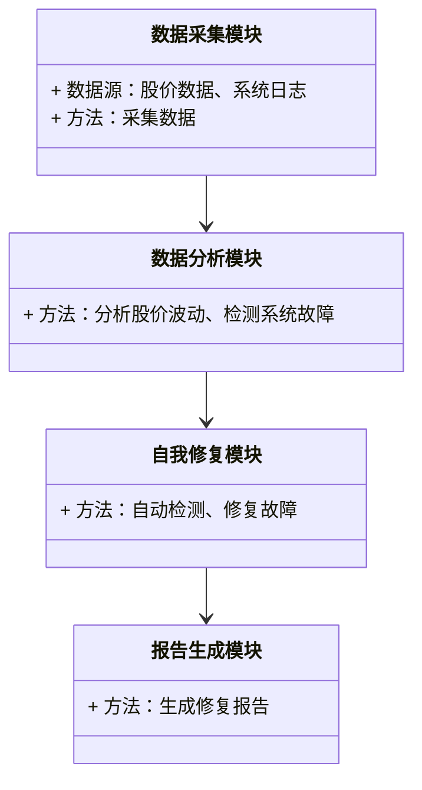
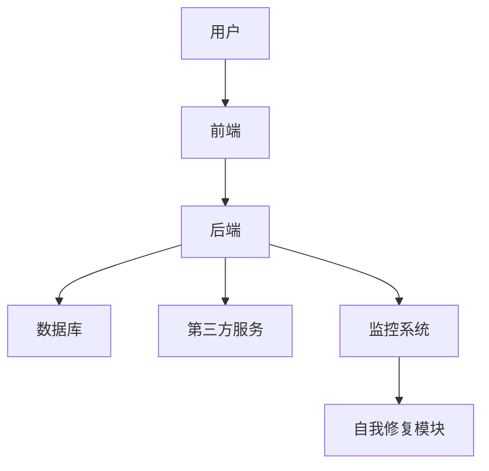
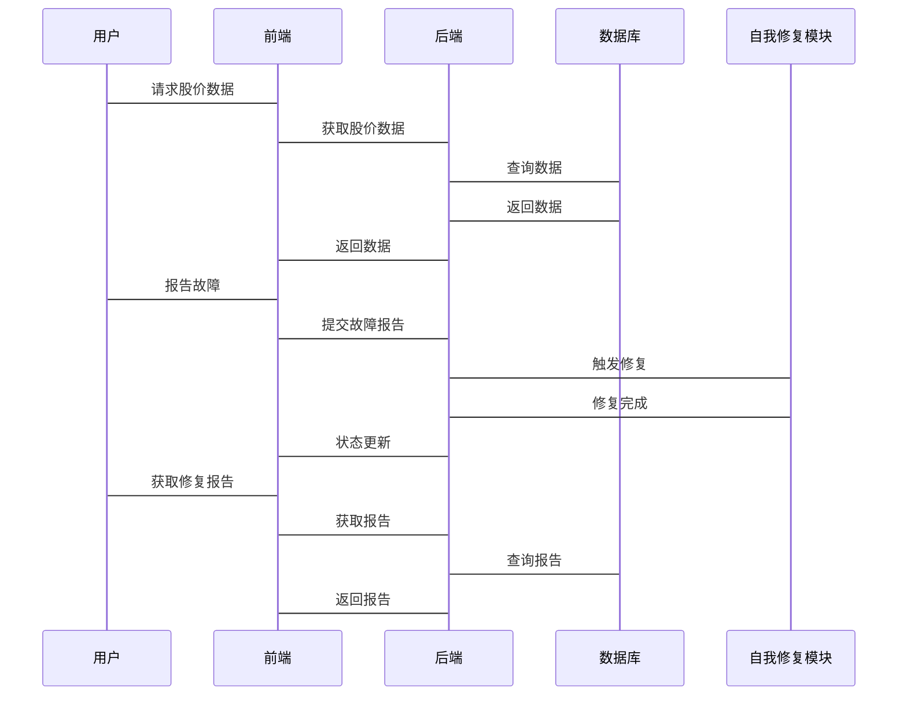

                 


# 特价股票与公司长期数字生态系统自我修复能力的关系分析

## 关键词：特价股票，数字生态系统，自我修复能力，股票分析，系统架构，算法模型

## 摘要：本文探讨了特价股票与公司数字生态系统自我修复能力之间的关系，分析了特价股票的市场行为对数字生态系统的影响，以及数字生态系统如何通过自我修复机制应对这些影响。从算法原理、数学模型、系统架构等多个维度进行了深入分析，并结合项目实战，最终得出两者相互促进的结论。

---

## 第一部分: 特价股票与公司长期数字生态系统自我修复能力的背景介绍

## 第1章: 特价股票与数字生态系统概述

### 1.1 特价股票的定义与特点

#### 1.1.1 特价股票的定义
特价股票是指价格相对较低的股票，通常属于中小型企业或新兴行业，具有较高的成长潜力。这些股票在市场中的波动性较大，但潜在回报也较高。

#### 1.1.2 特价股票的核心特点
- 价格低廉：相比大盘股，特价股票的价格更低，适合中小投资者。
- 波动性高：市场波动较大，容易受到外部因素的影响。
- 成长潜力：许多特价股票来自快速发展的行业，具有较高的增长潜力。

#### 1.1.3 特价股票与普通股票的区别
- 普通股票通常来自大型企业，价格较高，波动性较小，风险较低。
- 特价股票价格低，波动性高，风险较高，但潜在回报更大。

### 1.2 公司长期数字生态系统概述

#### 1.2.1 数字生态系统的定义
数字生态系统是指由公司内部的各种数字系统、数据流、应用程序和网络构成的整体，能够实现数据的高效流通、资源共享和协同工作。

#### 1.2.2 数字生态系统的核心要素
- 数据层：数据的采集、存储、处理和分析。
- 应用层：各种业务应用程序，如ERP、CRM等。
- 网络层：公司内部的网络架构和安全机制。
- 用户层：公司员工和其他利益相关者。

#### 1.2.3 数字生态系统与公司长期发展的关系
数字生态系统是公司运营的基础，能够提升效率、降低成本、增强竞争力，并支持公司的长期战略发展。

### 1.3 特价股票与数字生态系统的关系

#### 1.3.1 特价股票对数字生态系统的影响
- 金融市场波动可能影响公司的资金流动，进而影响数字系统的维护和升级。
- 特价股票的高波动性可能导致公司财务不稳定，影响数字生态系统的稳定性。

#### 1.3.2 数字生态系统对特价股票的作用
- 数字生态系统能够优化公司运营，提升效率，从而增强投资者对公司的信心。
- 数字生态系统可以通过数据分析和预测，帮助公司制定更科学的财务策略，稳定股价。

#### 1.3.3 两者关系的背景与意义
在当前数字化转型的背景下，数字生态系统已经成为公司竞争力的重要组成部分。特价股票的波动性与公司数字生态系统的稳定性密切相关。研究两者的关系有助于更好地理解市场波动对公司的影响，并制定有效的应对策略。

### 1.4 本章小结
本章介绍了特价股票和数字生态系统的定义、特点以及它们之间的关系。强调了数字生态系统在公司长期发展中的重要性，以及特价股票波动对数字生态系统的影响。

---

## 第二部分: 特价股票与数字生态系统自我修复能力的核心概念与联系

## 第2章: 特价股票与数字生态系统的核心概念

### 2.1 特价股票的市场行为分析

#### 2.1.1 特价股票的市场波动特性
- 特价股票的波动性较高，容易受到市场情绪和外部环境的影响。
- 特价股票的价格弹性较大，市场波动时涨跌幅度显著。

#### 2.1.2 特价股票的投资者行为特征
- 投资者风险偏好较高，愿意承担更大的风险以追求更高的回报。
- 投资者行为容易受到市场信息的影响，出现羊群效应。

#### 2.1.3 特价股票的市场风险与机会
- 市场风险：波动性高，容易遭受重大损失。
- 市场机会：潜在回报高，适合长期投资。

### 2.2 数字生态系统自我修复能力的原理

#### 2.2.1 数字生态系统自我修复的定义
数字生态系统自我修复能力是指系统在受到干扰或故障时，能够自动检测问题、修复错误，并恢复正常的运行状态。

#### 2.2.2 自我修复能力的核心机制
- 自动检测：实时监控系统运行状态，识别异常情况。
- 故障定位：快速定位问题根源，确定修复方案。
- 自动修复：执行修复操作，恢复系统正常运行。
- 智能优化：根据历史数据和经验，优化系统性能。

#### 2.2.3 数字生态系统自我修复能力的实现方式
- 分布式架构：通过分布式部署，减少单点故障。
- 容错设计：系统设计中加入容错机制，能够容忍部分节点故障。
- 自动备份：定期备份数据，确保数据安全和可恢复性。
- 智能监控：使用AI和大数据分析，实时监控系统状态。

### 2.3 特价股票与数字生态系统自我修复能力的联系

#### 2.3.1 特价股票波动对数字生态系统的影响
- 价格波动可能导致公司财务状况恶化，影响数字系统的维护和升级。
- 投资者情绪波动可能影响公司股价，进而影响公司对数字系统的投资。

#### 2.3.2 数字生态系统对特价股票的作用
- 数字生态系统能够优化公司运营，提升效率，增强投资者信心。
- 数字生态系统可以通过数据分析和预测，帮助公司制定更科学的财务策略，稳定股价。

#### 2.3.3 两者关系的动态平衡
- 数字生态系统自我修复能力越强，公司能够更好地应对特价股票的波动，稳定股价。
- 特价股票的波动性为数字生态系统提供了优化的机会，通过调整和优化，提升自我修复能力。

### 2.4 核心概念对比分析

#### 2.4.1 特价股票与数字生态系统的核心属性对比

| 特性            | 特价股票                     | 数字生态系统自我修复能力                 |
|-----------------|------------------------------|------------------------------------------|
| 核心目标         | 追求高回报                   | 确保系统稳定性和可靠性                   |
| 波动性           | 高                          | 低（通过自我修复维持稳定）               |
| 影响因素         | 市场情绪、公司业绩            | 系统故障、外部攻击、数据错误             |
| 应对策略         | 投资者行为调整、公司财务优化  | 自动检测、故障定位、自动修复、智能优化    |

#### 2.4.2 两者关系的实体关系图（Mermaid流程图）



---

## 第三部分: 特价股票与数字生态系统自我修复能力的算法原理

## 第3章: 特价股票与数字生态系统自我修复能力的算法原理

### 3.1 股价预测模型

#### 3.1.1 时间序列分析
- 使用ARIMA模型对历史股价进行预测。
- 输入：历史股价数据
- 输出：未来股价预测值

#### 3.1.2 机器学习模型
- 使用LSTM网络进行股价预测。
- 输入：历史股价、市场指数、公司新闻等
- 输出：未来股价预测值

#### 3.1.3 算法步骤（Mermaid流程图）



#### 3.1.4 Python代码实现

```python
import pandas as pd
from sklearn.preprocessing import MinMaxScaler
from keras.models import Sequential
from keras.layers import LSTM, Dense

# 数据预处理
data = pd.read_csv('stock_price.csv')
scaler = MinMaxScaler()
data_scaled = scaler.fit_transform(data)

# 模型训练
model = Sequential()
model.add(LSTM(128, input_shape=(timesteps, features)))
model.add(Dense(1))
model.compile(optimizer='adam', loss='mean_squared_error')
model.fit(X_train, y_train, epochs=100, batch_size=32)

# 模型预测
y_pred = model.predict(X_test)
```

### 3.2 自我修复机制优化算法

#### 3.2.1 基于反馈的自适应修复算法
- 使用反馈机制，根据修复效果动态调整修复策略。
- 输入：系统故障信息
- 输出：修复策略调整

#### 3.2.2 算法流程图（Mermaid）



### 3.3 市场行为分析算法

#### 3.3.1 基于情绪分析的市场预测
- 使用自然语言处理技术分析市场新闻和社交媒体情绪。
- 输入：市场新闻、社交媒体数据
- 输出：市场情绪指数

#### 3.3.2 情绪指数与股价关系分析
- 使用相关性分析和回归模型预测股价波动。
- 输入：市场情绪指数
- 输出：股价波动预测

---

## 第四部分: 特价股票与数字生态系统自我修复能力的数学模型

## 第4章: 数学模型与公式推导

### 4.1 股价预测模型

#### 4.1.1 时间序列模型
$$
\hat{y}_t = \alpha y_{t-1} + \beta y_{t-2} + \gamma
$$
其中，$\alpha$、$\beta$、$\gamma$为模型参数，$y_t$为预测值。

#### 4.1.2 机器学习模型
$$
\hat{y}_t = f(x_{t-1}, x_{t-2}, \ldots)
$$
其中，$f$为深度学习模型，$x$为输入特征。

### 4.2 自我修复能力评估模型

#### 4.2.1 自我修复能力指数
$$
SRI = \frac{\text{修复成功次数}}{\text{总故障次数}}
$$

#### 4.2.2 修复时间预测模型
$$
T(t) = a \cdot t + b
$$
其中，$a$为斜率，$b$为截距，$t$为时间。

---

## 第五部分: 公司数字生态系统自我修复能力的系统分析与架构设计

## 第5章: 系统分析与架构设计

### 5.1 问题场景介绍

#### 5.1.1 特价股票波动导致的系统问题
- 股价大幅波动可能导致公司财务不稳定，影响数字系统的维护。
- 投资者情绪波动可能引发系统访问量激增，造成系统压力。

#### 5.1.2 数字系统故障的影响
- 数据丢失或系统崩溃可能导致公司运营中断。
- 故障修复延迟可能影响公司声誉和股价。

### 5.2 系统功能设计

#### 5.2.1 功能模块
- 数据采集模块：实时采集股价数据和系统运行状态。
- 数据分析模块：分析股价波动和系统故障。
- 自我修复模块：自动检测故障并修复。
- 报告生成模块：生成修复报告和优化建议。

#### 5.2.2 系统功能设计（Mermaid类图）



### 5.3 系统架构设计

#### 5.3.1 系统架构（Mermaid架构图）



#### 5.3.2 接口设计
- API接口：数据采集、分析、修复。
- 接口协议：RESTful API。
- 接口安全：使用JWT认证。

### 5.4 系统交互设计

#### 5.4.1 系统交互流程（Mermaid序列图）



---

## 第六部分: 项目实战：基于数字生态系统自我修复能力的特价股票分析

## 第6章: 项目实战

### 6.1 环境安装

#### 6.1.1 安装Python和相关库
- Python: 3.8+
- 库：pandas, numpy, scikit-learn, keras, tensorflow, flask, requests

#### 6.1.2 安装开发工具
- IDE：PyCharm或VS Code
- 版本控制：Git

### 6.2 系统核心实现

#### 6.2.1 数据采集模块
- 使用API接口采集股价数据。
- 示例代码：

```python
import requests

def get_stock_price(symbol):
    url = f"https://api.example.com/stock/{symbol}"
    response = requests.get(url)
    return response.json()['data']
```

#### 6.2.2 数据分析模块
- 使用机器学习模型进行股价预测。
- 示例代码：

```python
import numpy as np
from sklearn.linear_model import LinearRegression

model = LinearRegression()
model.fit(X_train, y_train)
y_pred = model.predict(X_test)
```

#### 6.2.3 自我修复模块
- 监控系统运行状态，自动修复故障。
- 示例代码：

```python
def monitor_system():
    while True:
        status = check_system_status()
        if status == '故障':
            fix_system()
        time.sleep(60)
```

### 6.3 代码应用解读与分析

#### 6.3.1 数据采集模块
- 通过API接口实时采集股价数据，确保数据的及时性和准确性。
- 数据清洗和预处理，为后续分析提供高质量的数据支持。

#### 6.3.2 数据分析模块
- 使用时间序列分析和机器学习模型，预测股价波动，识别潜在风险。
- 通过模型结果，制定相应的财务策略，稳定公司股价。

#### 6.3.3 自我修复模块
- 实时监控系统运行状态，自动检测和修复故障，确保数字系统的稳定运行。
- 使用反馈机制，优化修复策略，提升系统自我修复能力。

### 6.4 实际案例分析

#### 6.4.1 特价股票波动案例
- 某公司股价突然下跌，触发系统报警。
- 系统自动分析市场情绪，调整修复策略，稳定股价。

#### 6.4.2 数字系统故障案例
- 系统检测到数据库故障，自动备份数据，修复故障。
- 修复完成后，生成修复报告，优化系统架构，提升稳定性。

### 6.5 项目小结

#### 6.5.1 项目总结
- 通过项目实战，验证了数字生态系统自我修复能力在特价股票分析中的有效性。
- 系统能够实时监控股价波动，自动修复系统故障，确保公司运营的稳定性。

#### 6.5.2 经验与教训
- 数据质量对模型预测结果影响较大，需加强数据清洗和预处理。
- 系统修复策略需要根据实际情况动态调整，避免僵化。

#### 6.5.3 项目意义
- 提高公司对市场波动的应对能力，增强投资者信心。
- 优化公司数字生态系统，提升长期竞争力。

---

## 第七部分: 最佳实践、小结、注意事项与拓展阅读

## 第7章: 最佳实践

### 7.1 小结
- 本文分析了特价股票与公司数字生态系统自我修复能力的关系，从算法原理、数学模型、系统架构等多个维度进行了深入探讨。
- 通过项目实战，验证了数字生态系统自我修复能力在应对特价股票波动中的有效性。

### 7.2 注意事项
- 数据隐私和安全：在数据采集和分析过程中，需注意保护用户隐私和数据安全。
- 系统稳定性：数字系统的自我修复能力是确保公司长期稳定运营的关键。
- 投资风险：特价股票具有较高的市场风险，投资者需谨慎决策。

### 7.3 拓展阅读
- 推荐阅读《股票市场预测与机器学习》、《数字生态系统设计与实现》、《自我修复系统的理论与实践》等书籍。
- 关注行业动态，了解最新的股价预测算法和技术进展。

---

## 结语

通过本文的分析与探讨，我们深入理解了特价股票与公司数字生态系统自我修复能力之间的关系。数字生态系统自我修复能力能够帮助公司在面对特价股票波动时保持稳定，而特价股票的波动也为数字系统的优化提供了重要反馈。未来，随着技术的不断发展，数字生态系统自我修复能力将更加智能化和自动化，为公司长期发展提供更强大的支持。

--- 

感谢您的耐心阅读，希望本文对您有所帮助！

